#Interviewing data: using databases

You will probably all have previously used spreadsheets to organize and analyze data. Today's class aims to take your skills to the next level, by introducing databases and the language used to query them. Databases can handle larger datasets, and with practice are more flexible and nimble for **filtering**, **sorting**, and grouping and **aggregating** data.

Databases also allow you to **join** multiple data tables into one, or match records across different datasets, if they have common fields – which can be a powerful tool.

It often makes sense to process data in a database before exporting to the software you will use to visualize it.

### Introducing SQLite and the SQLite Manager Firefox add-on

We will work with [**SQLite**](http://sqlite.org/), database software that can be managed using a free add-on to the Firefox browser, called the [**SQLite Manager**](https://addons.mozilla.org/en-US/firefox/addon/sqlite-manager/).

SQLite claims to be the most widely-used database software in the world, and is built into many software applications including Firefox -- which uses it to manage information including your bookmarks. SQLite is easier to configure and work with than databases like [MySQL](http://www.mysql.com/) and [PostgeSQL](http://www.postgresql.org/), in which the database runs on a "server," either on your own machine or over the Internet. Instead, SQLite databases are simple, portable files that are written directly to disk.

The SQLite Manager add-on allows you to work with any SQLite database. Open SQLite Manager by selecting `Tools>SQLite Manager` in Firefox. You should see a screen like this:


### The data we will use

Download from here, unzip the folder and place on your desktop. Contains the following:

`pzifer` Folder containing:

- `pfizer.sqlite` SQLite database detailing payments by the drug company Pfizer to doctors
- `pfizer.txt` Tab-delimited text file containing the same data
- `fda.txt` Tab-delimited text file documenting warning letters from the Food and Drug Administration to doctors involved in research on experimental drugs or medical devices.

This data was used in reporting [this story](http://www.newscientist.com/article/dn18806-revealed-pfizers-payments-to-censured-doctors.html).

### Open database and examine its contents

Open the database `pfizer.sqlite`, by selecting `Database>Connect Database`. Navigate to the database file, and click `Open`.

Databases contain Tables of data. At present, this database contains only one Table, called `pfizer`.

Select the `pfizer` Table in the panel to the left, and click the `Browse and Search` tab in the right-hand panel. You should now be able to see the first few rows of the data in the table:

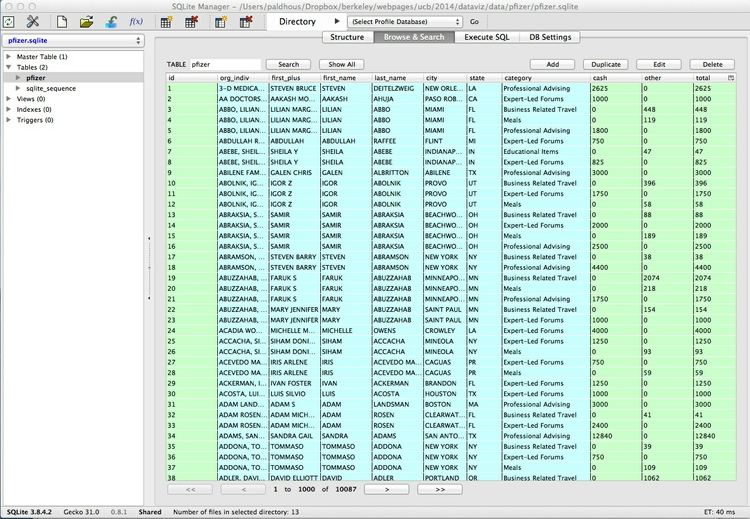

Notice that it looks much like a spreadsheet, except that columns and rows are not designated by letters and numbers in a coordinate system. Instead, the column names, called “fields” in a database, are fixed. Here each row, or “record,” has a unique ID number, created by SQLite as a “Primary Key” when the data was imported. (We will do this later with a new Table.)

Notice also that the field names are kept fairly short and have no spaces. This will keep things succinct when we write database queries. SQLite Manager also color-codes the fields by the type of data they contain: In this case numbers, which are all integers, have a light green background, while text fields are light blue. Finally, note that the total number of records is given at the foot of the Table: there are 10,087.

In this Table, each record represents the payments made in a particular category to each doctor. Individual doctors may have multiple records, if they received more than one category of payment. The text fields contain various identifying information for each doctor, while the payments are either `cash` or `other` -- payments "in kind," such as the provision of meals. The `total` field gives the value of payments for each record, whichever type.

### Introducing Structured Query Language

To extract information from our database, we need to ask for it in the language that databases understand: [**Structured Query Language**](http://en.wikipedia.org/wiki/SQL), or **SQL**. Don’t panic: The logic of SQL is very easy to follow -- it is the closest that computer code comes to plain English.

Learning SQL is very useful, because (with small variations in syntax) most databases use the same language. So in this class, you won’t just be learning how to use SQLite, but also acquiring skills that can be transferred to other database software.

### Write queries to filter and sort the data

Click on the `Execute SQL` tab and notice that `Enter SQL` box contains the statement `SELECT * FROM tablename`. Replace `tablename` with `pfizer`, and click `Run SQL`. That should return the entire table, because `*` is a wildcard that tells SQLite to return information from every field in a table. The query will return all 10,087 records, because we haven’t asked for the data to be filtered in any way.

OK, now let’s run a more useful query, filtering the data to make a list of all doctors in California who were paid $10,000 or more by Pfizer to run “Expert-Led Forums,” lecturing other doctors about using the company’s drugs. Paste or type this query into the `Enter` box:

```sql
SELECT first_plus, last_name, city, state, category, total
FROM pfizer
WHERE state = 'CA' AND category LIKE 'Expert%' AND total >= 10000
ORDER BY total DESC;
```
Click `Run SQL` and you should see the following results:


Let’s break this query down:

```sql
SELECT first_plus, last_name, city, state, category, total
FROM pfizer
WHERE state = 'CA' AND category LIKE 'Expert%' AND total >= 10000
ORDER BY total DESC;
```

 - The first two lines tell SQLite to `Select` the named fields from the pfizer table, with each field separated by a comma.
 - The `WHERE` clause applies a filter to return only certain records from the table.
  - When filtering text fields, the search string should be put in single quote marks.
  - The second text field filter uses the operator `LIKE` to perform a "fuzzy" match, and is used with wildcard characters: the `%` wildcard takes the place of any number of characters, while the `_` wildcard is used to represent single characters only. Here the `%` wildcard is simply saving us from having to type `Expert-Led Forums` in full, but such queries can be very useful to return data entered in slightly different ways. (`LIKE` also matches irrespective of case, whereas `=` requires the case to be exactly as typed.)
  - Our query also includes a number filter, here telling SQLite to return records only when the total is greater or equal, or `>=`, to 10,000. Try experimenting with different operators, such as `=`, `<` (less than), and `<>` (not equal to).
  - In this query, each part of the `WHERE` clause is linked by `AND`, which ensures that records will only be returned if all the stated criteria are met. `WHERE` statements obey [Boolean logic](http://en.wikipedia.org/wiki/Boolean_algebra#Basic_operations), which uses the operators `AND`, `OR` and `NOT`; see what happens if you replace the first `AND` with `OR`.
 - The final line of the query sorts the results in descending order by the total paid. See what happens if you remove `DESC`.
 - The semi-colon simply marks the end of the query. See what happens if you change the end of the query to the following:
`ORDER BY total DESC
LIMIT 20;`

Now let’s run the following query, which extends the search for doctors paid $10,000 or more for running Expert-Led Forums to New York, as well as California:

```sql
SELECT first_plus, last_name, city, state, category, total
FROM pfizer
WHERE (state = 'CA' OR state = 'NY') AND category LIKE 'Expert%' AND total >= 10000
ORDER BY total DESC;
```
Notice the brackets surrounding the first part of the `WHERE` clause: These function just like in normal algebra, ensuring that this part of the query is run first. Now remove these brackets and look at the results, so that you understand how this works.

By now you should be starting to get the hang of **SQL**, so let’s try a couple more queries to filter and sort the data.

1) The 20 doctors across the four largest states (CA, TX, FL, NY) paid the most for Professional Advising:

```sql
SELECT first_plus, last_name, city, category, state, total
FROM pfizer
WHERE (state = 'CA' OR state = 'TX' OR state = 'FL' OR state = 'NY') AND  category LIKE 'Prof%'
ORDER BY total DESC
LIMIT 20;
```
It should hopefully be obvious how the `LIMIT` clause works.

2) All payments for speaking at Expert-Led Forums or for Professional Advising, arranged alphabetically by doctor (last name, then other names):

```sql
SELECT last_name, first_plus, city, category, state, total
FROM pfizer
WHERE category LIKE 'Expert%' OR category LIKE 'Prof%'
ORDER BY last_name, first_plus;
```
Notice from the above that you can sort by more than one field; in this case both sorts are in the same ascending alphabetical order, but they need not be.

This should be the result of the last query:

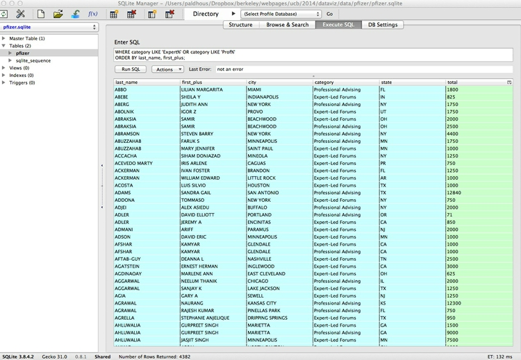

### Save and export queries

Next we will save the last of these queries, so that we can return to it later. Select `View>Create View` from the top menu, give the View a suitable name (e.g. `speak_advice`), and paste the SQL for the query into the box:

Click OK, and at the next dialog box click Yes. Double click on Views in the left panel and select the newly created View. The results of the query appear in the `Browse & Search` tab.

Now click on the `Structure` tab, which should look like this:

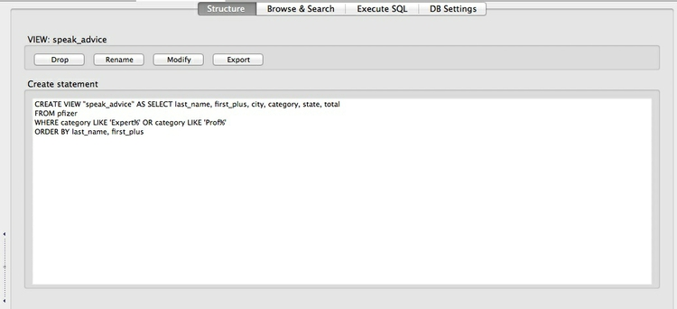

To export a query, click on `Export`, then fill the dialog box in as follows:

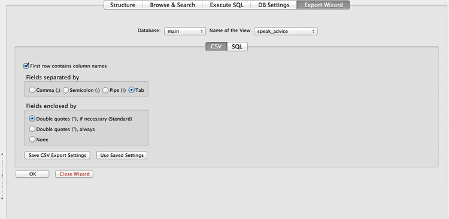

Selecting the `CSV` tab saves the query as a CSV or other text file. I usually save with a `Tab` separating the fields, to give a tab-delimited text file, like those we have used in previous weeks. Make sure to check `First row contains column names`; selecting `Double quotes(") if necessary(Standard)` will enclose all text entries in the data in double quotes.

Click `OK`, and save the query with a `.txt` suffix.

### Reproducibility: databases vs. spreadsheets

By creating Views, you can keep a record of the queries you have run. This is good practice in data journalism, as it creates a reproducible record of your data processing -- in stark contrast to point-and-click operations in a spreadsheet, which are hard to document.

As a data journalist, an important goal should be to maintain a fully documented trail of your work from raw data to published story or visualization. This allows data-savvy editors (if you are lucky enough to have them!) to check your work, and may be important if your conclusions or accuracy are challenged.

### Write queries to group and aggregate data

Now let's write a query to calculate the total payments made in each state. Click on the `Execute SQL` tab, and run the following query:

```sql
SELECT state, SUM(total) AS state_total
FROM pfizer
GROUP BY state
ORDER BY state_total DESC;
```
Click `Run SQL` and you should see the following results:

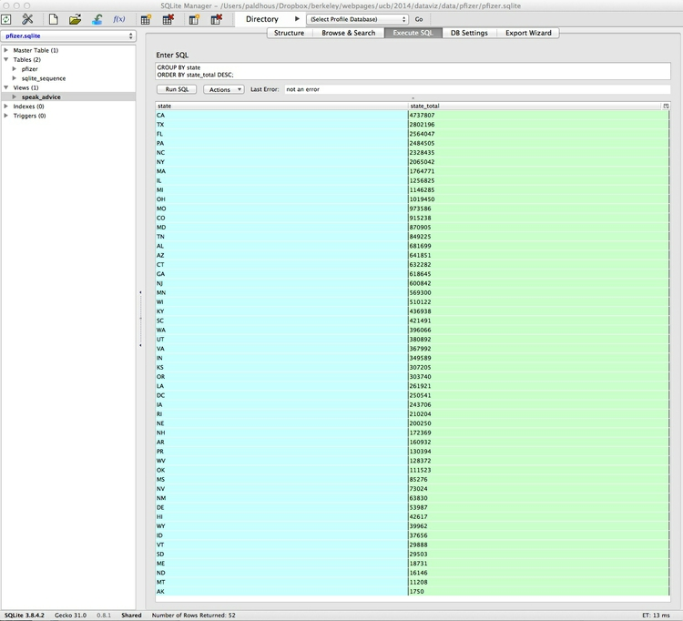

Again, let’s break this query down:

```sql
SELECT state, SUM(total) AS state_total
FROM pfizer
GROUP BY state
ORDER BY state_total DESC;
```

- The first two lines return data for state and total, with the totals added up using the function `SUM` and the field renamed `AS` `state_total`. See what happens if you replace `SUM` with `AVG`, `MAX`, `MIN` or `COUNT`.
- The third line with the `GROUP BY` clause is crucial, telling SQLite how to group the data to calculate the totals. In queries like this, fields that are selected but are not themselves being aggregated (using `SUM`, `AVG` etc) must appear in the `GROUP BY` clause.

Notice how the variable or field to be acted on by the `SUM` function appears in brackets.

Now let’s total by state just for payments made for Expert-led forums, using this query:

```sql
SELECT state, SUM(total) AS expert_total
FROM pfizer
GROUP BY state, category
HAVING category LIKE 'Expert%'
ORDER BY expert_total DESC;
```
Click `Run SQL` and you should see the following results:

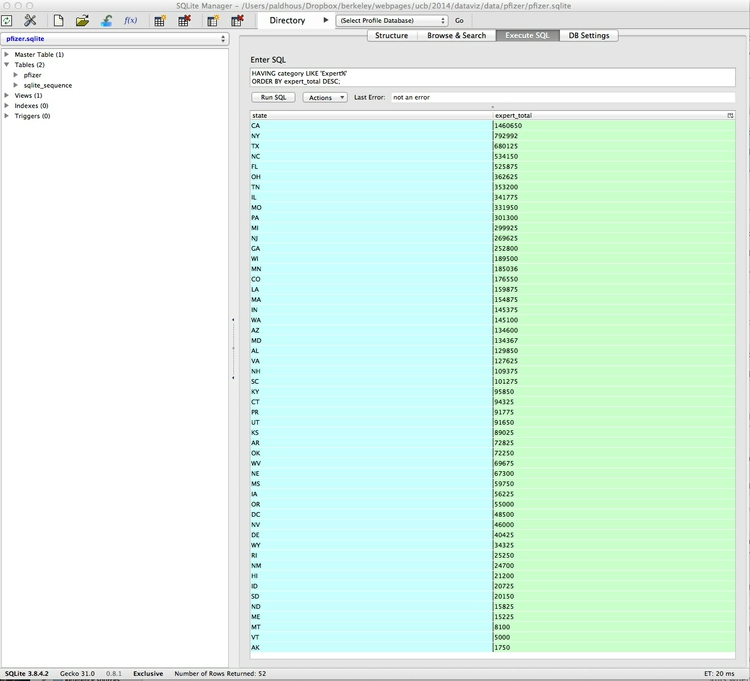

This query introduces the `HAVING` clause:
```sql
SELECT state, SUM(total) AS expert_total
FROM pfizer
GROUP BY state, category
HAVING category LIKE 'Expert%'
ORDER BY expert_total DESC;
```
For queries that include a `GROUP BY` clause, `HAVING` does the same filtering job as `WHERE` does in a simple filtering query; note that fields that appear in the `HAVING` clause must also appear under `GROUP BY`.

We can also aggregate data by more than one field at a time. For example, this query calculates the total payments by state and by category:

```sql
SELECT state, category, SUM(total) AS subtotal
FROM pfizer
GROUP BY state, category;
```
This should be the result:

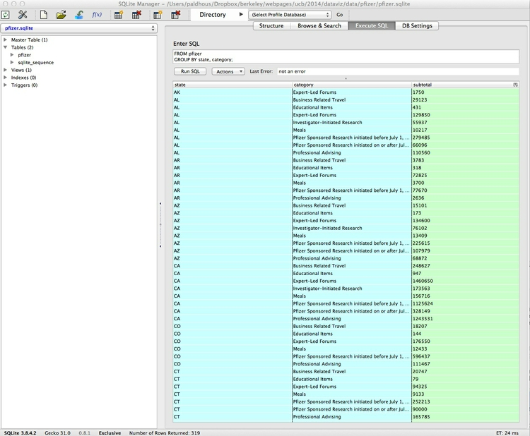

### Replicate this query as a pivot table in Libre Office Calc

To human eyes, this data would be easier to read if it were in a table with the states in rows and the cateories in columns. This is sometimes called a "pivot table," and involves converting the data from a "long" to a "wide" format. Making pivot tables, or converting between these formats for specific visualization tasks, is a common task in data journalism.

SQLite lacks a pivot function, and this is one task where a spreadsheet has an advantage. So let's briefly put the database to one side, and import the Pfizer data, which is in the file `pfizer.txt`, into Libre Office Calc by selecting `Insert>Sheet From File` form the top menu. Save the spreadsheet, then select `Data>Pivot Table>Create` from the top menu, and click `OK` when the data is selected. At the next dialog box, drag and drop the fields as follows:


Note that the default is to aggregate the totals using `Sum`, which is what we want here. You can select other aggregate measures by clicking `Options ...`.

Click `OK`, and this should be the result:


Save and close the spreadsheet, then return to the database.

### Run a query on a query

We can run queries on queries that we have previously saved as Views. Let’s do that on our saved list of all payments for Expert-led Forums or Professional Advising, returning the total payments for these two categories made to each doctor:

```sql
SELECT first_plus, last_name, city, state, SUM(total) AS sum_total
FROM speak_advice
GROUP BY first_plus, last_name, city, state
ORDER BY sum_total DESC;
```
Notice how the name of the saved View is used in the `FROM` clause, where previously we named  a Table.

We can also obtain the same result in one step, without saving as a View, using a subquery. This is given in brackets, indicating that it should be run before the rest of the query:

```sql
SELECT first_plus, last_name, city, state, SUM(total) AS sum_total
FROM (SELECT first_plus, last_name, city, category, state, total
FROM pfizer 
WHERE category LIKE 'Expert%' OR category LIKE 'Prof%')
GROUP BY first_plus, last_name, city, state
ORDER BY sum_total DESC;
```
Running nested queries like this takes some practice. When starting out, you may find it easier to go step by step, saving as a View and then querying the View.

Each of these queries should give the following result:

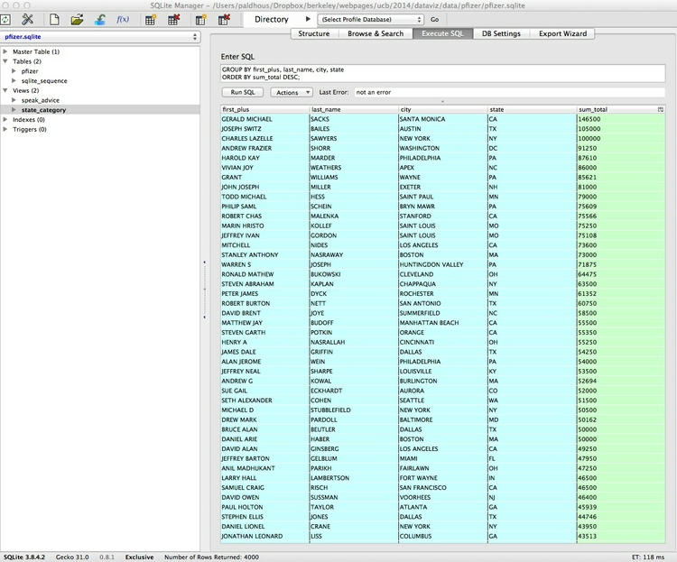

### Create a new data table, and import data

Now we will create a second table and import data, in the file `fda.txt`, giving information about warning letters sent by the Food and Drug Administration to doctors because of problems with their conduct of clinical research on experimental drugs or medical devices.

Import the file into Libre Office Calc to view the data. The first few rows look like this when imported into a spreadsheet:


Notice that the dates are in the format `YYYY-MM-DD`. I strongly advise converting dates into this format for all of your data processing work, as it is an international standard, widely understood by data analysis software including SQLite. If your date also includes the time of day, use one of the following formats:

`YYYY-MM-DD HH:MM:SS`

`YYYY-MM-DDTHH:MM:SS`

In the second format `T` is simply the capital letter "T", inserted into the date to note the distinction between date and time values. The full date and time string may also be terminated with a `Z`.

Return to the database, and create a table into which to import the data. Select `Table>Create Table` from the top menu, and `Select File`. You will need to change the `Format` at the dialog box from `CSV Files` to `All Files` to import a file with a `.txt` extension.

Now fill in the import dialog box as follows:

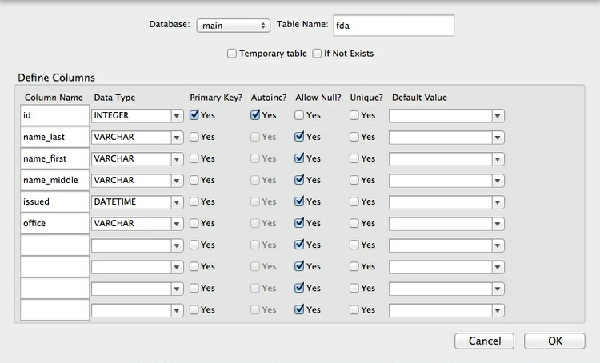

The first `id` field will be automatically created when the data is imported, giving a unique ID number to each record. For this field, make sure to select `INTEGER` for Data Type, and to check the `Primary Key` and `Autoinc` boxes.

As mentioned above, Primary Keys uniquely identify each record in a database Table. (If you are importing data that already contains a column that uniquely identifying each record, then you can select that as the Primary Key.)

The other Column Names match those in the data; take care to select the correct Data Type. `VARCHAR` means a text field of varying length; `DATETIME` should be used for the issued date. [Here](http://www.sqlite.org/datatype3.html) is a reference for Data Types accepted by SQLite.

Click `Yes` at the next dialog box, which will show the SQL code being used to create the table.

Now we can import the data, by clicking the `Import` icon: 

Fill in the dialog box as follows, and select `OK` at the subsequent prompts:

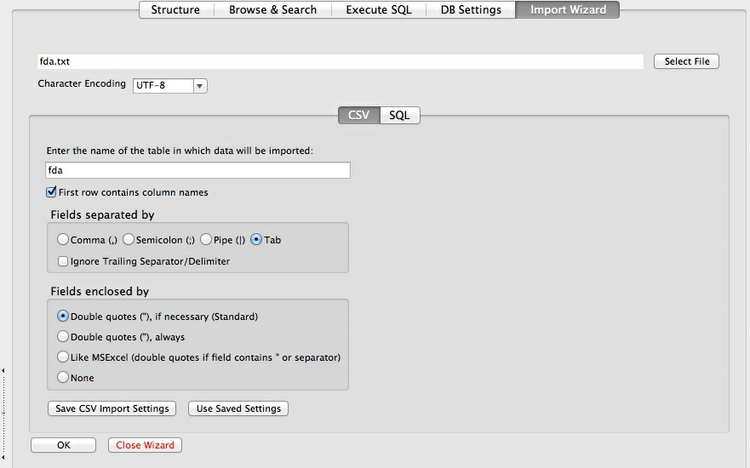

With the new `fda` Table selected in the left panel, select the `Browse & Search` tab to view the imported data:

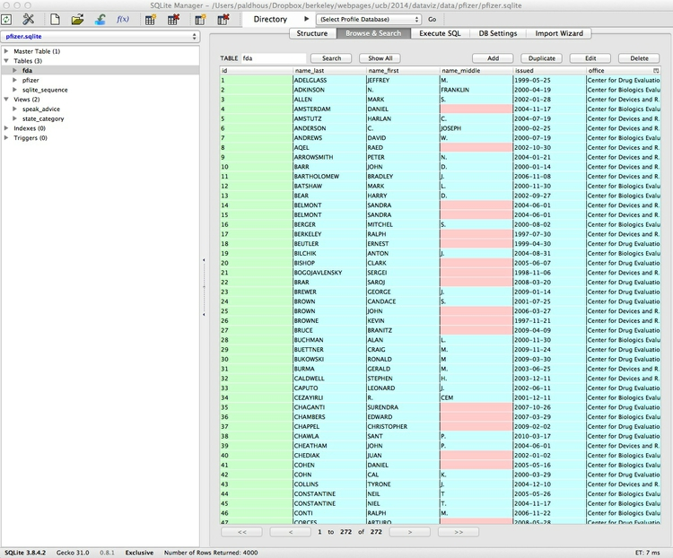

Notice that empty values, called `NULLS`, are color-coded in pink.

### Run queries using dates

Date values are colored the same as text, and when used in queries should be put in single quote marks, as for text. For dates we can use operators that we previously used for numbers, in much the same way.

For instance, this query returns all records from the fda table with issue dates from 1 Jan 2005 onwards:

```sql
SELECT *
FROM fda
WHERE issued >= '2005-01-01'
ORDER BY issued;
```

The following query uses the `strftime` (string from time) function to extract the year from dates, and then counts the number of letters issued per year:

```sql
SELECT strftime('%Y', issued) AS issued_year, COUNT(id) AS count_letters
FROM fda
GROUP BY issued_year
ORDER BY issued_year;
```
It will give the following results:

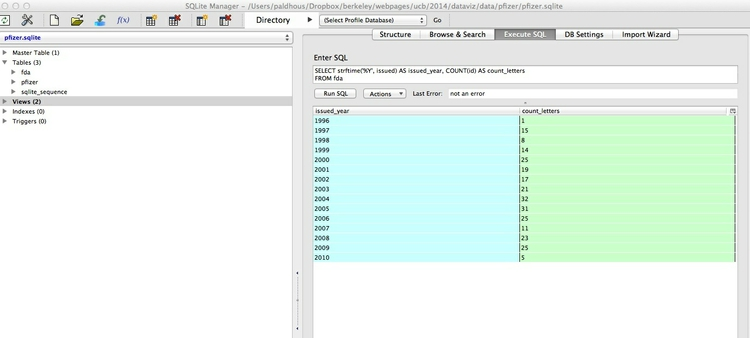

The following query illustrates other some other date functions, to return all the fields in the FDA table, with a new column showing how many days have elapsed since each letter was issued:

```sql
SELECT *, (julianday(date('now')) - julianday(issued)) AS days_elapsed
FROM fda
ORDER BY issued;
```
At the time of writing these class notes, this query gave the following results:


Let's break this query down:

```sql
SELECT *, (julianday(date('now')) - julianday(issued)) AS days_elapsed
FROM fda
ORDER BY issued;
```
- The `julianday` function returns the Julian day -- the number of days that have elapsed since noon in Greenwich (the Prime Meridian longitude used as a reference for time zones) on 24 November, 4714 BC. Having turned dates into numbers in this way, you can subtract one from the other to calculate the difference between them in days.
- `now` returns the current date and time, and `date` extracts just the date from this timestamp. See what happens if you run the same query without the date function.
- Notice that the calculated `days_elapsed` field is color-coded in a more intense green. This is because Julian dates can be decimal fractions, so the result is "cast" by SQLite in this format, known in computing terms as a **floating-point number**, rather than an integer. This will be more obvious when you run the query without the `date` function.

See [here](http://www.sqlite.org/lang_datefunc.html) for more on querying dates with SQLite, including other periods that can be extracted from dates/times.

### Query across joined data tables

Now we will run a query across our two Tables, so we select doctors paid by Pfizer to run Expert-Led Forums who had also received a warning letter from the FDA for problems with their conduct of clinical research. This involves the other main operation with data: a **join**.

To find doctors who may be the same individual, we need to match them by both first and last name. Here is how to achieve that using SQL:

```sql
SELECT *
FROM fda JOIN pfizer ON fda.name_last = pfizer.last_name AND fda.name_first = pfizer.first_name
WHERE pfizer.category LIKE 'Expert%';
```
This will give the following results:


Again, let's break this query down.

```sql
SELECT *
FROM fda JOIN pfizer ON fda.name_last = pfizer.last_name AND fda.name_first = pfizer.first_name
WHERE pfizer.category LIKE 'Expert%';
```
- All should be familiar apart from the `JOIN` within the `FROM` clause. The first part, `fda JOIN pfizer` specifies the two Tables to be joined.
- The rest, starting with `ON`, defines how the tables should be joined together. Here we are telling SQLite to join the tables on the fields defining both first `AND` last names for each doctor.
- When working with more than one table, both the table and the field can be specified, separated by a period. If any of the field names are present in both tables, you will need to do this.

The default `JOIN` in SQLite is called an `INNER JOIN`, which returns results **only** if there are matches across both tables. Notice that you get the same results if you write the query with `INNER JOIN`.

This type of query is a staple of investigative reporting, allowing reporters to match individuals across two datasets: school bus drivers and convicted sex offenders, for instance. In such cases, further reporting is needed to confirm that individuals with matching names are actually the same person!

SQLite also allows you to run `LEFT JOIN` queries. These retain all of the  requested data from the first-mentioned table, and join matching data from the second table. Where there is no matching data from the second tables, `NULL` values are returned.

Close the database by selecting `Database>Close Database` form the top menu.

Finally select `Database>Exit` from the top menu to exit SQLite Manager.

### Assignment

- Run each of the following queries in your pfizer database:
 - Identify the ten doctors paid the most for Professional Advising in the state of North Carolina, giving their full name and city, and listing them in descending order of the total paid.
 - Return all of the data in the FDA Table, with a new column giving the number of days elapsed from the date each letter was sent, to the end of 2010.
 - Return data giving the number of FDA warning letters issued by month, irrespective of the year in which they were sent (i.e. your results should have 12 rows, which each giving the total number of letters sent in that month, from 1996 to 2010).
 - Return data showing the number of FDA warning letters issued in each month for the years 2000 to 2002 inclusive (i.e you should have a separate rows for letters sent in February in 2000, 2001 and 2002). Put the results in chronological order.
 - Return all fields from both tables, showing doctors who received FDA warning letters after the start of 2000, who were also paid by Pfizer for Professional Advising.
- Save each query as a View, then share your database file with me.

Some of these queries may prove quite challenging, and you may need to experiment and review SQLite's [time and date functions](http://www.sqlite.org/lang_datefunc.html). If you get stuck, contact me.


### Further reading

[Comprehensive reference](http://sqlite.org/lang.html) for SQL as understood by SQLite

[Stack Overflow](http://stackoverflow.com/)
For any work involving code, this question-and-answer site is a great resource for when you get stuck, to see how others have solved similar problems. Search the site, or [browse SQLite questions](http://stackoverflow.com/questions/tagged/sqlite).


