# Data visualization with Tableau Public

### Introducing Tableau Public

[**Tableau Public**](http://www.tableausoftware.com/public/) allows you to create a wide variety of interactive charts and maps and organize them into dashboards and stories that can be saved to the cloud and embedded on any web page.

The free Public version of the software requires you to save your visualizations to the open web. If you have sensitive data that needs to be kept within your organization, you will need a license for the [Desktop version](http://www.tableau.com/products/) of the software.

Tableau was developed for exploratory graphical data analysis, so it is a great tool for exploring a new dataset -- filtering, sorting and aggregating the data in different ways while experimenting with various chart types.

Although Tableau was not designed as a publication tool, the ability to embed finished dashboards and stories on any web page has also allowed organizations that lack JavaScript coding expertise to create customized interactive online graphics.

### The data we will use

Download the data for this session from [here](data/visualizing.zip), unzip the folder and place it on your desktop. It a folder called `nations`, with the following files:

- `nations.csv` Data from the [World Bank Indicators](http://data.worldbank.org/indicator/all) portal, which is an incredibly rich resource. Contains the following fields:
 -  `iso_a3` [Three-letter code](http://unstats.un.org/unsd/tradekb/Knowledgebase/Country-Code) for each country, assigned by the [International Organization for Standardization](http://www.iso.org/iso/home/store/catalogue_tc/catalogue_detail.htm?csnumber=63545).
 - `country` Country name.
 - `year`
 - `region` `income_group` World Bank [regions and current income groups](http://siteresources.worldbank.org/DATASTATISTICS/Resources/CLASS.XLS), explained [here](http://data.worldbank.org/about/country-and-lending-groups).
 - `population` Estimated [total population](http://data.worldbank.org/indicator/SP.POP.TOTL) at mid-year, including all residents apart from refugees.
 - `gdp_percap` [Gross Domestic Product per capita](http://data.worldbank.org/indicator/NY.GDP.PCAP.PP.CD) in current international dollars, corrected for purchasing power in different territories.
 - `life_expect` [Life expectancy](http://data.worldbank.org/indicator/SP.DYN.LE00.IN) in years for a child born in the year in question, if prevailing patterns were to stay the same throughout its life.
 - `population` Estimated [total population](http://data.worldbank.org/indicator/SP.POP.TOTL) at mid-year, including all residents apart from refugees.
 - `birth_rate` Number of [live births during the year per 1,000 people](http://data.worldbank.org/indicator/SP.DYN.CBRT.IN), based on mid-year population estimate.
 - `neonat_mortal` [Neonatal mortality rate](http://data.worldbank.org/indicator/SH.DYN.NMRT): number of babies dying before reaching 28 days of age, per 1,000 live births in a given year.

### Visualize the data on nations' health and wealth

#### Connect to the data

Launch Tableau Public, and you should see the following screen:


Under the *Connect* heading at top left, select `Text File`, navigate to the file `nations.csv` and `Open`. At this point, you can view the data, which will be labeled as follows:

 - Text: `Abc`
 - Numbers: `#`
 - Dates: calendar symbol
 - Geography: globe symbol

You can edit fields to give them the correct data type if there are any problems:


Once the data has loaded, click `Sheet 1` at bottom left and you should see a screen like this:


#### Dimensions and measures: categorical and continuous

The fields should appear in the `Data` panel at left. Notice that Tableau has divided the fields into `Dimensions` and `Measures`. These broadly correspond to categorical and continuous variables. Dimensions are fields containing text or dates, while measures contain numbers.

If any field appears in the wrong place, click the small downward-pointing triangle that appears when it is highlighted and select `Convert to Dimension` or `Convert to Measure` as required.

#### Shelves and Show Me

Notice that the main panel contains a series of "shelves," called `Pages,` `Columns`, `Rows`, `Filters` and so on. Tableau charts and maps are made by dragging and dropping fields from the data into these shelves.

Over to the right you should see the `Show Me` panel, which will highlight chart types you can make from the data currently loaded into the `Columns` and `Rows` shelves. It is your go-to resource when experimenting with different visualization possibilities. You can open and close this panel by clicking on its title bar.

#### Columns and rows: X and Y axes

The starting point for creating any chart or map in Tableau is to place fields into `Columns` and `Rows`, which for most charts correspond to the X and Y axes, respectively. When making maps, longitude goes in `Columns` and latitude in `Rows`. If you display the data as a table, then these labels are self-explanatory.

#### Initial questions to ask this data

I first approached the dataset with the following questions:

- What is the relationship between a nations' wealth, measured as GDP per capita, and their citizens' life expectancy?
- How has this relationship changed over time?

You may have realized that these are essentially the same questions asked in the Gapminder video we saw in the opening session -- so our chart will be rather similar.

#### Make a bubble chart to explore the relationship between wealth and life expectancy, and animate over time

From the morning session, you will remember that we can investigate relationships using a scatter plot. One would imagine that the people in wealthier countries would live healthier and longer lives. So we will put wealth on the X axis, as the presumed explanatory variable, and life expectancy on the Y.

First let's rename these variables, so that their meaning is unambiguous. Hover over `Life Expect`, click on the small downward-pointing triangle that appeats, select `Rename` and call it `Life expectancy at birth (years)`. Similarly, change `Gdp Percap` to `GDP per capita`.

Now drag `GDP per capita` to  `Columns` and `Life expectancy at birth (years)` to `Rows`. Notice that this results in a chart with a single point:


This is because Tableau's default behavior is to aggregate continuous variables -- in this case it has added up all the values in the dataset using the function `SUM`.

To override this behaviour, and see every single data point, select `Analysis` from the top menu and uncheck `Aggregate measures`. The chart should now look like this:


However, removing aggregation disables some useful functions (more on this later), so select `Analysis` and check `Aggregate measures` once more. Hover over each of the measures in the `Columns` and `Rows` shelves, click on the downward-pointing triangle to open the dropdown menu, and change the aggregation from `Measure (Sum)` to `Measure (Average)`. The chart should looks like this:


Now drag `Country` to the `Detail` shelf under `Marks`. This creates a separate mark for each country, plotting the average values over the entire time period for each. The chart should now look like this:


To show just one year's data, and to animate the changes over time, drag `Year` into the `Pages` shelf. Notice that this both filters the data and adds controls to move through the years:


Although we are still aggregating the data using the function `AVG`, there is only one record per country, per year, so the chart is now plotting single values.

Experiment with the page controls, and notice that the chart goes blank in 2013 and 2014 -- years for which there is no data. This is not desirable behavior, but we can prevent it by filtering those years out of the displayed data.

Hover over `Year` in the `Pages` shelf, click on the downward pointing trial and select `Filter...`. Uncheck the two years with missing data and click `OK`:


Now drag `Region` to `Color`, and the circles will be colored with Tableau's default qualitative color scheme for categorical data. (Tableau's qualitative color schemes are well designed, so there is no need to adopt a ColorBrewer scheme. However, it is possible to edit colors individually as you wish.)

For a more subtle color scheme, click on `Color`, select `Edit Colors...` and at the dialog box select the `Tableau 10 Light` qualitative color scheme, then click `Assign Palette` and `OK`:


In the `Marks` shelf, change from `Automatic` to `Circle` to switch to solid circles.

As the circles overlap, let's give them some transparency so each can be seen. Click on `Color` again, drop the transparency to 75% and give each circle a gray border to help distinguish them from one another. The chart should now look like this:

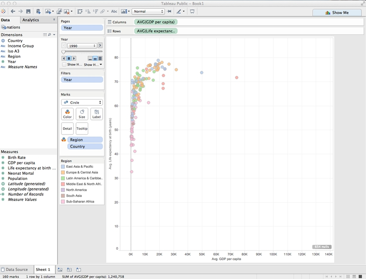

It's clear that there are a few outlier countries with very high GDP per capita, with most of the others clustered at the bottom of the range. Using a logarithmic scale for the X axis will help see differences in population density for most nations.

So right-click on the X axis and select `Edit Axis`. At the dialog box, check `Logarithmic`:

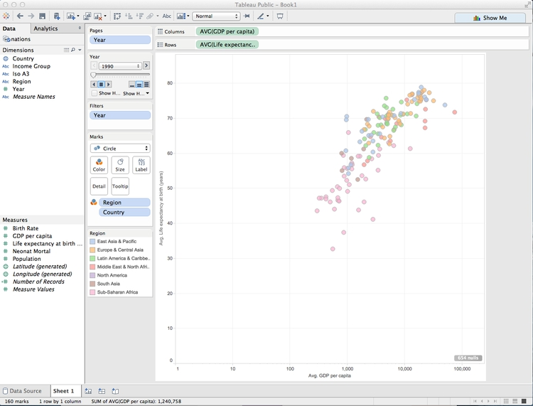

Running through the years, there are never any values of less that $100 on the X axis. So now let's edit the axis range and also change the units so that it's clear the figures are in $.

To fix the latter, hover over `GDP per capita` in the `Measures` panel and select `Default Properties>Number Format...` and fill in the dialog box as follows:

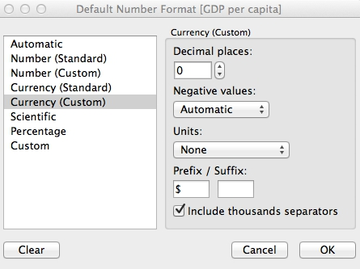

Now right-click on the X axis and select `Edit Axis`. At the dialog box, check `Fixed` and set the `Start` value as `100`. Also edit the `Title`, to remove `Avg.` as only a single value is being shown:

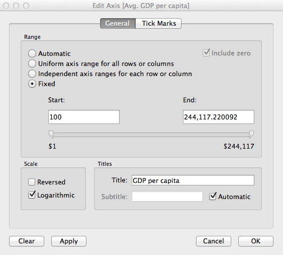

Edit the Y axis `Title` to remove `Avg.` also. The chart should now look like this:


There does indeed seem to be a relationship between wealth and life expectancy, so let's draw a trend line. Switch to the `Analytics` tab in the panel at left, drag `Trend Line` over the chart area, and drop it onto the chart icon labeled `Logarithmic`:


Remember from the opening session that the relationship between wealth and life expectancy across nations is logarithmic, but the logarithmic X axis transforms the curve into a straight trend line. However, rather than a single trend line we have one for each region, and confidence bands around each line have also been drawn:


Now select `Analysis>Trend Lines>Edit Trend Lines` and edit the dialog box to the following:


Hover over the trend line to see its equation. (If you wish, you can also turn off the logarithmic option on the X axis temporarily, to see what the logaraithmic curve looks like.)

Right-click on the line, select `Format...` and change the thick black line to thinner gray dashes. The chart should now look like this:


Use the `Page` controls to play through the years again, and notice that the slope of the line becomes shallower over time.

Having explored this relationship, we could stop there. But we can also highlight larger countries by dragging `Population` to `Size`. After doing so, click on `Size` and move the slider to the right to increase the size of all of the circles.

Tableau's default behavior is to scale circles correctly, by area. So the relative size of the circles corresponds to the countries' population in each year.

The chart should now look something like this:


Now click on the title bars for the size and color legends and select `Hide Card` to remove them from the visualization. We can provide the values for the total amount of protected land through a tooltip, rather than a legend. And we will later make a map to serve as a color legend, making that redundant.

Hover over one of the circles, and notice the tooltip that appears. By default, all the fields we have used to make the visualization appear in the tooltip. (If you need any more, just drag those fields onto `Tooltip`.) Click on `Tooltip` and edit as follows:


Unchecking `Include command buttons` removes some additional Tableau tooltip functionality, giving a plain tooltip.

There's a problem with the chart: Some of the smaller circles lie behind larger ones, which means that their tooltips can't be accessed. To solve this, open the dropdown menu for `Country` in the `Marks` shelf, select `Sort` and fill in the dialog box as follows:


Now drag `Country` so it appears at the top of the list of fields in the `Marks` shelf. The sort we have just performed would not have been possible if we had unchecked `Aggregate Measures` earlier. It should ensure that the smallest circles always appear on top:


Take some time to consider how the chart is constructed in relation to the principles covered in this morning's session, especially the perceptual heirarchy of visual cues.

#### Save to the cloud

Right-click on `Sheet 1` at bottom, select `Rename Sheet`, and call it `Bubble chart`.

Having finished this chart, now is a good time to save our work. From the top menu, select `File>Save To Tableau Public`. At the logon dialog box enter your Tableau Public account details, give the Wookbook a suitable name and click `Save`. When the save is complete, you can close that window.

#### Make a map to use as a color legend

Select `Worksheet>New Worksheet` from the top menu, and double-click on `Country`. Tableau recognizes the names of countries and states/provinces; for the U.S., it also recognizes counties. Its default map-making behavior is to put a circle at the centroid of each area, which can be scaled and colored to reflect values from the data:

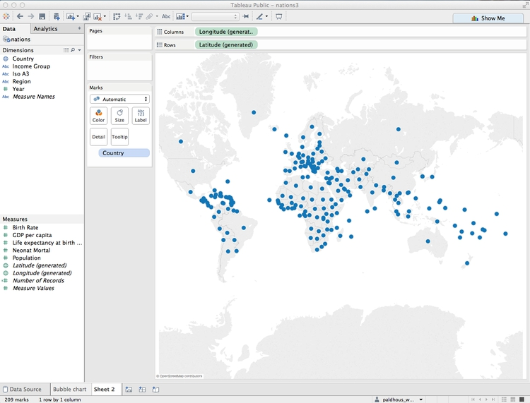

However, we need each country to be filled with color by region. Using `Show Me`, switch to the `filled map` option, and each nation should fill with color. Drag `Region` to `Color` and see how the same color scheme we used previously carries over to the map. Click on `Color`, set the transparency to 75% to match the bubble chart and remove the borders. Also click on `Tooltip` and uncheck `Show tooltip` so that no tooltip appears on the legend.

We will use this map as a color legend, so its separate color legend is unnecessary. Click the color legend's title bar and select `Hide Card` to remove it from the visualization.

Center the map in the view by clicking on it, holding and panning. It should now look something like this:

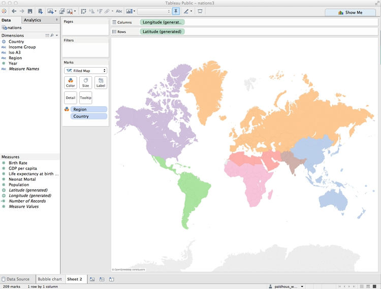

Rename the worksheet `Inset map` and save to the web again.

#### Make a dashboard displaying the bubble chart and map color legend

From the top menu, select `Dashboard>New Dashboard`. We can set the size of the dashboard to fit the web page in which it will be embedded, and this can be a `Range`, giving some basic responsive design. For simplicity, we will set the dashboard to `Laptop` size.

Drag `Bubble chart` from the panel at left to the main panel. The default title, from the worksheet name, isn't very informative, so right-click on that and select `Hide Title`.

Right click on the `Year` title for the `Page` control, and `Edit title` to increase its font size.

Notice that Tableau allows you to drop various other items onto a dashboard: horizontal and vertical containers, text boxes, images, web pages and blank space.

Drag a `Text` box onto bottom of the chart, until the lower part of the bubble chart becomes gray, showing where the new element will appear. Then add the source information:


The source text box will be much too large, so extend the size of the chart window as appropriate. Now is also a good time to set the font size for the axis labels, which are a little small. Right-click on each axis, select `Format` and increase the font size to `10pt`.

Now select `Dashboard>Show Title` from the top menu. Right-click on it, select `Edit Title...` and change the default `<Sheet Name>` to something more informative:


When adding items to a dashboard, you can make them `Tiled` or `Floating`, which allows them to be placed over the top of one another. Switch to `Floating` and drag the map onto the bottom right of the chart. Hide its title, and if necessary reduce its size so that it doesn't obscure any of the circles in any of the years. Also right-click on the map and select `Hide View Toolbar` and `Hide Map Search`. This will remove the map's interactive controls.

The finished dashboard should look something like this:

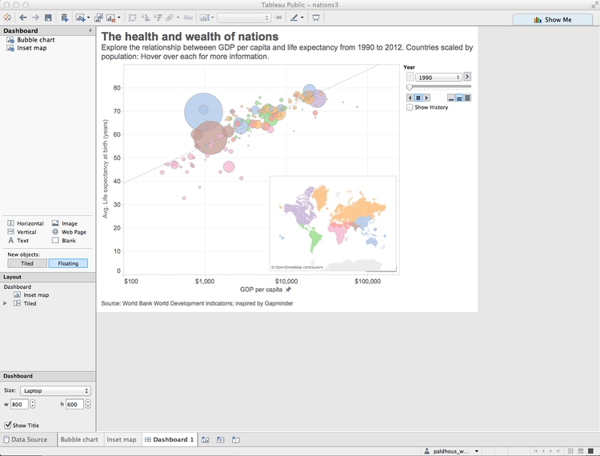

Rename the dashboard and save to the web.

Once the dashboard is online, use the `Share` link at the bottom to obtain an embed code, which can be inserted into the HTML of any web page.


(You can also `Download` a static view of the graphic as a PNG image or a PDF.)

#### Some more questions to ask this data

I next decided to explore the data on neonatal mortality, asking the following questions:

- How have the total number of neonatal deaths changed over time, globally, regionally and nationally?
- How has the neonatal death rate for each country changed over time?

#### Create new calculated variables

The data contains fields on birth and neonatal death rates, but not the total numbers, which must be calculated. From the top menu, select `Analysis>Create Calculated Field`. Fill in the dialog box as follows (just start typing a field name to select it for use in a formula):


Notice that calculated fields appear in the `Data` panel preceded by an `=` symbol.

Now create a second calculated field giving the total number of neonatal deaths:


(We have run some simple arithmetic, but it's possible to use a wide variety of functions to manipulate the data in various ways.)

#### Make a series of treemaps showing neonatal deaths over time

For any one year, I realized that a treemap would allow me to directly compare the neonatal deaths in each country, nested by region.

In a new worksheet, drag `Country` and `Region` onto `Columns` and `Neonatal deaths` onto `Rows`. Then open `Show Me` and select the `treemap` option. The initial chart should look like this:


Now remove `Region` from `Label` to  show just the country names, and drag `Region` to `Color`. Click on `Color` and set transparency to 75%, to match the appearance of our previous chart.

The treemap should now look like this:


Notice that Tableau has by default aggregated `Neonatal deaths` using the `SUM` function, so what we are seeing is the number for each country added up across the years.

To see one year at a time, we need to filter by year. If you drag the existing `Year` variable to the `Filters` shelf, you will get the option to filter by a range of numbers, which isn't what we need:


Instead, we need to be able check individual years, and draw a treemap for each one. To do that, select `Year` in the `Dimensions` panel and `Duplicate`.

Select the new variable and `Convert to Discrete` and then rename it `Year (discrete)`. Now drag this new variable to `Filters` and select 2012 (the last year for which there is data).


The treemap now displays the data for 2012:


That's good for a snapshot of the data, but with a little tinkering, we can adapt this visualization to show change in the number of neonatal deaths over time at the national, regional and global levels.

Select `Year (discrete)` in the `Filters` shelf and `Filter ...` to edit the filter. Select all the years with even numbers (apart from 2014, for which there is no data) and click `OK`:


Now drag `Year (discrete)` onto `Rows` and the chart should look like this:


The formatting needs work, but notice that we now have a bar chart made out of treemaps.

Extend the chart area to the right by changing from `Normal` to `Fit Width` on the dropdown menu in the top ribbon:


I find it more intuitive to have the most recent year at the top, so click on this sort icon in the top ribbon to change the order of the bars:


The rectangles are now too small for the labels to work well. Rather than removing them entirely, let's just leave a label for India in 2012, to make it clear that this is the country with by far the largest number of neonatal deaths. Click on `Label` in the `Marks` shelf, and switch from `All` to `Selected` under `Marks to Label`. Then right-click on the rectangle for India in 2012, and select `Mark Label>Always Show`. Right click again on the rectangle and select `Format`. Under `Sheet`, open the dropdown menu for `Default>Pane` and set the color to a dark gray. The chart should now look like this:


We can again use the map as a legend for the regions, so hide the color legend. Edit the tooltip as follows:


To remove some clutter from the chart, select `Format>Borders` from the top menu, and under `Sheet`, `Rows` and `Columns` set all the options to `None`. Right-click on `Year (discrete)` at the top left of the chart and select `Hide Field Labels for Rows`. Then hover just above the top bar to get a double-arrowed drag symbol and drag upwards to reduce the white space at the top. You may also want to drag the bars a little closer to the year labels. The chart should now look like this:

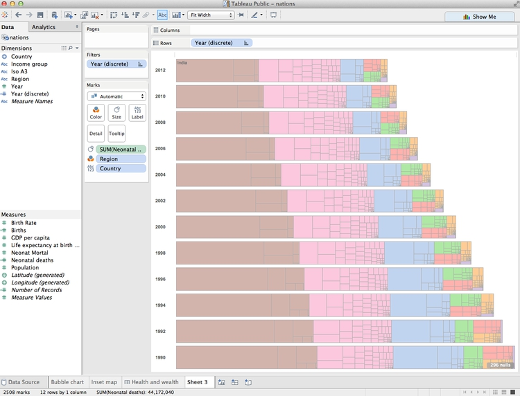

Rename the worksheet `Treemap bar chart` and save to the web.

#### Make a line chart showing neonatal mortality rate by country over time

To explore the neonatal death rate over time by country, I decided to use a line chart.

First, rename `Neonat Mortal` as `Neonatal death rate (per 1,000 births)`. Then, in a new worksheet, drag this variable to `Rows` and `Year` to `Columns`. Also drag `Country` to `Detail` in the `Marks` shelf to draw one line per country. The chart should now look like this:


Drag region to `Color`, set the transparency to 75%, and remove the color legend. Notice that this data finishes in 2013. To make the range consistent with the treemaps, drag `Year (discrete)` to filter and select all years apart from 2013 and 2014.

Now right-click on the X axis, select `Edit Axis`, edit the dialog box as follows and click `OK`:


To minimize chart junk, select `Format>Borders` from the top menu, and under `Sheet` set all the options to `None`. Then select `Format>Lines`, under `Columns` set `Grid Lines` ro `None`, and under `Sheet` set `Axis Ticks` to `None`.

Right-click on the X axis again, select `Format`, change `Alignment` to `Up` and use the dropdown menu set the `Font` to bold.

The chart should now look like this:


We can also highlight the countries with the highest total number of neonatal deaths by dragging `Neonatal deaths` to `Size`. The chart should now look like this:


This line chart shows that the trend in most countries has been to reduce neonatal deaths, while some countries have had more complex trajectories. But to make comparisons between individual countries, it will be necessary to add controls to filter the chart.

Tableau's default behavior when data is filtered is to redraw charts to reflect the values in the filtered data. So if we want the Y axis and the line thicknesses to stay the same when the chart is filtered, we need to freeze them.

To freeze the line thicknesses, hover over the title bar for the line thickness legend, select `Edit Sizes...` and fill in the dialog box as follows:


Now remove this legend from the visualization. We will later add an annotation to our dashboard to explain the line thickness.

To freeze the Y axis, right-click on it, select `Edit Axis...`, make it `Fixed` and click `OK`:

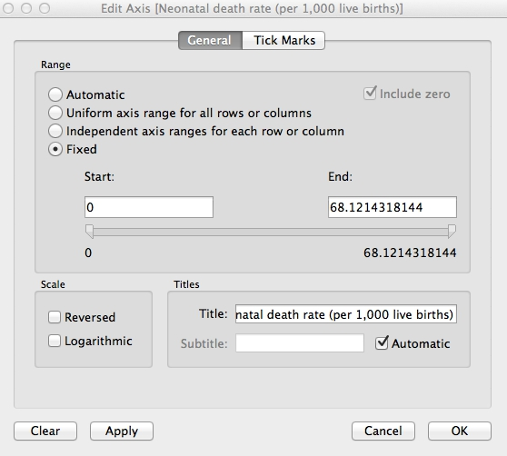

Right-click on the Y axis again, select `Format...` and increase the font size to `10pt` to make it easier to read.

Now drag `Country` to `Filters`, make sure `All` are checked, and at the dialog box, and click `OK`:


Now we need to add a filter control to select countries to compare. Hover over `Country` in the `Filters` shelf and select `Show Quick Filter`. A default filter control, with a checkbox for each nation, will appear to the right of the chart:


This isn't the best filter control for this visualization. To change it, hover over the title bar for the filter, note the range of filter controls available, and select `Multiple Values (Custom List)`. Then select `Edit Title...` and add some text explaining how the filter works:

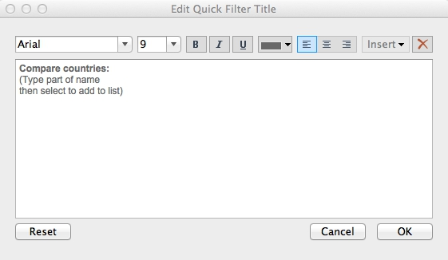

Take some time to explore how this filter works.

Rename `Income Group` to `Income group` so its case is consistent with the other variables named on the chart. The add `Region` and `Income group` to `Filters`, making sure that `All` options are checked for each. Select `Show Quick Filter` for both of these filters, and select `Single Value Dropdown` for the control. Reset both of these filters to `All`, and the chart should now look like this:


Now let's provide a single label to highlight India, as we did for the treemap. Drag `Country` onto `Label`, then click on `Label` and highlight `Selected`. Then hover over the line for India, select a point, right-click and select `Mark Label>Always Show`. Right-click on the point again, select `Format` and under `Sheet>Pane` set the font color to a dark gray.

The chart should now look like this:


Finally, click on `Tooltip` and edit as follows:


Rename the sheet `Line chart` and save to the web.

#### Make a dashboard combining both charts

Select `Dashboard>New Dashboard` from the top menu, and make it `Laptop` size.

Add `Treemap bar chart` to the dashboard, hide its title and then `Fit Width` to make it fill the dashboard area. Similarly, add `Line Chart` to the right of the dashboard, which should now look like this:

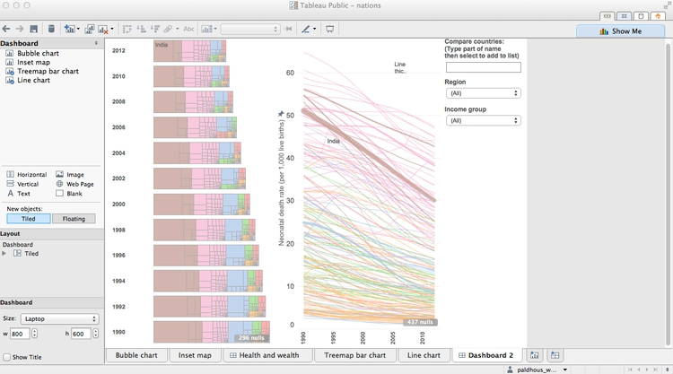

This needs some reformatting. Drag the bottom of the first filter control down to create some room for the lists of countries that it will create.

Notice that the `Region` and `Income group` filters control only the line chart. To make them control the treemaps, too, for each filter select `Apply to Worksheets>Selected Worksheets...` and fill in the dialog box as follows:


The filters will now control both charts.

Add `Inset map` for a color legend at bottom right. Hide its title and remove the map controls, as for the first dashboard.

We can also allow the highlighting of a country on one chart to be carried across the entire dashboard. Select `Dashboard>Actions...` from the top menu, and at the first dialog box select `Add action>Highlight`. Filling the second dialog box as follows will cause each country to be highlighted across the dashboard when it is clicked on just one of the charts:


Click `OK` on both dialog boxes to apply this action.

Add a title and source information. Then switch to the `Floating` option, then drag a `Text` box to the top of the line chart to add an annotation explaining the thickness of the lines.

Give the dashboard an appropriate name, and save to the web.

The final dashboard should look like this:


Again, take some time to consider how this visualization of the data works, in relation to the principles we discussed in the opening session.

#### From dashboards to stories

Tableau also allows you to create stories, which combine successive dashboards into a step-by-step narrative. Select `Story>New Story` from the top menu. Having already made a dashboard, you should find these simple and intuitive to create. Select `New Blank Point` to add a new scene to the narrative.

#### Better responsive design

While the Tableau dashboard size `Range` option gives some basic responsive design, this will not easily allow you to create dashboards that work on every device from a small smartphone to a large desktop computer.

I would suggest creating three different dashboards, each with a size `Range` appropriate for phones, tablets, and desktops respectively. You can then follow the instructions [here](https://public.tableau.com/s/blog/2014/11/making-responsive-tableau-dashboards) to put the embed codes for each of these dashboards into a div with a separate class, and then use `@media` CSS rules to ensure that only the div with the correct dashboard displays, depending on the size of the device.

If you need to make a fully responsive Tableau visualization and are struggling with these instructions, contact me for help!

As for all responsively designed web pages, make sure to include this line of code between the `<head></head>` tags of your HTML:

```CSS
<meta name="viewport" content="width=device-width, initial-scale=1.0">
```

### Further reading/viewing

[Tableau Public training videos](http://www.tableausoftware.com/public/training)

[Gallery of Tableau Public visualizations](http://www.tableausoftware.com/public/gallery/all)
You can download any of these examples using the links at bottom right and open the files (which will have the extension `.twbx`) with Tableau Public to see how they were put together.

[Tableau Public Knowledge Base](http://www.tableausoftware.com/public/knowledgebase/all)
A useful resource with the answers to many queries about how to use the software.


