# Backgrounding non-profits, companies and people

### Non-profits

In the U.S., non-profit organizations can be considered as charities, exempt from tax, if their activities fall under [exempt purposes](http://www.irs.gov/Charities-&-Non-Profits/Charitable-Organizations/Exempt-Purposes-Internal-Revenue-Code-Section-501%28c%29%283%29) specified by the Internal Revenue Service (IRS). These purposes are summarized by the IRS as "charitable, religious, educational, scientific, literary, testing for public safety, fostering national or international amateur sports competition, and preventing cruelty to children or animals."

Charities meeting these requirements are known as 501(c)(3) organizations, after the section of the U.S. tax code that governs their operations. As we will see, this includes some organizations with large turnovers. Some organizations have both commercial arms that are treated as for-profits, and non-profit arms that fall under 501(c)(3).

While 501(c)(3) organizations do not have to pay tax, they do have to submit an annual report to the IRS, known as a Form 990. As a journalist trying to gather basic information on a non-profit, the idiosyncratic Form 990 is your friend.

There are several versions of this form, with a condensed version for smaller non-profits, see [here](https://www.irs.gov/Charities-&-Non-Profits/Annual-Electronic-Filing-Requirement-for-Small-Exempt-Organizations-Form-990-N-e-Postcard). 501(c)(3) organizations with for-profit arms must file their taxable business income using a form called [990-T](http://www.irs.gov/instructions/i990t/).

We will consider the full Form 990, also known as 990-EO, filed by organizations with annual earnings of $200,000 or more, and assets of $500,000 or more.

Two websites provide a good starting point to search for non-profits and view their 990s:

##### [Guidestar](http://www.guidestar.org/)

From the homepage, you can search for non-profits by name. The advanced search page is [here](http://www.guidestar.org/AdvancedSearch.aspx). Once on the page for an individual non-profit, for example [here](http://www.guidestar.org/organizations/53-0196572/american-chemical-society.aspx) for the American Chemical Society, who will see a green button to the right to download the three most recent 990s:

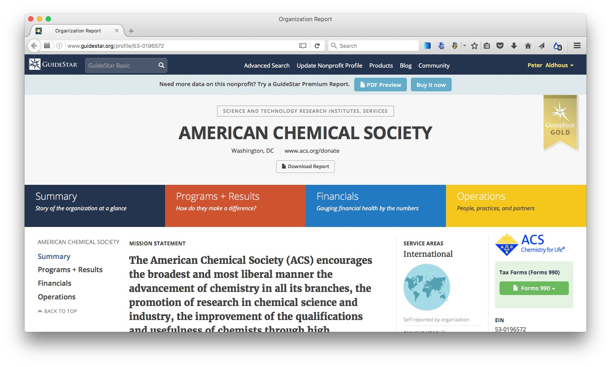

You will need to [sign up](https://www.guidestar.org/Login.aspx) for a free account to view these forms. You can also pay for access to more reports and certain information extracted from them -- however, I have never found any need to do this.

##### [CitizenAudit](https://www.citizenaudit.org/)

This is a project set up by the data journalist [Luke Rosiak](http://www.lukerosiak.info/), originally with backing from the Sunlight Foundation. It is systematically digitizing 990s using optical character recognition, so that they become fully searchable. So not only can you use the search box on the home page to search for an organization and its 990s, but you can also search the documents for mentions of people, payments from one non-profit to another, and so on. There is a good write-up of its uses in journalism [here](http://www.icij.org/blog/2013/09/investigating-charities-how-search-finances-nonprofits-and-foundations).

For comparison with Guidestar, [here](https://www.citizenaudit.org/530196572/) is the page for the American Chemical Society:

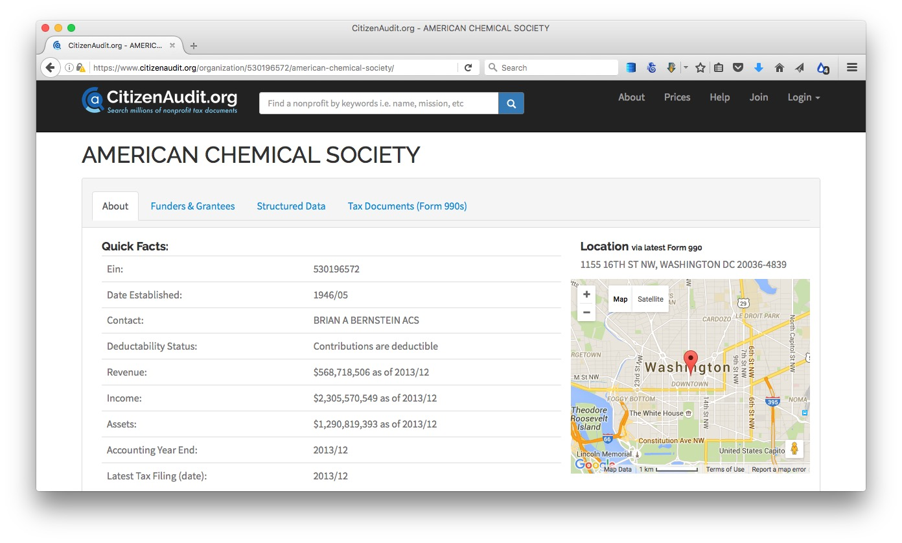

The `Tax Documents (Form 990s)` tab should have links to 990-EO and 990-T documents going back over 15 years. The most recent ones should habe searchable **Raw text**. (You can also download the scanned PDFs and search them directly in a PDF viewer such as Adobe Acrobat or Preview.)

When CitizenAudit launched, it was entirely free. It has now become self-supporting, which means that after [40 searches or page views](https://www.citizenaudit.org/pages/faq/) from a particular IP address, you will be asked to sign up for a [paid account](https://www.citizenaudit.org/accounts/signup/). This limits its utility, however if you have a project for which you need to gather alot of information on non-profits, and particularly if you need to look at how money passes from one to another, buying a 30-day pass may be a worthwhile option. The full **Funders and Grantees** section, which lists organizations giving and receiving money to the non-profit in question, is only available with a paid account.

##### What's in a Form 990?

- **Part I** gives a summary of revenue and expenses over the past two years.

- **Part III** gives detail of expenses and revenue on program service -- a major, usually ongoing, activity of an organization that accomplishes its tax-exempt purpose.

- **Parts IV to VI** contain checklists verifying that the charity meets criteria for tax-exempt status, has appropriate governance and policies etc.

- **Part VII** lists and gives compensation for: 
A) Officers, directors and trustees and key employees.
B) Five current highest compensated employees paid more than $100,000.
C) Former officers, key employees and highest compensated employees paid more than $100,000.
D) Former directors and trustees who received more than $10,000.
E) Five highest paid independent contractors paid more than $100,000.

- **Part VIII** gives a breakdown of revenue.

- **Part IX** gives a breakdown of expenses into major functional categories.

- **Part X** is the balance sheet (a friendly accountant can help interpret this and other parts of the form).

**Schedules of interest:**

- **B** would be of great interest, as it lists major contributors and their donations. But is almost always missing, and if present names can be withheld. But there are often other ways of getting this information -- annual reports, plaques in the lobby etc.
- **C** documents political campaign and lobbying activities.
- **I** documents grants awarded.
- **J** has more details on compensation of directors, officers, key employees etc.
- **L** Transactions with “interested persons.”
- **O** supplemental information, pay attention to this, as it contains the overspill from other parts of the form!
- **R** Related organizations.

##### An example Form 990

Here is the latest (2014) Form 990 for the American Chemical Society:

In class, we will use this form to answer the following questions:

- What was the ACS's total revenue in 2014?

- What were its total expenses?

- What was its total salary bill?

- What was the highest paid independent contractor?

- Who was the highest paid officer/employee, and how much did they earn?

- How much did the ACS spend on lobbying?

##### More resources for repoting on nonprofits

For excellent reporting on charities behaving badly, read [America's Worst Charities](http://cironline.org/americasworstcharities), by the Center for Investigative Reporting and the *Tampa Bay Times*. [Kendall Taggart](https://www.buzzfeed.com/kendalltaggart), now with BuzzFeed News, has a [great slide deck](http://slides.com/kendall/mining-nonprofit-data#/) explaining the resources she used to report these stories. She explains more about how the reporting was done [here](http://cironline.org/reports/how-we-identified-nations-worst-charities-4630).

America's Worst Charities is particularly interesting because the reporters weren't just analyzing the spending of one or two charities: They looked at thousands, focusing on those that used the services of professional fundraising companies, and then highlighting those that spent proportionately the least on their supposed charitable function. To do this, they downloaded [bulk financial data](https://www.irs.gov/uac/SOI-Tax-Stats-Annual-Extract-of-Tax-Exempt-Organization-Financial-Data), extracted from 990s, provided by the IRS. The slide deck explains that they used Open Refine for cleaning this data, and SQLite for analyzing it -- tools we've explored in previous weeks.

The slide deck also recommends resources to track charity finances available in [some states](http://slides.com/kendall/mining-nonprofit-data#/16), and a [database of disciplinary actions](http://charitysearch.apps.cironline.org/) taken by states against charities, compiled by CIR and the *Tampa Bay Times*.


### Companies

If a company is public, meaning its shares are traded on a stock exchange, then the value of its shares, and the volume of their trading, can provide useful information about its general health, and reveal significant events affecting the company. [Google](http://www.google.com/finance) and [Yahoo](http://finance.yahoo.com/) both operate finance sites at which you can view these metrics over time.

In class, we will use Google Finance to explore the history of trading in the stock of Valeant Pharmaceuticals, which has become controversial after [being accused of price gouging](http://www.businessinsider.com/why-have-valeant-pharmaceuticals-shares-collapsed-2015-11).

At Google Finance, you can view the graphs of stock value and trading volume over various periods (up to ten years), and compare both to **Related companies**, listed below the graph, or standard indices such as the Dow Jones Industrial Average. Companies can be searched by their full names, or by their abbreviated stock market [ticker](http://en.wikipedia.org/wiki/Ticker_symbol) -- VRX in the case of Valeant.

Yahoo finance also allows you to download data on the stock value history of companies by constructing urls of the following form:

**Valeant:**

```SQL
http://real-chart.finance.yahoo.com/table.csv?s=VRX
```

**Dow Jones Industrial Average:**

```SQL
http://real-chart.finance.yahoo.com/table.csv?s=^DJI
```

Search [here](http://finance.yahoo.com/lookup) for the tickers/symbols for companies and indices to use in constructing these urls.

##### Securities and Exchange Commission

Public companies are regulated by the [**Securities and Exchange Commission**](https://www.sec.gov/about/whatwedo.shtml) (SEC), which describes its role as to "protect investors, maintain fair, orderly, and efficient markets, and facilitate capital formation." Traded companies are obliged to report certain information to the SEC, which you can view by searching for them at the SEC's main [company search page](https://www.sec.gov/edgar/searchedgar/companysearch.html).

At the page for each company, you will find its filings to the SEC over time. Here is a guide to the codes for some of the most important documents:

- **10-K** is the annual report, giving  year-end financial statements, a history of the company, legal entanglements, insider conflicts of interest and a detailed management discussion of the company’s prospects. The section marked **Risk Factors** is especially informative. It is where a company describes all the things that might harm its prospects. This is where companies speak the truth that otherwise they would never utter -- they do this here because it protects them from being accused by the SEC of misleading investors if they get into serious financial trouble. [Here](https://www.sec.gov/Archives/edgar/data/1076481/000119312510057418/d10k.htm) is the 10-K filed for 2009 by the diagnostics company Sequenom, in which this section makes for particularly interesting reading!

- **10-Q** is the quarterly financial report.

- **DEF 14A** is the proxy statement, which gives salaries, bonuses and stock holdings of top executives. It also gives biographies of some executives and directors, and lists the largest shareholders.

- **8-K** announces important breaking news that may affect the stock price. Biomedical companies, for example, will report key results from clinical trials here.

- **Form 4 and Schedule 13D** report stock transactions by insiders and key shareholders.

You can search for SEC enforcement actions [here](http://www.sec.gov/litigation.shtml). Try searching for Sequenom and see what you find! (This [brief story](https://www.newscientist.com/blogs/shortsharpscience/2009/09/claims-for-safer-downs-test-cr.html) will provide some background to why Sequenom got into trouble.)

[Here](https://searchwww.sec.gov/EDGARFSClient/jsp/EDGAR_MainAccess.jsp) is the SEC's full text search, which can be useful, for example, for finding references to individuals, and privately-held companies, in documents filed by publicly-traded companies.


##### Sqoop


**[Sqoop](sqoop.com/)** is a new site that aims to provide a one-stop-shop for information on companies. Sign up for a free account [here](http://sqoop.com/users/sign_up).

You can search using the names of companies, individual corporate officers, or keywords, and it will return links to SEC filings, patents and cases in in federal courts. (You will still need a login for the [PACER](https://www.pacer.gov/) federal court search system to access federal court documents.)

Here are the results for a search on Valeant:

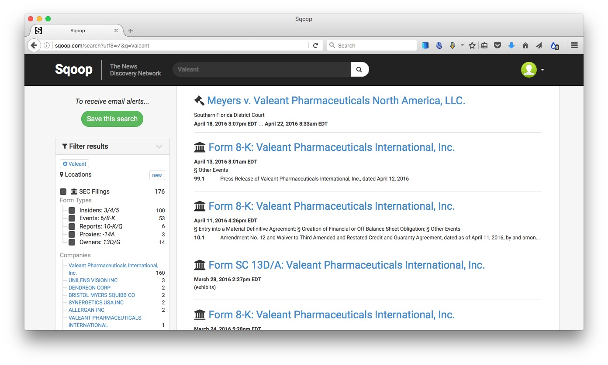

You can save a search to receive updates by email of new documents.

If you are a local reporter, Squoop also provides the option to [narrow your SEC filing searches by geography](http://sqoop.com/blog/2016-03-11-geographic-search). Click on the `Locations` button after running your search to activate this option.

Sqoop is currently made freely avilable to journalists, as it tries to expand its user base. It is a for-profit, however, so it is possible that charges will be introduced in future.

##### Privately-held companies

It is much harder to do background research on privately-held companies, which do not have to file reports to the SEC. So think about the agencies (state and federal) that have some oversight or regulatory role. For example, a company running animal experiments will have to file reports about its use of animals to the U.S. Department of Agriculture's Animal and Plant Health Inspection Service, which can be searched [here](https://acissearch.aphis.usda.gov/LPASearch/faces/CustomerSearch.jspx).

While somewhat dated, [here](backgrounding_companies.pdf) is a useful guide to backgrounding privately-held companies.

In the U.S., companies are registered with the authorities in the state they call home. You can search for businesses registered in California [here](http://kepler.sos.ca.gov/). You can order basic documents about companies' registration [using this form](http://bpd.cdn.sos.ca.gov/pdf/be-records-requests.pdf).

But be aware that the name a company trades under may not be its registered name. To find out the registered name, you may need to run a "fictitious business name" search at the county level. [Here](http://sccounty01.co.santa-cruz.ca.us/clerkrecorder/Asp/FBNInquiry.asp) is the search site for Santa Cruz County, and [here](http://www.brbpub.com/) is useful a site from which you can navigate down to all sorts of public records at state and country levels, including fictitious business name searches.

[**OpenCorporates**](https://opencorporates.com/) is an ambitious effort to build a database of information on companies throughout the world, public and private.

### Finding former employees

Any time you are investigating an organization, whether a company or a nonprofit, former employees can be an invaluable resource. (Of course, you need to be wary of embittered ex-employees settling scores.) In recent years, LinkedIn has emerged as the best way of finding them.

If you are a professional journalist (so you may have to wait until you're out in the world of employment!) you can [ask to join](https://www.linkedin.com/groups/3753151/profile) the [LinkedIn for Journalists](https://press.linkedin.com/about-linkedin/linkedin-for-journalists) group. You should then get an invitation to attend a webinar, and once you've done that you'll be granted a free premium account, which allows you to use the sites advanced search functions and send InMail messages to people you want to contact.

### People

Searching for information on individual people can be difficult, without access to a commercial research tool such as [Accurint](http://www.accurint.com/). In my experience, most online search sites that offer background checks, contact information, and so on, are more effective at parting you from your money than providing good information.

Again, it helps to think about official agencies to which individuals must report information. [Who Is John Doe](http://www.reporter.org/desktop/tips/johndoe.htm), a site put togther by investigative reporter [Duff Wilson](http://www.journalism.columbia.edu/profile/395-duff-wilson/10), provides a very useful guide to potential sources of information. [Here](http://www.peoplesearchpro.com/journalism/people/) is another site that provides links to various people-searching resources.

# Making maps with CartoDB


#### The data we will use

Download from [here](data/mapping.zip), unzip the folder and place on your desktop. It contains the following:

`mapping` Folder containing:
- `oregon_dams_csv` Data on dams in Oregon, from the state's [dams inventory](http://apps.wrd.state.or.us/apps/misc/dam_inventory/).
- `oregon_seismic_risk` Data om seismic risk for the state, [calculated by](http://earthquake.usgs.gov/hazards/products/conterminous/) the U.S. Geological Survey.

#### Getting started with CartoDB, and uploading data

[**CartoDB**](http://qgis.org/en/site/) is a cloud-based mapping application that makes it easy to produce interactive, online maps. These maps can include [animations of data over time](http://docs.cartodb.com/tutorials/introduction_torque.html). It is also a geospatial database, allowing you to process geodata using Structured Query Language.

Login to a new CartoDB account, and you should see a screen like this:

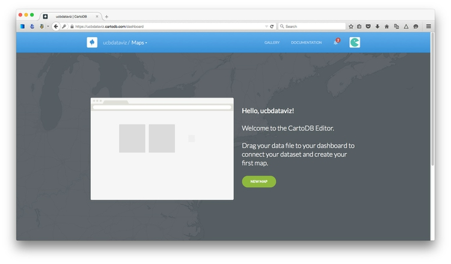

Open the drop-down menu under `Maps` at top left and switch to `Your datasets`. The click the green `NEW DATASET` button at top right:

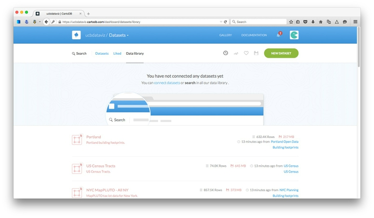

You should now see the following screen:

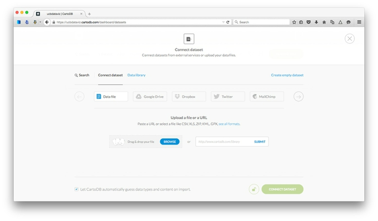

With the `Data file` tab selected, click the `Browse` button, navigate to the zipped `oregon_seismic_risk.zip` shapefile and click `Open`. Then click the green `Connect dataset` button.

CartoDB can import geodata in a variety of formats, including CSV, [KML](https://developers.google.com/kml/?hl=en), [GeoJSON](http://geojson.org/) and zipped [shapefiles](https://en.wikipedia.org/wiki/Shapefile). See [here](http://docs.cartodb.com/cartodb-editor.html) for more on imports and supported data formats.

Once the data has imported, you will see the uploaded data table in `DATA VIEW`:

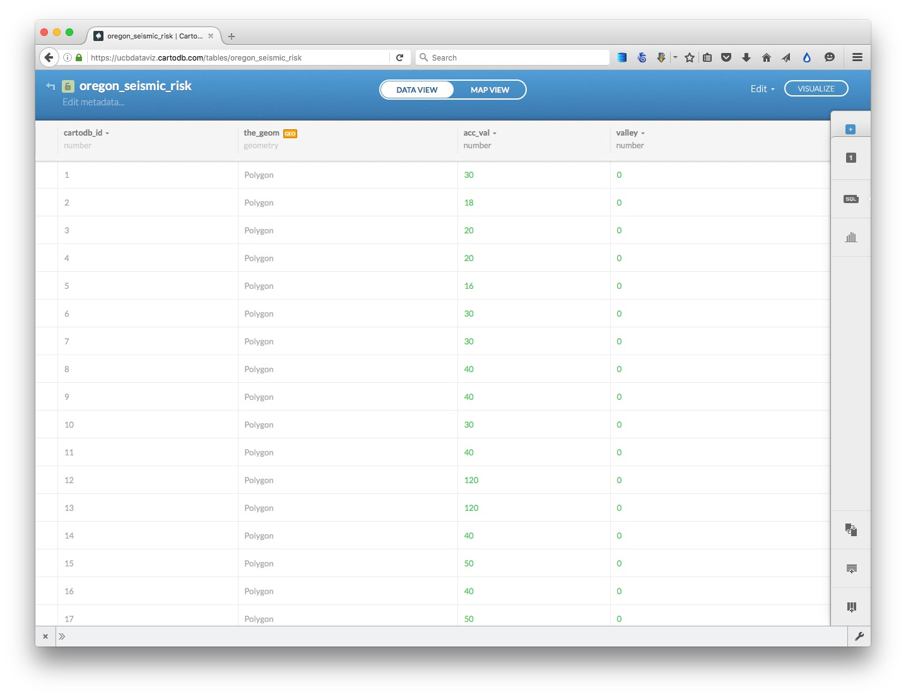

Notice that, in addition to the fields from the original data, each row has been given a `cartodb_id`, which is a unique identifier for each. The table also has a field called `the_geom` which has the tag `GEO`. This field is central to how CartoDB works, defining the geometry of any map you make. These geometries can be points, lines or polygons (areas) -- which is what we have here.

You can rename fields, sort the table by the data in them, or change their data type (for example from numbers to strings of text), by clicking the downward-pointing triangle next to the header of each.

The important column in this data is `acc_val`, which represents the peak ground accelaration expected over 50 years, with a two-percent probability. The numbers are expressed as a percentage of *g*, the acceleration due to gravity.

Switch to `MAP VIEW` to see the basic, unstyled map:

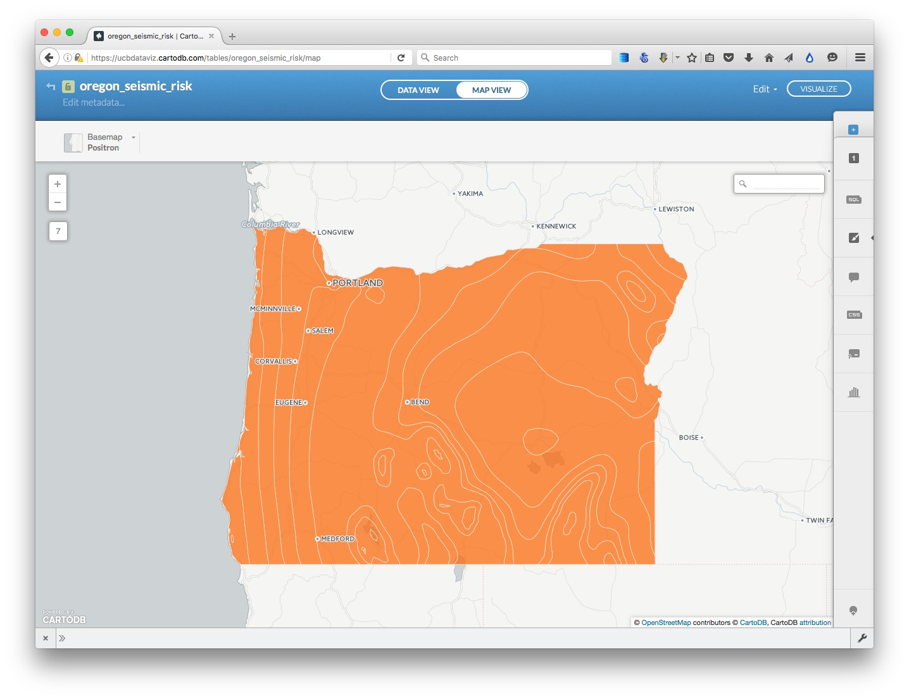

Click the small return arrow at top left to go back to the overview of your datasets.

Notice that the top menu has a link to `DOCUMENTATION`, which has links to CartoDB's technical manuals. The `Data library` link contains useful datasets that you can import into your own account. Take a few minutes to explore what's there, before returning to your `Datasets`.

Now click the `NEW DATASET` button again and import the file `oregon_dams.csv`, which should look like this in the `DATA VIEW`:

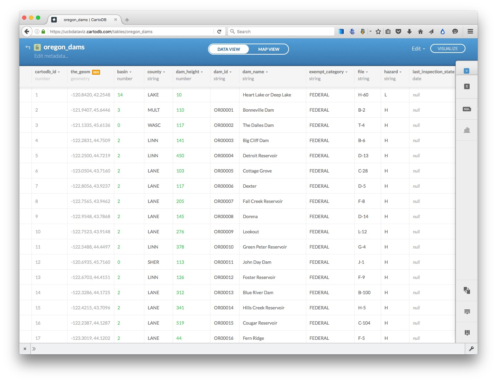

Notice that `the_geom` for points is given by their longitude and latitude co-ordinates.

Notice that there is a column called `hazard`, with valaues of `H` for high, `S` for significant, and `L` for low. `H` means a dam could cause loss of human life if it failed; `S` means failure could cause significant economic or environmental damage. However, these ratings do not mean that a dam is *likely* to fail.

Click on the `MAP VIEW` to see the locations of all of the dams:

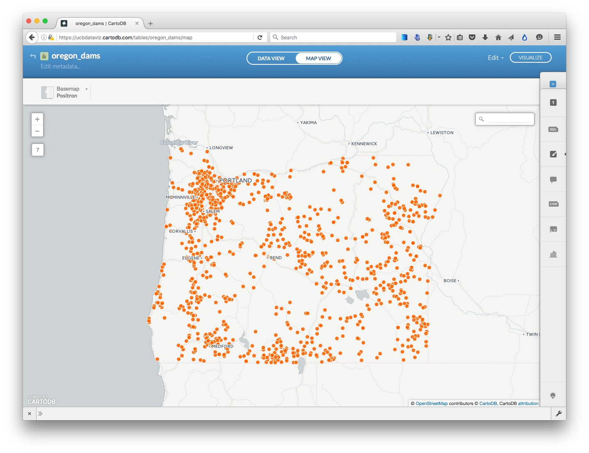


#### Run a SQL query to select potentially hazardous dams in high seismic risk zones

We will now run the following query, to filter the dams to return those with a hazard rating of `H` or `S` only in the zones of highest seismic risk, where `acc_val` is `40` or more:

```SQL
SELECT oregon_dams.*
FROM oregon_dams, oregon_seismic_risk
WHERE ST_WITHIN(oregon_dams.the_geom, oregon_seismic_risk.the_geom) AND oregon_seismic_risk.acc_val >= 40 AND (oregon_dams.hazard = 'H' OR oregon_dams.hazard='S')
```

CartoDB is based on a [PostgreSQL](http://www.postgresql.org/) database. It works similarly to SQLite, although the syntax for some queries is a little different. [Here](http://www.postgresqltutorial.com/) is a PostgreSQL tutorial, if you would like to learn more.

Importantly, CartoDB allows you you run spatial/grographic queries using an extension to PostgreSQL called [PostGIS](http://postgis.net/). PostGIS functions can, for instance, calculate distances or areas, and all begin with the prefix `ST_`. See [here](http://postgis.net/docs/manual-2.2/PostGIS_Special_Functions_Index.html) for a full list of PostGIS special functions.

The query above uses `ST_Within` (see [here](http://postgis.net/docs/manual-2.2/ST_Within.html)) to select everything from the `oregon_dams` dataset where the geometry for those points falls within the geometry of the `oregon_seismic_risk` zones, if `acc_val` is 40 or more. When running a query like this, referencing `the_geom` from two datasets/tables, both tables must appear in the `FROM` clause, separated by a comma.

Click `Apply query` and you will be prompted to `create dataset from query`. Click on this link, and rename the new dataset as `oregon_dams_hazard` by clicking on its name at top left.

Select the `MAP VIEW` to see the filtered dataset on a map:

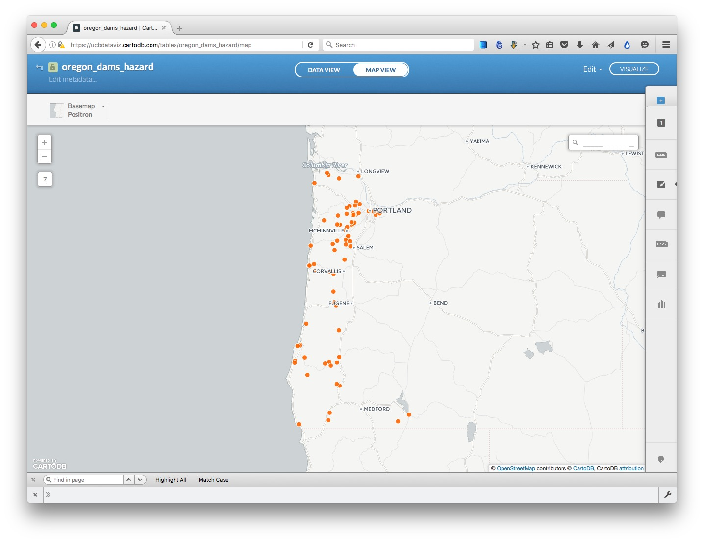


#### Create a map combining two datasets

Exit this map and reopen the `oregon_seismic_risk` dataset. Then click the `VISUALIZE` button at top right.

You will then see a prompt to create a new map. Click the green `OK, CREATE MAP` button. Rename this map `oregon_seismic_dams` by clicking on its name at top left.

Now add `oregon_dams_hazard` to the map, by clicking on the blue `+` button to the right. At the dialog box, select the `oregon_dams` dataset and click the `ADD LAYER` button.

Now select `MAP VIEW` to see both layers on the same map:

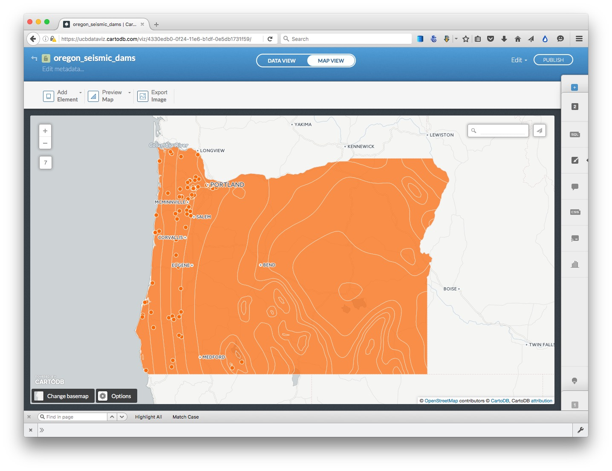

#### Select a basemap

Close the panel at bottom left suggesting interesting maps.

Now choose a basemap for your visualization, by clicking `Select basemap` at bottom left. Take a few minutes to explore the built-in basemap options.

#### Style the maps using the CartoDB wizard

Notice that the toolbar at right has tabs numbered `1` and `2`. It you hover over them, you will see that they correspond to the `oregon_seismic_risk` and `oregon_dams_hazard` layers respectively.

Click on `1` to expose the `Map layer wizard` for the `oregon_seismic_risk` layer, which can also be reached by clicking the paintbrush icon:


(You can collapse the wizards at any time by clicking to the left of any of the icons.)

Notice that opening the wizard has also exposed blue toggle controls for each layer, which can be used to turn the visibility for each on and off. Hide the `oregon_dams_hazard` layer so we can see what we are doing.

Scroll from left to right through the visualization options, and select `CHOROPLETH` to make a map where larger values for seismic risk correspond to more intense colors

Set `acc_val` as the data `Column`, select `5 Buckets`, and set them by `Quantile`. The map should now look like this:


Now click `2` to switch to the `oregon_dams_hazard` layer, and turn on its visibility.

In the `Map layer wizard`, select `CATEGORY` and color the circles by their hazard level, by selecting `hazard` as the data `Column`. The map should now look like this:


Go back into the `Map layer` wizard and manually edit the colors, by clicking on the colored boxes, selecting new colors so that high risk dams are emphasized with a more intense color:

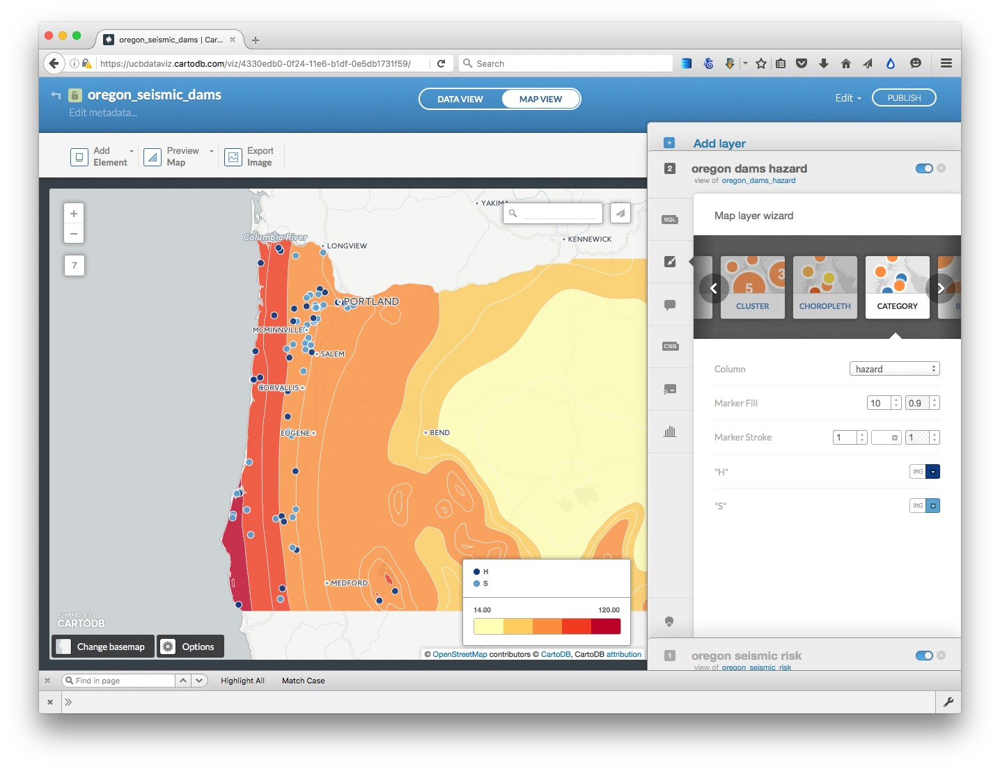


#### Edit the legend

The meaning of legend will not immediately be obvious to someone who does not know what the numbers mean, and what `H` and `S` refer to.

For the `oregon_dams_hard` layer, click on the legend icon:


Change the `Title` from `empty` to `Dam hazard`:

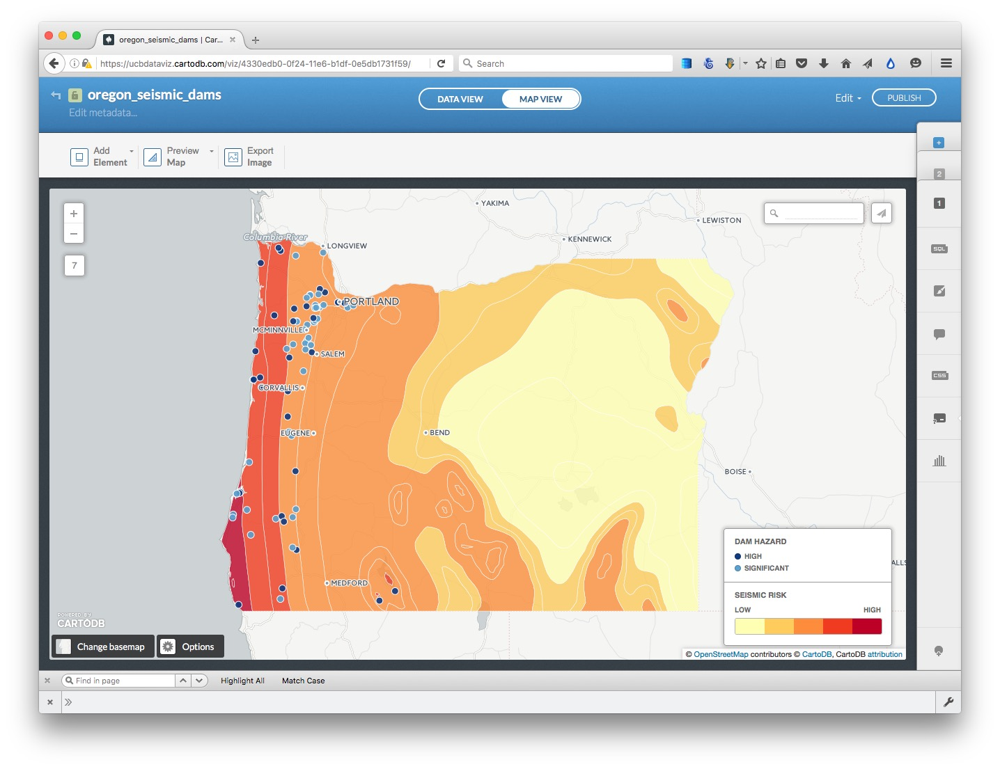

Now click on the `</>` link to the HTML for the legend, and edit to the following, and click `Apply`:

```CSS
<div class='cartodb-legend category'>	
<div class="legend-title">Dam hazard</div>
<ul>
	<li>
		<div class="bullet" style="background: #0F3B82"></div> High
	</li>
	<li>
		<div class="bullet" style="background: #5CA2D1"></div> Significant
	</li>
</ul>
</div>
```
Edit the legend for the `oregon_seismic_risk` layer, adding `Seismic risk` for title, and replacing the numbers for `Left label` and `Right label` with `Low` and `High`.  Click `Apply` and the map should look like this:

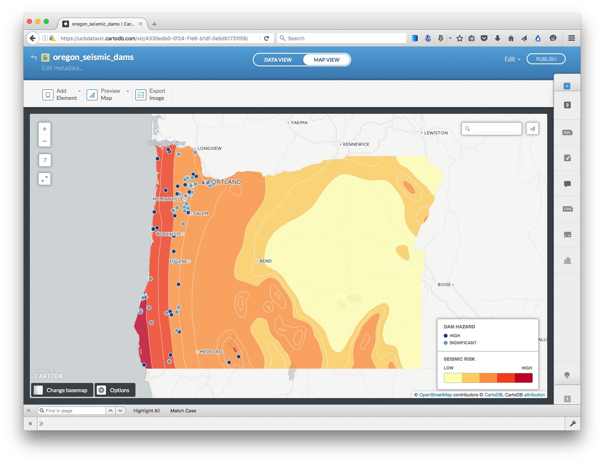


#### Configure tooltips

Select the `oregon_dams_hazard` layer, and click the infowindow icon:


In the `Hover` tab, select the `dam_name` toggle control, and uncheck `title`. Now the dam's name should appear when you hover over each point.


#### Configure the map options, and publish

We are almost ready to publish the map, but before doing so, click `Options` at the bottom left of the map to select the controls and other items you want to include. Here  the `Search box`, which geocodes locations entered by the user and zooms to them, is disabled; the option to switch to a `Fullscreen` view of the map is enabled:


Also explore the `Add Element` button at top left, which allows you to add a title and other annotations to your map.

Having finished working on the visualization, click the `PUBLISH` button at top right. This will call up the following options:

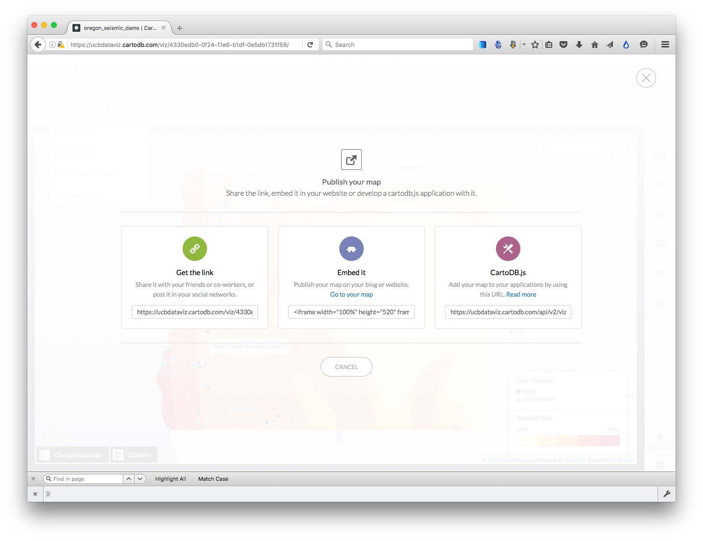

Copy the code from `Embed it` to obtain an [iframe](http://www.w3schools.com/tags/tag_iframe.asp) which will allow you to embed the map on any web page, in the following format:

```CSS
<iframe width="100%" height="520" frameborder="0" src="https://ucbdataviz.cartodb.com/viz/4330edb0-0f24-11e6-b1df-0e5db1731f59/embed_map" allowfullscreen webkitallowfullscreen mozallowfullscreen oallowfullscreen msallowfullscreen></iframe>
```
(Note that you can edit the dimensions of the iframe -- here set at `100%` of the width of the div in which it appears -- and `520` pixels high) as required.)

#### Further reading/resources

[CartoDB tutorials](http://docs.cartodb.com/tutorials.html)


