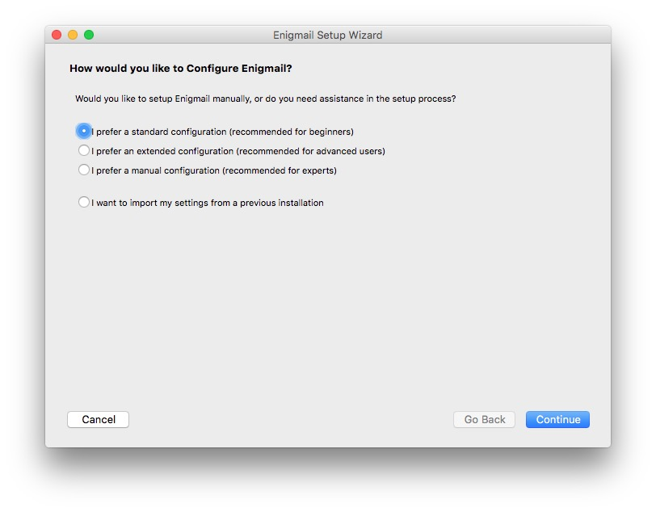
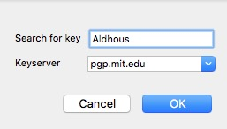
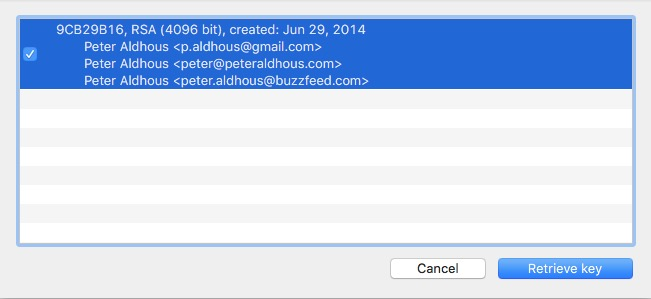
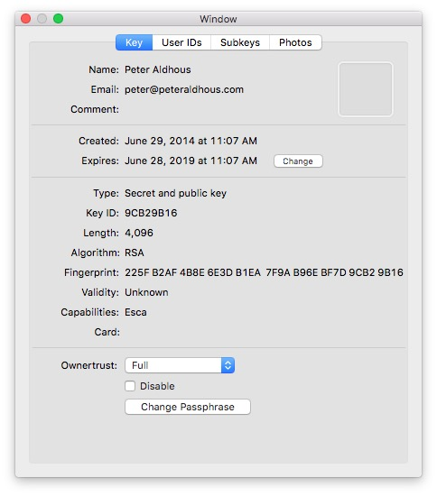
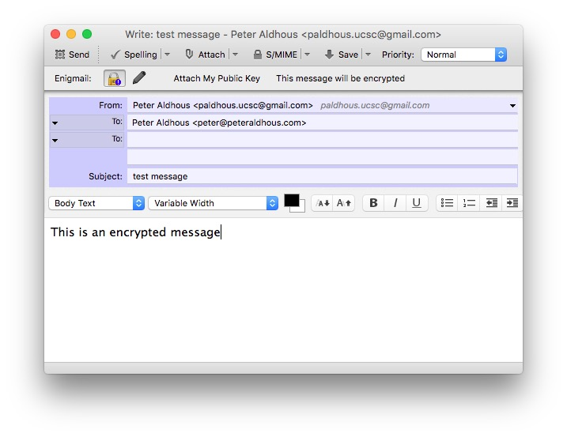

# Privacy, security and some basic e-sleuthing

### Protect yourself, and your sources

Your emails, phone calls, web surfing and searches are not guaranteed to be private. Neither are files on your computer, unless you take steps to protect them. But there are important steps you can take to protect your information from most attempts to access it.

As a private citizen, the extent to which you wish to take advantage of these protections is your choice. However, as a journalist you may need to protect the identity of confidential sources, and information supplied by them. Poor security practices on your part puts them at risk. So it is important that journalists should follow good practice in digital security. They should also know how to encrypt their information and, when necessary, their communication.

### Don't get phished!

People are the weak points in many organization's digital security, because they can be tricked into doing things that are insecure. That's why so many hackers launch "phishing" attacks, which are intended either to get people to enter their username and password into a fake login screen, or to download files infected with malware. Email is the most popular method, because sender addresses are so easy to fake, or [spoof](https://en.wikipedia.org/wiki/Email_spoofing). But such attacks can come by other communcation methods.

Phising can be disastrous for newsrooms, as in 2013, when the [AP's Twitter account was hijacked](http://www.bloomberg.com/news/articles/2013-04-23/dow-jones-drops-recovers-after-false-report-on-ap-twitter-page) in phishing scam, and used to post a false message about an attack on the White House.

So don't be the person that compromises your news organization's digital security! Responsible wesbites should never ask you for your login details, so don't follow a link and type them into a web form. Also be very careful about downloading and opening attachments -- even Word documents can contain embedded scripts that can hijack your computer, and remember that an email that seems to have comes from a colleague's address may be from someone else.

### Encrypt your hard drives (internal and external)

If your laptop is stolen or lost, a login password offers little protection for your files and other information: A hard drive can simply be removed and booted on another machine. So you should routinely encrypt your hard drives. [This post](https://support.apple.com/en-us/HT204837) explains how to encrypt a hard drive on the Mac, using FileVault; [this post](http://windows.microsoft.com/en-us/windows/protect-files-bitlocker-drive-encryption) explains the equivalent procedure on Windows, using BitLocker. (Do pay attention to the instructions on ensuring that you don't get locked out of the drive!)

Once you have set up disk encyrption, your operating system automatically encrypts any data saved to the encrypted disk. To anyone without the password/key, the data on the disk will be gibberish.

### Remove files from your computer
Deleting files does not destroy them, so to remove traces you need to overwrite them multiple times. [Eraser](http://eraser.heidi.ie/) will do that on Windows; see [this article](http://www.macworld.com/article/1166104/security/how-to-securely-delete-files.html) for how to securely delete files on the Mac.

### Passwords and passphrases

Most people are terrible at setting passwords, using common words or easily-guessed numbers. But even if you don't use `password` or `123456` you aren't safe. Password-guessing software can try millions of combinations per second (probably trillions, in the case of the NSA). So even "strong" passwords, employing hard-to-remember combinations of letters, numbers and special characters, are relatively easy to crack.

Make sure to use a different password for each service you use, so that a breach of one doesn't compromise other accounts. That creates a problem, however, because nobody can remember dozens of complex passwords. So use a password manager such as [1Password](https://1password.com/) or [Lastpass](https://lastpass.com/) to generate and remember them for you. Protect your password manager account with a passphrase, consisting of a string of randomly-selected words.

If the words you pick are genuinely random, passphrases are much more secure than passwords, because they offer many more combinations. They are also easier for you to remember. (Indeed, they're the opposite of traditional "strong" passwords, which perversely are hard for people to remember but easy for machines to guess.) As is often the case, [XKCD](https://xkcd.com/936/) is a source of wisdom:

[This article](https://theintercept.com/2015/03/26/passphrases-can-memorize-attackers-cant-guess/) explains how to create a strong passphrase. Using the method explained here, a five-word passphrase would require an average of 14 quintillion attempts to crack -- that's 14 followed by 18 zeroes, which would challenge even the NSA.

You should also protect your encrypted hard drives with a strong passphrase.

### Use two-factor authentication for web services, especially for email

A web-based email account is an Achilles heel for security. If it is breached, an attacker can change your other passwords at will. So when using webmail, make sure to use two-factor authentication, which requires both a password and a code sent to your phone. Set up two-factor authentication for your Gmail/Google account [here](https://www.google.com/landing/2step/).

Take advantage of two-factor authentication for web services wherever it is available.

### Let's not get paranoid: Consider the threat

The simple steps above will greatly improve your digital security. But there are many more steps that can be taken to keep your communications and online activity private. Those you choose to employ will depend on the circumstances, which involves considering the threat, as follows:

- **What do I need to keep secret?** (e.g. content of communication, source identities, files.)
- **Who do I need to keep it secret from?** (The "adversary," e.g. government, source's employer, competing news organizations.)
- **What can they do to find out?** (Consider technical, legal, and social means.)
- **What happens if they do find out?** (This is the risk, and will tell you how determined you need to be.)

[This article](https://source.opennews.org/en-US/learning/security-journalists-part-two-threat-modeling/) provides a good overview of how to weigh these questions, and act upon the answers.

### Web browsing in private

Every time you visit a website you reveal your:

- **Operating system**
- **Regional and language settings**
- **Connection’s “host name”** This may allow people to guess your name, email address and so on
- **IP address** This may identify where you work. Even surfing from home, IP
addresses may identify you -- for example they can appear next to messages left in online communities, which can be Googled.
- **Referring page** This reveals the link from which you clicked, or your search terms, if you are coming from a search engine.

[This site](http://www.ip-secrets.com/) reveals the information you display to any website you visit.

Websites can also deposit tracking “[cookies](https://en.wikipedia.org/wiki/HTTP_cookie)” on your machine. If you want to block attempts to track you online, try the Privacy Badger add-on for [Chrome](https://chrome.google.com/webstore/detail/privacy-badger/pkehgijcmpdhfbdbbnkijodmdjhbjlgp?hl=en-US) or [Firefox](https://addons.mozilla.org/en-US/firefox/addon/privacy-badger-firefox/). Be aware, however, that it will interfere with the functionality of some websites.

Note that the "private" browsing options in web browsers are not really private -- all they do is block cookies, and prevent your activity being stored in your browser's history.

For some investigations, you may want to explore a particular website without revealing your identity. For this, you can use an anonymous proxy server such as [AnonyMouse](http://anonymouse.org/anonwww.html) or [Guardster](http://www.guardster.com/subscription/proxy_free.php). (Using coffee-shop wi-fi, rather than your office or home, can also be a good idea if it's important not to reveal your identity to a particular website.)

For a more systematic approach to anonymous web browsing, consider using the [Tor](https://www.torproject.org/) browser or a Virtual Private Network (VPN).

As [this article](https://thetinhat.com/tutorials/darknets/tor-vpn.html) explains, Tor and VPNs are rather different. Tor, which is based on Firefox, encrypts your data and connects you to one server in its network, which then bounces it on to two more servers before you are connected to the site you are browsing. Crucially, the second and third links in the chain only know the previous link, so your identity remains hidden.

All of this means that the website you are visiting doesn't know who or where you are, anyone trying to snoop on your connection cannot see which site you are connecting to, and neither can your Internet Service Provider (ISP). While it is in theory possible for the NSA to deanonymise Tor users, for most purposes Tor offers reliably anonymous browsing.

The downside of all this bouncing around the internet is that connections are slow. Also, using Tor effectively, without compromising your anonymity, means [changing aspects of your online behavior](https://www.torproject.org/download/download.html.en#warning) -- such as avoiding insecure browser plugins such as Flash, and never opening downloaded documents while online using Tor.

If you subscribe to a VPN, your connection is encrypted and sent to the provider's server, which then connects to the site you are visiting. Again, your true identity and location is hidden from that site, and anyone trying to intercept your connection, or your ISP, will just see gibberish being sent to the provider's server.

VPNs are much faster than Tor, but the provider can see all of your traffic -- so your anonymity ultimately lies in its hands. Will it hand over your browsing information if asked by a government agency? Read providers' privacy policies, but be aware that they may change, or not be followed under all circumstances.

I use [this VPN service](https://www.privateinternetaccess.com/), which is relatively inexpensive and offers connections via servers in multiple countries across the world.

In general, VPNs are a good option for relatively low-threat situations where you require a fast connection. For example, it is a good idea to use a VPN when using an insecure connection, such as airport or coffee-shop wifi. If you really *need* to remain anonymous, however, Tor is your best option.

Google and other search sites [routinely store your searches](https://startpage.com/eng/protect-privacy.html). For private web searching, use [startpage](https://www.ixquick.com/) or [DuckDuckGo](https://duckduckgo.com/).

### Encryption

Public key encryption uses math to keep your information secure. It depends upon a "keypair," two unique strings of randomly generated numbers and letters, which are linked together by a mathematical algorithm.

You can store your "public" key in the open in an online directory called a [keyserver](https://en.wikipedia.org/wiki/Key_server_%28cryptographic%29), or can simply email it to someone you want to communicate with securely. Other people can use this key to encrypt a message or file so that only you can read it, by decrypting it using your private key. It is vital, therefore, that you keep your private key secure.

The first step to setting up encryption is to download a program called GnuPG, which uses the keys to encrypt and decrypt messages and files. On the Mac, download and install [GPG Suite](https://gpgtools.org/#gpgsuite) (formerly GPG Tools); on Windows, use [GPG4Win](http://files.gpg4win.org/gpg4win-2.2.1.exe).

#### Email

Encryption is most commonly used to communicate securely by email, which is otherwise an extremely insecure means of communication. You should think of emails as electronic postcards that can be read by anyone who intercepts them as they travel over the internet. Encryption is like putting the same note in an envelope that can only be opened by the intended recipient. But note that only the body of the message is encrypted. Your identity, the identity of the recipient, and the subject line are all still readable by anyone intercepting the message.

Because email addresses are easy to spoof, you need to know that someone is who they say they are before setting up an encyrpted communication with them. Public encryption keys have signatures, and here is mine: `225F B2AF 4B8E 6E3D B1EA 7F9A B96E BF7D 9CB2 9B16`. Ideally, you will verify the intended recipient's identify in person, when they can also show you the fingerprint of their public key on their computer. In practice, people usually publish their fingerprints on a trusted website, associated with their email address, like [this](https://www.buzzfeed.com/peteraldhous).

##### Setting up encryption with Thunderbird/Enigmail

The easiest way to encrypt your emails is using the [Enigmail](https://enigmail.net/index.php/en/) add-on for [Thunderbird](https://www.mozilla.org/en-US/thunderbird/).

Having installed Thunderbird, first you need to add your email account.

To add a Gmail account secured by two-factor authentication, you will first need to create an app-specific password, by clicking on `App passwords` [here](https://myaccount.google.com/u/2/security). Follow the instructions to generate the password, and copy the 16-digit code that appears.

In Thunderbird, add your email account by selecting `Tools>Account Settings` from the top menu. At the dialog box that appears, select `Add Mail Account` on the drop-down menu at bottom left, and enter the account details as follows:

In the case of a Gmail account secured by two-factor authentication, use your app-specific password here, and click `Continue`.

At the following screen, select `IMAP (remote folders)` and click `Done`:

If you are setting up a Gmail account, you will be sent to Google's security site, where you will need to enter your regular password (not the app-specific password) to continue.

To install Enigmail, select `Tools>Add-ons` from the top menu in Thunderbird, search for Enigmail using the box at top right, and then click `Install`. After installing Enigmail, restart Thunderbird to activate it.

You should now have an `Enigmail` menu in Thunderbird:

Select `Enigmail>Setup Wizard` from the top menu, and opt to use a standard configuration:

When prompted, create a new key pair. Make sure to use a strong passphrase at the next dialog box:

At the next dialog box, click `Create Revocation Certificate` and save this file somewhere safe, ideally on a memory stick that you keep in a safe place.

After you click the final `Done`, select `Tools>Account Settings` from the top menu, and check the `Open PGP Security` settings for your email account:

Make sure `Encrypt draft messages on saving` is checked. This will ensure that unecrypted drafts of a message you want to encrypt are not saved in your webmail account.

Now you are set up to send me an encrypted email. But do do so, you first need to import my public key.

From the Thunderbird top menu, select `Enigmail>Key Management`. From the new menu that appears, select `Keyserver>Search for Keys`. My key is on the [MIT keyserver](https://pgp.mit.edu/), so search for my name on this keyserver as follows:

Select the non-italic key that appears (the others are old keys that have been revoked):

Check that the fingerprint matches the [listing](https://www.buzzfeed.com/peteraldhous) on my page at BuzzFeed, then click `OK` to import the key:

To upload your public key to a keyserver so that anyone can find it, highlight it in the Enigmail Key Management window, then select `Keyserver>Upload Public Keys`.

See [here](https://enigmail.wiki/Key_Management)for more on key management in Enigmail.

You may also wish to list your key fingerprint on your website or Twitter account do that people can validate it.

You can also import others' public keys and save your public key to a keyserver using GPG Suite or GPG4Win.

On the Mac, open GPG Keychain from your Applications folder, click the `Lookup Key` icon and search for my name at the dialog box. This search should return the following:

Click `Retrieve key` to import my key.

Having done so, double click on the entry for my key to read check its fingerprint against the [listing](https://www.buzzfeed.com/peteraldhous) on my page at BuzzFeed:

If someone emails their public key to you, save it on your computer and click the `Import` icon in GPG Keychain to import.

To upload your public key to a public keyserver, highlight your key in GPG Keychain, then select `Key>Send public key to key server`.

[Here](https://help.riseup.net/en/security/message-security/openpgp/gpg-keys) are instructions for importing public keys on Windows using GPG4Win.

Back in Thunderbird, click `Write`, write me a message, and click the lock icon to use encryption:

If you like, you can also click `Attach My Public Key` to send me your public key.

Any attachments you add to an encrypted messages will also be encrypted.

Now send the message!

See [these](https://emailselfdefense.fsf.org/en/) [articles](https://support.mozilla.org/en-US/kb/digitally-signing-and-encrypting-messages) for more on setting up Enigmail on the Mac, Windows, or Linux.

#### Chat/Instant Messaging

[Whatsapp](https://www.whatsapp.com/), the instant messaging app for smartphones, now [includes encryption](https://blog.whatsapp.com/10000618/end-to-end-encryption) as standard. See [here](https://www.whatsapp.com/faq/en/general/28030015) for more.

For encrypted instant messaging on your computer, use [Cryptocat](https://crypto.cat/).

#### Phone and text messages

To encrypt text messages and cellphone calls, use the Signal app for [iPhone](https://itunes.apple.com/us/app/signal-private-messenger/id874139669?mt=8) and [Android](https://play.google.com/store/apps/details?id=org.thoughtcrime.securesms&hl=en). In my experience, call quality with Signal can be poor. However, the text message functionality is very good.

#### Video calls

For secure video conferencing, use [Jitsi](https://jitsi.org/).

### Remember: Cellphones are personal tracking devices

GPS-enabled phones are personal tracking devices, and may not be filly powered off even if switched off. If you are using a cellphone to communicate with a confidential source, use a prepaid celphone, paid for with cash. Switch off and remove the battery when not in use. Don't take your cellphone to meetings with confidential sources!

#### Hiding your phone number

- *67 blocks caller ID
- You can spoof caller ID with [SpoofCard](http://www.spoofcard.com/).

### Basic e-sleuthing

#### Who sent this email?

As noted above, emails are easy to spoof. Sources and targets of investigations may also use throwaway emails using false names. You can find out something about the origin of an email, however, through its header see [here](email_headers.pdf) for how to find and extract).

Having copied an email's header, paste into the boxes [here](http://whatismyipaddress.com/trace-email) or [here](http://www.ip-adress.com/trace_email/).

Note that emails sent from Gmail's webmail interface will always locate to Google's headquarters in Mountain View -- so a throwaway Gmail account offers little information. If a Gmail was sent using an email client such as Thunderbird or Outlook, however, information from the IP address of the host machine wiull be revealed.

#### Who is behind this website?

[Whois](https://www.easywhois.com/) [searches](http://whois.domaintools.com/) provide information on the underlying IP address and registration information, from a url.

Use [this search ](http://www.domaintools.com/research/whois-history)for a site's Whois history, as registrations for a domain may chnage over time.

#### What other websites are hosted at the same IP address?

These [search](http://www.ip-adress.com/reverse_ip/) [sites](http://www.linkvendor.com/seo-tools/domains-from-ip.html) will perform reverse IP lookups, listing other websites hosted at the same IP address. That may be useful in investigations in which you are trying to identify constellations of websites operated by the same source -- however, bear in mind that it doesn't reveal much if your target is using a large commercial webhosting provider.

#### What is the history of this website?

Remember the [notes](http://paldhous.github.io/ucsc/2016/investigative-policy/week2.html) from Week 2 about using Google'c cache and the [Wayback Machine](http://www.archive.org/web/web.php) to find old versions of websites.

#### Monitor websites for changes

At [ChangeDetection.com](ChangeDetection), you can set up alerts to monitor websites for changes, and notify you when they occur. Alternatively, use the Firefox add-ons [Distill Web Monitor](https://addons.mozilla.org/en-us/firefox/addon/alertbox/?src=search) or [SiteDelta](https://addons.mozilla.org/en-us/firefox/addon/sitedelta/).

As we’ve already noted: Websites are likely to change if their owners realize that information on the site is incriminating. So save web pages that are key to an investigation!

### Further reading

[Security for Journalists, Part One: The Basics](https://source.opennews.org/en-US/learning/security-journalists-part-one-basics/)
Good article on the basics of digital security, by Jonathan Stray.

*[Digital Security for Journalists](https://www.gitbook.com/book/susanemcg/digital-security-for-journalists/details)*
Free book by Susan McGregor.

[Chatting In Secret While We're All Being Watched](https://theintercept.com/2015/07/14/communicating-secret-watched/)
Overview article from the Intercept, covering some of the services mentioned in these notes, and more.

[Ed Snowden Taught Me To Smuggle Secrets Past Incredible Danger. Now I Teach You.](https://theintercept.com/2014/10/28/smuggling-snowden-secrets/)
Intercept article by Micah Lee, who helped get Edward Snowden in encrypted contact with Laura Poitras and Glenn Greenwald.

[Enigmail wiki](https://enigmail.wiki/)
Documentation for the Engimail add-on for Thunderbird.
