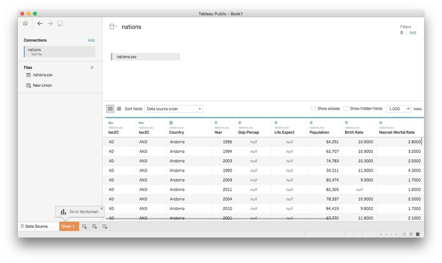
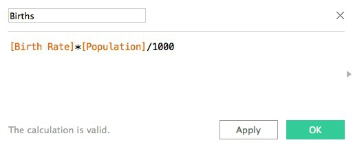
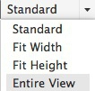

# Data visualization

Visualizing data is a good way to communicate complex information, because we are highly visual animals, evolved to spot patterns and make visual comparisons. To visualize effectively, however, it helps to understand a little about how our brains process visual information.

### Design for the human brain

Whenever we visualize, we are encoding data using visual cues, or "mapping" data onto variation in size, shape or color, and so on. There are various ways of doing this, as this primer illustrates:


These cues are not created equal, however. In the mid-1980s, statisticians William Cleveland and Robert McGill [ran some experiments](http://courses.ischool.berkeley.edu/i247/f05/readings/Cleveland_GraphicalPerception_Science85.pdf) with human volunteers, measuring how accurately they were able to estimate the numbers encoded by different visual cues. This is what they found:


The position of points on an aligned scale is perceived with similar accuracy to the length of a line -- we don't need to see a solid line to accurately read the distance between an axis, and a point on a scatter plot.

This perceptual hierarchy of visual cues is very important. When making comparisons with continuous variables, aim to use cues near the top of the scale wherever possible.

Look at the following visual encodings of the same simple dataset. Do the bars or the circles make it easiest to "read" the numerical values that are encoded?


### But this doesn't mean that everything becomes a bar chart

Length on an aligned scale may be the best option to allow people to compare numbers accurately, but that doesn't mean the other possibilities are always to be avoided in visualization. Indeed, color hue is a good way of encoding categorical data. The human brain is particularly good at recognizing patterns and differences. This means that variations in color, shape and orientation, while poor for accurately encoding the precise value of continuous variables, can be good choices for representing categorical data.

You can also combine different visual cues into the same graphic to encode different variables. But always think about the main messages you are trying to impart, and where you can use visual cues near the top of the visual hierarchy to communicate that message most effectively.

#### Case study: Immunization in California kindergartens

Now we'll explore a dataset at different levels of analysis, to show how different visual encodings may be needed for different visualization tasks with the same data.

This data, from the [California Department of Public Health](https://www.cdph.ca.gov/programs/immunize/Pages/ImmunizationLevels.aspx), gives numbers on immunization and enrollment at kindergartens across the state. The data is provided at the level of individual schools, but can be aggregated to look at counties, or the entire state.

When looking at change over time at the state level, the perceptual hierarchy makes a column chart a good choice:


Notice that I've focused on the percentage of children with *incomplete* vaccination, rather than the percentage complete, for two reasons: 
- The differences between the lengths of the bars are greater, and so is easier to read. 
- More importantly, incomplete vaccination is what increases the risk of infectious disease outbreaks, which is why we care about this data.

But bar chart is not the only choice:

Here's the same information presented as a line chart:


Notice that here, I haven't started the Y axis at zero. This would be unforgivable for a bar chart, where the length of the bar *is* the visual encoding, and so starting at an arbitrary value would distort the comparison between the bars. Here, however, I'm emphasizing the relative slope, to show change over time, so starting at zero is less crucial.

And here's the data as a dot-and-line chart:


Here, I've returned to a Y axis that starts at zero, so that the relative positions of the points can be compared accurately.

But what if we want to look at individual counties? When comparing a handful of counties, the dot-and-line chart, combining the visual cues of position on an aligned scale (for the yearly values) and slope (for the rate of change from year to year) works well:


But there are 58 counties in California, and trying to compare them all using a dot-and-line chart results in chaos:


In this case, it makes sense to drop down the perceptual hierarchy, and use the intensity of color to represent the percentage of incomplete immunization:


This type of chart is called a heat map. It provides a quick and easy way to scan for the counties and years with the highest rates of incomplete immunization.

#### Using color effectively

Color falls low on the perceptual hierarchy of visual cues, but it is often deployed to highlight particular elements of a chart, and sometimes to encode data values. Poor choice of color schemes is a problem that bedevils many graphics, so it is worth taking some time to consider how to use color to maximum effect.

It helps to think about colors in terms of the color wheel, which places colors that "harmonize" well together side by side, and arranges those that have strong visual contrast -- blue and orange, for instance -- at opposite sides of the circle:


(Source: [Wikimedia Commons](http://commons.wikimedia.org/wiki/Category:Colorwheels#mediaviewer/File:Byrcolorwheel.png))

When encoding data with color, take care to fit the color scheme to your data, and the story you're aiming to tell. As we have already seen, color is often used to encode the values of categorical data. Here you want to use "qualitative" color schemes, where the aim is to pick colors that will be maximally distinctive, as widely spread around the color wheel as possible.

When using color to encode continuous data, it usually makes sense to use increasing intensity, or saturation, of color to indicate larger values. These are called "sequential" color schemes.

In some circumstances, you may have data that has positive and negative values, or which highlights deviation from a central value. Here, you should use a "diverging" color scheme, which will usually have two colors reasonably well separated on the color wheel as its end points, and cycle through a neutral color in the middle:

Here are some examples of qualitative, sequential and diverging color schemes:


Choosing color schemes is a complex science and art, but there is no need to "roll your own" for every graphic you make. Many visualization tools include suggested color palettes, and I often make use of the [ColorBrewer](http://colorbrewer2.org/) website. Orginally designed for maps, but useful for charts in general, these color schemes have been rigorously tested to be maximally informative.

You will notice that the suggestions made by ColorBrewer can be displayed according to their values on three color "models": HEX, RGB and CMYK. Here is a brief explanation of these color models.

- **RGB** Three values, describing a color in terms of combinations of red, blue and green light, with each scale ranging from 0 to 255; sometimes extended to RGB(A), where A is alpha, which encodes transparency. Example: `rgb(169, 104, 54)`.

- **HEX** A six-figure "hexadecimal" encoding of RGB values, with each scale ranging from hex 00 (equivalent to 0) to hex ff (equivalent to 255); HEX values will be familiar if you have any experience with web design, as they are commonly used to denote color in HTML and CSS. Example: `#a96836`

- **CMYK** Four values, describing a color in combinations of cyan, magenta, yellow and black, relevant to the combination of print inks. Example: `cmyk(0, 0.385, 0.68, 0.337)`

You will also notice that ColorBrewer allows you to select color schemes that are colorblind safe. Surprisingly, many news organizations persist in using color schemes that exclude a substantial minority of their audience. Red and green lie on opposite sides of the color wheel, and also can be used to suggest "good" or "go," versus "bad" or "stop." But about 5% of men have red-green colorblindness, also known as deuteranopia.

Install [Color Oracle](http://www.colororacle.org/index.html) to simulate how your charts and maps will look to people with various forms of colorblindness.


### The data we will use today

Download the data for this session from [here](data/dataviz.zip), unzip the folder and place it on your desktop. It contains the following file:

- `nations.csv` Data from the [World Bank Indicators](http://data.worldbank.org/indicator/all) portal, which is an incredibly rich resource. Contains the following fields:
 -  `iso2c` `iso3c` Two- and Three-letter [codes](http://www.nationsonline.org/oneworld/country_code_list.htm) for each country, assigned by the [International Organization for Standardization](http://www.iso.org/iso/home/store/catalogue_tc/catalogue_detail.htm?csnumber=63545).
 - `country` Country name.
 - `year`
 - `population` Estimated [total population](http://data.worldbank.org/indicator/SP.POP.TOTL) at mid-year, including all residents apart from refugees.
 - `gdp_percap` [Gross Domestic Product per capita](http://data.worldbank.org/indicator/NY.GDP.PCAP.PP.CD) in current international dollars, corrected for purchasing power in different territories.
 - `life_expect` [Life expectancy at birth](http://data.worldbank.org/indicator/SP.DYN.LE00.IN), in years.
 - `population` Estimated [total population](http://data.worldbank.org/indicator/SP.POP.TOTL) at mid-year, including all residents apart from refugees.
 - `birth_rate` [Live births during the year per 1,000 people](http://data.worldbank.org/indicator/SP.DYN.CBRT.IN), based on mid-year population estimate.
 - `neonat_mortal_rate` [Neonatal mortality rate](http://data.worldbank.org/indicator/SH.DYN.NMRT): babies dying before reaching 28 days of age, per 1,000 live births in a given year.
 - `region` `income` World Bank [regions and income groups](http://siteresources.worldbank.org/DATASTATISTICS/Resources/CLASS.XLS), explained [here](http://data.worldbank.org/about/country-and-lending-groups).

### Introducing Tableau Public


[**Tableau Public**](http://www.tableausoftware.com/public/) allows you to create a wide variety of interactive charts and maps and organize them into dashboards and stories that can be saved to the cloud and embedded on any web page.

The free Public version of the software requires you to save your visualizations to the open web. If you have sensitive data that needs to be kept within your organization, you will need a license for the [Desktop version](http://www.tableau.com/products/) of the software.

Tableau was developed for exploratory graphical data analysis, so it is a great tool for exploring a new dataset -- filtering, sorting and aggregating the data in different ways while experimenting with various chart types.

Although Tableau was not designed as a publication tool, the ability to embed finished dashboards and stories on any web page has also allowed organizations that lack JavaScript coding expertise to create customized interactive online graphics.

### Visualize the data on neonatal mortality

#### Connect to the data

Launch Tableau Public, and you should see the following screen:


Under the `Connect` heading at top left, select `Text File`, navigate to the file `nations.csv` and `Open`. At this point, you can view the data, which will be labeled as follows:

 - Text: `Abc`
 - Numbers: `#`
 - Dates: calendar symbol
 - Geography: globe symbol

You can edit fields to give them the correct data type if there are any problems:



Once the data has loaded, click `Sheet 1` at bottom left and you should see a screen like this:


#### Dimensions and measures: categorical and continuous

The fields should appear in the `Data` panel at left. Notice that Tableau has divided the fields into `Dimensions` and `Measures`. These broadly correspond to categorical and continuous variables. Dimensions are fields containing text or dates, while measures contain numbers.

If any field appears in the wrong place, click the small downward-pointing triangle that appears when it is highlighted and select `Convert to Dimension` or `Convert to Measure` as required.

#### Shelves and Show Me

Notice that the main panel contains a series of "shelves," called `Pages,` `Columns`, `Rows`, `Filters` and so on. Tableau charts and maps are made by dragging and dropping fields from the data into these shelves.

Over to the right you should see the `Show Me` panel, which will highlight chart types you can make from the data currently loaded into the `Columns` and `Rows` shelves. It is your go-to resource when experimenting with different visualization possibilities. You can open and close this panel by clicking on its title bar.

#### Columns and rows: X and Y axes

The starting point for creating any chart or map in Tableau is to place fields into `Columns` and `Rows`, which for most charts correspond to the X and Y axes, respectively. When making maps, longitude goes in `Columns` and latitude in `Rows`. If you display the data as a table, then these labels are self-explanatory.

#### Some questions to ask this data

- How has the total number of neonatal deaths changed over time, globally, regionally and nationally?
- How has the neonatal death rate for each country changed over time?

#### Create new calculated variables

The data contains fields on birth and neonatal death rates, but not the total numbers of births and deaths, which must be calculated. From the top menu, select `Analysis>Create Calculated Field`. Fill in the dialog box as follows (just start typing a field name to select it for use in a formula):



Notice that calculated fields appear in the `Data` panel preceded by an `=` symbol.

Now create a second calculated field giving the total number of neonatal deaths:


In the second formula, we have rounded the number of neonatal deaths to the nearest thousand using `-3` (`-2` would round to the nearest hundred, `-1` to the nearest ten, `1` to one decimal place, `2` to two decimal places, and so on.)

Here we have simply run some simple arithmetic, but it's possible to use a wide variety of functions to manipulate data in Tableau in many ways. To see all of the available functions, click on the little gray triangle at the right of the dialog boxes above.

#### Understand that Tableau's default behavior is to summarize/aggregate data

As we work through today's exercise, notice that Tableau routinely summarizes or aggregates measures that are dropped into `Columns` and `Rows`, calculating a `SUM` or `AVG` (average or mean), for example.

This behavior *can* be turned off by selecting `Analysis` from the top menu and unchecking `Aggregate Measures`. However, I do not recommend doing this, as it will disable some Tableau functions. Instead, if you don't want to summarize *all* of the data, drop categorical variables into the `Detail` shelf so that any summary statistic will be calculated at the correct level for your analysis. If necessary, you can set the aggregation so it is being performed on a single data point, and therefore has no effect.

#### Make a series of treemaps showing neonatal deaths over time

A treemap allows us to directly compare the neonatal deaths in each country, nested by region.

Drag `Country` and `Region` onto `Columns` and `Neonatal deaths` onto `Rows`. Then open `Show Me` and select the `treemap` option. The initial chart should look like this:


Look at the `Marks` shelf and see that the size and color of the rectangles reflect the `SUM` of `Neonatal deaths` for each country, while each rectangle is labeled wuth `Region` and `Country`:


Now drag `Region` to `Color` to remove it from the `Label` and color the rectangles by region, using Tableau's default qualitative color scheme for categorical data:


For a more subtle color scheme, click on `Color`, select `Edit Colors...` and at the dialog box select the `Tableau Classic Medium` qualitative color scheme, then click `Assign Palette` and `OK`.

(Tableau's qualitative color schemes are well designed, so there is no need to adopt a ColorBrewer scheme. However, it is possible to edit colors individually as you wish.)

Click on `Color` and set transparency to 75%. (For your assignment you will create a chart with overlapping circles, which will benefit from using some transparency to allow all circles to be seen. So we are setting transparency now for consistency.)

The treemap should now look like this:


Tableau has by default aggregated `Neonatal deaths` using the `SUM` function, so what we are seeing is the number for each country added up across the years.

To see one year at a time, we need to filter by year. If you drag the existing `Year` variable to the `Filters` shelf, you will get the option to filter by a range of numbers, which isn't what we need:


Instead, we need to be able check individual years, and draw a treemap for each one. To do that, select `Year` in the `Dimensions` panel and `Duplicate`.

Select the new variable and `Convert to Discrete` and then `Rename`	it `Year (discrete)`. Now drag this new variable to `Filters`, select 2014, and click `OK`:


The treemap now displays the data for 2014:


That's good for a snapshot of the data, but with a little tinkering, we can adapt this visualization to show change in the number of neonatal deaths over time at the national, regional and global levels.

Select `Year (discrete)` in the `Filters` shelf and `Filter ...` to edit the filter. Select all the years with even numbers and click `OK`:


Now drag `Year (discrete)` onto `Rows` and the chart should look like this:


The formatting needs work, but notice that we now have a bar chart made out of treemaps.

Extend the chart area to the right by changing from `Standard` to `Entire View` on the dropdown menu in the top ribbon:



I find it more intuitive to have the most recent year at the top, so select `Year (discrete)` in the `Rows` shelf, select `Sort` and fill in the dialog box so that the years are sorted in `Descending` order:


The chart should now look like this:


We will create a map to serve as a legend for the regions, so click on the title bar for the color legend and select `Hide Card` to remove it from the visualization.

To remove some clutter from the chart, select `Format>Borders` from the top menu, and under `Sheet>Row Divider`, set `Pane` to `None`. Then close the `Format Borders` panel.

Right-click on the `Sheet 1` title for the chart and select `Hide Title`. Also right-click on `Year (discrete)` at the top left of the chart and select `Hide Field Labels for Rows`. Then hover just above the top bar to get a double-arrowed drag symbol and drag upwards to reduce the white space at the top. You may also want to drag the bars a little closer to the year labels. 

The labels will only appear in the larger rectangles. Rather than removing them entirely, let’s just leave a label for India in 2014, to make it clear that this is the country with by far the largest number of neonatal deaths. Click on `Label` in the Marks shelf, and switch from `All` to `Selected` under `Marks to Label`. Then right-click on the rectangle for India in 2014, and select `Mark Label>Always Show`. The chart should now look like this:


Hover over one of the rectangles, and notice the tooltip that appears. By default, all the fields we have used to make the visualization appear in the tooltip. (If you need any more, just drag those fields onto `Tooltip`.) Click on `Tooltip` and edit as follows. (Unchecking `Include command buttons` disables some interactivity, giving a plain tooltip):


#### Save to the web

Right-click on `Sheet 1` at bottom left and `Rename Sheet` to `Treemap bar chart`. Then select `File>Save to Tableau Public...` from the top menu. At the logon dialog box enter your Tableau Public account details, give the Workbook a suitable name and click `Save`. When the save is complete, a view of the  visualization on Tableau's servers will open in your default browser.

#### Make a map to use as a color legend

Select `Worksheet>New Worksheet` from the top menu, and double-click on `Country`. Tableau recognizes the names of countries and states/provinces; for the U.S., it also recognizes counties. Its default map-making behavior is to put a circle at the geographic center, or centroid, of each area, which can be scaled and colored to reflect values from the data:


However, we need each country to be filled with color by region. Using `Show Me`, switch to the `filled maps` option, and each nation should fill with color. Drag `Region` to `Color` and see how the same color scheme we used previously carries over to the map. Click on `Color`, set the transparency to 75% to match the bubble chart and remove the borders. Also click on `Tooltip` and uncheck `Show tooltip` so that no tooltip appears on the legend.

We will use this map as a color legend, so its separate color legend is unnecessary. Click the color legend’s title bar and select `Hide Card` to remove it from the visualization. Also remove the `Sheet 2` title as before.

Center the map in the view by clicking on it, holding and panning, just as you would on Google Maps. It should now look something like this:


Rename the worksheet `Map legend` and save to the web again.

#### Make a line chart showing neonatal mortality rate by country over time

To address our second question, and explore the neonatal death rate over time by country, we can use a line chart.

First, rename `Neonat Mortal` as `Neonatal death rate (per 1,000 births)`. Then, open a new worksheet, drag this variable to `Rows` and `Year` to `Columns`.  The chart should now look like this:


Tableau has aggregated the data by adding up the rates for each country in every year, which makes no sense here. So drag `Country` to `Detail` in the `Marks` shelf to draw one line per country:


Drag region to `Color` and set the transparency to 75%.

Now right-click on the X axis, select `Edit Axis`, edit the dialog box as follows and click `OK`:


Right-click on the X axis again, select `Format`, change `Alignment` to `Up` and use the dropdown menu set the `Font` to bold. Also remove the `Sheet 3` title.

The chart should now look like this:


We can also highlight the countries with the highest total number of neonatal deaths by dragging `Neonatal deaths` to `Size`. The chart should now look like this:


This line chart shows that the trend in most countries has been to reduce neonatal deaths, while some countries have had more complex trajectories. But to make comparisons between individual countries, it will be necessary to add controls to filter the chart.

Tableau's default behavior when data is filtered is to redraw charts to reflect the values in the filtered data. So if we want the Y axis and the line thicknesses to stay the same when the chart is filtered, we need to freeze them.

To freeze the line thicknesses, hover over the title bar for the line thickness legend, select `Edit Sizes...` and fill in the dialog box as follows:


Now remove this legend from the visualization, together with the color legend. We can later add an annotation to our dashboard to explain the line thickness.

To freeze the Y axis, right-click on it, select `Edit Axis...`, make it `Fixed` and click `OK`:


Right-click on the Y axis again, select `Format...` and increase the font size to `10pt` to make it easier to read.

Now drag `Country` to `Filters`, make sure `All` are checked, and at the dialog box, click `OK`:


Now we need to add a filter control to select countries to compare. On `Country` in the `Filters` shelf, select `Show Filter`. A default filter control, with a checkbox for each nation, will appear to the right of the chart:


This isn't the best filter control for this visualization. To change it, click on the title bar for the filter, note the range of filter controls available, and select `Multiple Values (Custom List)`. This allows users to select individual countries by starting to type their names. Then select `Edit Title...` and add some text explaining how the filter works:


Take some time to explore how this filter works.

Rename `Income` to `Income group`. Then add `Region` and `Income group` to `Filters`, making sure that `All` options are checked for each. Select `Show Filter` for both of these filters, and select `Single Value Dropdown` for the control. Reset both of these filters to `All`, and the chart should now look like this:


Notice that the `Income group` filter lists the options in alphabetical order, rather than income order, which would make more sense. To fix this, right-click on `Income group` in the data panel and select `Default Properties>Sort`. At the dialog box below, select `Manual` sort, edit the order as follows and click `OK`:


The chart should now look like this:


Finally, click on `Tooltip` and edit as follows:


Rename the sheet `Line chart` and save to the web.

#### Make a dashboard combining both charts

From the top menu, select `Dashboard>New Dashboard`. Set its `Size` to `Automatic`, so that the dashboard will fill to the size of any screen on which it is displayed:


To make a dashboard, drag charts, and other elements from the left-hand panel to the dashboard area. Notice that Tableau allows you to add items including: horizontal and vertical containers, text boxes, images (useful for adding a publication's logo), embedded web pages and blank space. These can be added `Tiled`, which means they cannot overlap, or `Floating`, which allows one element to be placed over another.

Drag `Treemap bar chart` from the panel at left to the main panel. The default title, from the worksheet name, isn't very informative, so right-click on that, select `Edit Title ...` and change to `Total deaths`.

Now add `Line Chart` to the right of the dashboard (the gray area will show where it will appear) and edit its title to `Death rates`. Also add a note to explain that line widths are proportional to the total number of deaths. The dashboard should now look like this:


Notice that the `Country`, `Region` and `Income group` filters control only the line chart. To make them control the treemaps, too, click on each filter, open up the dropdown menu form the downward-pointing triangle, and select `Apply to Worksheets>Selected Worksheets...` and fill in the dialog box as follows:


The filters will now control both charts.

Add `Map legend` for a color legend at bottom right. (You will probably need to drag the window for the last filter down to push it into position.) Hide the legend's title then right-click on the map and select `Hide View Toolbar` to remove the map controls.

We can also allow the highlighting of a country on one chart to be carried across the entire dashboard. Select `Dashboard>Actions...` from the top menu, and at the first dialog box select `Add action>Highlight`. Filling the second dialog box as follows will cause each country to be highlighted across the dashboard when it is clicked on just one of the charts:


Click `OK` on both dialog boxes to apply this action.

Select `Dashboard>Show Title` from the top menu. Right-click on it, select `Edit Title...` and change from the default to something more informative:


Now drag a `Text` box to the bottom of the dashboard and add a footnote giving source information:


The dashboard should now look like this:


#### Design for different devices

This dashboard works on a large screen, but not on a small phone. To see this, click the `Device Preview` button at top left and select `Phone` under `Device type`. In portrait orientation, this layout does not work at all:


Click the `Add Phone Layout` at top right, and then click `Custom` tab under `Layout - Phone` in the left-hand panel. You can then rearrange and if necessary remove elements for different devices. Here I have removed the line chart and filter controls, and changed the legend to a `Floating` element so that it sits in the blank space to the top right of the bar chart of treemaps.


Now save to the web once more. Once the dashboard is online, use the `Share` link at the bottom to obtain an embed code, which can be inserted into the HTML of any web page.

(You can also `Download` a static view of the graphic as a PNG image or a PDF.)

You can download the workbook for any Tableau visualization by clicking the `Download Workbook` link. The files (which will have the extension `.twbx`) will open in Tableau Public.

Having saved a Tableau visualization to the web, you can reopen it by selecting `File>Open from Tableau Public...` from the top menu.

#### Another approach to responsive design

As an alternative to using Tableau's built-in device options, you may wish to create three different dashboards, each with a size appropriate for phones, tablets, and desktops respectively. You can then follow the instructions [here](https://public.tableau.com/s/blog/2014/11/making-responsive-tableau-dashboards) to put the embed codes for each of these dashboards into a `div` with a separate class, and then use `@media` CSS rules to ensure that only the div with the correct dashboard displays, depending on the size of the device.

If you need to make a fully responsive Tableau visualization and are struggling, contact me for help!

When making responsively designed web pages, make sure to include this line of code between the `<head></head>` tags of your HTML:

```CSS
<meta name="viewport" content="width=device-width, initial-scale=1.0">
```

#### From dashboards to stories

Tableau also allows you to create stories, which combine successive dashboards into a step-by-step narrative. Select `Story>New Story` from the top menu. Having already made a dashboard, you should find these simple and intuitive to create. Select `New Blank Point` to add a new scene to the narrative.

### Some more practice

- See if you can create [this second dashboard](https://public.tableau.com/views/dataviz_5/Dashboard2?:embed=y&:display_count=yes) from the data.

 Here are some hints:

 - Drop `Year` into the `Pages` shelf to create the control to cycle through the years.
 - You will need to change the `Marks` to solid circles and scale them by the total number of neonatal deaths. Having done so, you will also need to increase the size of all circles so countries with small numbers of neonatal deaths are visible. Good news: Tableau's default behavior is to size circles correctly by area, so they will be the correct sizes, relative to one another.
 - You will need to switch to a `Logarithmic` X axis and alter/fix its range.
 - Format GDP per capita in dollars by clicking on it in the `Data` panel and selecting `Default Properties>Number Format>Currency (Custom)`.
 - Create a single trend line for each year's data, so that the line shifts with the circles from year to year. Do this by dragging `Trend line` into the chart area from the `Analytics` panel. You will then need to select `Analysis>Trend Lines>Edit Trend Lines...` and adjust the options to give a single line with the correct behavior.
 -  Getting the smaller circles rendered on top of the larger ones, so their tooltips can be accessed, is tricky. To solve this, open the dropdown menu for `Country` in the `Marks` shelf, select `Sort` and fill in the dialog box as follows:

   

   Now drag `Country` so it appears at the top of the list of fields in the `Marks` shelf.

 This should be a challenging exercise that will help you learn how Tableau works. If you get stuck, download my visualization and study how it is put together.

### Further reading/viewing

Alberto Cairo: [*The Functional Art: An Introduction to Information Graphics and Visualization*](http://www.amazon.com/The-Functional-Art-introduction-visualization/dp/0321834739)

Nathan Yau: [*Data Points: Visualization That Means Something*](http://www.amazon.com/Data-Points-Visualization-Means-Something/dp/111846219X)

[Tableau Public training videos](http://www.tableausoftware.com/public/training)

[Gallery of Tableau Public visualizations](http://www.tableausoftware.com/public/gallery/all): Again, you can download the workbooks to see how they were put together.

[Tableau Public Knowledge Base](http://kb.tableau.com/): Useful resource with the answers to many queries about how to use the software.


