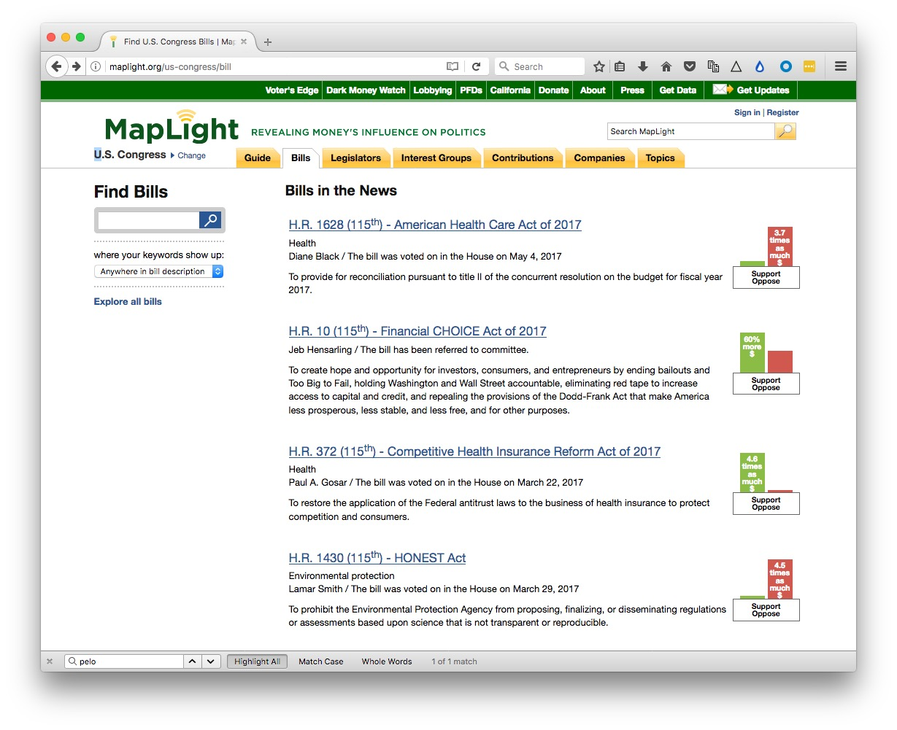

# Following the money and goods

Many great investigative stories, and context for a good deal of regular beat reporting, comes from heeding the advice of the source Deep Throat in the movie *All The President's Men*, who advised the Watergate reporters Carl Bernstein and Bob Woodward of the *Washington Post*: "[Follow the money](https://en.wikipedia.org/wiki/Follow_the_money)."

The quote seems to be apocryphal, but it remains sound advice when reporting on politics and policy.

In today's class, we will look at some online resources for doing background research on financial contributions to politicians' campaigns, and disclosures about their own personal financial interests. We'll also consider how to relate campaign finance records to politicians' positions on issues and legislation.

Then we'll discuss how to explore the movement of goods internationally, which was crucial to Martha Mendoza's Pulitzer-winning reporting in the *[Seafood From Slaves](https://www.ap.org/explore/seafood-from-slaves/)* series for the Associated Press.

### Money and politics

First the bad news: Campaign finance is fiendishly complex; some reporters have built their entire careers around analyzing it.

It helps to have a basic understanding of the main types of groups that raise and spend money around elections, and the restrictions on how they can operate:

- **Candidates' own campaign committees**
	Any candidate for office will have a committee that raises money for the campaign. For federal candidates, no individual can contribute more than $2,700 per election (primaries, runoffs, and general elections are considered separate). This explains why campaigns seek "bundlers" -- people who can gather contributions from many individuals and pass the total to the campaign. A candidate's campaign is in direct control over how its campaign committee's money is spent.

- **National, state, and local party committees**
	Major political parties raise money independently of individual candidates, and will spend much of this on general organization and molbilization that benefits all of the party's candidates. (These committees are also allowed to transfer small amounts of money to individual candidate's committees -- generally $5,000 per candidate, per committee, per election.) Individuals can donate up to $10,000 per calendar year to a state or local party committee, and up to $33,900 per calendar year to a national party committee.

Corporations and unions may not donate money directly to either of the above. And limits on individual donations mean that billionaires can't exert much influence through these committees. But there are other means through which rich organizations and individuals can influence elections.

- **Political Action Committees (PACS)**
 - **Connected** 
 While unions and corporatations may not contribute money directly to candidates, they can form PACs that raise money from members, in the case of unions, or executives and shareholders, in the case of companies. These PACs also make unlimited expenditures independently of a candidate or political party. So as long as they are not directly coordinating with a campaign, they can, for example, run TV ads advocating for or against a particular candidate.
 - **Leadership** 
 These are PACS established by prominent political figures, often current or former members of Congress, that are often used to support the campaigns of other candidates from the same party, or to fund activities to raise a politician's profile, not specifically related to an election campaign.

 Individuals can donate up to $5,000 per year to a PAC, and a PAC may contribute up to $5,000 to a candidate per election, $15,000 to a political party, and $5,000 to another PAC.

- **Super PACs**
	Known formally as independent expenditure committees, these groups may not give money to candidates, and are not allowed to coordinate with campaigns on their election-related activities. They are not subject to campaign contribution limits, and may accept contributions from companies, nonprofits, unions, and individuals. See [here](https://www.opensecrets.org/pacs/superpacs.php) for information on the most important current super PACS. Many Super PACS devote most of their activity to supporting or opposing one particular candidate. As you might imagine, defining whether a PAC or Super PAC is coordinating with a candidate is a gray area. Super PACs are obliged to identify their donors -- with an important caveat, see below.

- **Social welfare and related organizations**
In an earlier class, we considered 501(c)(3) charities, which are not allowed to campaign for and against political candidates. But there are other 501(c) groups that are similarly tax exempt, but are not subject to this restriction:
 - **501(c)(4)** Known as social welfare groups, these include such well-known groups as the National Rifle Association and Planned Parenthood.
 - **501(c)(5)** Labor and argicultural groups, which include the Service Employees International Union, and the American Federation of Labor and Congress of Industrial Organizations.
 - **501(c)(6)** Business leagues, which include the US Chamber of Commerce, the American Medicial Association, and PhRMA, the main pharmaceutical industry group.

These groups can raise and spend and unlimited amount of money and accept contributions from companies, unions, individuals, and other nonprofits. They do not have to identify their donors, and are therefore often called [dark money](https://www.opensecrets.org/dark-money/basics) groups. And because they, in turn, can donate to Super PACs, large amounts of dark money may also end up in Super PACs.

These two types of groups have become very important and controversial since 2010, because of two court rulings in that year. First, the US Supreme Court ruled in *[Citizens United v. Federal Election Commission](https://ballotpedia.org/Citizens_United_v._Federal_Election_Commission)* that removed restrictions on electioneering placed on companies and unions, freeing them to spend as much as they want to support or oppose a particular candidate. Then, in a case called *[SpeechNOW v. Federal Election Commission](https://ballotpedia.org/SpeechNOW.org_v._Federal_Election_Commission)*, a federal appeals court removed limits on contributions to groups that make "independent expenditures." This is what led to the formation of Super PACs, which have since raised hundreds of millions of dollars, mostly spent on TV advertising.

As a result, the influence of dark money on American elections has grown:

(Source: Center for Responsive Politics, [OpenSecrets.org](https://www.opensecrets.org/dark-money/basics))

Trying to determine the origins and dark money, and how it is spent, is a difficult detective task. [Here](darkmoney.pdf) is a useful tipsheet from the Center for Responsive Politics.

#### Get it from the source

The primary source for campaign finance data at the federal level is the [Federal Election Commission](https://beta.fec.gov/). Explore and download its data [here.](https://beta.fec.gov/data/advanced/)

The equivalent for the state of California is the Secretary of State's [CAL-ACCESS](http://cal-access.sos.ca.gov/) system. Follow the links from the home page, or search its data from [here](http://powersearch.sos.ca.gov/).

However, in this class we will explore websites that have processed the raw data, and presented it in ways that are easier to search and interpret.

#### OpenSecrets.org

OpenSecrets.org, from the Center for Responsive Politics in Washington DC, tracks campaign finance, lobbying, and politicians' own financial interests.

The website offers numerous ways to explore campaign finance and other data. Click the `MENU` at top right to reveal the options:

In class, we'll navigate from `Politicians & Elections>Congress` to consider the campaign finance records of two California members of the House of Representative, [Nancy Pelosi](https://www.opensecrets.org/politicians/summary.php?cycle=2016&cid=N00007360&type=C) and [Darrell Issa](https://www.opensecrets.org/politicians/summary.php?cycle=2016&cid=N00007017&type=C). Pelosi is the Democratic Minority Leader, representing California's 12th Congressional District, covering most of San Francisco. Issa is a Republican, representing California's 49th Congressional District, covering northern coastal San Diego County, and parts of Orange County.

After considering their own campaign committees and leadership PACS, we'll navigate from `Politicians & Elections>Outside Spending>By Candidate` to see how they were targeted in the 2016 election cycle by party committees, Super PACS, and 501(c) groups.

We'll also navigate from the [page](https://www.opensecrets.org/outsidespending/summ.php?disp=C) documenting outside spending for an against candidates to look at where the candidates targeted by large amounts of Super PAC and other outside money.

Candidates for federal office have to make disclosures if their personal financial interests. We'll also mavigate to those for Pelosi and Issa from `Politicians & Elections>Personal Finance`.

As well as spending money to influence elections, companies and other organizations employ lobbyists to represent their positions on legislation and issues. We'll navigae from `Influence and Lobbying>Lobbying` to look for details of the American Chemical Society's lobbying activity, which we saw earlier in its 2015 Form 990. We'll also explore the `Top Spenders`, and look at lobbying by Planned Parenthood and the National Rifle Association.

#### FollowTheMoney.org

[FollowTheMoney.org](https://www.followthemoney.org/), run by the National Institute on Money in State Politics, aims to provide a one-stop-shop for campaign finance data and lobbying data at the state level.

You can navigate the site in general ways. One important thing to remember: If you click on the magnifying glass icon, you will burrow straight down to the records you have selected; clicking on the name of a candidate or entity will expose a wider range of records, for instance donations to a candidate across multiple elections.

In class, we'll first explore some interesting 2016 races in California by navigating from `Election Overview`, including the races for the 66th State Assembly and 11th State Senate Districts. The former race attracted the largest direct campaign contributions of any race for the state legislature in 2016; the latter was interesting in that it pitched two Democratic candidates against one another, again attracting large amounts of campaign donations.

In California, ballot measures can attract large amounts of campaign finance. In class, we'll explore spending on some of the most contentious statewide initiatives in 2016.

Note, campaign contribution limits will differ from state to state. [Here](https://ballotpedia.org/Campaign_finance_requirements_in_California) is a summary of the limits for California.

#### MapLight

[MapLight](http://maplight.org/), based in Berkeley, is useful for seeing how campaign finance aligns with legislators' positions on bills. It has data for both Congress and the California legislature.

From the main site, we will navigate to the `Bills` tab, and explore recent Bills that have been subject to Congressional votes, including [H.R. 1431](http://maplight.org/us-congress/bill/115-hr-1431/12149856/total-contributions), the EPA Science Advisory Reform Act of 2017. Introduced by Republican Representative Frank Lucas, it would change the membership rules for the EPA's science advisory board to include more members from industry.

Maplight uses campaign finance data from OpenSecrets.org and FollowTheMoney.org, tallying direct contributions to the campaign committees of elected legislators, including those that come via PACs. Bear in mind that it can't account for the influence of dark money.

You can search for bills by number or keywords, or click on the links to look at bills recently in the news:

Having navigated to a bill, the `Total Contributions` tab will indentify the types of interest groups that support or oppose the bill, and how much they have given to members who could vote in the previous two years:

Click in the link immediately below the chart to identify the individual organizations that have taken a position on the bill.

The `Contributions by Vote` tab is the most interesting as it reveals how campaign contributions from interest groups related to the way in which members voted:

There is also a tab to show a `Timeline of Contributions` from organizations that supported or opposed the bill.

Scroll down, and you can apply various filters to the data, and see the contributions and votes of each legislator.

Click on the `California` tab in the top navigation bar to look at contributions and votes in the state legislature.

### Following the movement of goods

The Associated Press's Pultizer-winning series Seafood From Slaves depended partly on the reporters' ability to track a specific shipment of seafood into the supply chains of major U.S. companies.

In class, I'll show some slides from Martha Mendoza, explaining how the story was reported, including the lengths reporters went to to track a single shipment of slave-caught seafood from the Indonesian island of Benjima to Bangkok.

Once that ship had landed in the Thai capital, reporters had to track individual trucks to to factories, cold storage plants, and Thailand's biggest fish markets. From there, they used U.S. Customs records to trace shipments to customers in the United States.

Tracking the ship was possible thanks to a website called [MarineTraffic](https://www.marinetraffic.com), which documents in real time the position the position of ships that carry [Automated Identification System](https://en.wikipedia.org/wiki/Automatic_identification_system) transceivers. Designed to avoid collisions, the signals are detected by shore-based receivers and orbiting satellites, and aggregated by MarineTraffic.

Aircraft, which carry similar transponders, can be tracked in the a similar way, using websites such as [Flightradar24](https://www.flightradar24.com/). (I used bulk data provided by this website [for my reporting](https://www.flightradar24.com/) on surveillance flights by the FBI and Department of Homeland Security).

A shipments by sea must be documented on a [Bill of Lading](https://en.wikipedia.org/wiki/Bill_of_lading), a document issued by a carrier, providing evidence of receipt of the goods and the port of destination. The equivalent for air transport is called an [Air Waybill](https://en.wikipedia.org/wiki/Air_waybill).

For shipments to the US, Customs and Border Protection [does not reveal](https://help.cbp.gov/app/answers/detail/a_id/319/~/obtaining-information-about-importers-%2F-exporters-by-commodity) the names of importers. However, a number of commercial services provide this information, which is how the AP was able to track seafood to U.S. companies' supply chains.

These include:

- [PIERS](https://www.ihs.com/products/piers.html)

- [Panjiva](https://panjiva.com/)

- [Import Genius](https://www.importgenius.com/)

If you need to do any reporting that requires a commercial database, it is always worth speaking with the company to find out whether they are prepared to offer free access or a free trial subscription to journalists.

