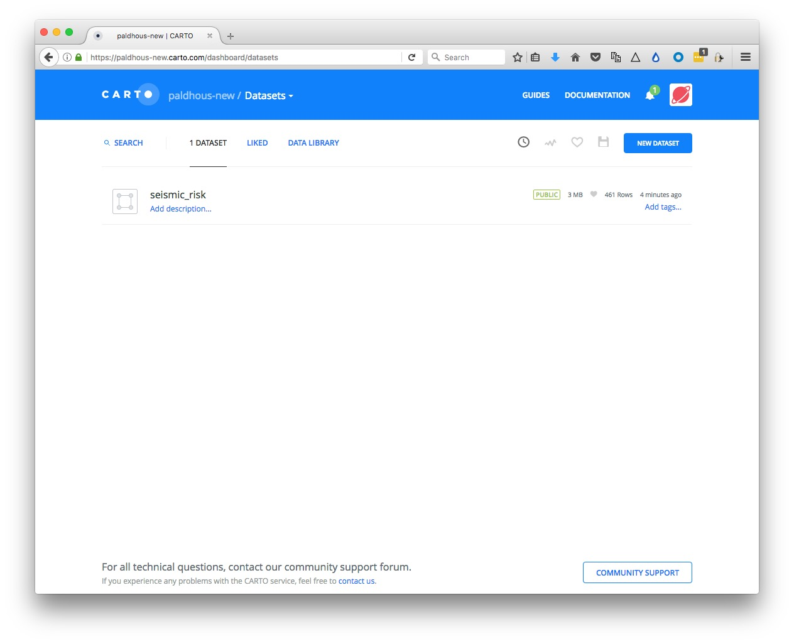
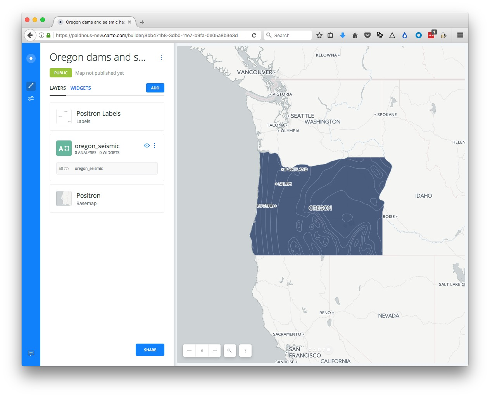
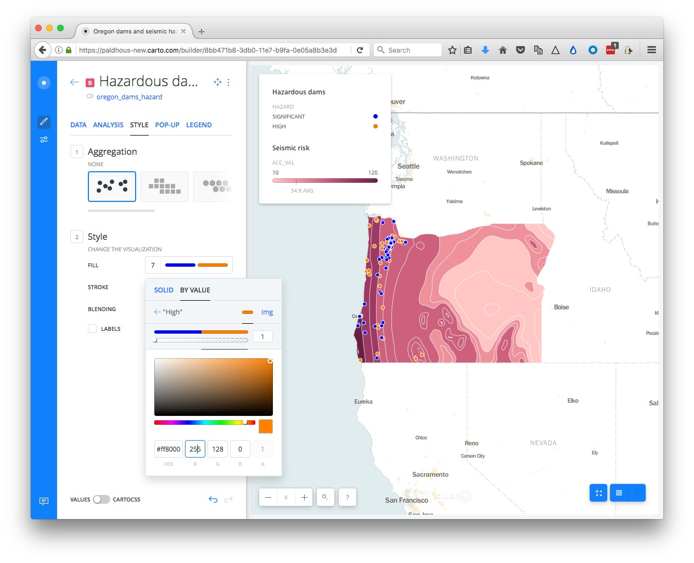

# Making maps with Carto

### Introducing Carto

[**Carto**](https://carto.com/) is a cloud-based mapping application that makes it easy to produce interactive, online maps. These maps can include [animations of data over time](https://carto.com/docs/faqs/torque/). It is also a geospatial database, allowing you to process geodata using [Structured Query Language](https://en.wikipedia.org/wiki/SQL).

### The data we will use

Download from [here](data/mapping.zip), unzip the folder and place on your desktop. It contains the following:

- `oregon_dams.csv` Data on dams in Oregon, from the state's [dams inventory](http://apps.wrd.state.or.us/apps/misc/dam_inventory/). Contains fields including `hazard` (High, Significant, or Low)   , and `storage`, giving the each dam's capacity in acre feet.

- `seismic_risk.zip` Data on seismic risk for the contiguous US, [calculated by](https://earthquake.usgs.gov/hazards/hazmaps/conterminous/index.php#2014) the US Geological Survey. The risk values are in the field `acc_val`, and represent the peak ground acceleration, expressed as a percentage of the acceleration due to gravity, likely to be experienced with a 2% chance over 50 years. This data is a zipped [shapefile](https://en.wikipedia.org/wiki/Shapefile), a common format for geographic data. Broadly speaking, a shapefile contains a table of data, which is associated with map geometries that can be polygons, lines, or points.

- We will also later import data from the USGS earthquakes API, for earthquakes since 1960 with a magitude of 5 and above, within a 2,000km radius of the geographic center of Oregon, using this url:

	```SQL
http://earthquake.usgs.gov/fdsnws/event/1/query?starttime=1960-01-01T00:00:00&latitude=43.9336&longitude=-120.5583&maxradiuskm=2000&minmagnitude=5&format=csv&orderby=time
```

### Our mapping task

We are going to make a map with three layers:

- Choropleth (i.e. a filled map using color) showing the risk of a damaging quake in the state of Oregon.
- A map of scaled circles, showing the amount of water stored in dams in the state judged to be a High or Significant hazard, in high seismic risk zones.
- An animation of historical earthquakes of magnitude 5 and above in the region since 1960.

### Import data to Carto and process using SQL

Login to your Carto account, open the drop-down menu under `Maps` at top left and switch to `Your datasets`:


Then click the `NEW DATASET` button at top right.

You should now see the following screen:


With the `Data file` tab selected, click the `Browse` button, navigate to the zipped `siesmic_risks.zip` shapefile and click `Open`. Then click the `CONNECT DATASET` button at bottom right.

Carto can import geodata in a variety of formats, including CSV, [KML](https://developers.google.com/kml/?hl=en), [GeoJSON](http://geojson.org/) as well as shapefiles.

Once the data has imported, you will see the uploaded data table:


Notice that, in addition to the fields from the original data, each row has been given a `cartodb_id`, which is a unique identifier for each. The table also has a field called `the_geom`. This field is central to how Carto works, defining the geometry of any map you make. These geometries can be points, lines or polygons (areas) -- which is what we have here.

You can rename fields by clicking on the three little blue dots to the right of their names:


You can sort or order the table by the data in each field by clicking on the blue dots and then using the arrows. And you can change the data type for each field (for example from numbers to strings of text), using the same menu.

Click `PREVIEW` at bottom right to see the basic, unstyled map:


Now click `BACK` to close that map and click on the circle at top left to return to your datasets:


Notice that the top menu has a link to `DOCUMENTATION`, which has links to Cato's technical manuals.



The `DATA LIBRARY` link contains useful datasets that you can import into your own account. We are going to use this to import a map of US states, which we will then use in a SQL query to clips the seismic risk map to the boundaries of Oregon.

Click the data `DATA LIBRARY` link, then `SEARCH` for "states." Scroll down, navigate to page 2 of the search returns, select the dataset `USA states` and click the `Connect dataset` link at top right.


Notice that the imported dataset contains a field called `postal` with the states' two-letter abbreviations:


Now slide the toggle at bottom right from `METADATA` to `SQL`:


This should open the following panel


Notice that there is a default query that is simply selecting all the data from the table:

```SQL
SELECT * FROM ne_50m_admin_1_states
```

CartoDB is based on a [PostgreSQL](http://www.postgresql.org/) database. It works similarly to SQLite, although the syntax for some queries is a little different. [Here](http://www.postgresqltutorial.com/) is a PostgreSQL tutorial, if you would like to learn more.

Paste the following query into the SQL panel and click `APPLY`:

```SQL
SELECT *
FROM ne_50m_admin_1_states
WHERE postal = 'OR'
```

You should now just have one row in your data representing the state of Oregon. You can click `Preview` to confirm this on a map if you wish.

Click the three blue dots to the right of the table name and `Create Dataset from query`:


Click on the new table's title and rename as `oregon`:


Toggle to the `SQL` panel again, and paste in this query in place of the default:

```SQL
SELECT seismic_risk.acc_val, ST_Intersection(seismic_risk.the_geom, oregon.the_geom) AS the_geom
FROM seismic_risk, oregon
WHERE ST_Intersects(seismic_risk.the_geom, oregon.the_geom)
```

Carto allows you you run spatial/grographic queries using an extension to PostgreSQL called [PostGIS](http://postgis.net/). PostGIS functions can, for instance, calculate distances or areas, and all begin with the prefix `ST_`. See [here](http://postgis.net/docs/manual-2.2/PostGIS_Special_Functions_Index.html) for a full list of PostGIS special functions.

This query uses the spatial functions `ST_Intersection`, [which creates a new geometry](https://postgis.net/docs/ST_Intersection.html) that is the overlap between the geometries from two tables, and `ST_Intersects`, [which returns](https://postgis.net/docs/ST_Intersects.html) data only for overlaps between two geometries.

Here, the `SELECT` clause will return two columns, `acc_val` from the `seismic_risk` table, and a new `the_geom`, which is the part of the `seismic_risk.the_geom` that overlaps with the `oregon.the_geom`.

The `FROM` clause must name both tables included in the query.

The `WHERE` clause ensures that the data returned is only for the overlap between the two geometries.

Click `APPLY` to run the query, then create a new dataset from the result, and rename as `oregon_seismic`:


The map `PREVIEW` should look like this:


Now return to your `DATASETS`, click the `NEW DATASET` button again and import the file `oregon_dams.csv`, which should look like this:


Notice that `the_geom` for points is given by their longitude and latitude co-ordinates.

Click `PREVIEW` to see the locations of all of the dams:


We will create a new column in this data to allow us to accurately scale the size of the dams by their `storage` in acre feet. Click on the three little dots to the right of the header on any of the columns and `Add new column`.


Rename the new column as `scale` and change its data type to `Number`:


Now open the `SQL` panel with the toggle switch and run this query:

```SQL
UPDATE oregon_dams
SET scale = sqrt(storage)
```
This is an `UDPATE` query, which alters a table, rather than selecting data from one or more tables.

The `scale` field should now be populated with numbers:


We have created this field, because Carto only allows you to set the size of circles by their width, not their area. To scale accurately by area, you need to use the square root of the data values, because the area of a circle is propotional to its radius squared, according to the equation `π*r^2`.

Now we will run a query to select only the dams judged to be a `High` or `Significant` hazard in zones with a seismic hazard `acc_value` of greater than 40.

```SQL
SELECT oregon_dams.*
FROM oregon_dams, oregon_seismic
WHERE ST_Within(oregon_dams.the_geom, oregon_seismic.the_geom) AND oregon_seismic.acc_val >= 40 AND (oregon_dams.hazard = 'High' OR oregon_dams.hazard='Significant')
```
This query uses the spatial function `ST_Within`, [ which returns data](https://postgis.net/docs/ST_Within.html) only if the first geometry is inside the second. The meaning of rest of the `WHERE` clause should make sense from our earlier SQL class.

`APPLY` this query, then create a new dataset from the result, and rename as `oregon_dams_hazard`. In `PREVIEW`, this dataset should look like this:


Finally, we will pull in the historical earthquakes data.

Return to your `DATASETS`, click `NEW DATASET` and enter the following into the url.

```SQL
http://earthquake.usgs.gov/fdsnws/event/1/query?starttime=1960-01-01T00:00:00&latitude=43.9336&longitude=-120.5583&maxradiuskm=2000&minmagnitude=5&format=csv&orderby=time
```
Click `SUBMIT` and you should see the following screen:


With tables like this, pulled from an live API, it is possible to have them update automatically on a defined schedule, with a paid-for account, hence the invitation to upgrade.

However, we will simply `CONNECT DATASET`, which should look like this:


Rename this dataset to `quakes`.


### Create a map combining datasets

Exit the `quakes` dataset and reopen the `oregon_seismic` dataset by clicking on its name in your `DATASETS`. Then click the `CREATE MAP` button at bottom right.

If this is your first time using the news Carto Builder interface, you will be aksed if you want to `TAKE A TOUR`. Instead click `EDIT YOUR MAP`.

Rename this map `Oregon dams and seismic hazards` by clicking on its name at top left:



Now clickon the `ADD` button. Select the `oregon_dams_hazard` layer so that it is highlighted in blue, then click the `ADD LAYER` button at bottom right.

You should now see both layers on the same map:


### Select a basemap

Now choose a basemap for your visualization, by clicking the `Basemap` layer in the left panel. The default is a basemap from Carto called `Positron`, with the `Labels` displayed over the data layers.

This is a good default choice. Take a few minutes to explore the built-in basemap options using the `Source` and `Style` options. You are not limited to these basemaps, however.

To import another tiled basemap from elsewhere on the web, click this icon under `Source`:


Now click the blue plus sign under `Style` to call up the following dialog box:


The `XYZ` tab allows you to call in publicly available basemaps using URLs in the following format:

```SQL
https://{s}.tiles.mapbox.com/v3/mapbox.world-bright/{z}/{x}/{y}.png
```

We will use this "world bright" basemap, provided by MapBox (see the other basemaps from MapBox [here](http://a.tiles.mapbox.com/v3/mapbox/maps.html)). The [Leaflet Providers preview](http://leaflet-extras.github.io/leaflet-providers/preview/) is a good place to look for available basemaps from other providers. It previews the maps and also exposes their `XYZ` URLs:


Back in Carto, enter the `XYZ` URL for the MapBox world bright map, above, and click `Add basemap`. The map should now look like this:


You can also replace the basemap with a white or colored background by clicking on the paint-pot icon under `Source`:


Return to the main layers panel by clicking on the backward-pointing arrow next to `Basemap`.

### Style the maps using the point-and-click interface

Now click on the `oregon_seismic` layer to bring up this view:


At this point, rename the layer `Seismic risk`.

Click on `STYLE`, then the color bar for `FILL`. Then select `BY VALUE` and select the `acc_val` field to color the map by the values for seismic risk:


The default options divide the data into 5 buckets, or bins, using quantiles. You can explore other options by clicking the three blue dots next to each. You can also select from a range of color palettes, and add labels to your map if desired by checking that box. Click on `Custom color set` if you wish to set the colors for each bin individually, for instance to use a [ColorBrewer](http://colorbrewer2.org/) palette.

Return to the main layers panel, click on the `oregon_dams_hazard` layer, and rename to `Hazardous dams`.

In the `STYLE` tab, retain the default aggregation of `NONE`, and click on the color bar for `FILL`, then `BY VALUE`. Select `type` and the points should be colored using a default qualitative color scheme:


Click on the color bar for `FILL`, and then the individual color bars to edit the colors used. Here I have selected a HEX value of `#0000FF` to make each dam rated as a `Significant` hazard blue, and `#FF8000` to make each dam rate `High` hazard orange:



(The different aggregation options allow you to create other map types from a points layer, including animations. We will explore these options in the workshop, as time allows.)

### Style using CartoCSS

To exert finer control over the map styling, we can use CartoCSS, which styles maps in much the same way that conventional CSS styles web pages. See [here](https://github.com/mapbox/carto/blob/master/docs/latest.md) for a CartoCSS reference.

Still in the `Hazardous dams` layer, slide the `VALUES/CARTOCSS` toggle at bottom-left to `CARTOCSS`

You should see the following code:

```CSS
#layer {
  marker-width: 7;
  marker-fill: ramp([hazard], (#0000ff, #ff8000), ("Significant", "High"), "=");
  marker-fill-opacity: 1;
  marker-allow-overlap: true;
  marker-line-width: 1;
  marker-line-color: #FFF;
  marker-line-opacity: 1;
}
```

Edit to the following

```CSS
#layer {
  marker-width: [scale]/7;
  marker-fill: ramp([hazard], (#0000ff, #ff8000), ("Significant", "High"), "=");
  marker-fill-opacity: 0.5;
  marker-allow-overlap: true;
  marker-line-width: 1;
  marker-line-color: #FFF;
  marker-line-opacity: 1;
}
```

Rather than making the circles making the dam a fixed size, this code scales them by the field `scale` we made earlier, so that they are scaled by area according to their storage capacity -- or the amount of water that could be released if they failed catastrophically. I divided all those values by 7, so that the largest circle does not completely dominate the map.

Click `APPLY` and the map should redraw:


### Edit the legends 

Select the `LEGEND` tab for the `Hazardous dams` layer, edit the `TITLE` to `Scaled by storage capacity`.

Switch to the `Seismic risk` layer, select the `LEGEND` tab, uncheck the `TITLE`, and edit the `LEFT LABEL` and `RIGHT LABEL` to `Low` and `High` respectively.


### Configure tooltips/pop-ups

Switch to the `Hazardous dams` layer and select the `POP-UP` tab. Select `Hover` and the `LIGHT` style, and check `dam_name`, edting the text to `Name`.

When you hover over one of the facilities, the map should now look like this:


### Add an animated layer with the quakes

Return to the layers panel and click `ADD`, selecting the `quakes` layer. Select this layer,and under the `STYLE` tab change the aggregation to `ANIMATED` by clicking this icon:


Change the `FILL` color to black (Hex: `#000000`) and the `COLUMN` to `time`

The quakes layer should now be animated.

#### Configure the map options, and publish

Return to the main layers panel.

We are almost ready to publish the map, but before doing so, click the `Settings` icon at left:


Experiment with the options. Here the `SEARCH BOX`, which geocodes locations entered by the user and zooms to them is disabled.


I strongly recommend disabling the `SCROLL WHEEL ZOOM` which will otherwise cause the map to zoom unintentionally when someone scrolls down a web page in which the map is embedded.

Having finished working on the map, click the `SHARE` button. This will call up the following options:


Click `PUBLISH`, than copy the code the code from `Embed it` to obtain an [iframe](http://www.w3schools.com/tags/tag_iframe.asp) which will allow you to embed the map on any web page, in the following format:

```CSS
<iframe width="100%" height="520" frameborder="0" src="https://paldhous-new.carto.com/builder/8bb471b8-3db0-11e7-b9fa-0e05a8b3e3d7/embed" allowfullscreen webkitallowfullscreen mozallowfullscreen oallowfullscreen msallowfullscreen></iframe>
```
(Note that you can edit the dimensions of the iframe -- here set at `100%` of the width of the div in which it appears -- and `520` pixels high) as required.)


### Further reading/resources

[Carto tutorials](https://carto.com/docs/tutorials/)

[The Map Academy](https://carto.com/academy/)
A series of exercies in Carto, organized by difficulty.
