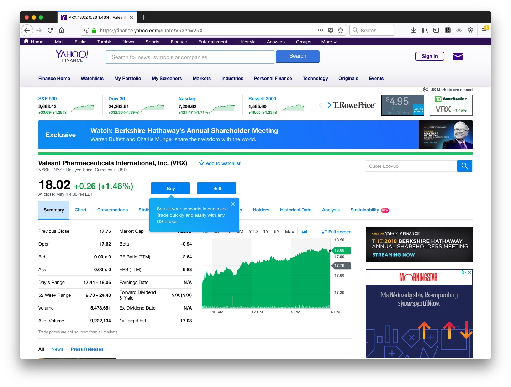
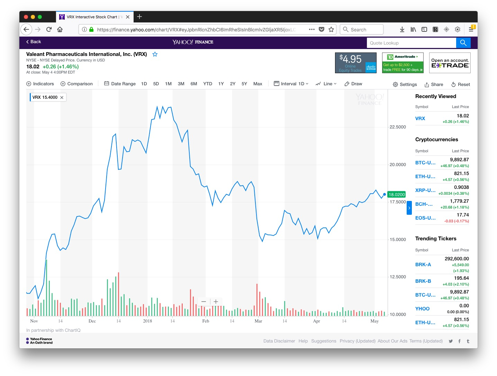
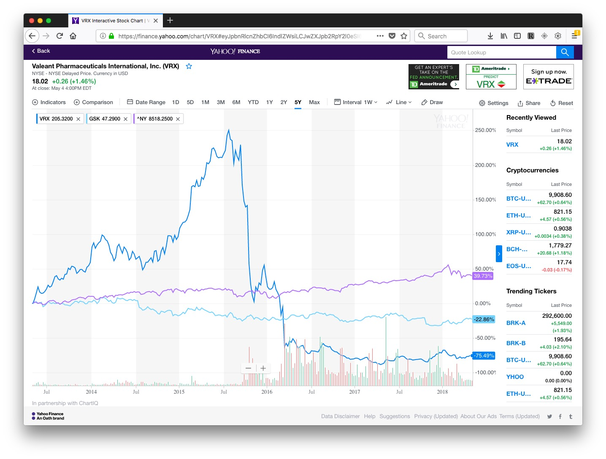
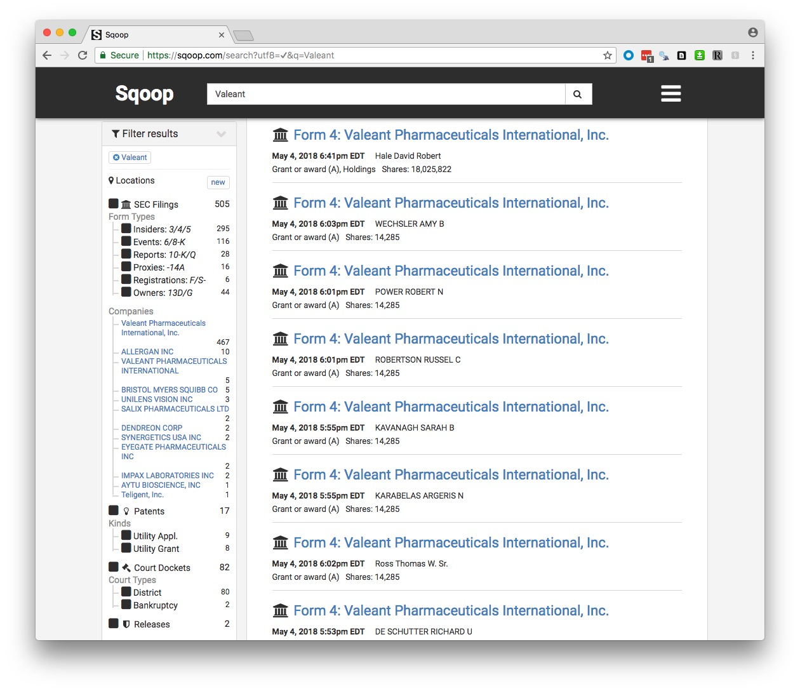

# Backgrounding companies

If a company is public, meaning that its shares are traded on a stock exchange, then the value of its shares, and the volume of their trading, can provide useful information about its general health, and reveal significant events affecting the company. [Google](https://www.google.com/finance) and [Yahoo](https://finance.yahoo.com/) both operate finance sites at which you can view these metrics over time.

In class, we will use Yahoo Finance to explore the history of trading in the stock of companies including Valeant Pharmaceuticals, which became controversial in 2015 after [being accused of price gouging](http://www.businessinsider.com/why-have-valeant-pharmaceuticals-shares-collapsed-2015-11).

You can search for companies using their names or abbreviated stockmarket ticker symbools( see [here](https://finance.yahoo.com/lookup)).

Search for Valeant or VRX, select its main presence on the New York Stock Exchange (NYSE), and you will end up on [this page](https://finance.yahoo.com/quote/VRX?p=VRX):

Now switch to the `Chart` tab and select `Full screen`. The default chart will look something like this, with a line showing the stock price, and the bars at the bottom showing the trading volume for each interval (here one day):

You can set customized date ranges, change the chart types, and add comparisons to the chart. Here I've selected the last 5 yearsm added GlaxoSmithKline for a more conventional drug company, and the NYSE index to compare the stock market as a whole:

Go `Back` from the chart and select the `Historical data` tab, and you can download data for any search. This can be useful if you want to make your own charts.

### Securities and Exchange Commission

Public companies are regulated by the [**Securities and Exchange Commission**](https://www.sec.gov/Article/whatwedo.html) (SEC), which describes its role as to "protect investors, maintain fair, orderly, and efficient markets, and facilitate capital formation." Traded companies are obliged to report certain information to the SEC, which you can view by searching for them at the SEC's main [company search page](https://www.sec.gov/edgar/searchedgar/companysearch.html).

At the page for each company, you will find its filings to the SEC over time. Here is a guide to the codes for some of the most important documents:

- **10-K** is the annual report, giving  year-end financial statements, a history of the company, legal entanglements, insider conflicts of interest and a detailed management discussion of the company’s prospects. The section marked **Risk Factors** is especially informative. It is where a company describes all the things that might harm its prospects. This is where companies speak the truth that otherwise they would never utter -- they do this here because it protects them from being accused by the SEC of misleading investors if they get into serious financial trouble. [Here](https://www.sec.gov/Archives/edgar/data/1076481/000119312510057418/d10k.htm) is the 10-K filed for 2009 by the diagnostics company Sequenom, in which this section makes for particularly interesting reading!

- **10-Q** is the quarterly financial report.

- **DEF 14A** is the proxy statement, which gives salaries, bonuses and stock holdings of top executives. It also gives biographies of some executives and directors, and lists the largest shareholders.

- **8-K** announces important breaking news that may affect the stock price. Biomedical companies, for example, will report key results from clinical trials here.

- **Form 4 and Schedule 13D** report stock transactions by insiders and key shareholders.

You can search for SEC enforcement actions [here](http://www.sec.gov/litigation.shtml). Try searching for Sequenom and see what you find! (This [brief story](https://www.newscientist.com/blogs/shortsharpscience/2009/09/claims-for-safer-downs-test-cr.html) will provide some background to why Sequenom got into trouble.)

[Here](https://searchwww.sec.gov/EDGARFSClient/jsp/EDGAR_MainAccess.jsp) is the SEC's full text search, which can be useful, for example, for finding references to individuals, and privately-held companies, in documents filed by publicly-traded companies. ([Here](https://www.sec.gov/edgar/searchedgar/edgarfulltextfaq.htm) is the FAQ page for that search form, explaining how to use it to best effect.

### Sqoop

**[Sqoop](https://sqoop.com/)** is a relatively new site that aims to provide a one-stop-shop for information on companies. Sign up for a free account [here](https://sqoop.com/users/sign_up).

You can search using the names of companies, individual corporate officers, or keywords, and it will return links to SEC filings, patents, cases in federal courts, and Departmet of Justice press releases. (You will still need a login for the [PACER](https://www.pacer.gov/) federal court search system to access federal court documents.)

Here are the results for a search on Valeant:

You can save a search to receive updates by email of new documents.

If you are a local reporter, Squoop also provides the option to [narrow your SEC filing searches by geography](https://sqoop.com/blog/2016-03-11-geographic-search). Click on the `Locations` button after running your search to activate this option.

Sqoop is currently made freely avilable to journalists, as it tries to expand its user base. It is a for-profit, however, so it is possible that charges will be introduced in future.

### Privately-held companies

It is much harder to do background research on privately-held companies, which do not have to file reports to the SEC. Many of technology companies you are likely to be most interested in as science reporters will be privately held, backed by venture capital.

An example is Theranos, the blood-testing diagnostics company that became mired in a [major scandal](https://www.wired.com/2016/05/everything-need-know-theranos-saga-far/) after a Pulitzer-winning reporter with the *Wall Street Journal* started to investigate its scientific claims and glowing media coverage. Things have done from [bad to worse](http://www.businessinsider.com/theranos-founder-ceo-elizabeth-holmes-life-story-bio-2018-4) since then.

So think about the agencies (state and federal) that have some oversight or regulatory role. For example, a company running animal experiments will have to file reports about its use of animals to the U.S. Department of Agriculture's Animal and Plant Health Inspection Service, and will be inspected from time to time, see [here](https://www.aphis.usda.gov/aphis/ourfocus/animalwelfare/sa_awa/awa-inspection-and-annual-reports).

Does the company, its staff, or facilities, need to be licensed? Doctors and many other professionals do, and their licensing information will usually be searchable online, and will including disciplinary actions. Many types of businesses, from car repair shops to nursing homes, will also have to be licensed, usually at the state level.

Does the company have a loan from the Small Business Adminstration? Search [here](http://web.sba.gov/pro-net/search/dsp_dsbs.cfm). Does it have a Small Business Innovation Research grant? Search [here](https://www.sbir.gov/sbirsearch/award/all).

Has the company received any other grants or contracts from the federal government? Search at [USASpending.gov.](https://www.usaspending.gov/Pages/Default.aspx)

Does the company have problems with Occupational Safety and Health, either at the [federal](https://www.osha.gov/oshstats/index.html) or state ([here](https://www.dir.ca.gov/dosh/), for California) level? (Note, Cal/OSHA files its inspection and enforcement activity in the federal database.)

Companies' own press releases can be useful, and are now usually archived online, either on a company's own website, or through services like [CISION/PR Newswire](http://www.prnewswire.com/) and [MarketWired](http://www.marketwired.com/).

In the U.S., companies are registered with the authorities in the state they call home. You can search for businesses registered in California [here](https://businesssearch.sos.ca.gov/). Find out more about available information [here.](http://www.sos.ca.gov/business-programs/business-entities/information-requests/) You can order basic documents about companies' registration [using this form](http://bpd.cdn.sos.ca.gov/pdf/be-records-requests.pdf).

But be aware that the name a company trades under may not be its registered name. To find out the registered name, you may need to run a "fictitious business name" search at the county level. [Here](http://sccounty01.co.santa-cruz.ca.us/clerkrecorder/Asp/FBNInquiry.asp) is the search site for Santa Cruz County, and [here](http://www.brbpub.com/) is useful a site from which you can navigate down to all sorts of public records at state and country levels, including fictitious business name searches.

[**OpenCorporates**](https://opencorporates.com/) is an ambitious effort to build a database of information on companies throughout the world, public and private.

### Lawsuits

Companies are frequently involved in lawsuits, so use court searches to identify these.

