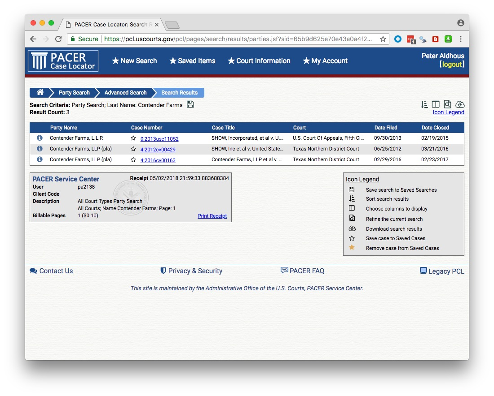

# Backgrounding nonprofits and people, finding court cases and documents

### Nonprofits

In the U.S., nonprofit organizations can be considered as charities, [exempt](https://www.irs.gov/charities-non-profits/charitable-organizations/exemption-requirements-section-501-c-3-organizations) from tax, if their activities fall under [exempt purposes](https://www.irs.gov/charities-non-profits/charitable-organizations/exempt-purposes-internal-revenue-code-section-501c3) specified by the Internal Revenue Service (IRS). These purposes are summarized by the IRS as "charitable, religious, educational, scientific, literary, testing for public safety, fostering national or international amateur sports competition, and preventing cruelty to children or animals." Lobbying to influence legislation may not be a ["substantial"](https://www.irs.gov/charities-non-profits/measuring-lobbying-substantial-part-test) portion of their activities. That's judged by IRS using factors including the time and money devoted to lobbying; organizations can also request that this be measured by expenditure alone, using the guidelines [here](https://www.irs.gov/charities-non-profits/measuring-lobbying-activity-expenditure-test). Charities may also not campaign for or against particular political candidates.

Charities meeting these requirements are known as 501(c)(3) organizations, after the section of the U.S. tax code that governs their operations. As we will see, this includes some organizations with large turnovers. Some organizations have both commercial arms that are treated as for-profits, and non-profit arms that fall under 501(c)(3).

While 501(c)(3) organizations do not have to pay tax, they do have to submit an annual report to the IRS, known as a Form 990. As a journalist trying to gather basic information on a nonprofit, the idiosyncratic Form 990 is your friend.

There are several versions of this form, with a condensed version, known as [990-EZ](https://www.irs.gov/uac/about-form-990ez), for smaller non-profits (those with an annual revenue of $200,000). The smallest charities, with an annual revenue of $50,000 or less, are merely required to fill in a "postcard" version of the form known as [990-N](https://www.irs.gov/charities-non-profits/annual-electronic-filing-requirement-for-small-exempt-organizations-form-990-n-e-postcard), which contains little information.

501(c)(3) organizations with for-profit arms must file their taxable business income using a form called [990-T](http://www.irs.gov/instructions/i990t/).

Many familiar charitable organizations, such as the Bill and Melinda Gates Foundation, fall under a different category called a Private Foundation, and must fill in a form called a [990-PF](https://www.irs.gov/uac/about-form-990pf). These forms are slightly different, but once you are used to reading regular 990s they should be easy to navigate.

Churches, while being charities, are not required to file Form 990s.

Nonprofits *must* provide their three most recent Form 990s. If you cannot find them on the sites below, or get them from the IRS, and the organization refuses to hand them over, you have a story about a misbehaving charity!

We will consider the full Form 990, also known as 990-EO, filed by organizations with annual earnings of $200,000 or more, and assets of $500,000 or more.

These forms can be revealing, and it is quite possible to find information that shows problems with a charity's organization or finances. Less then 1% of Form 1990s are actually audited by the IRS.

A charity should have a defined **program service**: a major, usually ongoing, activity of the organization that accomplishes its tax-exempt purpose.

Two websites provide a good starting point to search for nonprofits and view their 990s:

##### [Guidestar](http://www.guidestar.org/)

From the homepage, you can search for non-profits by name. The advanced search page is [here](http://www.guidestar.org/AdvancedSearch.aspx). Once on the page for an individual non-profit, for example [here](http://www.guidestar.org/organizations/53-0196572/american-chemical-society.aspx) for the American Chemical Society, who will see a button to the right to show and download the three most recent 990s:

You will need to [sign up](https://www.guidestar.org/Account/Register) for a free account to view these forms. You can also pay for access to more reports and certain information extracted from them -- however, I have never found any need to do this.

##### [CitizenAudit](https://www.citizenaudit.org/)

This is a project set up by the data journalist [Luke Rosiak](https://twitter.com/lukerosiak), originally with backing from the Sunlight Foundation. It is systematically digitizing 990s using optical character recognition, so that they become fully searchable. So not only can you use the search box on the home page to search for an organization and its 990s, but you can also search the documents for mentions of people, payments from one non-profit to another, and so on. There is a good write-up of its uses in journalism [here](http://www.icij.org/blog/2013/09/investigating-charities-how-search-finances-nonprofits-and-foundations).

For comparison with Guidestar, [here](https://www.citizenaudit.org/organization/530196572/american-chemical-society/) is the page for the American Chemical Society:

The `Tax Forms (Form 990s)` tab at left should have links to 990-EO and 990-T documents going back over 15 years. More recent ones should have searchable **Raw text**, although there is a delay between the documents being posted and the raw text being made available. (You can also download the scanned PDFs and search them directly in a PDF viewer such as Adobe Acrobat or Preview.)

When CitizenAudit launched, it was entirely free. It has now become self-supporting, which means that after [40 searches or page views](https://www.citizenaudit.org/pages/faq/) from a particular IP address, you will be asked to sign up for a [paid account](https://www.citizenaudit.org/accounts/signup/). This limits its utility, however if you have a project for which you need to gather alot of information on non-profits, and particularly if you need to look at how money passes from one to another, buying a 30-day pass for $99 may be a worthwhile option.

The other tabs at left allow you to view and download  structured data extracted from the Forms 990. (The download button is only available to paying customers, but you can use the [Chrome Table Capture plugin]((if you have a paid account, but you can also use the Chrome Table Capture Plugin)) as a workaround.)

The `Grants` and `Related & Supported Organizations` tabs are especially usedul at looking for transfers of money in and out of nonprofits. We'll come back and look at these after looking at a sample Form 1990.

##### What's in a Form 990-EO?

Do check to see whether the return is from anything other than a full calendar year, and for check marks near the top that may identify initial or amended returns.

- **Part I** gives a summary of revenue and expenses over the past two years.

	**8 - 12**: Where the money came from, including donations, grants, investments, revenue from performing their program service revenue like hospital bills or college tuition (Line 9) and investments (Line 10). There is more detail in Part VIII, the revenue statement, on page 9. The “prior year” and “current year” columns make big year-to-year changes obvious.

	**13 - 18** Where the money went. What the charity spent its budget on, under broad headings including grants, salaries, and professional fundraising fees.

	**19- 22** Annual surplus/deficit, assets and liabilities. Charities are allowed to make a surplus. These lines tell you whether a charity's assets or liabilities are growing.

- **Part III** gives detail of expenses and revenue on program service.

- **Part IV** Checklist for required schedules
 
	Answering yes to any of these questions means a charity must file a schedule explaining the circumstances. Some may be worth checking out, see below for examples. Look out for **25**, “excess benefit transactions to disqualified individuals,” which is likely to mean large payments to insiders of one sort or another.

- ** Part V** Checklist for tax compliance.

	**6** may be interesting for some charities. It asks whether any donations were not tax deductible, and whether donors were warned about this.

- ** Part VI** Checklist for governance and policies etc.

	Look out for **2**, which details family or business interests between officers, directors, trustees, or key employees; **5** asks whether the organization became aware of embezzlement; **15** asks about procedures for determining the pay of top employees; **17** lists the states in which the organization is obliged to file a copy of the 1990, useful for determining where it operates.

- **Part VII** lists and gives compensation for:

	A) Officers, directors and trustees and key employees.
B) Five current highest compensated employees paid more than $100,000.
C) Former officers, key employees and highest compensated employees paid more than $100,000.
D) Former directors and trustees who received more than $10,000.
E) Five highest paid independent contractors paid more than $100,000.

	Look out for large payments to people who left -- which can indicate problems.

- **Part VIII** gives a breakdown of revenue.

- **Part IX** gives a breakdown of expenses into major functional categories.
 
	This section can be manipulated, for example to make money spent on fundraising look like money spent on program service. Donations don't usually fly in of their own accord, so if a charity says it spent little or nothing on fundraising but is receiving much of its revenue from donations, be suspicious!

- **Part X** is the balance sheet (a friendly accountant can help interpret this and other parts of the form).

**Schedules of interest:**

- **B** would be of great interest, as it lists major contributors and their donations. But is almost always missing, and if present names can be withheld. But there are often other ways of getting this information -- annual reports, plaques in the lobby etc.

- **C** documents political campaign and lobbying activities.

- **F** documents grants awarded outside the U.S.

- **I** documents grants awarded in the U.S.

- **J** has more details on compensation of directors, officers, key employees etc.

- **L** Transactions with “interested persons.” Definitely worth looking for!

- **O** supplemental information, pay attention to this, as it contains the overspill from other parts of the form!

- **R** Related organizations.

##### An example Form 990

[Here](ACS_2016_990.pdf) is the latest (2016) Form 990 for the American Chemical Society:

<object class="pdf" data="ACS_2016_990.pdf" type="application/pdf" width="100%" height="1000px">
		
Your web browser doesn't have a PDF Plugin. Instead you can <a href="ACS_2015_990"> Click here to download the PDF</a>

	</object>

In class, we will use this form to answer the following questions:

- What was the ACS's total revenue in 2016?

- What were its total expenses?

- What was its total salary bill?

- What was the highest paid independent contractor, and how much did they get paid?

- Who was the highest paid officer/employee, and how much did they earn?

- How much did the ACS spend on lobbying?

##### More resources for reporting on nonprofits

For excellent reporting on charities behaving badly, read [America's Worst Charities](https://www.revealnews.org/topic/charities/), by the Center for Investigative Reporting and the *Tampa Bay Times*. [Kendall Taggart](https://www.buzzfeed.com/kendalltaggart), now with BuzzFeed News, has a [great slide deck](http://slides.com/kendall/mining-nonprofit-data#/) explaining the resources she used to report these stories. She explains more about how the reporting was done [here](https://www.revealnews.org/article/how-we-identified-the-nations-worst-charities/).

America's Worst Charities is particularly interesting because the reporters didn't just analyze the spending of one or two charities: They looked at thousands, focusing on those that used the services of professional fundraising companies, and then highlighting those that spent proportionately the least on their supposed charitable function. To do this, they downloaded [bulk financial data](https://www.irs.gov/statistics/soi-tax-stats-annual-extract-of-tax-exempt-organization-financial-data), extracted from 990s, provided by the IRS.

The slide deck also recommends resources to track charity finances available in [some states](http://slides.com/kendall/mining-nonprofit-data#/16), and a [database of disciplinary actions](http://charitysearch.apps.cironline.org/) taken by states against charities, compiled by CIR and the *Tampa Bay Times*. The actions underlying this database, which will only be complete up to the publication of America's Worst Charities in 2013, were obtained by public records requests.

### People

Searching for information on individual people can be difficult, without access to a commercial research tool such as [Accurint](http://www.accurint.com/), or TransUnion's [TLOxp](https://tloxp.tlo.com/). I can show you how TLOxp works in class.

In my experience, most online search sites that offer background checks, contact information, and so on, are more effective at parting you from your money than providing good information.

If you don't have access to these resources, it helps to think about official agencies to which individuals must report information. [Who Is John Doe](http://www.reporter.org/desktop/tips/johndoe.htm), a site put together by investigative reporter [Duff Wilson](http://www.journalism.columbia.edu/profile/395-duff-wilson/10), provides a very useful guide to potential sources of information. [Here](http://www.peoplesearchpro.com/journalism/people/) is another site that provides links to various people-searching resources.

Nowadays, I regularly use LinkedIn to find sources, especially when I need to reach people who work or who have worked for particular organizations, and to contact sources who keep their emails and phone numbers out of the public domain. [LinkedIn Premium](https://premium.linkedin.com/) is very useful for finding and communicating with these people. This can be free for [journalists](https://premium.linkedin.com/). It offers some improved search features, but the main benefit is InMail, which allows you to send messages to people who are not in your contacts on LinkedIn.

For regular folks, Facebook is an incredibly useful resource, for finding people, and connections between them.

### Federal courts

Cases in federal courts (district, banruptcy, and appellate) can be searched at **[PACER](https://www.pacer.gov/)** (Public Access to Court Electronic Records). Register for an account [here](https://pacer.psc.uscourts.gov/pscof/regWizard.jsf). Once you have an account, follow the `FIND A CASE` link in the top navigation bar and then `Search the PACER Case locator` to reach the [landing page](https://pcl.uscourts.gov/pcl/pages/welcome.jsf) for case searches.

Usually you will want to search on the `Find cases (Advanced)` if you know the case number or title, or more often `Find parties (Advanced)`, where you can search by the names of parties to a case, court types, dates, and so on.

When you run a search, if any cases are found you will see a screen like this, here showing a search for Contender Farms, a horse breeder that sued the US Department of Agriculture over its animal welfare enforcement, as described in [this story](https://www.buzzfeed.com/peteraldhous/usda-animal-welfare-redacted-documents):

Click through a case link and you will see a screen like this:

The `Case Summary` will tell you the status of the case, and give contact information for attorneys (also available under `Attorneys`.

I find the full list of documents at the `Docket Report` link especially useful. If you `Run Report` with the default settings, you will find a full list of documents in the case:

Look especially for Complaints and Amended Complaints, which will lay out the plantiffs' case, the defendants responses to these, and subsequent replies. Also look for Orders, Opinions, Judgments, and Notices, which should show you how and when the case was decided, or withdrawn.

PACER charges for access to documents. The charges will be fairly small, unless you are frequently downloading multiple court documents.

However, I recommend installing [RECAP](https://free.law/recap/), an extension to [Firefox](https://addons.mozilla.org/en-US/firefox/addon/recap-195534/) and [Chrome](https://chrome.google.com/webstore/detail/recap/oiillickanjlaeghobeeknbddaonmjnc). As you browse documents on PACER, the extension will upload each one to a public database, so that future users can obtain them for free.

When you encounter documents that have previously been upploaded to RECAP, they will show an `R` icon on a blue background:

Click these icons, and you can download the documents from RECAP free of charge.

### Other courts

Most cases are not heard at the federal level however, and each state has its own system. Courts will vary in the ease with which cases and documents can be searched online. In some cases you will need to visit the courthouse to obtain documents.

A good starting point, to find cases, is the [LexisNexis Academic](http://www.lexisnexis.com.oca.ucsc.edu/hottopics/lnacademic/?) service, available through the UCSC library, which allows you to search by parties at both the federal and state level:

Many newsrooms also have access to [LexisNexis CourtLink](https://courtlink.lexisnexis.com/), a commercial service that searches across state and federal courts, in many cases giving links to documents for download.

