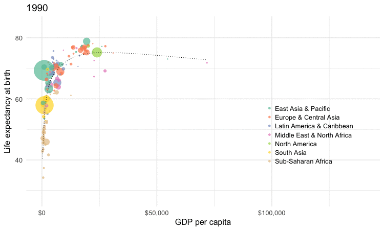
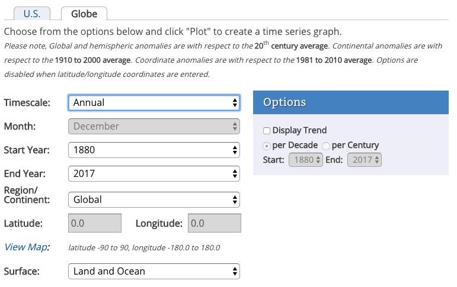
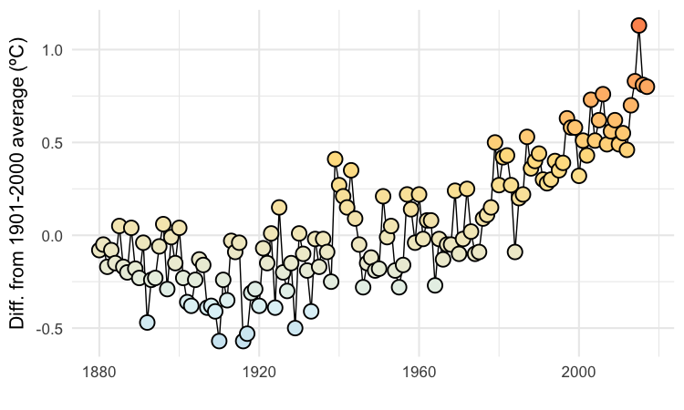
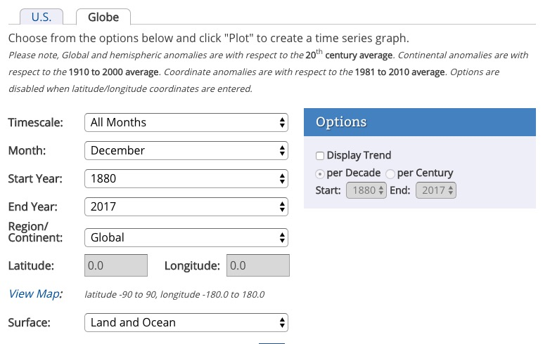
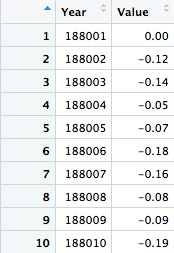

# Animation: making GIFs and videos from R

In today's class, we will make animated GIFs and videos from charts made in R using **ggplot2**. This depends on connecting R to two software libraries, [**ImageMagick**](http://imagemagick.org/script/index.php) (for processing images, including GIFs), and **[FFmpeg](http://ffmpeg.org/)** (for processing video). See the [software](software.html) page for installation instructions.


### The data we will use today

Download the data for this session from [here](data/animations-r.zip), unzip the folder and place it on your desktop. It contains the following file:

- `nations.csv` Data from the World Bank Indicators portal, as used previously.

### Setting up

Launch RStudio, create a new RScript, and set the working directory to the folder with your downloaded data by selecting `Session>Set Working Directory>To Source File Location`. Save the script as `animations.R`.

#### Install devtools and gganimate packages

Today, we are going to animate **ggplot2** graphics using the **[gganimate](https://github.com/dgrtwo/gganimate)** package, which is an [extension](http://www.ggplot2-exts.org/) to **ggplot2**. It depends upon ImageMagick and FFmpeg to make GIFs and videos.

**gganimate** is available on GitHub. To install from there, you first need to install the [**devtools**](https://github.com/hadley/devtools) package.

```R
# load devtools
library(devtools)

# install gganimate
install_github("dgrtwo/gganimate")
```

#### Load the packages we will use today

```R
# load required packages
library(readr)
library(ggplot2)
library(gganimate)
library(scales)
library(dplyr)
```

Apart from **gganimate**, we have encountered all of these packages in previous classes.


### Make a Gapminder-style animated bubble chart

In our first class with **ggplot2**, we made the following chart, showing GDP per capita, life expectancy at birth and population for the world's nations in 2015:


This is the code to generate that chart:

```r
# load data
nations <- read_csv("nations.csv")

# filter for 2015 data only
nations2015 <- nations %>%
  filter(year == 2015)

# make bubble chart
ggplot(nations2015, aes(x = gdp_percap, y = life_expect)) +
  xlab("GDP per capita") +
  ylab("Life expectancy at birth") +
  theme_minimal(base_size = 14) +
  geom_point(aes(size = population, color = region), alpha = 0.7) +
  scale_size_area(guide = FALSE, max_size = 15) +
  scale_x_continuous(labels = dollar) +
  stat_smooth(formula = y ~ log10(x), se = FALSE, size = 0.5, color = "black", linetype="dotted") +
  scale_color_brewer(name = "", palette = "Set2") +
  theme(legend.position=c(0.8,0.4))
```

Some reminders about what this code does:

 - `scale_size_area` ensures that the size of the circles scales by their area according to the population data, up to the specified `max_size`; `guide = FALSE` within the parentheses of this function prevents a legend for size being drawn.

 - `labels = dollar` from **scales** formats the X axis labels as currency in dollars.

 - `stat_smooth` works like `geom_smooth` but allows you to use a `formula` to specify the type of curve to use for the trend line fitted to the data, here a logarithmic curve.

Now we will use **gganimate** to generate an animation of the chart, from 1990 to 2015. Here is the code:

```R
nations_chart <- ggplot(nations, aes(x = gdp_percap, y = life_expect, frame = year)) +
  xlab("GDP per capita") +
  ylab("Life expectancy at birth") +
  theme_minimal(base_size = 16) +
  geom_point(aes(size = population, color = region), alpha = 0.7) +
  scale_size_area(guide = FALSE, max_size = 20) +
  scale_x_continuous(labels = dollar) +
  stat_smooth(aes(group = year), formula = y ~ log10(x), se = FALSE, size = 0.5, color = "black", linetype="dotted") +
  scale_color_brewer(name = "", palette = "Set2") +
  theme(legend.position=c(0.8,0.4))
```

Running this code will create an R object of type `gg` called `nations_chart`.

Now display it in the `Viewer` panel by running the following:

```R
gganimate(nations_chart)
```

This should be the result:


#### How the code works

I made a couple of small changes to the **ggplot2** code from the static graphic to optimise the appearance of the animation, increasing both the `base_size` for the text, and the `max_size` for the scaled circles.

The most important change, however, is in the initial `ggplot` function, which now includes `frame = year`. In the animation, this is the code that creates a separate chart for each year in the data.

Also notice that the code that creates the trend line now includes `aes(group = year)`. This is needed if we want to create a separate trend line for each year. Without this, a single trend line would be calculated for all the data across all the years, and would be static across the animation.

#### Save as a GIF and a video

Having made an animation, we can now save it as a GIF or a video:

```R
# save as a GIF
gganimate(nations_chart, "nations.gif", ani.width = 750, ani.height = 450, interval = 0.2)

# save as a video 
gganimate(nations_chart, "nations.mp4", ani.width = 800, ani.height = 450, interval = 0.1)
```

You can use the options `ani.width` and `ani.height` to set the dimensions, in pixels, of the animation; `interval` sets the interval between the frames, in seconds (the default is 1 second). For the video, I have set the ratio between width and height at 16:9, consistent with YouTube format.

Here is the video:

<div class="embed-responsive embed-responsive-16by9">
    <iframe class="embed-responsive-item" src="img/nations.mp4"></iframe>
</div>

### Add a pause to the final frame on a GIF

When making GIFs, it is often a good idea to add a longer pause on the final frame before the animation repeats. You can do this with the following code:

```R
# increase delay on final frame
system("convert nations.gif \\( +clone -set delay 300 \\) +swap +delete  nations_with_pause.gif")
```

This code uses the `system` function to send ImageMagick code to your wider computer system.

`convert` is one of the main commands in ImageMagick, used to convert between image formats as well as to manipulate images in a variety of ways. Here, `delay 300` increases the delay on the final frame to 3 seconds.

Here is the revised GIF:



### Make cumulative animations of historical global average temperature

For the Gapminder-style video, we displayed only the data for the year in question in each frame. In some cases, however, you may want to animate by adding data with each frame, and leaving the previously added data in place.

We will explore that now to make two animations of historical global temperature data from the National Oceanic and Atmospheric Administration (NOAA), similar to the video I made [here](https://www.buzzfeed.com/peteraldhous/this-is-your-planet-on-co2), and the GIF [here](https://www.buzzfeed.com/peteraldhous/another-hottest-year).

Navigate to NOAA's Climate at a Glance [time series page](https://www.ncdc.noaa.gov/cag/time-series/), and set the menus like this:



Scroll down to the data table, and hover over this icon:


This is a link to download a CSV, but we can't load it directly into R if we have its URL, so right-click and `Copy Link Address`.

Now we can load the data:

```R
# load data
global_temp_annual <- read_csv("https://www.ncdc.noaa.gov/cag/time-series/global/globe/land_ocean/1/12/1880-2017.csv", skip = 4)
```
The includes `skip = 4` because there are four rows in the file before the column headers.

The following code will draw a dot-and-line chart from the data:

```R
# draw chart
ggplot(global_temp_annual, aes(x = Year, y = Value)) +
  geom_line(color = "black") +
  geom_point(shape = 21, colour="black", aes(fill = Value), size=5, stroke=1) +
  theme_minimal(base_size = 16) +
  scale_fill_distiller(palette = "RdYlBu", limits = c(-2,2), guide = FALSE) +
  xlab("") +
  ylab("Diff. from 1901-2000 average (ºC)")

```
This should be the result:



This code uses ColorBrewer's `RdYlBu` palette, which runs from cool blues, through neutral yellows, to warm reds, fitting well to temperature data diverging from a central value.

The palette is applied with the function `scale_fill_distiller`. This and the function `scale_color_distiller` can be used to apply ColorBrewer sequential and diverging palettes in a smooth gradient to continuous variables, see [here](https://www.rdocumentation.org/packages/ggplot2/versions/2.2.1/topics/scale_colour_brewer) for more. Setting `limits = c(-2,2)` applies the palette for values from -2 to +2 degrees C, ensuring that the neutral yellow at the middle of the diverging palette is applied to a value of zero.

As this is a dot-and-line chart, it includes both `geom_line` and `geom_point` layers. Notice that the `geom_point` function also defines a numbered `shape`: `21` is a circle with a filled area, see [here](http://www.cookbook-r.com/Graphs/Shapes_and_line_types/) for other options. By using this shape, we can set the outline `color` to black and then use an `aes` mapping to `fill` it with color from the selected palette, according to the values for the `annual` variable.

To animate this chart, adding a year of data with each frame, use the following code:

```R
# animation
global_temp_annual_chart <- ggplot(global_temp_annual, aes(x = Year, 
                                                           y = Value, 
                                                           frame = Year, 
                                                           cumulative = TRUE)) +
  geom_line(color = "black") +
  geom_point(shape = 21, color = "black", aes(fill = Value), size = 5, stroke = 1) +
  theme_minimal(base_size = 16) +
  scale_fill_distiller(palette = "RdYlBu", limits = c(-2,2), guide = FALSE) +
  xlab("") +
  ylab("Diff. from 1901-2000 average (ºC)")

# save as video
gganimate(global_temp_annual_chart, "warming_annual.mp4", ani.width = 800, ani.height = 450, interval = 0.1)```

This time, the initial `ggplot` function also contains the code `cumulative = TRUE`, which adds one year of data with each frame, and leaves the previously added data in place.

This should be the result:

<div class="embed-responsive embed-responsive-16by9">
    <iframe class="embed-responsive-item" src="img/warming_annual.mp4"></iframe>
</div>

Now we'll make an animation showing a line for each year, drawn theough the temperature values for each month.

Back at NOAA's climate time series page, select these menu options:



Grab the URL for this data, as before, and load:

```R
# load data
global_temp_monthly <- read_csv("https://www.ncdc.noaa.gov/cag/time-series/global/globe/land_ocean/all/12/1880-2017.csv", skip = 4)
```

The first few rows should look like this:



To animate this data by year, but plot each by month as if all the months were in the same year, we need to process the data as follows:

```R
# process data
global_temp_monthly <- global_temp_monthly %>%
  rename(Yr_Mo = Year) %>%
  mutate(Year = as.integer(substr(Yr_Mo,1,4)),
         Date = as.Date(paste0(substr(Yr_Mo,1,4),
                               "-",
                               substr(Yr_Mo,5,6),
                               "-01")),
         Date_2017 = as.Date(paste0("2017-",
                                    substr(Yr_Mo,5,6),
                                    "-01")))
```
This code renames `Year`, which actually contains year and numeric month, to `Yr_Mo`. Then it uses the function `substr` to pull out the first four digits the create a new `Year` variable. It then creates two date columns, setting the date to the 1st of each month, and in the second case places all the dates in 2017. This sleight of hand is necessary to plot them as dates and have the lines stack up over one another. We can discuss why in class.

This code draws a chart with a line for every year:

```R
# draw chart
ggplot(global_temp_monthly, aes(x=Date_2017, 
                                y=Value, 
                                color = Value, 
                                group = Year)) +
  geom_line(size = 0.5, alpha = 0.5) + 
  theme_dark(base_size = 20) +
  scale_color_distiller(palette = "RdYlBu", limits = c(-2,2), guide = FALSE) +
  ylab("Diff. from C20th average (ºC)") +
  xlab("") +
  scale_x_date(date_labels = "%b",
               date_breaks = "month") +
  theme(panel.grid.minor = element_blank())
```
In the `aes` mapping, it is necessary to use `group = Year` to ensure that a separate line is drawn for each year.

The code uses another **ggplot2** built-in theme, `theme_dark`, to make the lightly colored lines show up against a dark background. The second `theme` function removes some of the grid lines.

`scale_x_date` sets the breaks for the data as monthly, and formats the date labels as the abbreviated month (Jan, Feb, etc). See what happens if you comment out this part of the code.

This code will create a cumulative animation of the data:

```R
# animation
global_temp_monthly_chart <- ggplot(global_temp_monthly, aes(x=Date_2017, 
                                                             y=Value, 
                                                             color = Value, 
                                                             group = Year, 
                                                             frame = Year, 
                                                             cumulative = TRUE)) +
  geom_line(size = 0.5, alpha = 0.5) + 
  theme_dark(base_size = 20) +
  scale_color_distiller(palette = "RdYlBu", limits = c(-2,2), guide = FALSE) +
  ylab("Diff. from C20th average (ºC)") +
  xlab("") +
  scale_x_date(date_labels = "%b",
               date_breaks = "month") +
  theme(panel.grid.minor = element_blank())

# save as GIF
gganimate(global_temp_monthly_chart, "warming_monthly.gif", ani.width = 750, ani.height = 450,  interval = 0.1)
```

Again, we can increase the delay on the final frame of the GIF:

```R
# increase delay on final frame
system("convert warming_monthly.gif \\( +clone -set delay 300 \\) +swap +delete  warming_monthly_with_pause.gif")
```

This should be the result:


### Further reading/resources

[ImageMagick examples](http://www.imagemagick.org/Usage/)

[FFmpeg documentation](https://ffmpeg.org/ffmpeg.html)


