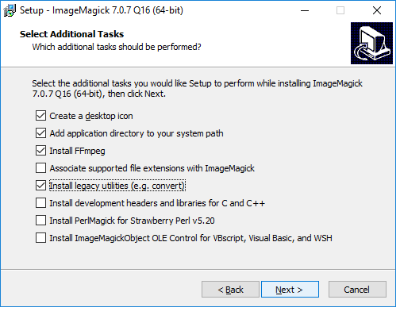

# Software and other tools

When you try to install some of the software below on the Mac, you may be warned that it comes from an unidentified developer. If this happens, right-click the installer file and select `Open`.


### [Chrome](https://www.mozilla.org/en-US/firefox/new/)

Some of the tools we will use are Chrome extensions. Ensure that you have the latest version of this popular web browser. Download Chrome [from here](https://www.mozilla.org/en-US/firefox/all/); if already installed, make sure you are updated to the latest version [following these instructions](https://support.google.com/chrome/answer/95414?co=GENIE.Platform%3DDesktop&hl=en).

### [Open Refine](http://openrefine.org/)
A powerful tool for data cleaning, once owned by Google, now open source. Download the latest **stable version** [from here](http://openrefine.org/download.html). When launched, Open Refine will work in your default web browser; note that your data remains on your computer, and is not uploaded to the web.

### [Google Sheets](https://www.google.com/sheets/about/)
Our spreadsheet application for these classes will be Google Sheets. Use from your [Google Drive ]()account.

### [Plotly](https://plot.ly/)
A web app for makign charts from data. Click the `LOG IN` button at top right to sign up for a free account.

### [R](http://www.r-project.org/) and [R Studio](http://www.rstudio.com/)
R is a software environment and programming language for statistical computing, data analysis, and graphics. Think of it as a Swiss Army knife for working with data. Download the latest installer for your operating system from [here](https://cran.rstudio.com/). R Studio provides a user interface that makes it much easier to use. Download the latest **free** version of RStudio Desktop [from here](http://www.rstudio.com/products/rstudio/download/).

### [Sublime Text](http://www.sublimetext.com/)

For some exercises, you will need a text editor optimized for authoring web pages. Download from [here](http://www.sublimetext.com/3).

### [ColorBrewer](http://colorbrewer2.org/)
Your go-to resource for color schemes to encode data. Web app: no installation required.

### [ImageMagick](http://imagemagick.org/script/index.php) and [FFmpeg](http://ffmpeg.org/)

ImageMagick is a software library for creating, editing, converting and manipulating images, including animated GIFs. FFmpeg is a software library that records and converts audio and video.

We will use them in conjunction with R to make animated graphics. They take some time to install, so it is important that you do this before class.

Here are the steps for installation on the **Mac**:

 - Download and install **Xcode**.
  - If you have Mac OS 10.12 Sierra or Mac OS 10.13 High Sierra, you should be able to download and install [from the App Store](https://itunes.apple.com/us/app/xcode/id497799835?ls=1&mt=12).
  - If you don't, you will need to update your OS if you want to make animations.
  - You may need to launch **Xcode**  and agree to the terms of service.
 - Open a Terminal window (find under `Applications>Utilities`) and enter:
 ```R
xcode-select --install
 ```
 This will install Xcode's command line tools, which are required for [**MacPorts**](https://www.macports.org/), the installer you will use to install the two software libraries.
 - [Download and install](https://www.macports.org/install.php) the correct version of MacPorts for your Mac OS.

 - In the Terminal, enter:
 ```R
 sudo port install ImageMagick
 ```
 You will be required to enter your Mac password. The installation will take some time to complete. This is a good time to make a cup of coffee.
 
 - When ImageMagick has installed, repeat the process for FFmpeg:
  ```R
 sudo port install ffmpeg
 ```

On **Windows**, you should be able to install ImageMagick and FFmpeg from [here](https://www.imagemagick.org/script/download.php#windows). Unless you have an old Windows 32-bit operating system, click on the HTTP download link to install the "Win64 dynamic at 16 bits-per-pixel component" version.

When you get to the dialog box, make sure that the boxes are checked as follows, to ensure that you also install FFmpeg and the legacy utilities:




