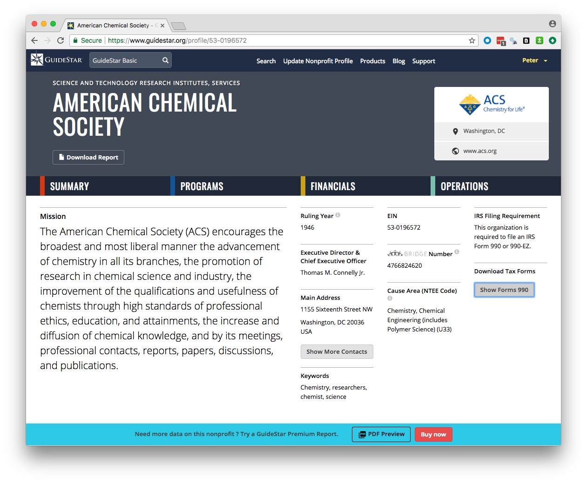
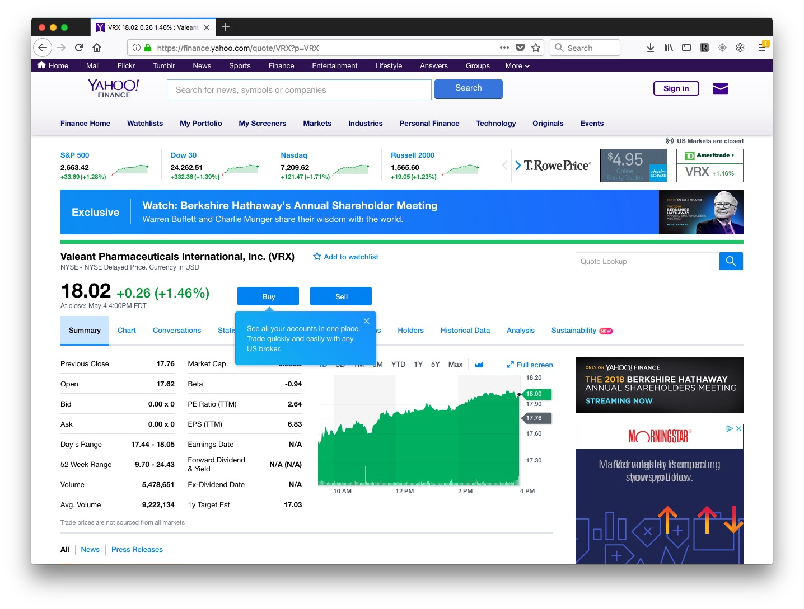
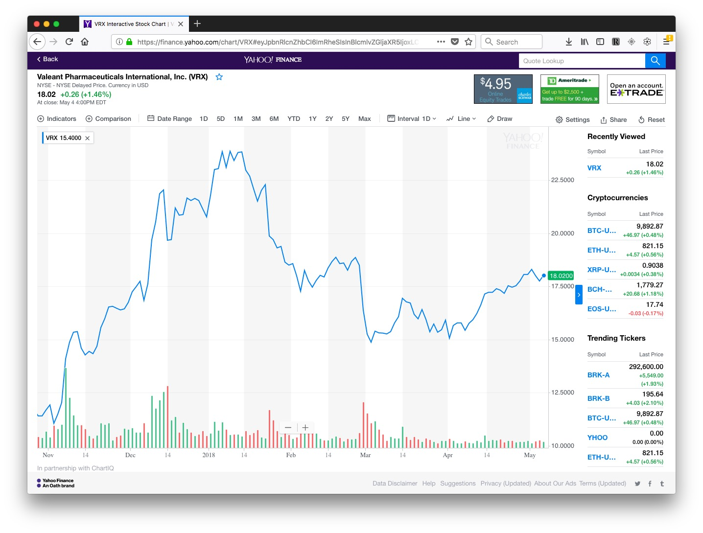
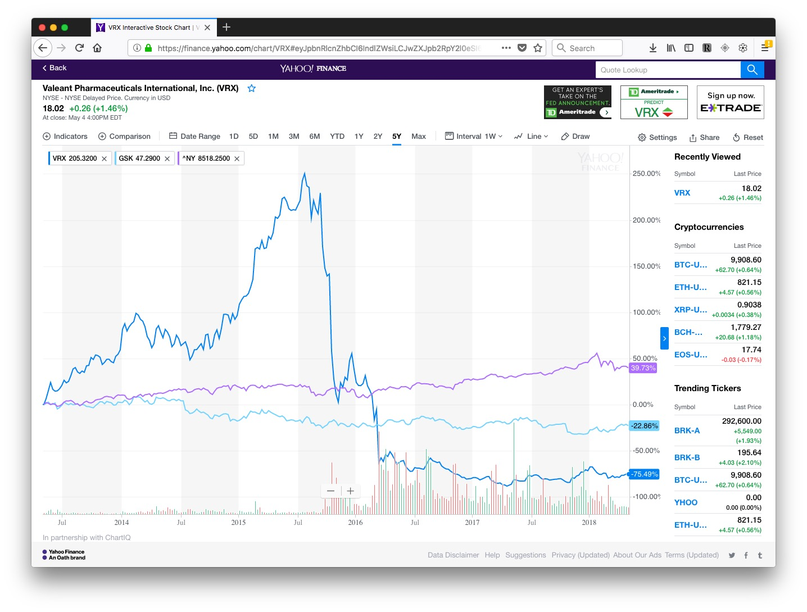
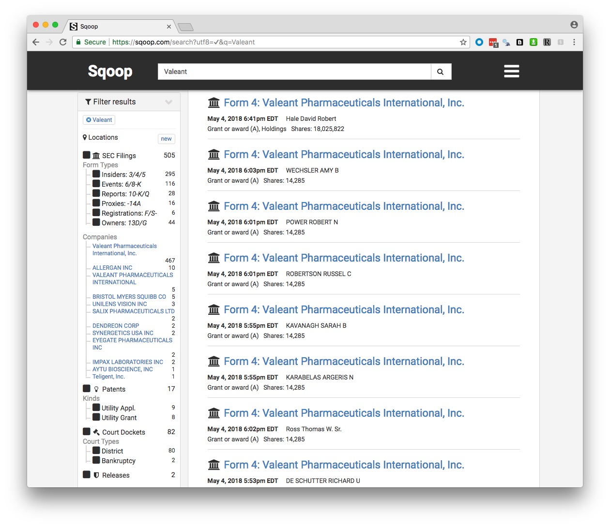

# Backgrounding nonprofits and companies

### Nonprofits

In the U.S., nonprofit organizations can be considered as charities, [exempt](https://www.irs.gov/charities-non-profits/charitable-organizations/exemption-requirements-section-501-c-3-organizations) from tax, if their activities fall under [exempt purposes](https://www.irs.gov/charities-non-profits/charitable-organizations/exempt-purposes-internal-revenue-code-section-501c3) specified by the Internal Revenue Service (IRS). These purposes are summarized by the IRS as "charitable, religious, educational, scientific, literary, testing for public safety, fostering national or international amateur sports competition, and preventing cruelty to children or animals." Lobbying to influence legislation may not be a ["substantial"](https://www.irs.gov/charities-non-profits/measuring-lobbying-substantial-part-test) portion of their activities. That's judged by IRS using factors including the time and money devoted to lobbying; organizations can also request that this be measured by expenditure alone, using the guidelines [here](https://www.irs.gov/charities-non-profits/measuring-lobbying-activity-expenditure-test). Charities may also not campaign for or against particular political candidates.

Charities meeting these requirements are known as 501(c)(3) organizations, after the section of the U.S. tax code that governs their operations. As we will see, this includes some organizations with large turnovers. Some organizations have both commercial arms that are treated as for-profits, and non-profit arms that fall under 501(c)(3).

While 501(c)(3) organizations do not have to pay tax, they do have to submit an annual report to the IRS, known as a Form 990. As a journalist trying to gather basic information on a nonprofit, the idiosyncratic Form 990 is your friend.

There are several versions of this form, with a condensed version, known as [990-EZ](https://www.irs.gov/uac/about-form-990ez), for smaller non-profits (those with an annual revenue of $200,000). The smallest charities, with an annual revenue of $50,000 or less, are merely required to fill in a "postcard" version of the form known as [990-N](https://www.irs.gov/charities-non-profits/annual-electronic-filing-requirement-for-small-exempt-organizations-form-990-n-e-postcard), which contains little information.

501(c)(3) organizations with for-profit arms must file their taxable business income using a form called [990-T](http://www.irs.gov/instructions/i990t/).

Many familiar charitable organizations, such as the Bill and Melinda Gates Foundation, fall under a different category called a Private Foundation, and must fill in a form called a [990-PF](https://www.irs.gov/uac/about-form-990pf). These forms are slightly different, but once you are used to reading regular 990s they should be easy to navigate.

Churches, while being charities, are not required to file Form 990s.

Nonprofits *must* provide their three most recent Form 990s. If you cannot find them on the sites below, or get them from the IRS, and the organization refuses to hand them over, you have a story about a misbehaving charity!

We will consider the full Form 990, also known as 990-EO, filed by organizations with annual earnings of $200,000 or more, and assets of $500,000 or more.

These forms can be revealing, and it is quite possible to find information that shows problems with a charity's organization or finances. Less then 1% of Form 1990s are actually audited by the IRS.

A charity should have a defined **program service**: a major, usually ongoing, activity of the organization that accomplishes its tax-exempt purpose.

Two websites provide a good starting point to search for nonprofits and view their 990s:

##### [Guidestar](http://www.guidestar.org/)

From the homepage, you can search for non-profits by name. The advanced search page is [here](http://www.guidestar.org/AdvancedSearch.aspx). Once on the page for an individual non-profit, for example [here](http://www.guidestar.org/organizations/53-0196572/american-chemical-society.aspx) for the American Chemical Society, who will see a button to the right to show and download the three most recent 990s:

You will need to [sign up](https://www.guidestar.org/Account/Register) for a free account to view these forms. You can also pay for access to more reports and certain information extracted from them -- however, I have never found any need to do this.

##### [ProPublica Nonprofit Explorer](https://projects.propublica.org/nonprofits/)

##### What's in a Form 990-EO?

Do check to see whether the return is from anything other than a full calendar year, and for check marks near the top that may identify initial or amended returns.

- **Part I** gives a summary of revenue and expenses over the past two years.

	**8 - 12**: Where the money came from, including donations, grants, investments, revenue from performing their program service revenue like hospital bills or college tuition (Line 9) and investments (Line 10). There is more detail in Part VIII, the revenue statement, on page 9. The “prior year” and “current year” columns make big year-to-year changes obvious.

	**13 - 18** Where the money went. What the charity spent its budget on, under broad headings including grants, salaries, and professional fundraising fees.

	**19- 22** Annual surplus/deficit, assets and liabilities. Charities are allowed to make a surplus. These lines tell you whether a charity's assets or liabilities are growing.

- **Part III** gives detail of expenses and revenue on program service.

- **Part IV** Checklist for required schedules
 
	Answering yes to any of these questions means a charity must file a schedule explaining the circumstances. Some may be worth checking out, see below for examples. Look out for **25**, “excess benefit transactions to disqualified individuals,” which is likely to mean large payments to insiders of one sort or another.

- ** Part V** Checklist for tax compliance.

	**6** may be interesting for some charities. It asks whether any donations were not tax deductible, and whether donors were warned about this.

- ** Part VI** Checklist for governance and policies etc.

	Look out for **2**, which details family or business interests between officers, directors, trustees, or key employees; **5** asks whether the organization became aware of embezzlement; **15** asks about procedures for determining the pay of top employees; **17** lists the states in which the organization is obliged to file a copy of the 1990, useful for determining where it operates.

- **Part VII** lists and gives compensation for:

	A) Officers, directors and trustees and key employees.
B) Five current highest compensated employees paid more than $100,000.
C) Former officers, key employees and highest compensated employees paid more than $100,000.
D) Former directors and trustees who received more than $10,000.
E) Five highest paid independent contractors paid more than $100,000.

	Look out for large payments to people who left -- which can indicate problems.

- **Part VIII** gives a breakdown of revenue.

- **Part IX** gives a breakdown of expenses into major functional categories.
 
	This section can be manipulated, for example to make money spent on fundraising look like money spent on program service. Donations don't usually fly in of their own accord, so if a charity says it spent little or nothing on fundraising but is receiving much of its revenue from donations, be suspicious!

- **Part X** is the balance sheet (a friendly accountant can help interpret this and other parts of the form).

**Schedules of interest:**

- **B** would be of great interest, as it lists major contributors and their donations. But is almost always missing, and if present names can be withheld. But there are often other ways of getting this information -- annual reports, plaques in the lobby etc.

- **C** documents political campaign and lobbying activities.

- **F** documents grants awarded outside the U.S.

- **I** documents grants awarded in the U.S.

- **J** has more details on compensation of directors, officers, key employees etc.

- **L** Transactions with “interested persons.” Definitely worth looking for!

- **O** supplemental information, pay attention to this, as it contains the overspill from other parts of the form!

- **R** Related organizations.

##### An example Form 990

[Here](ACS_2016_990.pdf) is the latest (2016) Form 990 for the American Chemical Society:

<object class="pdf" data="ACS_2016_990.pdf" type="application/pdf" width="100%" height="1000px">
		
Your web browser doesn't have a PDF Plugin. Instead you can <a href="ACS_2016_990.pdf"> Click here to download the PDF</a>

	</object>

In class, we will use this form to answer the following questions:

- What was the ACS's total revenue in 2016?

- What were its total expenses?

- What was its total salary bill?

- What was the highest paid independent contractor, and how much did they get paid?

- Who was the highest paid officer/employee, and how much did they earn?

- How much did the ACS spend on lobbying?

##### More resources for reporting on nonprofits

For excellent reporting on charities behaving badly, read [America's Worst Charities](https://www.revealnews.org/topic/charities/), by the Center for Investigative Reporting and the *Tampa Bay Times*. [Kendall Taggart](https://www.buzzfeed.com/kendalltaggart), now with BuzzFeed News, has a [great slide deck](http://slides.com/kendall/mining-nonprofit-data#/) explaining the resources she used to report these stories. She explains more about how the reporting was done [here](https://www.revealnews.org/article/how-we-identified-the-nations-worst-charities/).

America's Worst Charities is particularly interesting because the reporters didn't just analyze the spending of one or two charities: They looked at thousands, focusing on those that used the services of professional fundraising companies, and then highlighting those that spent proportionately the least on their supposed charitable function. To do this, they downloaded [bulk financial data](https://www.irs.gov/statistics/soi-tax-stats-annual-extract-of-tax-exempt-organization-financial-data), extracted from 990s, provided by the IRS.

The slide deck also recommends resources to track charity finances available in [some states](http://slides.com/kendall/mining-nonprofit-data#/16), and a [database of disciplinary actions](http://charitysearch.apps.cironline.org/) taken by states against charities, compiled by CIR and the *Tampa Bay Times*. The actions underlying this database, which will only be complete up to the publication of America's Worst Charities in 2013, were obtained by public records requests.

### Companies

If a company is public, meaning that its shares are traded on a stock exchange, then the value of its shares, and the volume of their trading, can provide useful information about its general health, and reveal significant events affecting the company. [Google](https://www.google.com/finance) and [Yahoo](https://finance.yahoo.com/) both operate finance sites at which you can view these metrics over time.

In class, we will use Yahoo Finance to explore the history of trading in the stock of companies including Valeant Pharmaceuticals, which became controversial in 2015 after [being accused of price gouging](http://www.businessinsider.com/why-have-valeant-pharmaceuticals-shares-collapsed-2015-11).

You can search for companies using their names or abbreviated stockmarket ticker symbools( see [here](https://finance.yahoo.com/lookup)).

Search for Valeant or VRX, select its main presence on the New York Stock Exchange (NYSE), and you will end up on [this page](https://finance.yahoo.com/quote/VRX?p=VRX):

Now switch to the `Chart` tab and select `Full screen`. The default chart will look something like this, with a line showing the stock price, and the bars at the bottom showing the trading volume for each interval (here one day):

You can set customized date ranges, change the chart types, and add comparisons to the chart. Here I've selected the last 5 yearsm added GlaxoSmithKline for a more conventional drug company, and the NYSE index to compare the stock market as a whole:

Go `Back` from the chart and select the `Historical data` tab, and you can download data for any search. This can be useful if you want to make your own charts.

#### Securities and Exchange Commission

Public companies are regulated by the [**Securities and Exchange Commission**](https://www.sec.gov/Article/whatwedo.html) (SEC), which describes its role as to "protect investors, maintain fair, orderly, and efficient markets, and facilitate capital formation." Traded companies are obliged to report certain information to the SEC, which you can view by searching for them at the SEC's main [company search page](https://www.sec.gov/edgar/searchedgar/companysearch.html).

At the page for each company, you will find its filings to the SEC over time. Here is a guide to the codes for some of the most important documents:

- **10-K** is the annual report, giving  year-end financial statements, a history of the company, legal entanglements, insider conflicts of interest and a detailed management discussion of the company’s prospects. The section marked **Risk Factors** is especially informative. It is where a company describes all the things that might harm its prospects. This is where companies speak the truth that otherwise they would never utter -- they do this here because it protects them from being accused by the SEC of misleading investors if they get into serious financial trouble. [Here](https://www.sec.gov/Archives/edgar/data/1076481/000119312510057418/d10k.htm) is the 10-K filed for 2009 by the diagnostics company Sequenom, in which this section makes for particularly interesting reading!

- **10-Q** is the quarterly financial report.

- **DEF 14A** is the proxy statement, which gives salaries, bonuses and stock holdings of top executives. It also gives biographies of some executives and directors, and lists the largest shareholders.

- **8-K** announces important breaking news that may affect the stock price. Biomedical companies, for example, will report key results from clinical trials here.

- **Form 4 and Schedule 13D** report stock transactions by insiders and key shareholders.

You can search for SEC enforcement actions [here](http://www.sec.gov/litigation.shtml). Try searching for Sequenom and see what you find! (This [brief story](https://www.newscientist.com/blogs/shortsharpscience/2009/09/claims-for-safer-downs-test-cr.html) will provide some background to why Sequenom got into trouble.)

[Here](https://searchwww.sec.gov/EDGARFSClient/jsp/EDGAR_MainAccess.jsp) is the SEC's full text search, which can be useful, for example, for finding references to individuals, and privately-held companies, in documents filed by publicly-traded companies. ([Here](https://www.sec.gov/edgar/searchedgar/edgarfulltextfaq.htm) is the FAQ page for that search form, explaining how to use it to best effect.

#### Sqoop

**[Sqoop](https://sqoop.com/)** is a relatively new site that aims to provide a one-stop-shop for information on companies. Sign up for a free account [here](https://sqoop.com/users/sign_up).

You can search using the names of companies, individual corporate officers, or keywords, and it will return links to SEC filings, patents, cases in federal courts, and Departmet of Justice press releases. (You will still need a login for the [PACER](https://www.pacer.gov/) federal court search system to access federal court documents.)

Here are the results for a search on Valeant:

You can save a search to receive updates by email of new documents.

If you are a local reporter, Squoop also provides the option to [narrow your SEC filing searches by geography](https://sqoop.com/blog/2016-03-11-geographic-search). Click on the `Locations` button after running your search to activate this option.

Sqoop is currently made freely avilable to journalists, as it tries to expand its user base. It is a for-profit, however, so it is possible that charges will be introduced in future.

#### Privately-held companies

It is much harder to do background research on privately-held companies, which do not have to file reports to the SEC. Many of technology companies you are likely to be most interested in as science reporters will be privately held, backed by venture capital.

An example is Theranos, the blood-testing diagnostics company that became mired in a [major scandal](https://www.wired.com/2016/05/everything-need-know-theranos-saga-far/) after a Pulitzer-winning reporter with the *Wall Street Journal* started to investigate its scientific claims and glowing media coverage. Things have done from [bad to worse](http://www.businessinsider.com/theranos-founder-ceo-elizabeth-holmes-life-story-bio-2018-4) since then.

So think about the agencies (state and federal) that have some oversight or regulatory role. For example, a company running animal experiments will have to file reports about its use of animals to the U.S. Department of Agriculture's Animal and Plant Health Inspection Service, and will be inspected from time to time, see [here](https://www.aphis.usda.gov/aphis/ourfocus/animalwelfare/sa_awa/awa-inspection-and-annual-reports).

Does the company, its staff, or facilities, need to be licensed? Doctors and many other professionals do, and their licensing information will usually be searchable online, and will including disciplinary actions. Many types of businesses, from car repair shops to nursing homes, will also have to be licensed, usually at the state level.

Does the company have a loan from the Small Business Adminstration? Search [here](http://web.sba.gov/pro-net/search/dsp_dsbs.cfm). Does it have a Small Business Innovation Research grant? Search [here](https://www.sbir.gov/sbirsearch/award/all).

Has the company received any other grants or contracts from the federal government? Search at [USASpending.gov.](https://www.usaspending.gov/Pages/Default.aspx)

Does the company have problems with Occupational Safety and Health, either at the [federal](https://www.osha.gov/oshstats/index.html) or state ([here](https://www.dir.ca.gov/dosh/), for California) level? (Note, Cal/OSHA files its inspection and enforcement activity in the federal database.)

Companies' own press releases can be useful, and are now usually archived online, either on a company's own website, or through services like [CISION/PR Newswire](http://www.prnewswire.com/) and [MarketWired](http://www.marketwired.com/).

In the U.S., companies are registered with the authorities in the state they call home. You can search for businesses registered in California [here](https://businesssearch.sos.ca.gov/). Find out more about available information [here.](http://www.sos.ca.gov/business-programs/business-entities/information-requests/) You can order basic documents about companies' registration [using this form](http://bpd.cdn.sos.ca.gov/pdf/be-records-requests.pdf).

But be aware that the name a company trades under may not be its registered name. To find out the registered name, you may need to run a "fictitious business name" search at the county level. [Here](http://sccounty01.co.santa-cruz.ca.us/clerkrecorder/Asp/FBNInquiry.asp) is the search site for Santa Cruz County, and [here](http://www.brbpub.com/) is useful a site from which you can navigate down to all sorts of public records at state and country levels, including fictitious business name searches.

[**OpenCorporates**](https://opencorporates.com/) is an ambitious effort to build a database of information on companies throughout the world, public and private.

#### Lawsuits

Companies are frequently involved in lawsuits, so use court searches to identify these.

