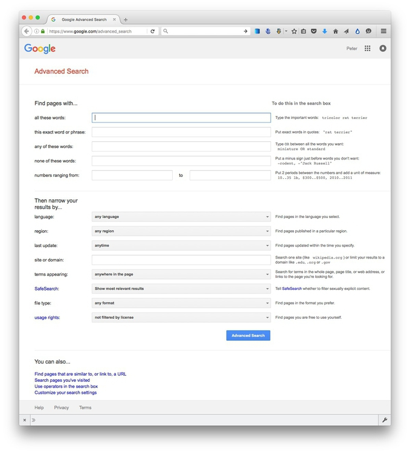
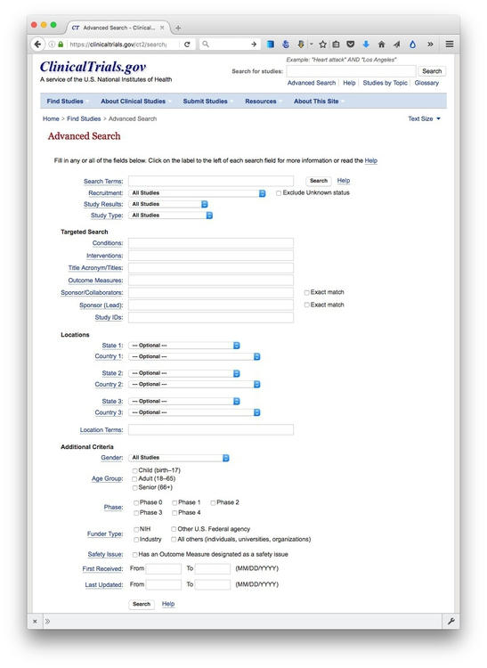
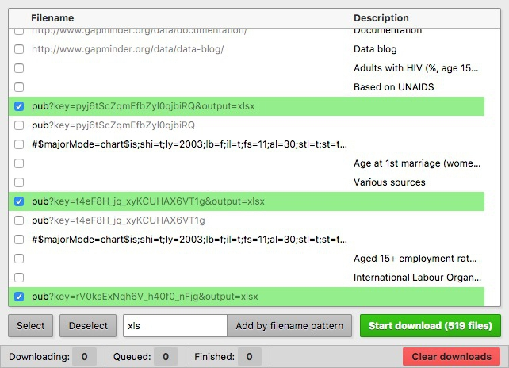
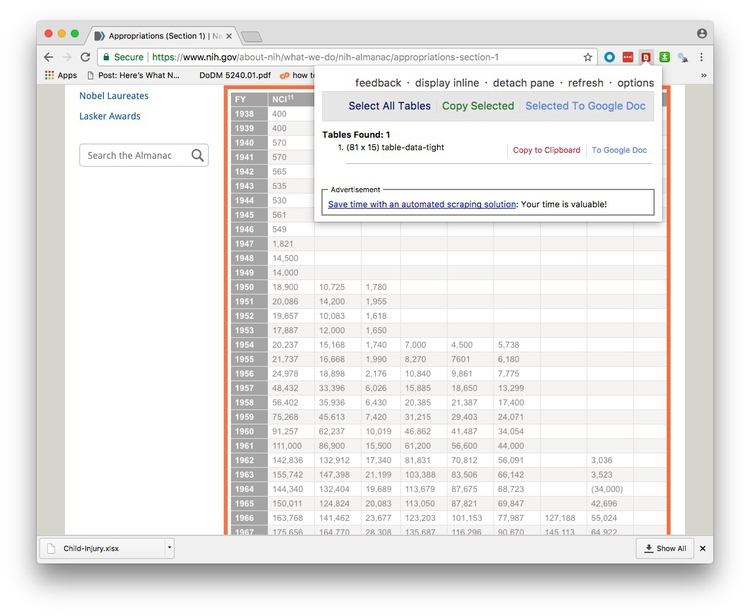
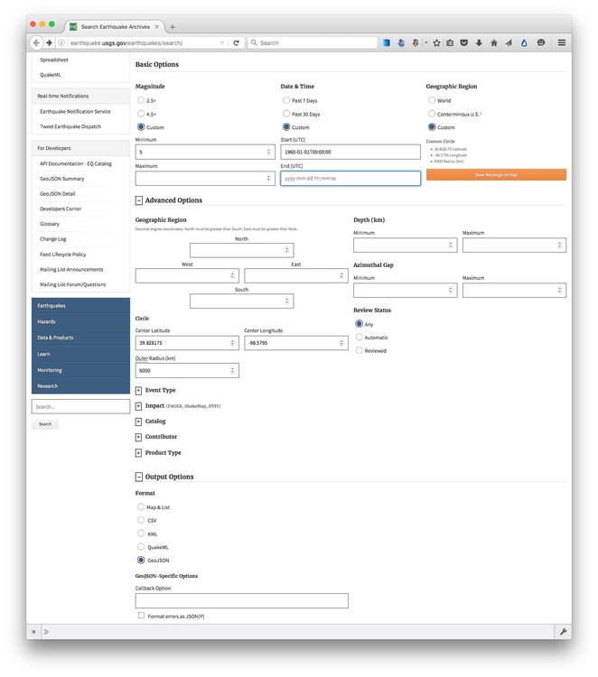

# Acquiring data

Not so many years ago, data was hard to obtain. Often journalists would have to painstakingly compile their own datasets from paper records. The Internet has changed the game. Today, many government and other public databases can now be queried online, and the results of those searches downloaded. Other datasets can be downloaded in their entirety.

The main problem today is usually not finding relevant data, but in working out whether it can be trusted, spotting and correcting errors and inconsistencies, and getting it in the right format for analysis and visualization.

In this class, we will cover some tips and tricks for finding the data you need online, and getting it onto your computer. We will also review some common data formats, and learn how to convert from one to another.

### Understand common data formats

**[CSV](http://en.wikipedia.org/wiki/Comma-separated_values)** is just one variant of a "delimited" text file, in which the fields or columns in a table of data are separated by commas (hence comma-separated values, or CSV) or another character such as a tab. You may also encounter "fixed width" text files, in which the fields are lined up, with each located a specified number of characters across each row. Spreadsheets such as Libre Office Calc or Microsoft Excel can import fixed-width files, which you can then export in a delimited format for use in other software.

Text files are great for transferring data from one software application to another during analysis and visualisation, but other formats that are easier for machines to read are typically used when transferring data between computers online.

**[JSON](http://json.org/)**, or JavaScript Object Notation, treats data as a series of “objects,” which begin and end with curly brackets. Each object in turn contains a series of name-value pairs. There is a colon between the name and value in each pair, and the pairs separated by commas.

Here, for example, are the first few rows of a simple dataset relating to a controversial theory claiming that the extent to which a country has developed a democratic political system is driven largely by the historical prevalence of infectious disease:

```json
[{"country":"Bahrain","income_group":"High income: non-OECD","democ_score":45.6,"infect_rate":23},
{"country":"Bahamas, The","income_group":"High income: non-OECD","democ_score":48.4,"infect_rate":24},
{"country":"Qatar","income_group":"High income: non-OECD","democ_score":50.4,"infect_rate":24},
{"country":"Latvia","income_group":"High income: non-OECD","democ_score":52.8,"infect_rate":25},
{"country":"Barbados","income_group":"High income: non-OECD","democ_score":46,"infect_rate":26}]
```

**[XML](http://www.w3.org/XML/)**, or Extensible Markup Language, is another format often used to move data around online. For example, the RSS feeds through which you can subscribe to content from blogs and websites using a reader such as [Feedly](https://feedly.com/) are formatted in XML.

In XML data is structured by enclosing values within “tags,” similar to those used to code different elements on a web page in HTML. Here is that same data in XML format:

```xml
<?xml version="1.0" encoding="UTF-8"?>
<rows>
  <row country="Bahrain" income_group="High income: non-OECD" democ_score="45.6" infect_rate="23" ></row>
  <row country="Bahamas, The" income_group="High income: non-OECD" democ_score="48.4" infect_rate="24" ></row>
  <row country="Qatar" income_group="High income: non-OECD" democ_score="50.4" infect_rate="24" ></row>
  <row country="Latvia" income_group="High income: non-OECD" democ_score="52.8" infect_rate="25" ></row>
  <row country="Barbados" income_group="High income: non-OECD" democ_score="46" infect_rate="26" ></row>
</rows>
```

### Data portals

Life is much easier if you can find everything you need in one place. The main effort to centralize access to data by the U.S. federal government is [Data.gov](https://www.data.gov/). You can search for data from the home page, or follow the [Data](https://catalog.data.gov/dataset) and Topics links from the top menu.

Be warned, however, that Data.gov is a work in progress, and does not contain all of the U.S. government’s data. Some of the most useful datasets are still only available on the websites of individual federal agencies. The Federal Committee on Statistical Methodology has [links to agencies](https://nces.ed.gov/FCSM/related_agencies.asp) with with some the most important data collections.

It is worth familiarizing yourself with the main government agencies that have responsibility for the beats you are interested in, and the datasets they maintain.

Other data portals at various levels of government are emerging. The City and County of San Francisco, for example, was at the forefront of the Open Data movement, establishing [DataSF](https://data.sfgov.org/) in 2009.

If you need to make comparisons between nations, the [**World Bank**](https://www.worldbank.org/) probably has what you need. Its [World Development Indicators catalog](https://data.worldbank.org/indicator/?tab=all) containing data for more than 7,000 different measures, compiled by the bank and other UN agencies.

You can navigate the site using the search box or using the topics links to the right. When you click on a particular indicator, you are sent to a page that gives options to download the dataset from a link near the top right of the page. The data in some cases goes back as far as 1960, and is listed both by individual country and summarized by regions and income groups.

Other useful sources of data for international comparisons are [**Gapminder**](https://www.gapminder.org/data/) and the **[UN Statistical Division](https://unstats.un.org/home/)**. For health data in particular, try the **[Organisation for Economic Co-operation and Development](https://www.oecd.org/els/health-systems/health-data.htm)** and the **[World Health Organization](https://www.who.int/gho/en/)**.

### Search for data on the web

Often, your starting point in searching for data and documents will be Google. It can be worth focusing your queries using Google’s [advanced search](https://www.google.com/advanced_search):



(Source: [Google](https://www.google.com/advanced_search))

The options to search by `site or domain` and `file type` can be especially useful when looking for data. For example, the [U.S. Geological Survey](https://www.usgs.gov/) is the best source of data on earthquakes and seismic risk, so when searching for this information, specifying the domain `usgs.gov` would be a good idea. You can make the domains as narrow or broad as you like: `.edu`, for instance, would search the sites of all US academic institutions using that top-level domain; `ucsc.edu` would search the web pages of this university only.

The file type search offers a drop-down menu, with the options including Excel spreadsheets, and Google Earth `KML` and `KMZ` files. These are common data formats, but you are not limited to those on the menu. In a regular Google search, type a space after your search terms followed by `filetype:xxx`, where `xxx` is the suffix for the file type in question. For example, `dbf` will look for database tables in this format. Combining file type and domain searches can be a good way to find data an agency has posted online -- some of which may not otherwise be readily accessible.

Searching for PDFs and `PPT` presentations can be a good way to find documents that may not otherwise be easy to find.

Google has also recently launched [Dataset Search](https://toolbox.google.com/datasetsearch), which aims to simplify the process of finding high-quality datasets, published in standard formats.

One common data format doesn’t show up file type searches. Geographical data is often made available as “shapefiles.” Because they consist of multiple files that are usually stored in compressed folders, shapefiles can’t readily be searched using a file type suffix, but they can usually be found by adding the terms “shapefile” or “GIS data” to a regular Google search.

### Search online databases

Many important public databases can be searched online, and some offer options to download the results of your queries. Most of these databases give a simple search box, but it’s always worth looking for the advanced search page, which will offer more options to customize your search. Here, for example, is the [advanced search](https://clinicaltrials.gov/ct2/search/advanced) page for [ClinicalTrials.gov](https://clinicaltrials.gov/):



(Source: [ClinicalTrials.gov](https://clinicaltrials.gov/ct2/search/advanced))

When you start working with a new online database, take some time to familiarize yourself with how its searches work: Read the Help or FAQs, and then run test searches to see what results you obtain. [Here](https://clinicaltrials.gov/ct2/help/how-find/index), for example, is the "How To" section of ClinicalTrials.gov.

Many online databases can be searched using Boolean logic, using the operators `AND`, `OR` and `NOT` to link search terms together. So find out how a particular database uses Boolean logic -- and the default settings that it will use if you list search terms without any Boolean operators.

Putting search terms in quote marks often searches for a specific phrase. For example, searching for “heart attack” on ClinicalTrials.gov will give only give results in which those two words appear together; leaving out the quote marks will include any trial in which both words appear.

Also find out whether the database allows “wildcards,” symbols such as `*` or `%` that can be dropped into your search to obtain results with variations on a word or number.

### Look for download options -- and know when you are hitting the wall

Having run a search on an online database, you will usually want to download the results, so look for the download links or buttons.

A common problem with online databases, however, is that they may impose limits on the number of results that are returned on each search. And even when a search returns everything, there may be a limit on how many of those results can be downloaded to your own computer.

If broad searches on a database keep returning the same number of results, that is a sign that you are probably running up against a search limit, and any download will not contain the complete set of data that you are interested in. However, you may be able to work out ways of searching to obtain all of the data in chunks.

### Download the entire database

Downloading an entire database, where this is allowed, frees you from the often-limited options given on an online advanced search form: You can then upload the data into your own database software, and query it in any way that you want. We will learn how to do this next week.

So always look for ways to grab all of the data. One trick is to run a search on just the database’s wildcard character, or with the query boxes left blank. If you do the latter at ClinicalTrials.gov, for instance, your search will return all of the trials in the database, which can then be downloaded using the options at the bottom of the results page.

Other databases have an online search form, but also have a separate link from where data to be downloaded in its entirety, usually as a text file or series of text files. One example is Bioresearch Monitoring Information System, which lists doctors and other researchers involved in testing experimental drugs being considered for marketing approval by the Food and Drug Administration. It can be searched online [here](https://www.accessdata.fda.gov/scripts/cder/BMIS/index.cfm?fuseaction=Search.ShowAdvancedSearchForm), but can also be downloaded in full from [here](https://www.fda.gov/Drugs/InformationOnDrugs/ucm135162.htm).

Note that large text files are again often stored in compressed folders, so may be invisible to a Google search by file type.

### Automate downloads of multiple data files

Often data or documents don't reside in a single searchable database, but instead exist online as a series of separate files. In such cases, clicking on each link is tedious and time-consuming. But you can automate the process using the [Batch Link Downloader](https://chrome.google.com/webstore/detail/batch-link-downloader/aiahkbnnpafepcgnhhecilboebmmolnn?hl=en-US) Chrome extension.

To illustrate, go to [Gapminder's data catalog](https://www.gapminder.org/data/), and select `All` indicators. The webpage now includes links to more than 500 downloadable spreadsheets.

Create a folder called `gapminder` on your desktop to hold the downloaded files.

Now temporaily change your download destination in Chrome so that the files are saved into this folder.

Select `Chrome>Preferences` from its top menu, then click the hamburger menu at top left:


Open up the `Advanced` menu and select `Downloads`, then change to the location to your `gapminder` folder.

The Batch Link Downloader downloads the target of any link on a web page. If it's a link to an image it will download an image; if it's a link to another webpage it will download that webpage; if it's a link to a data file such as a CSV file, it will download the file.

Now, back on the Gapminder data page, hover over some of the spreadsheet download icons, and see that the links all end with: `&Output=xlsx`. This is because they are the links to export Excel spreadhseets from the Google Sheets in which the data is stored.

Now click the Batch Link Downloaded icon:


Enter `xlsx` into the text box, click the `Add by filename pattern` button and all of the spreadsheets should be selected for download:



(If you were downloading CSV files, you would enter `.csv` into the text box, and so on.)

Click `Start download` and all the files should download into the target folder.

Once finished, make sure to switch you download location back, using Chrome Preferences as before!

### Extract data from tables on the web

On other occasions, data may exist in tables on the web. Copying and pasting data from web tables can be tricky, but the [Table Capture](https://chrome.google.com/webstore/detail/table-capture/iebpjdmgckacbodjpijphcplhebcmeop?hl=en) Chrome extension simplifies the process.

To illustrate what Table Capture does, go to [this table](https://www.nih.gov/about-nih/what-we-do/nih-almanac/appropriations-section-1) showing the budget history for components of the National Institutes of Health.

Click on the Table Capture icon:


Now you can click on the table found in the pop-up menu and then click one of the two icons to copy it to your clipboard to paste into a blank file (spreadsheet or text file) or stright into a Google Sheet respectively. (If pasting into a text file, the delimeters between the columns with be tabs.)



This table is in two parts, so click on the `Section 2` link, and repeat the process to grab all the data.

### Manipulate urls to expose the data you need

As you search for data using web query forms, make a habit of looking at what happens to the url. Often it will contain patterns detailing the search you have run, and it will be possible to alter the data provided by manipulating the url. This can be quicker than filling in search forms. In some cases it may even reveal more data than default search options will allow.

To illustrate how this works, go to the [ISRCTN clinical tral registry](https://www.isrctn.com/), and then navigate to the [advanced search page](https://www.isrctn.com/editAdvancedSearch). Enter `cancer` under `Condition` and note that more than 2,000 trials are returned.

The url should now have changed to the following:

```Javascript
http://www.isrctn.com/search?q=&filters=condition%3Acancer&searchType=advanced-search
```
Notice that the default is to display 10 results per page, and then change the view to see the maximum of 100 trials allowed by the dropdown menu. The url should now read:

```Javascript
http://www.isrctn.com/search?pageSize=100&sort=&page=1&q=&filters=condition%3Acancer&searchType=advanced-search
```
Now change that url to:

```Javascript
http://www.isrctn.com/search?pageSize=2500&sort=&page=1&q=&filters=condition%3Acancer&searchType=advanced-search
```
Having done so, all of the registered clinical trials involving cancer should now be displayed on a single page. We could now use Batch Link Download to download all of the individual web pages describing each of these trials, or we could use this url as the starting point to scrape data from each of those pages.

### Use application programming interfaces (APIs)

Websites like the ISRCTN clinical trial registry are not expressly designed to be searched by manipulating their urls, but some organizations make their data available through APIs that can be queried by constructing a url in a similar way. This allows websites and apps to call in specific chunks of data as required, and work with it "on the fly."

To see how this works, go to the U.S. Geological Survey's [Search Earthquake Archives](https://earthquake.usgs.gov/earthquakes/search/) page, where we will search for all earthquakes with a [magnitude](https://www.geo.mtu.edu/UPSeis/magnitude.html) of 5 or greater that occured witin 6,000 kilometers of the geographic center of the contiguous United States, which [this site](https://tools.wmflabs.org/geohack/geohack.php?pagename=Geographic_center_of_the_contiguous_United_States&params=39.828175_N_98.579500_W_region:US_type:landmark) tells us lies at a latitude of `39.828175` degrees and a longitude of `-98.5795` degrees. We will initially ask for the data in a format called [GeoJSON](https://geojson.org/) (a variant of JSON, a common format used to trasmit data over the web). Enter `1960-01-01T00:00:00` under `Start` for `Date & Time` boxes so that we obtain all recorded earthquakes from the beginning of 1960 onward. The search form should look like this:



(Source: [U.S. Geological Survey](https://earthquake.usgs.gov/earthquakes/search/))

You should recieve a quantity of data at the following url:

```Javascript
https://earthquake.usgs.gov/fdsnws/event/1/query?starttime=1960-01-01T00:00:00&latitude=39.828175&longitude=-98.5795&maxradiuskm=6000&minmagnitude=5&format=geojson&orderby=time
```
Now replace `geojson` in the url with `csv`. The data should now download in CSV format.

[Here](https://earthquake.usgs.gov/fdsnws/event/1/) is the full documentation for querying the earthquake API by manipulating these urls.

Now replace `geojson` in the url with `csv`. The data should now download in CSV format.

### Scrape data from the web

Sometimes you will need to compile your own data from information that is spread across a series of webpages, or maintained in a database that doesn't allow simple downloads of the data or API access. This is where web scraping comes in.

Using programming languages such as [R](https://www.r-project.org/) or [Python](https://www.python.org/), it is possible to write scripts that will pull data down from many webpages, or query web search forms to download an entire database piece by piece.

Web scraping by coding is beyond the scope of this class. However, the underlying process is simple to understand: Identify the patterns you would need to follow if collecting the data manually, then write a program to automate the process and write the results to a data file. That often means experimenting to reveal the most efficient way of exposing all of the data you require.

We have already been performing some of the elements of web scraping, by manipulating urls on web search forms and downloading the individual links *en masse*.

If you need to scrape data for a your visualization project, I should be able to help.

### PDFs: The bane of data journalism

Some organizations persist in making data available as PDFs, rather than text files, spreadsheets or databases. This makes the data hard to extract. While you should always ask for data in a more friendly format -- ideally a CSV or other simple text file -- you are at some point likely to find yourself needing to pull data out of a PDF.

**[Tabula](https://tabula.technology/)** can extract data from tables in digital PDFS. (To determine if you have a digital PDF, see if you can highlight individual cells within a table. If so, your PDF if digital; if the entire page is highlighted, it is a scanned image, and Tabula will not work.)

Also useful is the online service **[Cometdocs](http://www.cometdocs.com/)**. While it is a commercial tool, members of Investigative Reporters and Editors can [obtain a free account](http://ire.org/blog/ire-news/2013/05/22/ire-announces-partnership-cometdocs/). Cometdocs can read scanned PDFs, however its accuracy will vary depending on how well the OCR works on the document in question.

**[Adobe Acrobat Pro](https://acrobat.adobe.com/us/en/products/acrobat-pro.html)** will also perform OCR on scanned PDFs.

In my experience, the most accurate OCR tool is [**Abbyy FineReader**](https://www.abbyy.com/en-us/finereader/). However, it currently costs around $120.

[Here](https://github.com/jsfenfen/parsing-prickly-pdfs) is a useful set of resources detailing more advanced tools for dealing with hard-to-parse PDFs.

### Further reading/resources

Paul Bradshaw. *[Scraping For Journalists](https://leanpub.com/scrapingforjournalists)*


