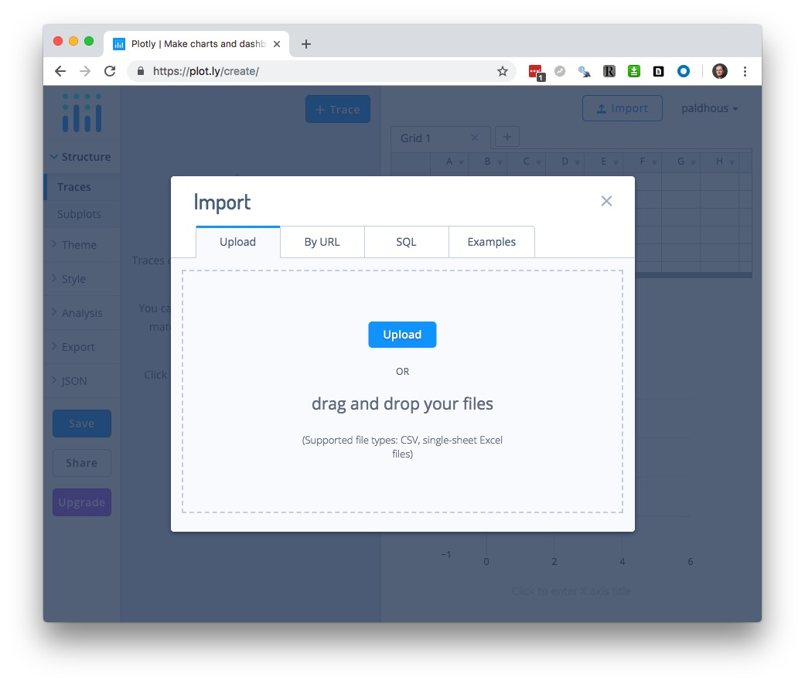
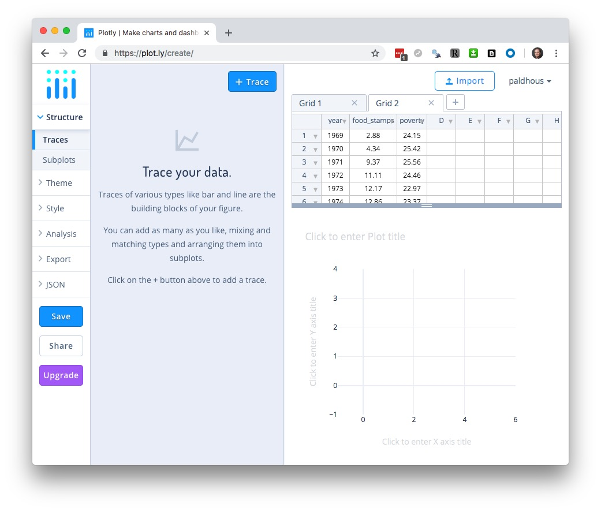
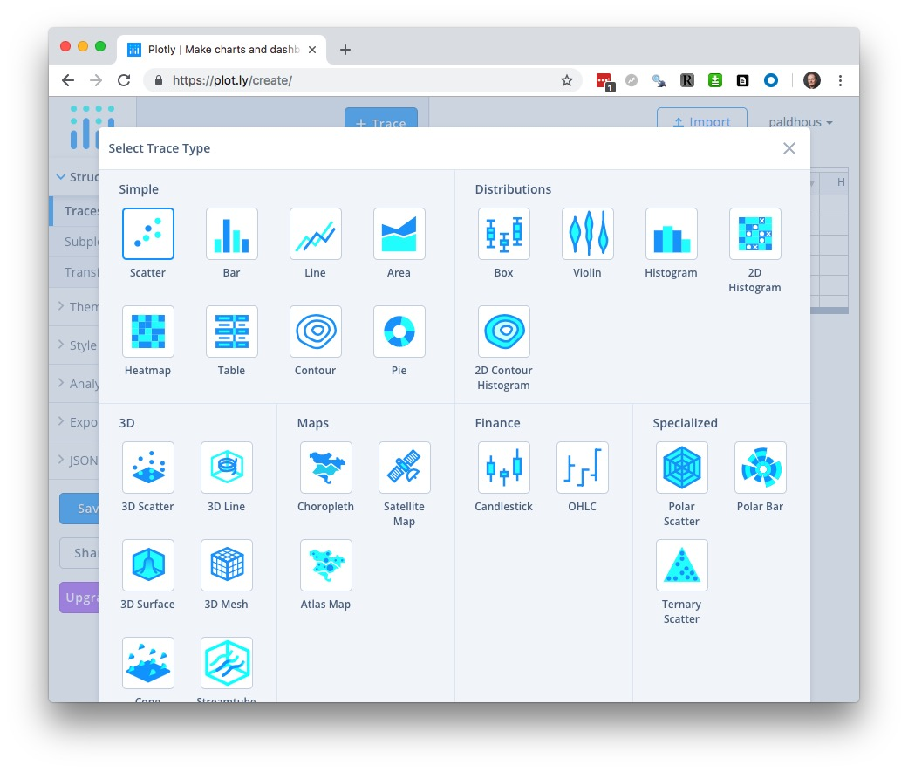
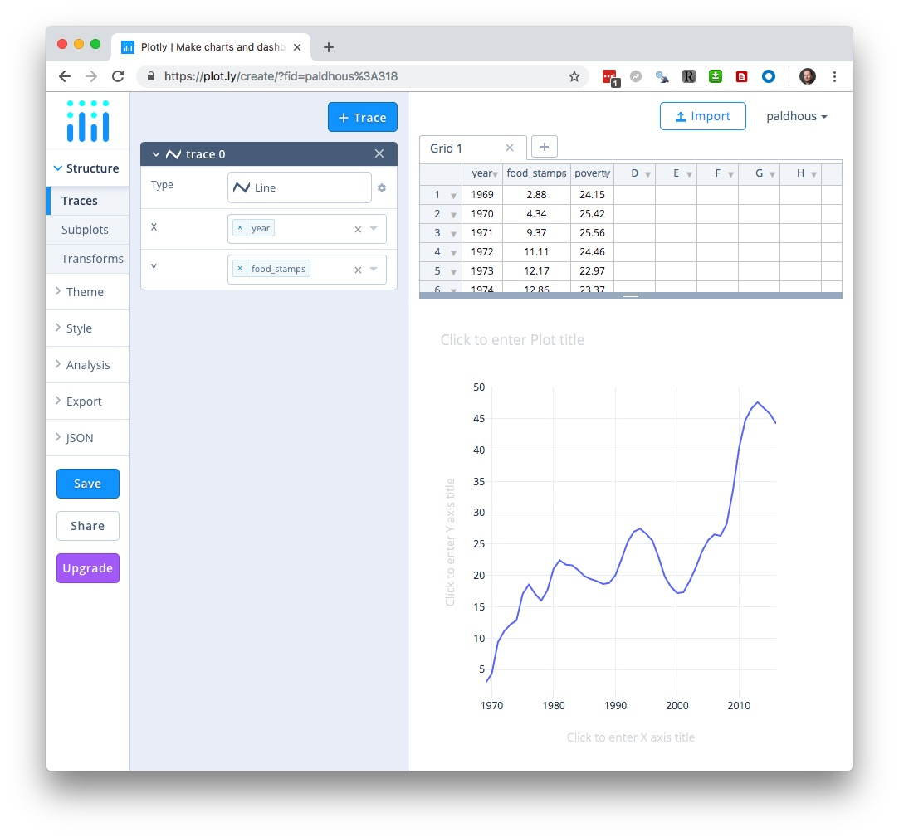
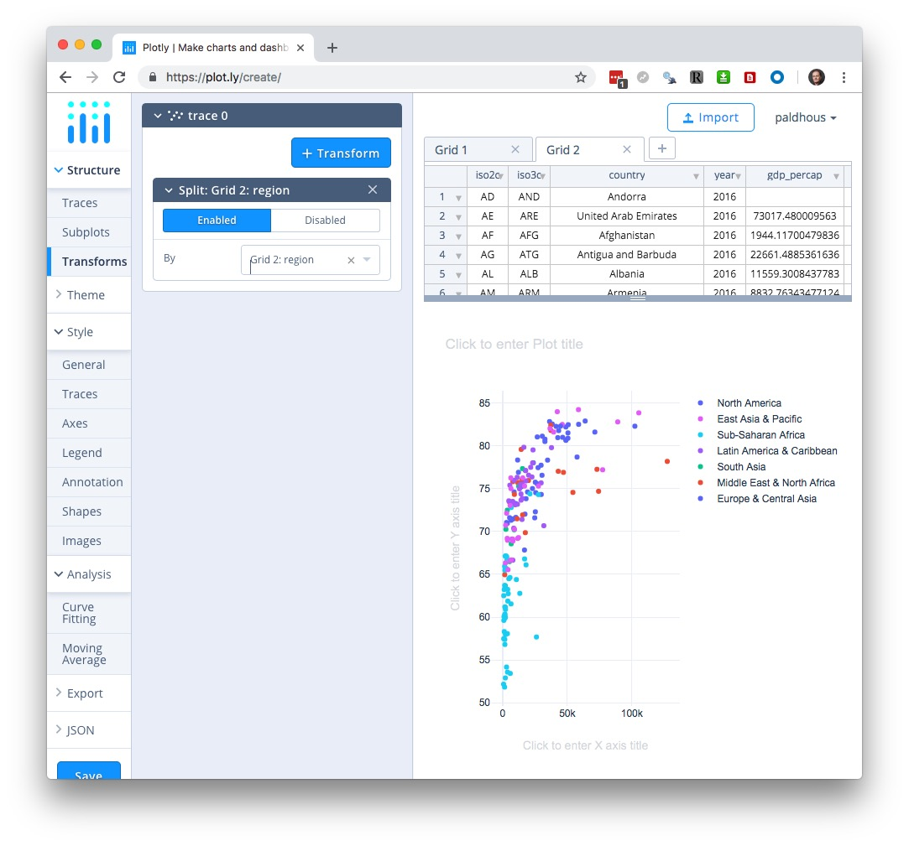

# Basic charts with Plotly

### Introducing Plotly

In today's class we will make a series of simple charts using [**Plotly**](https://plot.ly/), a web application that allows you to upload data and use a point-and-click interface to make online charts, with tooltips and other interactivity. These can be embedded in your web projects, or exported as static images.

Log in to Plotly by clicking the button at top right:


### The data we will use today

Download the data for this session from [here](data/basic-charts.zip), unzip the folder and place it on your desktop. It contains the following files:

- `food_stamps.csv` Contains the following variables:
 - `year` From 1969 to 2016.
 - `food_stamps` Average number of people participating in the Supplemental Nutrition Assistance Program, in millions, from the [US Department of Agriculture](https://www.fns.usda.gov/pd/supplemental-nutrition-assistance-program-snap).
 - `poverty` Estimated number of people in poverty, in millions, from the [US Census Bureau](https://census.gov/content/dam/Census/library/publications/2017/demo/P60-259.pdf).

- `nations_2015.csv` Data from the [World Bank Indicators](http://data.worldbank.org/indicator/all) portal, which is an incredibly rich resource. Contains the following fields:
 -  `iso2c` `iso3c` Two- and three-letter [codes](http://www.nationsonline.org/oneworld/country_code_list.htm) for each country, assigned by the [International Organization for Standardization](http://www.iso.org/iso/home/store/catalogue_tc/catalogue_detail.htm?csnumber=63545).
 - `country` Country name.
 - `year` 2015 for this data.
 - `gdp_percap` [Gross Domestic Product per capita](http://data.worldbank.org/indicator/NY.GDP.PCAP.PP.CD) in current international dollars, corrected for purchasing power in different territories.
 - `life_expect` [Life expectancy at birth](http://data.worldbank.org/indicator/SP.DYN.LE00.IN), in years.
 - `population` Estimated [total population](http://data.worldbank.org/indicator/SP.POP.TOTL) at mid-year, including all residents apart from refugees.
 - `region` `income` World Bank [regions and income groups](http://siteresources.worldbank.org/DATASTATISTICS/Resources/CLASS.XLS), explained [here](http://data.worldbank.org/about/country-and-lending-groups).

- `ca_vacc_counties.csv` Data from the [California Department of Public Health](http://www.shotsforschool.org/k-12/reporting-data/) on immunization in kindergartens, summarized at the county level, for the intake years 2001 to 2015. Contains the following fields:
 - `county`
 - `start_year` Intake year.
 - `enrolled` Number of children enrolled.
 - `complete` Number of children with complete vaccinations.
 - `pc_incomplete` Percentage of children without complete vaccinations.

- `test.html` A web page for embedding online charts. It has been set up using [Bootstrap](https://getbootstrap.com/) responsive web design framework so that any content will automatically adjust to the size of the browser window in which it is viewed, centered on the page.

### Make a bar chart showing number of people on food stamps over time

Having logged in to Plotly, click on the `WORKSPACE` link on the top navigation menu to see the following screen:


The `Grid` table shows the data to be visualized, so first import the file `food_stamps.csv` by clicking the `Import` buttom at top right. This will open the following dialog box:


In the `Upload` tab, click the `Upload` button and navigate to the folder containing the file, or drag the file onto the dialog box.

Your workspace should now look like this, with the imported data in a new `Grid`:



The first step in making a chart is to choose the `Chart type`. The default is a `Scatter plot`, but if you click on that box, you will see the other possibilities:



Select `Bar chart` and map `food_stamps` onto the Y axis and `year` onto the `X` to create the default chart:



`Hover Text` allows you to select an additional variable to appear in the tooltips. Leave this blank for this chart.

So far we have been working in the `Graph` section of the main left-hand menu, under `Create`. This also contains options to `Filter` a larger dataset or summarize or `Aggregate` the data; however, in general I would recommend filtering and summarizing your data before importing to Plotly. We will use `Group` in a subsequent chart to assign a qualitative color palette to a categorical variable.

Having made a basic chart, you can customize it by opening up the options in the `Style` section of the menu.

`Traces` contains options for customizing the main visual features of the chart. The available options depend on the chart type. Common options include  customizing color and opacity. For bar charts can also change bar widths and the padding around them. We will simply chage the default blue `Fill` to a bright red, using the HEX value `#FF0000`:


`Layout` contains an option to change the size of the chart. I recommend keeping it set to `Auto`, as this allows the chart to be responsive, altering its size to fit the available space when embedded into a web page. This section also allows you to add a plot title, and to customize the font faces and size. If you don't wish your chart to have tooltips, switch them off under `Hover Interaction`.

`Notes` allows you to annotate the chart in various ways. Click the `+ Annotation` button to see the options. You can add subtitles or captions, or label individual data points; `Automatically Positioned Labels` will label data points with their values.

Add a `Source to data`, which is USDA (you can also provide a hyperlink to the data source, which is: `https://www.fns.usda.gov/pd/supplemental-nutrition-assistance-program-snap`), and position it at `-30%` relative to the `Canvas`.


`Axes` contains options for customizing the `X` and `Y` axes. It contains options to set the `Range` of each axis, to show or hide grid and zero lines under `Lines`, and to customize `Tick Labels` and `Tick Markers`. `Range Slider` adds a control to adjust the range shown on the X axis, which can be useful to zoom in on the details for very long time series. Plotly charts by default can be zoomed in and out, but I would recommend disabling this for both axes. You will usually want to adjust the axis `Titles`; delete the `X` axis title, and edit the Y axis title to `Participants (millions)`.


`Legend` allows you to customize the legend for charts that need them, superfluous here.

`Shapes` provides options to add reference lines or bands to your chart; use in combination with `Notes` as required for chart annotation. (If you need to add a trend line to a scatter plot, use `Curve fitting` under `Analysis`.)

`Images` allows you to add images, such as an organization's logo, to a chart.

`Mobile` contains options to create Mobile-friendly versions of your chart.

Having finished customizing your chart, hit the `Save` button, then save both `Plot` and `Grid` as `Public`:


### Export and share the chart

Having saved your chart, select `Export` to save it as a PNG image, setting the desired height and width in pixels:


Click `Download` to save the PNG image file to you computer. (Saving in PDF, SVG, and EPS formats, which will give a graphic that can edited in a vector graphics editor such as [Adobe Illustrator](https://www.adobe.com/products/illustrator.html), is possible only with a paid account.)

For a simple embed, click the `Share` button and switch to the `Embed` tab to obtain an [**iframe**](https://www.w3schools.com/html/html_iframe.asp) code:


Copy the embed code, then open the `test.html` file in [Sublime Text](https://www.sublimetext.com/). Insert the code into the page and edit as follows:

```Javascript
  <div class="container">

    <iframe width="100%" height="450" frameborder="0" scrolling="no" src="https://plot.ly/~paldhous/307.embed"></iframe>

  </div> <!-- /.container -->
```
An iframe allows you to embed one web page, here dislplaying your chart on Plotly's servers, into another. Set its height in pixels, and its width as `100%`. This will allow the chart width to adjust for different browser window sizes. You may also need to insert `https:` at the start of the web address.

A `div` is a distinct section of a webpage. Insert the iframe into the div with the class `container`. This is a feature of Bootstrap that will center the embed on you page, optimized for different browser window sizes.

Save the page and open it in your web browser:


A default Plotly embed contains an `EDIT CHART` link, allowing other users to edit the chart using their own Plotly account. When you hover over the chart, various controls appear at top right.

To obtain an embed without these features, which I would recommend, select `Export` once more, switch to the `HTML` tab, and `Download as Html file`:


Place the downloaded file in your working folder for this class and rename it as `food-stamps-bar.html`. Open in Sublime Text, scroll to the bottom of the file, and edit as follows:

**Before:**

```Javascript
 config: {"mapboxAccessToken": "pk.eyJ1IjoiY2hyaWRkeXAiLCJhIjoiY2lxMnVvdm5iMDA4dnhsbTQ5aHJzcGs0MyJ9.X9o_rzNLNesDxdra4neC_A", "linkText": "Export to plot.ly", "showLink": true}
```

**After:**
```Javascript
 config: {"mapboxAccessToken": "pk.eyJ1IjoiY2hyaWRkeXAiLCJhIjoiY2lxMnVvdm5iMDA4dnhsbTQ5aHJzcGs0MyJ9.X9o_rzNLNesDxdra4neC_A", "linkText": "Export to plot.ly", "showLink": false, "displayModeBar": false}
```
Now open `test.html` once more and edit the iframe to embed the downloaded web page:

```Javascript
  <div class="container">

    <iframe width="100%" height="450" frameborder="0" scrolling="no" src="food-stamps-bar.html"></iframe>

  </div> <!-- /.container -->
```
You should now have the following clean embed:

<iframe width="100%" height="450" frameborder="0" scrolling="no" src="food-stamps-bar.html"></iframe>


### Make a dot-and-line chart comparing number of people in poverty with number on food stamps over time

Click your browswer's back arrow to return to your account's home page:


Now hover over the grid with the food stamps data, and click on the `EDIT` button to start making a new chart from the same data.

This time, select `Line plot` as the chart type, and  put `food_stamps` on the `Y` axis and `year` on the `X`:



Now click the `+ Trace` button to add a second line, and edit so that `poverty` is mapped to the `Y` axis.


In the same way, you can add multiple traces to a make a chart combining different chart types, for example a line chart with a bar chart.

Switch to `Traces` in the `Style` section, and add `Points` to `All Traces`. (With multiple traces, you can also use the `Individual` tab to customize them one at a time.) Once you add points to a line chart, Poltly should automatically adjust the `Y` axis to start at zero and add a zero line.

By default, Plotly has chosen a qualitative palette with two colors opposed on the color wheel; you can use the `Individual` tab to customize the color of each trace individually if you wish.

Switch to `Axes`, remove the Title for the `X` axis and edit the `Y` axis title to `People (millions)`:


Swtich to `Legend`, and adjust its `Positioning`, `Orientation` and `Trace Order` as desired. You can also directly edit the trace labels on the chart:


Add source information under `Notes`, save the chart and then export/share as before.

### Make a heat map showing the percentage of kindergarten children in California with incomplete immunizations over time, by county

Click your browswer's back arrow to return to your account's home page, then select `WORKSPACE` to open a new blank grid. Import the `ca_vacc_counties.csv` file:


Select `Heatmap` under `Chart Type` and map `start_year` to the `X` axis, `county` to the `Y`, and `pc_incomplete` to `Z`, for color. Then click `Flip Vertically` to put the counties in alphabetical order:


Switch to `Traces` in the `Style` section and adopt an informative sequential `Colorscale`:


Under `Axes`, remove both axis titles.

Under `Color Bars`, add a `Title` of `Incomplete vaccination`:


Then add a `Suffix` of `%` to the `Labels`:



Add source information under `Notes`, save the chart, and then export/share as before. For a heat map with this many rows, it will be necessary to make the height greater than for most other types of chart:


### Make a bubble chart showing the relationship between GDP per capita and life expectancy for the world's nations in 2015

Click your browswer's back arrow to return to your account's home page, then select `WORKSPACE` to open a new blank grid. Import the `nations_2015.csv` file:


Keep the default `Scatter plot` and map `gdp_percap` onto the `X` axis and `life_expect` onto the `Y`:


Now add `Country` to `Hover text`, so that the countries are identified in the tooltips, and map `population` onto `Size`. This will make the circles enormous, but we will fix that later:


We want to color the cirles by region, but do not use the `Color` option, which is for mapping color to a quantitative variable. Instead, under `Group`, click the `+ Group` button and group by `region`, which will apply a categorical color palette to the circles by region:


Switch to `Traces` in the `Style` section and reduce the `Maximum Marker Size` for an optimal appearance:


(Notice that Plotly by default correctly scales circles by `Area`.)

Under `Axes`, edit the axis titles, and to mimic the appearance of the chart we saw in the Gapminder video switch the `Axis Type` to `Log` for the `X` axis under `Range`. Also add a `Prefix` of `$` under `Tick Labels`:


Again, add source information under `Notes`, save the chart, and then export/share as before.


