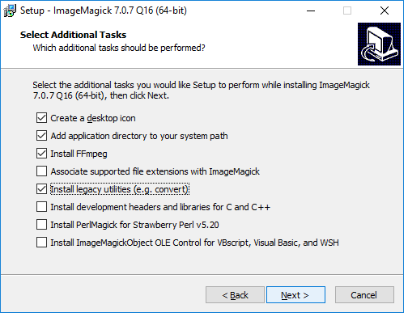

# Software and other tools

When you try to install some of the software below on the Mac, you may be warned that it comes from an unidentified developer. If this happens, right-click the installer file and select `Open`.


### [Chrome](https://www.google.com/chrome/)

Some of the tools we will use are Chrome extensions. Ensure that you have the latest version of this popular web browser. Download Chrome [from here](https://www.google.com/chrome/); if already installed, make sure you are updated to the latest version [following these instructions](https://support.google.com/chrome/answer/95414?co=GENIE.Platform%3DDesktop&hl=en).

### [Open Refine](http://openrefine.org/)
A powerful tool for data cleaning, once owned by Google, now open source. Download the latest version, 3.1, [from here](http://openrefine.org/download.html). When launched, Open Refine will work in your default web browser; note that your data remains on your computer, and is not uploaded to the web.

### [Google Sheets](https://www.google.com/sheets/about/)
Our spreadsheet application for these classes will be Google Sheets. Use from your [Google Drive ](https://drive.google.com/)account.

### [Plotly](https://plot.ly/online-chart-maker/)
A web app for making charts from data. Sign up for a free account [here](https://plot.ly/Auth/login/?action=signup#/).

### [R Studio Cloud](https://rstudio.cloud/)
R is a software environment and programming language for statistical computing, data analysis, and graphics. Think of it as a Swiss Army knife for working with data. RStudio is a user interface that makes it much easier to use. We will use [RStudio Cloud](https://rstudio.cloud/), so we are all working in exactly the same environment. You will receive an email to sign up.

If you continue to work in R after this class, you will probably want to install the software on your own machine. Download the latest R installer for your operating system from [here](https://cran.rstudio.com/), and download the latest **free** version of RStudio Desktop [from here](https://www.rstudio.com/products/rstudio/download/).

### [Sublime Text](https://www.sublimetext.com/)

For some exercises, you will need a text editor optimized for authoring web pages. Download from [here](https://www.sublimetext.com/).

### [ColorBrewer](http://colorbrewer2.org/)
Your go-to resource for color schemes to encode data. Web app: no installation required.

### [FFmpeg](https://ffmpeg.org/)

FFmpeg is a software library that records and converts audio and video.

Here are the steps for installation on the **Mac**:

 - Download and install **Xcode**.
  - If you have Mac OS 10.13.6 High Sierra or later, you should be able to download and install [from the App Store](https://itunes.apple.com/us/app/xcode/id497799835?ls=1&mt=12). 
  - If you have older versions of Mac OS, first sign up as an Apple Developer, [here](https://developer.apple.com/programs/enroll/). Then go [here](https://developer.apple.com/download/more/), and download and install the version of XCode for your device. [This table](https://en.wikipedia.org/wiki/Xcode#Version_comparison_table) shows XCode versions and the minimum Max OS needed to run them.
  - If you are unsure which version of the operating system you have, click the Apple symbol at the left of the top menu and select `About this Mac`.
  - You may need to launch **Xcode**  and agree to the terms of service.

 - Open a Terminal window (find under `Applications>Utilities`) and enter:
 ```R
xcode-select --install
 ```
 This will install Xcode's command line tools, which are required for [**MacPorts**](https://www.macports.org/), the installer we will use to install the two software libraries.
 - [Download and install](https://www.macports.org/install.php) the correct version of MacPorts for your Mac OS.

 - In the Terminal, enter:
  ```R
 sudo port install ffmpeg
 ```

On **Windows**, you should be able to install ImageMagick, a softawre library for manipulating images, and FFmpeg from [here](https://www.imagemagick.org/script/download.php#windows). Unless you have an old Windows 32-bit operating system, click on the HTTP download link to install the "Win64 dynamic at 16 bits-per-pixel component" version.

When you get to the dialog box, make sure that the boxes are checked as follows, to ensure that you also install FFmpeg and the legacy utilities:




