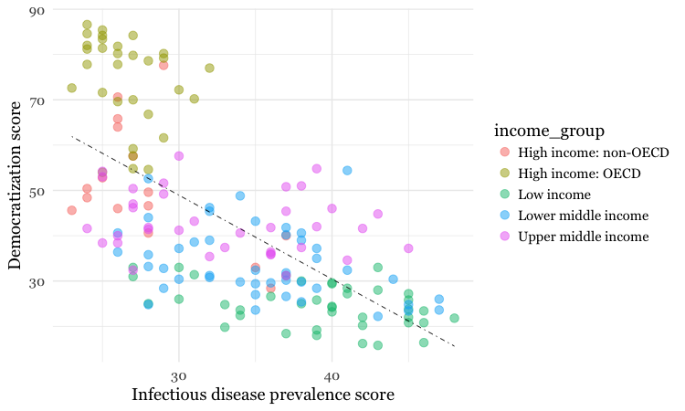

# Making static graphics with R

In today's class, we will begin to explore how R can be used to make graphics from data, making customized static graphics with the **[ggplot2](http://docs.ggplot2.org/current/)** package. This is part of the [tidyverse](https://www.tidyverse.org/), so you already have it installed from last week.

### The data we will use today

Download the data for this session from [here](data/static-charts-r.zip), unzip the folder and place it on your desktop. It contains the following files:

- `disease_democ.csv` Data illustrating a controversial theory suggesting that the emergence of democratic political systems has depended largely on nations having low rates of infectious disease, from the [Global Infectious Diseases and Epidemiology Network](http://www.gideononline.com/) and *[Democratization: A Comparative Analysis of 170 Countries](https://www.amazon.com/Democratization-Comparative-Analysis-Countries-Routledge/dp/0415318602)*, as used in week 1.
- `food_stamps.csv` [U.S. Department of Agriculture data](https://www.fns.usda.gov/pd/supplemental-nutrition-assistance-program-snap) on the number of `participants`, in millions, and `costs`, in $ billions, of the federal Supplemental Nutrition Assistance Program from 1969 to 2016.
- `kindergarten.csv` Data from the [California Department of Public Health](https://www.shotsforschool.org/k-12/reporting-data/), documenting enrollment and the number of children with complete immunizations at entry into kindergartens in California from 2001 to 2015. Contains the following variables:
  - `district` School district.
  - `sch_code` Unique identifying code for each school.
  - `pub_priv` Whether school is public or private.
  - `school` School name.
  - `enrollment` Number of children enrolled.
  - `complete` Number of children with complete immunizations.
  - `start_year` Year of entry (for the 2015-2016 school year, for example, this would be 2015).
- `nations.csv` Data from World Bank World Development Indicators portal, giving data on population, GDP per capita, life expectancy, birth rate, neonatal mortality rate, region and income group for the world's nations, from 1990 onwards, as used in the previous class.

### Setting up

Login to RStudio cloud and navigate to you project in the `UCSC` workspace. Upload the zipped folder with the data above, save an empty script as `static_charts.R` and your empty environment as `static_charts.RData`.

Your screen should now look like this:


### Introducing ggplot2 and the grammar of graphics

The "gg" in **ggplot2** stands for "[grammar of graphics](https://www.amazon.com/The-Grammar-Graphics-Statistics-Computing/dp/0387245448)," an approach to drawing charts devised by the statistician Leland Wilkinson. Rather than thinking in terms of finished charts like a scatter plot or a column chart, it starts by defining the coordinate system (usually the X and Y axes of a cartesian system), maps data onto those coordinates, and then adds layers such as points, bars and so on. This is the logic behind ggplot2 code.

#### Some **ggplot2** basics:

- `ggplot` This is the master function that creates a **ggplot2** chart.
- `aes` This function, named for "aesthetic mapping," is used whenever data values are mapped onto a chart. So it is used when you define which variables are plotted onto the X and Y axes, and also if you want to change the size or color of parts of the chart according to values for a variable.
- `geom` All of the functions that add layers to a chart start with `geom`, followed by an underscore, for example `geom_point` or `geom_bar`. The code in the parentheses for any `geom` layer styles the items in that layer, and can include `aes` mappings of values from data.
- `theme` This function modifies the appearance of elements of a plot, used, for example, to set size and font face for text, the position of a legend, and so on.
- `scale` Functions that begin with `scale`, followed by an underscore, are used to modify the way an `aes` mapping of data appears on a chart. They can change the axis range, for example, or specify a color palette to be used to encode values in the data.
- `+` is used each time you add a layer, a scale, a theme, or elements like axis labels and a title. After a `+` you can continue on the same line of code or move the next line. I usually write a new line after each `+`, which makes the code easier to follow.

### Make scatter plot from disease and democracy data

We'll start by making and modifying a scatter plot from the infections disease and democracy data.

#### Load required packages and the data

Open a new R script in RStudio, save the blank script to the folder with the data for this week, and then set your working directory to this location by selecting from the top menu `Session>Set Working Directory>To Source File Location`.

Now copy the following code into your script and run to load **readr**, **ggplot2**, and then load the disease and democracy data:

```r
# load required packages
library(ggplot2)
library(readr)

# load disease and democracy data
disease_democ <- read_csv("disease_democ.csv")
```

#### Map variables in the data onto the X and Y axes

Copy this code into your R script and run:

```r
# map values in data to X and Y axes
ggplot(disease_democ, aes(x = infect_rate, y = democ_score))
```

The code within the parentheses for the `ggplot` function defines the data frame to be used, followed by the `aes` mapping of variables in the data to the chart's X and Y axes.

The following chart should appear in the `Plots` panel at bottom right:


The axis ranges are automatically set to values in the data, but at this point there is just a blank chart grid, because we haven't added any `geom` layers to the chart.


#### Change the axis labels

By default, the axis labels will be the names of the variables in the data. But it's easy to customize, using the following code:

```r
# customize axis labels
ggplot(disease_democ, aes(x = infect_rate, y = democ_score)) +
  xlab("Infectious disease prevalence score") +
  ylab("Democratization score")
```


#### Change the theme

The default gray theme of **ggplot2** has a rather academic look. See [here](https://ggplot2.tidyverse.org/reference/theme.html) and [here](https://ggplot2.tidyverse.org/reference/#section-themes) for how to use the `theme` option to customize individual elements of a chart. However, for my charts, I typically use one of the **ggplot2** [built-in themes](https://ggplot2.tidyverse.org/reference/ggtheme.html), and then customize the fonts.

```r
# Change the theme
ggplot(disease_democ, aes(x = infect_rate, y = democ_score)) +
  xlab("Infectious disease prevalence score") + 
  ylab("Democratization score") +
  theme_minimal(base_size = 14, base_family = "Georgia")
```


Notice how the `base_family` and `base_size` can be used with a built-in theme to change font face and size.

#### Save the basic chart template

You can save a **ggplot2** chart as an object in your environment using the `<-` assignment operator. So we'll do that here to save the basic template, with no `geom` layers.

```r
# save chart template, and plot
disease_democ_chart <- ggplot(disease_democ, aes(x = infect_rate, y = democ_score)) +
  xlab("Infectious disease prevalence score") + 
  ylab("Democratization score") +
  theme_minimal(base_size = 14, base_family = "Georgia")
```

There should now be an object of type `gg` in your Environment called `disease_democ_chart`.

The `plot` function will plot a saved **ggplot2** object.

```r
# plot saved chart template
plot(disease_democ_chart)
```

#### Add a layer with points

This code will add a `geom` layer with points to the template:

```r
# add a layer with points
disease_democ_chart +
  geom_point()
```


This is exactly the same as running all the code saved in the `gg` object with the new line.

```r
# themed scatterplot
ggplot(disease_democ, aes(x = infect_rate, y = democ_score)) +
  xlab("Infectious disease prevalence score") + 
  ylab("Democratization score") +
  theme_minimal(base_size = 14, base_family = "Georgia") +
  geom_point()
```

#### Add a layer with a smoothed trend line, fitted to the data

```r
# add a trend line
disease_democ_chart +
  geom_point() +
  geom_smooth()
```


By default, the `geom_smooth` function plots a curve through the data using a method called [locally-weighted scatterplot smoothing](https://en.wikipedia.org/wiki/Local_regression), and adds a ribbon giving the standard error, a measure of uncertainty around the line of best fit through the data.

#### Customize the two layers we've added to the chart

The following code modifies the two `geom` layers to change their appearance.

```r
# customize the two geom layers
disease_democ_chart +
  geom_point(size = 3, alpha = 0.5) +
  geom_smooth(method = lm, se = FALSE, color = "red")
```


In the `geom_point` layer, we have increased the size of each point, and reduced its transparency using `alpha`.

In the `geom_smooth` function, we have changed the `color` of the line, removed the ribbon showing the `se` or standard error, and changed the `method` used to fit the data to a linear regression, or linear model (`lm`).

When setting colors in **ggplot2** you can use their [R color names](https://www.stat.columbia.edu/~tzheng/files/Rcolor.pdf), or their HEX values. This code will produce the same result:

```r
# customize the two geom layers
disease_democ_chart +
  geom_point(size = 3, alpha = 0.5) +
  geom_smooth(method = lm, se=FALSE, color = "#FF0000")
```

Until you are familiar with the options for each `geom`, you will need to look up how to change the appearance of each layer: Follow the links for each `geom` from [here](https://ggplot2.tidyverse.org/reference/#section-layer-geoms).

The following code customizes the trend line further, and includes an `aes` mapping to set the color of the points to that they reflect the categorical variable of World Bank income group.

```r
# customize again, coloring the points by income group
disease_democ_chart +
  geom_point(size = 3, alpha = 0.5, aes(color = income_group)) +
  geom_smooth(method = lm, se = FALSE, color = "black", linetype = "dotdash", size = 0.3)
```


Notice how the `aes` function colors the points by values in the data, rather than setting them to a single color. **ggplot2** recognizes that `income_group` is a categorical variable, and uses its default qualitative color palette.

Now run this code, to see the different effect of setting the `aes` color mapping for the *entire chart*, rather than just one `geom` layer.

```r
# color the entire chart by income group
ggplot(disease_democ, aes(x = infect_rate, y = democ_score, color=income_group)) +
  xlab("Infectious disease prevalence score") + 
  ylab("Democratization score") +
  theme_minimal(base_size = 14, base_family = "Georgia") + 
  geom_point(size = 3, alpha = 0.5) +
  geom_smooth(method=lm, se=FALSE, linetype= "dotdash", size = 0.3)
```


Because here we mapped the variable `income group` to color for the whole chart, and not just the points, it also affects the `geom_smooth` layer, so a separate trend line, colored the same as the points, is calculated for each `income_group`.

#### Set the axis ranges, and use a different color palette

Now let's return to the mapping the colors for income group just for the points, and customize further.

```r
# more customization
disease_democ_chart +
  geom_point(size = 3, alpha = 0.5, aes(color = income_group)) +
  geom_smooth(method = lm, se = FALSE, color = "black", linetype = "dotdash", size = 0.3) +
  scale_x_continuous(limits=c(0,60)) +
  scale_y_continuous(limits=c(0,100)) +
  scale_color_brewer(palette = "Set1",
                     name="Income group",
                     breaks=c("High income: OECD","High income: non-OECD","Upper middle income","Lower middle income","Low income"))
```


Notice how the first two `scale` functions are used to set the ranges for the axis, which are entered as a list, using the `c` function we saw last week.

We also applied a [ColorBrewer](http://colorbrewer2.org) qualitative palette using the `scale_color_brewer` function, and naming the desired `palette`. You can add the text you want to appear as a legend title using `name`, and specify the order in which the legend items appear using `breaks`).

I separated the code inside the parentheses of the `scale_color_brewer` function into three lines to make it easier to read.

### Export your charts as images

Having made a series of charts, you can browse through them using the blue arrows at the top of the `Plots` tab in the panel at bottom right. The broom icon will clear all of your charts; the icon to its immediate left remove the chart in the current view.

You can export any chart by selecting `Export>Save as Image...` in the `Plots` tab. At the dialog box, you can select the desired image format, and size.

If you wish to subsquently edit or annotate the chart in a vector graphics editor such as [Abode Illustrator](https://helpx.adobe.com/illustrator/how-to/what-is-illustrator.html), export as an SVG file.


```r
# save final disease and democracy chart
final_disease_democ_chart <- disease_democ_chart +
  geom_point(size = 3, alpha = 0.5, aes(color = income_group)) +
  geom_smooth(method = lm, se = FALSE, color = "black", linetype = "dotdash", size = 0.3) +
  scale_x_continuous(limits=c(0,60)) +
  scale_y_continuous(limits=c(0,100)) +
  scale_color_brewer(palette = "Set1",
                     name="Income group", 
                     breaks=c("High income: OECD","High income: non-OECD","Upper middle income","Lower middle income","Low income"))
```

### Make a series of charts from food stamps data

Now we will explore a series of other `geom` functions using the food stamps data.

#### Load the data, map variables onto the X and Y axes, and save chart template

```r
# load data
food_stamps <- read_csv("static-charts-r/food_stamps.csv")

# save basic chart template
food_stamps_chart <- ggplot(food_stamps, aes(x = year, y = participants)) +
  xlab("Year") +
  ylab("Participants (millions)") +
  theme_minimal(base_size = 14, base_family = "Georgia")
```

#### Make a line chart

```r
# line chart
food_stamps_chart +  
  geom_line()
```


#### Customize the line, and add a title

```r
# customize the line, add a title
food_stamps_chart +
  geom_line(size = 1.5, color = "red") +
  ggtitle("Line chart")
```


The function `ggtitle` adds a title to the chart.

#### Add a second layer to make a dot-and-line chart

```r
# Add a second layer to make a dot-and-line chart
food_stamps_chart +
  geom_line() +
  geom_point() +
  ggtitle("Dot-and-line chart")
```


#### Make a column chart, then flip its coordinates to make a bar chart

```r
# Make a column chart
food_stamps_chart +
  geom_col(color = "white") +
  ggtitle("Column chart")
```


#### The difference between color and fill

In the code above, you may be confused that the	`color` is set to white, yet the bars are black.

For some `geoms`, notably `geom_bar`, you can set color for their outline as well as the interior of the shape.
```r
# set color and fill
food_stamps_chart +
  geom_col(color = "#888888", 
           fill = "#CCCCCC", 
           alpha = 0.5) +
  ggtitle("Column chart")
```
When setting colors, `color` refers to the outline, `fill` to the interior of the shape.


#### Make a bar chart

You can make a bar chart using the same code for a column chart, and then using `coord_flip` to switch the X and Y axes.

 ```r
# Make a bar chart
food_stamps_chart +
  geom_col(color = "#888888", 
           fill = "#CCCCCC", 
           alpha = 0.5) +
  ggtitle("Bar chart") + 
  coord_flip()
```


#### Map color to the values of a continuous variable

You can also map color gradients onto values for a continous variable. We will now color the bars according to the cost of the program, in billions of dollars.

```r
# fill the bars according to values for the cost of the program
food_stamps_chart +
  geom_col(color= "white", 
           aes(fill = costs))
```


This code uses an `aes` mapping to color the bars according values for the costs of the program, in billions of dollars. **ggplot2** recognizes that `costs` is a continuous variable, but its default sequential scheme applies more intense blues to lower values, which is counterintuitive.

So let's use a ColorBrewer sequential color palette, and fix that.

```r
# use a colorbrewer sequential palette
food_stamps_chart +
  geom_col(color = "#888888", 
           aes(fill = costs)) +
  scale_fill_distiller(name = "Cost\n($ billion)",
                       palette = "Reds",
                       direction = 1)
```


`scale_fill_distiller` (and `scale_color_distiller`) work like `scale_color_brewer`, but set color gradients for ColorBrewer's sequential and diverging color palettes; `direction = 1` ensures that larger numbers are mapped to more intense colors (`direction = -1` reverses the color mapping).

Notice also the `\n` in the title for the legend. This introduces a new line.

#### Control the position of the legend

This code uses the `theme` function to move the legend from its default position to the right of the chart to use some empty space on the chart itself.

```r
# change position of legend
food_stamps_chart +
  geom_col(color = "#888888", 
  aes(fill=costs)) +
  scale_fill_distiller(name = "Cost\n($ billion)", palette = "Reds", direction = 1) +
  theme(legend.position=c(0.15,0.8))
```


The coordinates for the legend are given as a list: The first number sets the horizontal position, from left to right, on a scale from 0 to 1; the second number sets the vertical position, from bottom to top, again on a scale from 0 to 1.


### Other useful packages to use with ggplot2

The [ggplot2 extensions](https://www.ggplot2-exts.org/) page documents a series of packges that extend the capabilities of ggplot2. See the [gallery](https://www.ggplot2-exts.org/gallery/).

The **[scales](https://cran.r-project.org/web/packages/scales/scales.pdf)** package allows you to format axes to display as currency, as percentages, or so that large numbers use commas as thousands separators.


### Putting it all together

Here are some examples of using **dplyr**, **ggplot2**, and **scales** to process data and make charts.

#### Load California immunization and immunization data

```r
# load required packages
library(scales)
library(dplyr)

# load data
immun <- read_csv("static-charts-r/kindergarten.csv")
```
#### Calculate proportion of children with incomplete immunizations, fo the entire state, and by county.

```r
# percentage incomplete, entire state, by year
immun_year <- immun %>%
  group_by(start_year) %>%
  summarize(enrolled = sum(enrollment, na.rm=TRUE),
            completed = sum(complete, na.rm=TRUE)) %>%
  mutate(pc_incomplete = round(((enrolled-completed)/enrolled*100),2))

# percentage incomplete, by county, by year
immun_counties_year <- immun %>%
  group_by(county,start_year) %>%
  summarize(enrolled = sum(enrollment, na.rm = TRUE),
            completed = sum(complete, na.rm = TRUE)) %>%
  mutate(pc_incomplete = enrolled-completed/enrolled*100),2))
```

#### Identify the five counties with the largest enrollment over all years, then filter the counties summary data to include these counties only

To do this, we will sum the enrollment numbers by county across all the years, sort the counties in descending order, filter for the top five using `head(5)` and then select the county names.

Having done that, we can use a `semi_join` to filter the counties summary data.

```r
# identify five counties with the largest enrollment over all years
top5 <- immun %>%
  group_by(county) %>%
  summarize(enrolled = sum(enrollment, na.rm = TRUE)) %>%
  arrange(desc(enrolled)) %>%
  head(5) %>%
  select(county)

# proportion incomplete, top 5 counties by enrollment, by year
immun_top5_year <- semi_join(immun_counties_year, top5)
```
#### Make a heat map showing the percentage of children with incomplete immunization for each California county, over time

```r
# heat map, all counties, by year
ggplot(immun_counties_year, aes(x = start_year, y = county)) +
  geom_tile(aes(fill = pc_incomplete), color = "white") +
  scale_fill_gradient(low = "white",
                      high = "red",
                      name="% incomplete") +
  scale_x_continuous(breaks = c(2002,2004,2006,2008,2010,2012,2014)) +
  theme_minimal(base_size = 12, base_family = "Georgia") +
  xlab("") +
  ylab("County") +
  theme(panel.grid.major = element_blank(),
        panel.grid.minor = element_blank(),
        legend.position="bottom",
        legend.key.height = unit(0.4, "cm")) +
  ggtitle("Immunization in California kindergartens, by county")
```


This code uses `geom_tile` to make a heat map, and `scale_fill_gradient` to create a color gradient by manually setting the colors for the start and end of the scale. This is an alternative to using `scale_fill_distiller` to use a ColorBrewer sequential palette.

The `theme` function removes all grid lines from the chart, moves the legend to the bottom, and manually sets its height in centimeters.

#### Make a Gapminder-style bubble chart showing the relationship between GDP per capita and life expectancy for the world's nations in 2015

Here's another example, to further illustrate the diversity of charts that you can make by combining **dplyr** and **ggplot2** to process and chart data.

```r
# load data
nations <- read_csv("nations.csv")

# filter for 2016 data only
nations2016 <- nations %>%
  filter(year == 2016)

# make bubble chart
ggplot(nations2016, aes(x = gdp_percap, y = life_expect)) +
  xlab("GDP per capita") +
  ylab("Life expectancy at birth") +
  theme_minimal(base_size = 12, base_family = "Georgia") +
  geom_point(aes(size = population, color = region), alpha = 0.7) +
  scale_size_area(guide = FALSE, max_size = 15) +
  scale_x_continuous(labels = dollar) +
  stat_smooth(formula = y ~ log10(x), se = FALSE, size = 0.5, color = "black", linetype="dotted") +
  scale_color_brewer(name = "", palette = "Set2") +
  theme(legend.position=c(0.8,0.4))
```


In this code, `scale_size_area` ensures that the size of the circles scales by their area according to the population data, up to the specified `max_size`; `guide = FALSE` within the brackets of this function prevents a legend for size being drawn.

`labels = dollar` from **scales** formats the X axis labels as currency in dollars.

`stat_smooth` works like `geom_smooth` but allows you to use a `formula` to specify the type of curve to use for to trend line fitted to the data, here a logarithmic curve.

#### Some practice with ggplot2

Make the following charts from the California kindergarten immunization data:


### Assignment

 - Use **dplyr** and **ggplot2** to process data and draw these two charts from the `nations` dataset:


 - For both charts, you will first need to create a new variable in the data, using `mutate` from **dplyr**, giving the GDP of each country in trillions of dollars, by multiplying `gdp_percap` by `population` and dividing by a trillion (one, followed by twelve zeros, or ten raised to the power of 12).

 - For the first chart, you will need to `filter` the data with **dplyr** for the four desired countries. When making the chart with **ggplot2** you will need to add both `geom_point` and `geom_line` layers, and use the `Set1` ColorBrewer palette.

 - For the second chart, using **dplyr** you will need to `group_by` region and year, and then summarize using `sum`. There will be null values, or NAs, in this data, so you will need to use `na.rm = TRUE`. When drawing the chart with **ggplot2**, you will need to use `geom_area` and the `Set2` ColorBrewer palette. Think about the difference between `fill` and `color` when making the chart, and put a very thin white line around each area.

 - Save each chart as a PNG image, setting its size to 750 pixels wide and 450 pixels high.

 - Save the code to make these charts in the same R script you used in class today.

**Due: Fri Feb 22 at 8pm.**

This will be a challenging exercise, requiring you to draw on code examples from the past two classes. Start early, and contact me for help if you get stuck!


### Further reading/resources

Winston Chang: [*R Graphics Cookbook*](https://www.amazon.com/R-Graphics-Cookbook-Winston-Chang/dp/1449316956)
(Chang also has [a helpful website](http://www.cookbook-r.com/) with much of the same information, available for free.)

Hadley Wickham: [*ggplot2: Elegant Graphics For Data Analysis*](https://www.amazon.com/ggplot2-Elegant-Graphics-Data-Analysis/dp/331924275X)

[ggplot2](https://www.rstudio.com/wp-content/uploads/2015/08/ggplot2-cheatsheet.pdf) cheat sheet from RStudio.

[ggplot2 documentation](http://ggplot2.tidyverse.org/reference/)

[Stack Overflow](https://stackoverflow.com/)
Search the site, or [browse R questions](https://stackoverflow.com/questions/tagged/r)


