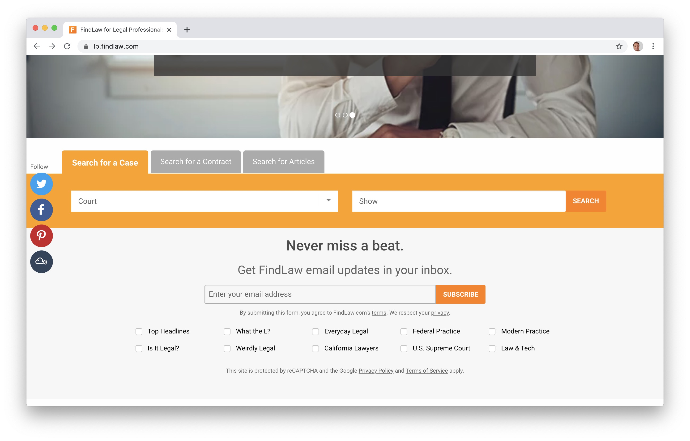
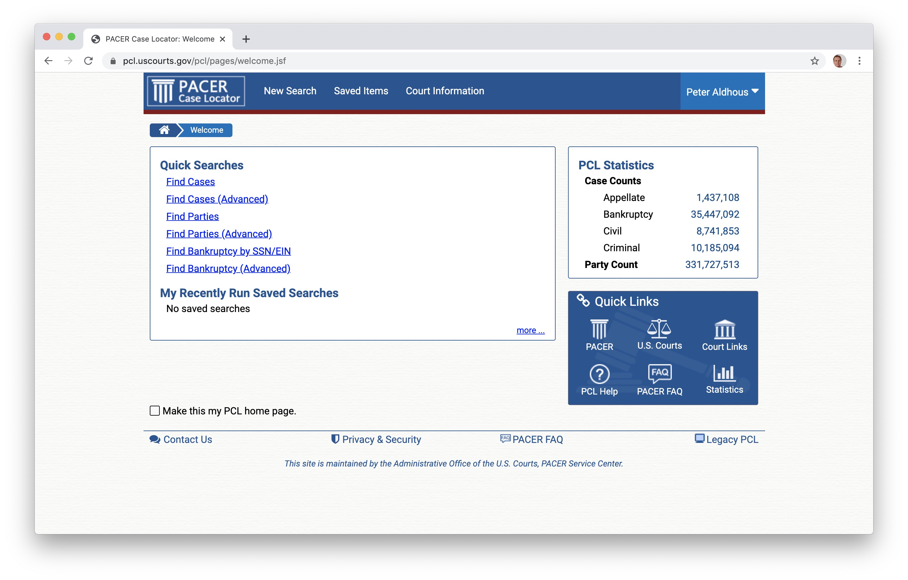
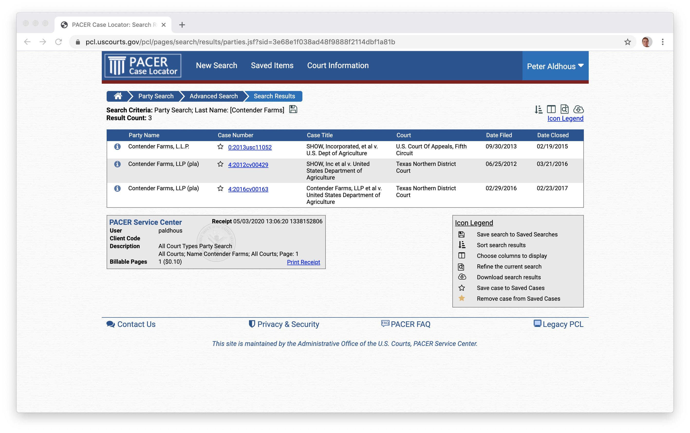
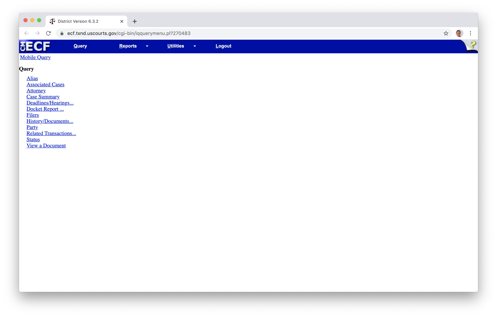
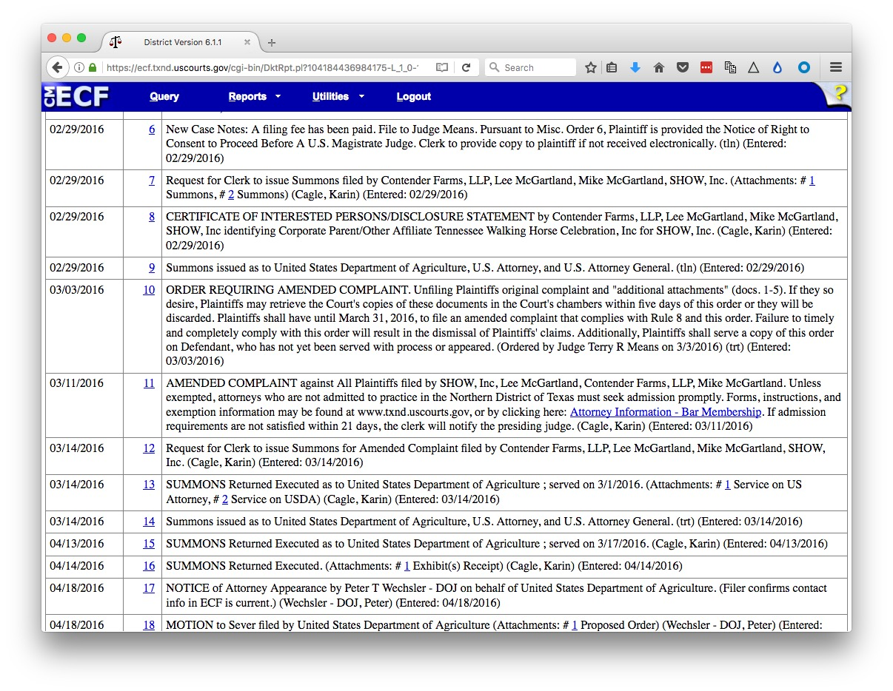
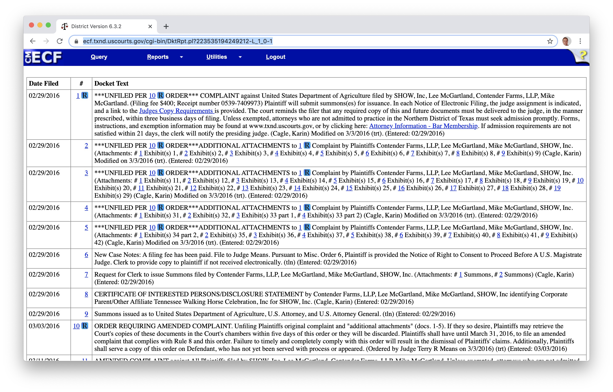

# Courts and media law

### Searching court and legal records

You may often need to search for records of criminal cases or civil lawsuits. This will require you to search federal, state, and county court systems to find the records you need. So the first step is often to work out which jurisdiction is involved.

#### General court and legal searches

**[FindLaw](https://lp.findlaw.com/)** allows you to search for summaries of rulings in cases in federal cases and cases in some of the more important state courts at the `Search for a Case` tab. You can also search for legal agreements/contracts, which may be important for disputes between companies,  at the `Search for a Contract` tab.

Findlaw also had a [useful search](https://codes.findlaw.com/) for federal and state laws. (The `Search for Articles` tab at the main search page  includes this search.) You can browse to other state resources from [here](https://caselaw.findlaw.com/).

As a UCSC Student, you have access to **[Nexis Uni](https://advance-lexis-com.oca.ucsc.edu/)** through your library account. You can search for rulings from federal and state appeals courts.

Many newsrooms also have access to a commercial service like [LexisNexis CourtLink](https://courtlink.lexisnexis.com/), which searches across state and federal courts, in many cases giving links for download to individual documents from the full docket of documents filed in a case.

In many cases, however, you will need to navigate individual court systems and courts to find the documents you need.

#### Federal courts

**[Federal courts](https://www.justice.gov/usao/justice-101/federal-courts)** hear cases involving federal laws or the US Constitution. There are three levels:

- **District courts** are the system's general trial courts. (Each federal district also has bankruptcy divisions.)

- **Circuit courts** hear appeals from decisions in the district courts.

- **The Supreme Court of the United States** is the highest court in the nation. It is the final court of appeal, having the power to decide appeals from rulings in lower federal court and also those brought in state court but dealing with federal law. The US constitution is the supreme law of the land, so many of its rulings are based on [interpreting how the constitution](https://www.supremecourt.gov/about/constitutional.aspx) relates to lower court rulings or federal or state laws. If the Supreme Court decides a law is unconstitutional, that law is struck down.

Cases in federal courts can be searched at **[PACER](https://www.pacer.gov/)** (Public Access to Court Electronic Records). Register for an account [here](https://pacer.psc.uscourts.gov/pscof/regWizard.jsf), selecting the option to `View`. Once you have an account, follow the `FIND A CASE` link in the top navigation bar and then `Search the PACER Case locator` to reach the [landing page](https://pcl.uscourts.gov/pcl/index.jsf) for case searches.

Usually you will want to search on the `Find cases (Advanced)` if you know the case number or title, or `Find parties (Advanced)`, if you know the name of one of the parties involved in the case. Both pages allow you to narrow searches by court types, dates, and so on.

When you run a search, if any cases are found you will see a screen like this, here showing a search for Contender Farms, a horse breeder that sued the US Department of Agriculture over its animal welfare enforcement, as described in [this story](https://www.buzzfeed.com/peteraldhous/usda-animal-welfare-redacted-documents):

Click through a case link and you will see a screen like this:

The `Case Summary` will tell you the status of the case, and give contact information for attorneys (also available under `Attorneys`).

The full list of documents at the `Docket Report` link is especially useful. If you `Run Report` with the default settings, you will find a full list of documents in the case:

Look especially for Complaints and Amended Complaints, which will lay out the plantiffs' case, the defendants' responses to these, and subsequent replies. Also look for Orders, Opinions, Judgments, and Notices, which should show you how and when the case was decided, or withdrawn.

PACER charges for access to documents at a rate of 10 cents a page. You will be billed quarterly. But if your total charges are less than $30 per quarter, the fees are waived.

Because of these charges, I recommend installing [**RECAP**](https://free.law/recap/), an extension to [Firefox](https://addons.mozilla.org/en-US/firefox/addon/recap-195534/) and [Chrome](https://chrome.google.com/webstore/detail/recap/oiillickanjlaeghobeeknbddaonmjnc). As you browse documents on PACER, the extension will upload each one to a public database, so that future users can obtain them for free.

When you encounter documents that have previously been upploaded to RECAP, they will show an `R` icon on a blue background:

Click these icons, and you can download the documents from RECAP free of charge.

#### State and local courts

Most cases are not heard at the federal level, however, and each state has its own system. Courts will vary in the ease with which cases and documents can be searched online. In some cases you will need to visit the courthouse to obtain documents.

Each system is different, so if you don't have access to a service like [LexisNexis CourtLink](https://courtlink.lexisnexis.com/) that searchers across systems, you will have to find and negotiate the different search pages available for individual courts.

The **[National Center for State Courts](https://www.ncsc.org/)** is a good starting point. [This page](https://www.ncsc.org/Information-and-Resources/Browse-by-State/State-Court-Websites.aspx) provides links to the systems in individual states. The `Court Structure Chart` links provide an overview of how the system is organized in each state.

This [**crowdsourced Google Document**](https://docs.google.com/document/d/1DHHv7GS6mycat97RTzlZDkokPZcm3QpoJgQ0W_QqaiY/edit), started by journalist [Ally Jarmanning](**http://**) of WBUR in Boston, is another great starting point for searching state and local courts.

Once you find the docket for any state or local case, it will be structured similarly to those at PACER.

### Media law

#### The First Amendment

The First Amendment to the US Consitution prevents the government from making laws that abridge freedom of speech and the freedom of the press. As such, it is a cornerstone of journalistic expression. It is the basis of landmark Supreme Court rulings that restrict the ability of public officials to [sue for defamation](https://supreme.justia.com/cases/federal/us/376/254/), and restrict the ability of the government to [censor information from publication](https://supreme.justia.com/cases/federal/us/403/713/), known as prior restraint.

The First Amendment does not grant complete freedom to journalists to write whatever they want, or to use any material without regard to copyright. And of course, remember that First Amendment protections don't apply outside the United States. That's increasingly important, given that publication on the Internet means that your work may be considered as having been published in any jurisdiction from which it can be accessed.

#### Copyright

Copyright is the right of authors, photographers, artists, musicians, and other creators of content to control their creative expressions that have been fixed in a tangible form. There is no copyright in ideas or facts, but there is in text, photos, graphics, video and audio recordings, and so on.

Breaching copyright can cause serious problems and is why publications should always obtain the copyright holder's permission before using a photo or graphic. Damages awarded for copyright infringement can [run up to $150,000](https://www.copyright.gov/title17/92chap5.html) and the infringer may be required to pay the copyright holder's legal costs.

In general, courts have found that embedding a photo or video from another site does not breach copyright. A New York federal judge [recently ruled](https://arstechnica.com/tech-policy/2020/04/judge-smacks-down-copyright-suit-over-instagram-embedding/), for instance, that it's OK to embed a photojournalist's work from their Instagram account. Many photojournalists are now locking down their accounts as a result.

The doctrine of "fair use" allows for limited use of copyrighted material without the author's permission. News reporting, criticism, and comment, can claim fair use. In general, the smaller the proportion of the copyrighted work used, the better the argument for fair use. The use should not descrease the market for the original work, so quoting the entirety of a poem, for example, is unlikely to be seen as fair. Fair use is also more likely to be granted is the work is imformational, rather than a creative work of fiction.

Copyright eventually expires but the terms are long: 70 years after the death of the author for many works. [This page](https://copyright.cornell.edu/publicdomain) will help you judge whether copyright has expired on an old work.

Many government agencies, [such as NASA](https://www.nasa.gov/multimedia/guidelines/index.html), do not copyright their images, audio, video, computer files and so on. These materials can be freely used.

#### Defamation

Defamation means a statement that causes an injury to someone's reputation. In some jusridictions, there is a distinction between libel, which covers written statements, and slander, for spoken statements.

Repeating a defamatory statement, for example in a quote, renders you and your publication potentially liable, as well as the person who made the statement.

Investigative journalism commonly involves publishing statements that are potentially defamatory. However, there are important privileges and legal defenses that can protect a journalist's ability to make such statements. These differ from jurisdiction to jurisdiction but the basic principles are similar.

While a publication should always seek specific legal advice before publishing any potentially defamatory statements, it is in your interest to understand the basics of these privileges and defenses.

##### Privileges

- **Opinion** The idea here is that opinions cannot, by their nature, be proven true or false and therefore cannot be defamatory. Judging what is a statement of alleged fact and what is a statement of opinion is inherently difficult and involves an element of subjective judgement. Different jurisdictions differ on how they interpret what is covered by opinion.

- **Fair comment/criticism** Everyone has the right to comment on matters of public concern. Providing this is done fairly these comments are not libelous. Again, judging what is "fair" involves a degree of subjective judgement.

- **Fair report** Fair and accurate reports of public proceedings, including court cases and legislative procedings, cannot be libelous. This is more straightforward, and means that you are generally on safe ground reporting from court documents, including civil and criminal complaints, or on potentially defamatory statements made in a legislative chamber such as the US Congress.

- **Neutral reportage** This privilege is supposed to protect fair, true, and impartial accounts of any newsworthy events from libel suits. It is reconized in California, but not in all US states. To claim this privilege, you would want to be able to show that you published any denials of potentially defamatory statements, or made strenuous attempts to obtain comment from the individual concerned.

##### Defenses

- **Not capable of defamatory meaning** Statements accusing people of breaking the law or otherwise engaging in morally repugnant behavior are generally understood to be potentially defamatory. But is it defamatory to accuse someone of drunkeness, being a communist, or using political clout? Different jurisdictions and courts have taken different views on statements like this.

- **Truth** In the US, paintiffs have to prove that defamatory statement was false. But in some jurisdictions, including Canada, the burden of proof that a statement was true falls on the defendant.

- **Fault** In the US a plaintiff will have to show fault on the part of the defendant. If the plaintiff is a public offcial or other public figure, they will have to show the publication or reporter showed "actual malice," which generally means publishing statements knowing they were untrue, or with reckless disregard to whether they were false. For private individuals, the bar is lower, and they will have to show that the publication or reporter was negligent in establishing whether the statement was untrue.
  
  States differ in how they interpret who the meaning of "public official" and "public figure." In California, the latter is someone who has voluntarily and actively sought to influence resolution of any matter of public interest.

#### How to handle complaints

Many people's first inclination in the face of someone angry about what you've published is to apologize. Do not do this. When you receive a complaint, be polite, make it clear you've understood what's being said, and say that you need to refer the matter to your editor -- which you should do without delay.

Most complaints can be resolved through polite engagement and a prompt correction, if a mistake had been made.

But not admit fault or apologize as a kneejerk reaction. If you do so, especially if you do so in writing, it will make things very difficult if the complaint escalates to a lawsuit.

### Further reading

**[Associated Press Stylebook](https://www.amazon.com/Associated-Press-Stylebook-2019-Briefing/dp/1541699890)**
This contains a very useful Briefing on Media Law.

