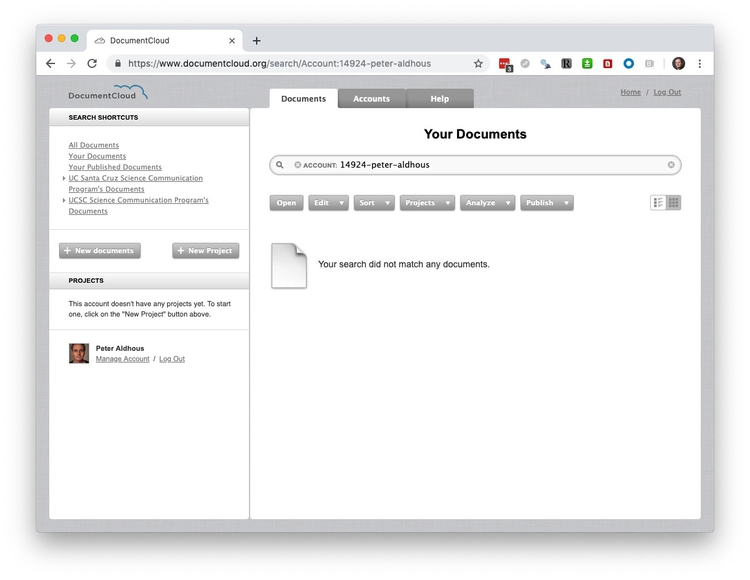
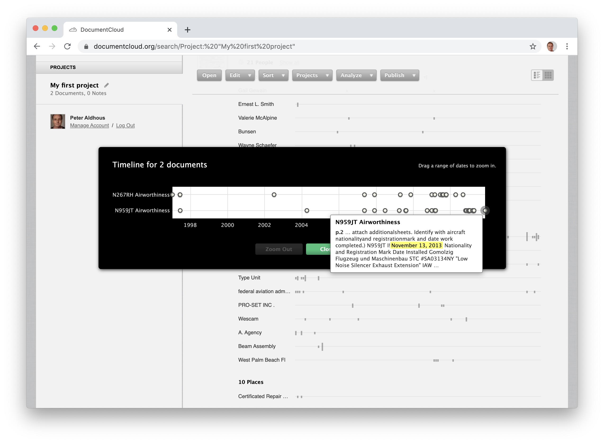
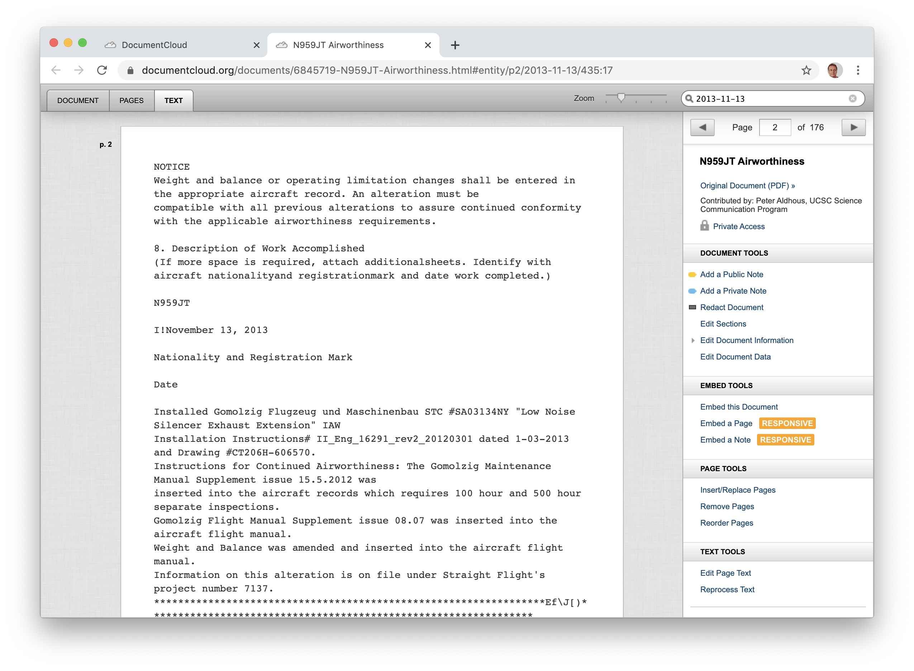
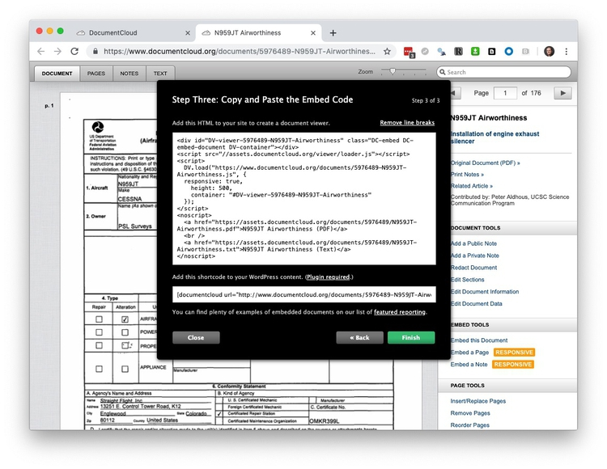

# Working with documents

### Introduction

Many investigative news stories depend on reporting from documents. In some cases, a single document or a small cache of documents may carry the story. But other stories depend on systematically analyzing large document sets to reveal the big picture.

Examples from my own work include:

#####[Spies In The Skies](https://www.buzzfeednews.com/article/peteraldhous/spies-in-the-skies):

This exploration of the activities of surveillance aircraft operated by the FBI and the Department of Homeland Security depended on a large quantity of flight tracking data obtained from the website [Flightradar24](https://www.flightradar24.com/). But to understand the ownership of each plane, and the equipment they carried, I relied on two key documents for each plane [purchased from the Federal Aviation Administration](http://aircraft.faa.gov/e.gov/ND/): The history of their [registration](https://www.faa.gov/licenses_certificates/aircraft_certification/aircraft_registry/), and their [airworthiness documentation](https://www.faa.gov/licenses_certificates/aircraft_certification/airworthiness_certification/), which details post-manufacture modifications made to aircraft. Some of the latter ran to more than 1,000 pages per plane. [Subsequent articles](https://www.buzzfeednews.com/article/peteraldhous/hidden-spy-planes), looking at other spy planes that I [identified through machine learning](https://buzzfeednews.github.io/2017-08-spy-plane-finder/), by training an an algorithm on flight tracking data from the aircraft in the first story, were reported in a similar way.

#####[The Cities Where The Cops See No Hate](https://www.buzzfeednews.com/article/peteraldhous/hate-crimes-miami-police-irving-syracuse):

This was a story about the under-reporting of hate crimes in [national statistics](https://ucr.fbi.gov/hate-crime/2018) collected by the FBI. There are many reasons for the undercount, including the fact that fewer than half of victims report hate crimes to the police. But I wanted to see whether police departments were failing to recognize hate crimes for what they are even when the incidents are reported. I realized I could address this by looking at police incident reports. But there are thousands of police departments across the US, logging millions of incidents a year, so I needed a focused, systematic methodology to find "missing" hate crimes that would tell a compelling story.

### The documents we will use today

[Download this zipped folder](data/documents.zip) containing airworthiness certificates for two of the FBI aircraft from the Spies in the Skies story. Place it on your desktop and unzip.

### Think systematically, develop a methodology

For the initial spy planes story, this was pretty straightforward. The documents cost $10 per plane, and I had a total of about 200 aircraft to look at. In practice, to keep costs down, I didn't order documents for *all* of the planes in the first story, but did so for about 130 of them, making sure I had a representative sample of the different aircraft flown by each agency. From this, it became clear that planes of the same model were usually equipped with the same equipment, allowing me to confidently make some general statements in the story about what the aircraft were capable of doing/seeing.

The hate crimes story required a more complex approach. This is what I came up with:

- Identify the police departments serving the 30 largest cities (all with a population of more than 100,000 people) in the US that had reported zero hate crimes in the five years up to and including 2016, then the most recent year in the FBI's hate crime statistics.

- Send public records requests for 2016 incident reports for the crime of "aggravated assault" to these cities. These are assaults that involve an attempt to inflict injury or a threat of violence with a deadly weapon. I chose this offense to focus on serious violent crimes that are reasonably commonplace, for which each of my cities reported dozens to more than 1,000 incidents per year, according to data collected under the FBI's [Uniform Crime Reporting](https://www.fbi.gov/services/cjis/ucr) program.

- For the records returned, which came from 10 cities (some failed to provide records; others made prohibitive demands on costs to search and duplicate the records), manually classify for possible hate crimes, with reference to the FBI's [hate crime reporting guidelines ](https://ucr.fbi.gov/hate-crime-data-collection-guidelines-and-training-manual.pdf). This inevitably involved subjective judgements. So  I got three academic experts, including a former FBI agent who used to run the agency's hate crime reporting program, to review the reports I had flagged as possible hate crimes. That led to the story being built around 15 incidents, recorded by six police departments, that my experts all agreed should each at least have been flagged as a possible hate crime and subjected to further scrutiny.

(I was being charged search and duplication fees for these requests, so the methodology was designed to be feasible within a budget that had been set for the project.)

The methodology you will develop for any story will depend on the nature of the documents and the questions you want to answer. You will almost always need to read a sample of your documents in full to understand what they contain. Ideally, you then want to develop a methodology that will allow you to categorize documents quickly and unambiguously without having to read every single word. But sometimes, as with my hate crimes story, there is no practical alternative to reading the documents in full.

### Make your documents machine-searchable

The key to automating or partially automating an analysis of documents is to make ensure that the text is machine-searchable. If your documents have been provided as scanned images, rather than digital PDFs, then you will need to use Optical Character Recognition to turn them into searchable text. (To determine if you have a digital PDF, see if you can highlight individual words within the document. If so, your PDF if digital; if the entire page is highlighted, it is a scanned image.)

[DocumentCloud](https://www.documentcloud.org/) (see below) performs OCR automatically when you upload documents, using the Open Source OCR tool [Tesseract](https://github.com/tesseract-ocr/tesseract). However, in my experience, its accuracy can be poor unless the quality of the scan is very good.

[Adobe Acrobat Pro](https://acrobat.adobe.com/us/en/acrobat/acrobat-pro.html) will also perform OCR on scanned PDFs, and I used it to OCR the documents for the spy planes stories. In my experience, the most accurate OCR software on poor-quality scans is Abbyy FineReader, avalable for [Windows](https://www.abbyy.com/en-us/finereader/) or [MacOS](https://www.abbyy.com/en-us/finereader/pro-for-mac/). It currently costs around $200 on Windows and $120 for the Mac. (If you need high-quality OCR for your reporting project, let me know and I can run them through Abby FineReader!)

### Show your work with DocumentCloud

[**DocumentCloud**](https://www.documentcloud.org/) is the independent nonprofit organization behind a web app that allows [news organizations](https://www.documentcloud.org/contributors) to publish, embed, annotate and redact the documents underlying their reporting. Read more about its history and goals [here](https://www.documentcloud.org/about).

You have each been set up with indivisual accounts under the UCSC SciCom DocumentCloud account. You've been given the [status of freelancer](https://www.documentcloud.org/help/accounts), which means you can upload, annotate, and edit your own documents. As an administrator, I can see any of your documents, and manage your individual accounts.

Login to DocumentCloud from the home page and you should see a screen like this:

Now switch to the `Documents` tab and click on the `Your documents` link in the `SEARCH SHORTCUTS` panel at top left. The screen should now look like this:

#### Create a project, upload documents

Usually your first step will be to create a project to hold the documents for a story you're working on. Click the `+ New Project` button and give your project a descriptive name:

Now click on the new project in the left hand panel, then click on the`+ New documents` button, select the airworthiness documents for the two planes, and click `Upload`:

It may take a little while for your documents to be fully processed. Once they are, your screen should look like this:

#### Look at recognized entities and timelines

DocumentCloud automatically runs documents through [Thomson Reuters Open Calais](http://www.opencalais.com/), which can flag people, places and organizations mentioned in a document.

Select the first document, then select `Analyze>View Entities`:

This should be the result:

Open Calais is not infallible -- "Added Table" seems unlikely to be a person. But you can now hover over the gray bars to see the context in which each recognized entity is mentioned:

This mention of Wescam, or instance, details the [installation of a surveillance camera](https://www.wescam.com/products-services/airborne-surveillance-and-reconnaissance/mx-10).

DocumentCloud's processing also highlights dates (again, do not assume complete accuracy in recognizing them correctly). Select `Analyze>View Timeline` to view the dates it has pulled from your document. You can hover over the mentions to see the context:

Here, we can see the installation of an [engine exhaust silencer](https://www.gomolzig.de/index.php?area=design&article=5) on Nov. 13, 2013.

#### Annotate documents

Having identified interesting elements in a document, you can add annotations to highlight them. Click on the highlighted date to go through to relevant OCR'd text:

Now click on the `DOCUMENT` tab to see the same section from the PDF:

To add an annotation, select `Add a Public Note` from the right-hand panel, then click and drag to highlight the text you wish to annotate, add a title and further explanatory text for your annotation, and click `Save`:

#### Redact documents

To redact text from a document, select `Redact Document` from the right-hand panel, then click and drag to draw black rectangles over the text you wish to hide, and then click `Save redactions`:

DocumentCloud's redactions are reliable and secure -- which is not always the case if you try and redact in a PDF viewer. I've obtained a document that was supposedly redacted, and all that had happened was a black rectangle had been placed over the text, which I could still copy and paste into another document.

Redacting documents can be important to protect individual's identity. For [this story](https://www.buzzfeednews.com/article/peteraldhous/david-sweatt-vanderbilt-sexual-assault-allegation) on allegations that a prominent nweuroscientist had drugged and raped a graduate student, I [added further redactions](https://www.documentcloud.org/documents/5025937-Stadum-Notes-and-Correspondence.html#document/p1/a464132) beyond those made by Oregon Health and Sciences University to protect the identity of the victim.

#### Control access to your documents

Unless you make a document public, it can only be seen by you. But when you publish, you will want to make links and embeds visible to your readers. To do that, highlight the documents to make public and then select `Edit>Access Level`, switch to `Public Access` and `Save`:

Prior to making a document public, you can make it available across your organization (apart from freelancers), which is a good setting while your story is being edited.

#### Link to documents and annotations from your story

To link to an entire document, highlight it, select `Open` and then copy the URL to obtain the link. To link to a specific annotation, click on its link in the document's right-hand panel, click the link icon () for the annotation, and again copy the URL to obtain the link.

#### Embed a document, page, or annotation in your story

Click on `Embed this Document`, add a link to the URL where your story will be published, and then follow the dialog boxes to obtain an embed code:

You can also embed single pages and annotations in a similar way.

### Systematically analyze documents with Overview

Overview is a project originally developed by data journalist [Jonathan Stray](http://jonathanstray.com/me).

Login to Overview and select `Import from DocumentCloud`. Att the next screen enter your DocumentCloud login details. You should now see your DocumentCloud projects, available for import:

Import, selecting `One file is one doucument`. When complete, the screen should look like this:

Overview can build a tree of folders grouping documents that are similar in their charactersitic word use. Click on `Tree` to activate this feature.

In practice, I've found Overview most useful to search and tag documents by the inclusion of key words and phrases. Use the search box to find documents containing that text, and then click `Tags` to create a tag to mark them as containing this term:

This was how I quickly searched and tagged the FBI spy planes by aircraft manufacturer and model, and by the specific equipment they carried:

You can export the text from your documents from Overview. Clock on the hamburger menu () at top right and select `Export`, then choose to export as separate text files or as a CSV or Excel spreadsheet:

### Turn text into data, then analyze for word usage, sentiment, and more

Once you have documents turned into text, you can also quantitatively analyze the usage of specific words or phrases, count words and syllables (and calculate a document's linguistic complexity), and analyze the overall sentiments of the words used. I've done this for text including [tweets from Donald Trump and all members of Congress](https://www.buzzfeednews.com/article/peteraldhous/trump-twitter-wars), and for presidential [State of the Union addresses](https://www.buzzfeednews.com/article/peteraldhous/trump-state-of-the-union-words). If you want to do this sort of text analysis, I [have a tutorial](https://paldhous.github.io/NICAR/2019/r-text-analysis.html) on using R packages including [tidytext](https://cran.r-project.org/web/packages/tidytext/tidytext.pdf) for text mining, which builds from the work we've done previously in the tidyverse.

### Further reading

**[Guided tour of DocumentCloud](https://www.documentcloud.org/help/tour)**

**[Overview FAQ/Help](https://blog.overviewdocs.com/help/)**

**[Text Mining With R](https://www.tidytextmining.com/)**
Excellent, free e-book from Julia Silge and David Robinson, authors of the tidytext package.

