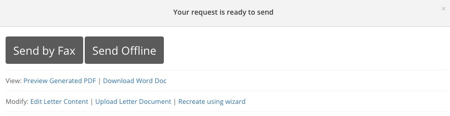
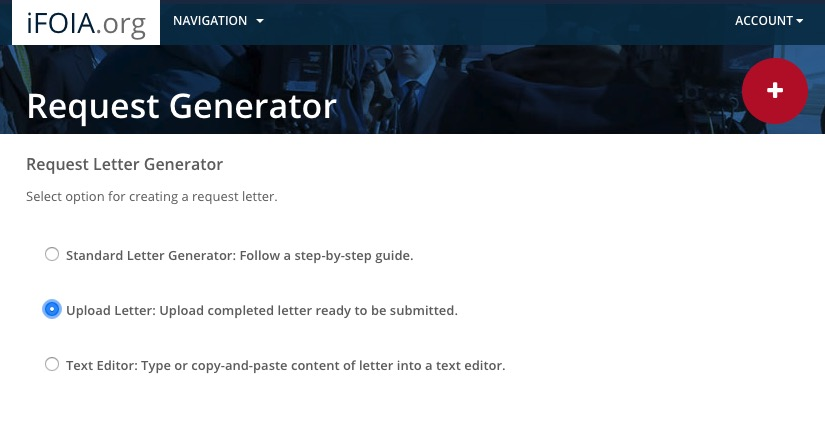

### Assignment

- You will each file FOIA/State public records request(s) with the goal of obtaining records that can be used for your reporting in our class in the Spring Quarter.
- Draft your request using the [iFOIA](https://www.ifoia.org/) letter generator for federal requests, or that National Freedom of Information Coalition [templates](https://www.nfoic.org/organizations/state-sample-foia-request-letters) for state records requests.
- If using iFOIA, don't file your request immediately. Instead, when you get to this pop-up, `Download Word Doc`:

- Then select `Follow-up>Delete Request`.
- Email me your draft request.
- Once we have agreed the wording, save the request as a PDF. You can file through iFOIA or directly by email. If filing though iFOIA, create a new request and select the `Upload letter` option at this screen:

- See [here](foia_contacts.html) for a searchable and downloadable list of federal FOIA contacts.
- Follow up at regular intervals!
