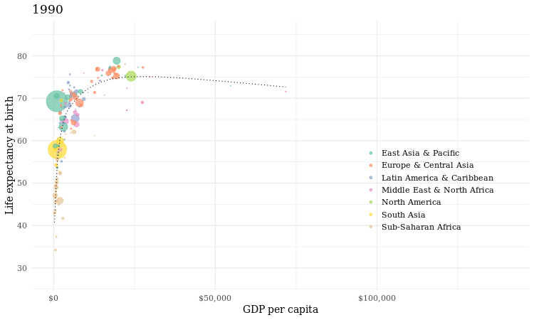
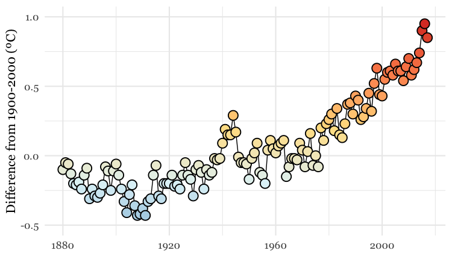
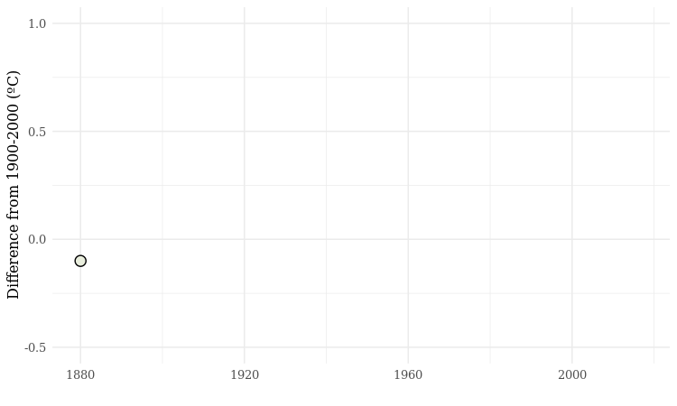
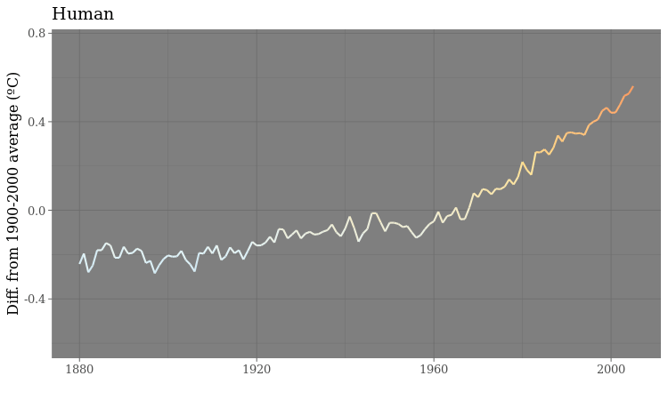

# Iteration and animation: GIFs and videos

In today's class, we will make animated GIFs and videos from charts made in R with **ggplot2**, using the [**gganimate**](https://gganimate.com) package.

### The data we will use today

Download the data for this session from [here](data/animations-r.zip), unzip the folder and place it on your desktop. It contains the following folders and files:

- `nations.csv` Data from the World Bank Indicators portal, as used in week 3 and subsequently.
- `warming.csv` [National Oceanic and Atmospheric Administration data](https://www.ncdc.noaa.gov/cag/global/time-series/globe/land_ocean/ytd/12/1880-2017.csv) on the annual average global temperature, from 1880 to 2017.
  - `year`
  - `value` Average global temperature, compared to average from 1900-2000.
- `simulations.csv` Data from NASA simulations of historical temperatures, estimating the effect of natural and human influences on climate, processed from the [raw data](https://www.bloomberg.com/graphics/2015-whats-warming-the-world/data/forcings.csv) used for this [piece from Bloomberg News](https://www.bloomberg.com/graphics/2015-whats-warming-the-world/). Contains the following variables:
  - `year`
  - `type` Natural or Human
  - `value` Global average temperature from the simulation, relative to average simulated value from 1990-2000.

### Setting up

Launch RStudio Cloud, upload the zipped folder with the data, and save a new R script as `animations.R`.

#### Install gganimate and other packages on which it depends

From the `Packages` panel, install the following packages: **gganimate**, **transformr**, **gifski**, **png**.

You can install them in one go, separated by spaces or commas. Make sure to have `Install dependencies` chacked.

#### Load the packages we will use today

```R
# load required packages
library(readr)
library(ggplot2)
library(gganimate)
library(scales)
library(dplyr)
```

Apart from **gganimate**, we have encountered all of these packages in previous weeks.

### Make a Gapminder-style animated bubble chart

The notes from the static charts class show how to make the following chart, showing GDP per capita, life expectancy at birth and population for the world's nations in 2016:


This was the code to generate that chart:

```r
# load data
nations <- read_csv("animations-r/nations.csv")

# make sure that year is treated as an integer
nations <- nations %>%
	mutate(year = as.integer(year))

# filter for 2016 data only
nations2016 <- nations %>%
  filter(year == 2016)

# make bubble chart
ggplot(nations2016, aes(x = gdp_percap, y = life_expect)) +
  xlab("GDP per capita") +
  ylab("Life expectancy at birth") +
  theme_minimal(base_size = 14, base_family = "Georgia") +
  geom_point(aes(size = population, color = region), alpha = 0.7) +
  scale_size_area(guide = FALSE, max_size = 15) +
  scale_x_continuous(labels = dollar) +
  stat_smooth(formula = y ~ log10(x), se = FALSE, size = 0.5, color = "black", linetype="dotted") +
  scale_color_brewer(name = "", palette = "Set2") +
  theme(legend.position=c(0.8,0.4))
```

Some reminders about what this code does:

 - `scale_size_area` ensures that the size of the circles scales by their area according to the population data, up to the specified `max_size`; `guide = FALSE` within the brackets of this function prevents a legend for size being drawn.

 - `labels = dollar` from **scales** formats the X axis labels as currency in dollars.

 - `stat_smooth` works like `geom_smooth` but allows you to use a `formula` to specify the type of curve to use for to trend line fitted to the data, here a logarithmic curve.

Now we will use **gganimate** to generate an animation of the chart, from 1990 to 2016. Here is the code:

```R
# animate entire time series with gganimate
nations_plot <- ggplot(nations, aes(x = gdp_percap, y = life_expect)) +
  xlab("GDP per capita") +
  ylab("Life expectancy at birth") +
  theme_minimal(base_size = 14, base_family = "Georgia") +
  geom_point(aes(size = population, color = region), alpha = 0.7) +
  scale_size_area(guide = FALSE, max_size = 15) +
  scale_x_continuous(labels = dollar) +
  stat_smooth(formula = y ~ log10(x), se = FALSE, size = 0.5, color = "black", linetype="dotted") +
  scale_color_brewer(name = "", palette = "Set2") +
  theme(legend.position=c(0.8,0.4)) +
  # gganimate code
  ggtitle("{frame_time}") +
  transition_time(year) +
  ease_aes("linear") +
  enter_fade() +
  exit_fade()
```

Running this code will create an R object of type `gganim` called `nations_plot`.

Now display it in the `Viewer` panel by running the following:

```R
animate(nations_plot)
```

#### How the gganimate code works

- `transition_time` This function animates the data by `year`, showing only the data that is relevant for any one point in time. As well as generating a frame for each year, it also generates intermediate frames to give a smooth animation.
- Using `"{frame_time}"` within the `ggtitle` function puts a title on each frame with the corresponding value from the variable in the `transition_time` function, here `year`. (The earlier conversion of `year` to integer ensures that we don't see decimal fractions in this title.)
- `ease_aes` This controls how the animation progresses. If animating over a time series, always use the option `"linear"` to ensure a constant speed for the animation. Other available options can be used when animating between different states of a chart, rather than over time, as we will see below.
- `enter_fade` `exit_fade` These functions control the behavior where a data point appears or disappears from the animation. You can also use `enter_shrink` and `exit_shrink`.

#### Save as a GIF and a video

We can now save the animation as a GIF or video.

```R
# save as a GIF
animate(nations_plot, fps = 10, end_pause = 30, width = 750, height = 450)
anim_save("nations.gif")

# save as a video
animate(nations_plot, renderer = ffmpeg_renderer(), fps = 30, duration = 20, width = 800, height = 450)
anim_save("nations.mp4")
```

You can use the options `width` and `height` to set the dimensions, in pixels, of the animation; `fps` sets the frame rate, in frames per second; for a GIF, you can add a pause at the end using `end_pause`, here set to 30 frames or 3 seconds at 10 frames a second.

To make a video, you need the code `renderer = ffmpeg_renderer()`; `duration` sets the duration of the video. The video code above also sets the ratio between width and height at 16:9, consistent with YouTube format.

[**FFmpeg**](https://ffmpeg.org/), a sofware library for working with video and audio, is already installed in RStudio Cloud. If working on your own computer, you will need to follow the instructions on the [software](software.html) page to install FFmpeg.

Here is the GIF:



And here is the video:

<div class="embed-responsive embed-responsive-16by9">
    <iframe class="embed-responsive-item" src="img/nations.mp4"></iframe>
</div>

### Make a cumulative animation of historical global average temperature

For the Gapminder-style video, we displayed only the data for the year in question in each frame. In some cases, however, you may want to animate by adding data with each frame, and leaving the previously added data in place.

We will explore that now by making animations similar the dot-and-line chart in [this video](https://www.facebook.com/BuzzFeedScience/videos/753675331429028/).

Here is the code to make a static version of the chart:

```R
# load data
warming <- read_csv("animations-r/warming.csv")

# draw chart
warming_plot <- ggplot(warming, aes(x = year, y = value)) +
  geom_line(colour="black") +
  geom_point(shape = 21, colour = "black", aes(fill = value), size=5, stroke=1) +
  scale_x_continuous(limits = c(1880,2017)) +
  scale_y_continuous(limits = c(-0.5,1)) +
  scale_fill_distiller(palette = "RdYlBu", limits = c(-1,1), guide = FALSE) +
  xlab("") +
  ylab("Difference from 1900-2000 (ºC)") +
  theme_minimal(base_size = 16, base_family = "Georgia")
```

This should be the result:



The file `warming.csv` contains the fields `year` and `value`, the latter being the global annual average temperature, compared to the 1900-2000 average.

As this is a dot-and-line chart, it includes both `geom_line` and `geom_point` layers. Notice that the `geom_point` function also defines a numbered `shape`: `21` is a circle with a filled area, see [here](http://www.cookbook-r.com/Graphs/Shapes_and_line_types/) for other options. By using this shape, we can set the outline `color` to black and then use an `aes` mapping to fill it with color, according to the temperature `value`.

The code uses `scale_fill_distiller` to use a ColorBrewer palette running from cool blues, through neutral yellows, to warm reds, applying them across a range of values from -1 to +1.

Again we can animate this data using **gganimate**:

```R
# draw chart
warming_plot <- ggplot(warming, aes(x = year, y = value)) +
  geom_line(colour = "black") +
  geom_point(shape = 21, colour = "black", aes(fill = value), size = 5, stroke = 1) +
  scale_x_continuous(limits = c(1880,2017)) +
  scale_y_continuous(limits = c(-0.5,1)) +
  scale_fill_distiller(palette = "RdYlBu", limits = c(-1,1), guide = FALSE) +
  xlab("") +
  ylab("Difference from 1900-2000 (ºC)") +
  theme_minimal(base_size = 16, base_family = "Georgia") +
  # gganimate code
  transition_reveal(id = 1, along = year)

# save as a GIF
animate(warming_plot, fps = 10, end_pause = 30, width = 750, height = 450)
anim_save("warming.gif")
```

#### How the gganimate code works

- `transition_reveal`. This keeps the previously revealed data in place as each value for the `along` time variable is added to the chart.

The default behavior for `transition_reveal` however, reveals the lines, but only plots the point for the current frame:



To create a cumulative animation of points, use code like this:

```R
# draw chart
warming_points <- ggplot(warming, aes(x = year, y = value)) +
  geom_point(shape = 21, colour = "black", aes(fill = value), size=5, stroke=1) +
  scale_x_continuous(limits = c(1880,2017)) +
  scale_y_continuous(limits = c(-0.5,1)) +
  scale_fill_distiller(palette = "RdYlBu", limits = c(-1,1), guide = FALSE) +
  xlab("") +
  ylab("Difference from 1900-2000 (ºC)") +
  theme_minimal(base_size = 16, base_family = "Georgia") +
  # gganimate code
  transition_time(year) +
  shadow_mark()

# save as a GIF
animate(warming_points, fps = 10, end_pause = 30, width = 750, height = 450)
anim_save("warming_points.gif")
```
`shadow_mark` retains the data from previous frames.


### Make an animation that switches between a simulation of human effects on global average emperature, and natural ones

Looped animations can also be used to switch between different states, or filtered views of the data. To illustrate this we will load the NASA data showing a simulation from climate models of how the global average temperature would have changed under the influence of natural events, such as variation in radiation from the Sun and the cooling effect of soot from volcanoes, compared to human influences, mostly emissions of carbon dioxide and other greenhouse gases.

This code will load the data and make the animation:

```R
# load data
simulations <- read_csv("animations-r/simulations.csv")

# draw chart
simulations_plot <- ggplot(simulations, aes(x=year, y=value, color = value)) +
  geom_line(size = 1) +
  scale_y_continuous(limits = c(-0.6,0.75)) +
  scale_colour_distiller(palette = "RdYlBu", limits = c(-1,1), guide = FALSE) +
  ylab("Diff. from 1900-2000 average (ºC)") +
  xlab("") +
  theme_dark(base_size = 16, base_family = "Georgia") +
  #gganimate code
  ggtitle("{closest_state}") +
  transition_states(
    type,
    transition_length = 0.5,
    state_length = 2
  ) +
  ease_aes("sine-in-out")

# save as a GIF
animate(simulations_plot, fps = 10, width = 750, height = 450)
anim_save("simulations.gif")
```

#### How the gganimate code works

- `transition_state`. This switches between different filtered states of the data, here defined by the variable `type`. `transition_length` is the length of the transition in seconds, and `state_length` is the pause at each state, again in seconds.

- `ease_aes` With a state transition animation, using options that  vary the speed of the transition, with a slower start and finish than the middle section, give a more visually pleaseing effect. Try `"cubic-in-out"` or `"sine_in_out"`
- Using `"{closest_state}"` in the `ggtitle` function displays the appropriate value for the variable used to define the states, here `type`.

The GIF should look like this:



### Further reading/resources

[gganimate website](https://gganimate.com/)


