# Basic charts with Plotly

### Introducing Plotly

In today's class we will make a series of simple charts using [**Plotly**](https://plot.ly/online-chart-maker/) Chart Studio, a web application that allows you to upload data and use a point-and-click interface to make online charts, with tooltips and other interactivity. These can be embedded in your web projects, or exported as static images.

### The data we will use today

Download the data for this session from [here](data/basic-charts.zip), unzip the folder and place it on your desktop. It contains the following files:

- `food_stamps.csv` Contains the following variables:
 - `year` From 1969 to 2016.
 - `food_stamps` Average number of people participating in the Supplemental Nutrition Assistance Program, in millions, from the [US Department of Agriculture](https://www.fns.usda.gov/pd/supplemental-nutrition-assistance-program-snap).
 - `poverty` Estimated number of people in poverty, in millions, from the [US Census Bureau](https://census.gov/content/dam/Census/library/publications/2017/demo/P60-259.pdf).

- `nations_2017.csv` Data from the [World Bank Indicators](https://data.worldbank.org/indicator/?tab=all) portal. Contains the following fields:
 -  `iso2c` `iso3c` Two- and three-letter [codes](https://www.nationsonline.org/oneworld/country_code_list.htm) for each country, assigned by the [International Organization for Standardization](https://www.iso.org/standard/63545.html).
 - `country` Country name.
 - `year` 2017 for this data.
 - `gdp_percap` [Gross Domestic Product per capita](https://data.worldbank.org/indicator/NY.GDP.PCAP.PP.CD) in current international dollars, corrected for purchasing power in different territories.
 - `life_expect` [Life expectancy at birth](https://data.worldbank.org/indicator/SP.DYN.LE00.IN), in years.
 - `population` Estimated [total population](https://data.worldbank.org/indicator/SP.POP.TOTL) at mid-year, including all residents apart from refugees.
 - `region` `income` World Bank [regions and income groups](http://siteresources.worldbank.org/DATASTATISTICS/Resources/CLASS.XLS), explained [here](https://datahelpdesk.worldbank.org/knowledgebase/articles/906519).

- `test.html` A web page for embedding online charts. It has been set up using the [Bootstrap](https://getbootstrap.com/) responsive web design framework so that any content will automatically adjust to the size of the browser window in which it is viewed, centered on the page.

### Log in to Plotly

Log in to Plotly [here](https://plot.ly/Auth/login/#/):

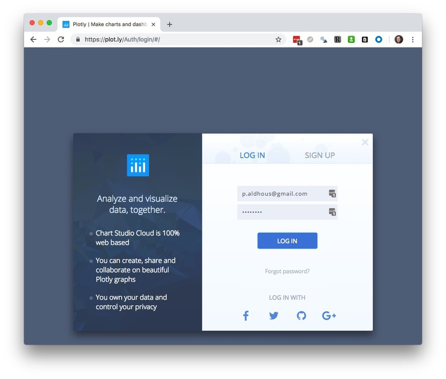

You should now see a screen like this:

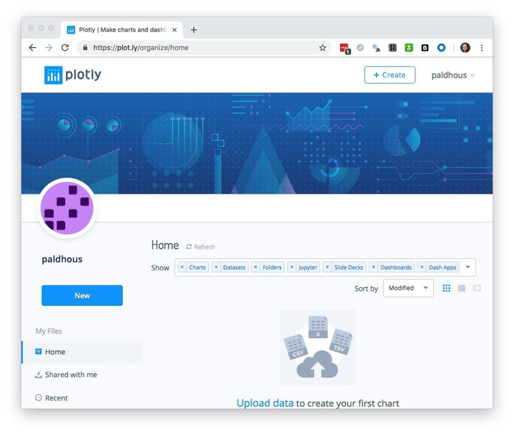

### Make a bar chart showing number of people enrolled in food stamps program over time

Having logged in to Plotly, click on the `New` or `+ Create` buttons and select `Chart` to see this screen: 

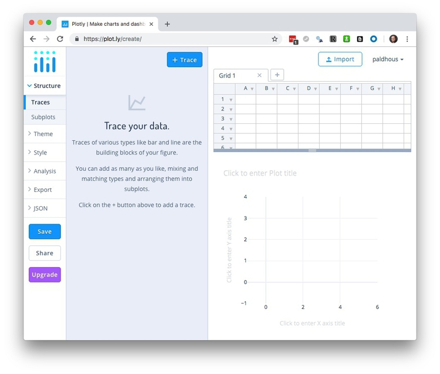

The `Grid` table shows the data to be visualized, so first import the file `food_stamps.csv` by clicking the `Import` buttom at top right. This will open the following dialog box:


In the `Upload` tab, click the `Upload` button and navigate to the folder containing the file, or drag the file onto the dialog box.

Your workspace should now look like this, with the imported data in a new `Grid`:

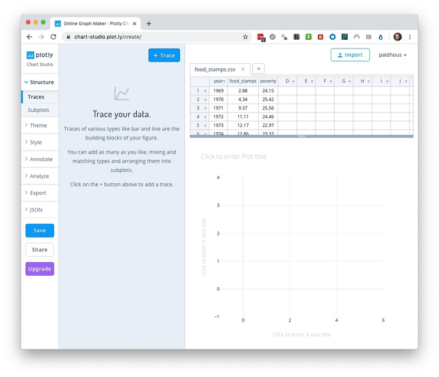

You build charts by adding variables to the plot using the `+ Trace` button. The default is a `Scatter plot`, but if you click on that box, you will see the other possibilities:


Select `Bar` and map `year` onto the X axis and `food_stamps` onto the `Y` to create the default chart:

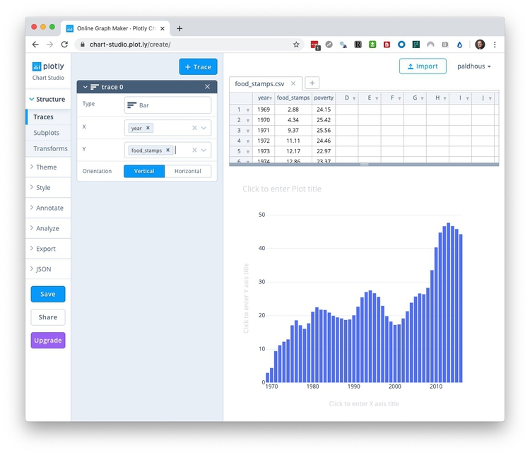

You can build charts with multiple layers, for example here adding a dot-and-line to show the number of people living in poverty, by adding additional `Traces`. But we will proceed with a simple column chart.

So far we have been working in the `Structure` section of the main left-hand menu, under the `Traces` tab. This also contains a `Subplots` tab, to create multiple charts from different `Traces` within the same panel; and a `Transforms` tab, which allows you to `Filter`, `Aggregate` (summarize) or `Sort` the data for a `Trace` (see the section on basic operations with data from the first class). `Split` will group the data by a categorical variable.

Having made a basic chart, you can customize it by choosing an overall `Theme`, and then opening up the options in the `Style` section of the menu. We will keep the default `Theme`.

In the `Style` menu, `General` contains an option to change the size of the chart. I recommend keeping it set to `Auto`, as this allows the chart to be responsive, altering its size to fit the available space when embedded into a web page. This section also allows you to add a plot title, and to customize the font faces and size, and to customize the tooltips. If you don't wish your chart to have tooltips, select `Disable` under `Hover>Mode`. We will change the `Text>Typeface` to `Arial`, which should display in all browsers when we later download as a web page.

The available options to customize in the `Traces` tab depend on the chart type. Common options include  customizing color and opacity. For bar or column charts you can also change bar widths and the padding around them. We will simply change the default blue color to a bright red, using the HEX value `FF0000`:

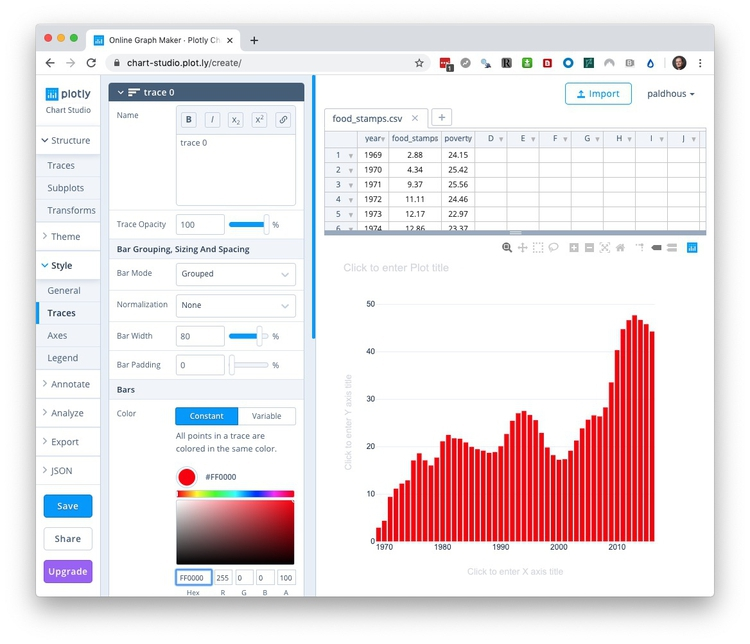

The `Axes` tab contains options for customizing the `X` and `Y` axes. It contains options to set the `Range` of each axis, to show or hide grid and zero lines under `Lines`, and to customize `Tick Labels` and `Tick Markers`. `Range Slider` adds a control to adjust the range shown on the X axis, which can be useful to zoom in on the details for very long time series.  You will usually want to adjust the axis `Titles`; Here, edit the Y axis title to `Participants (millions)`.

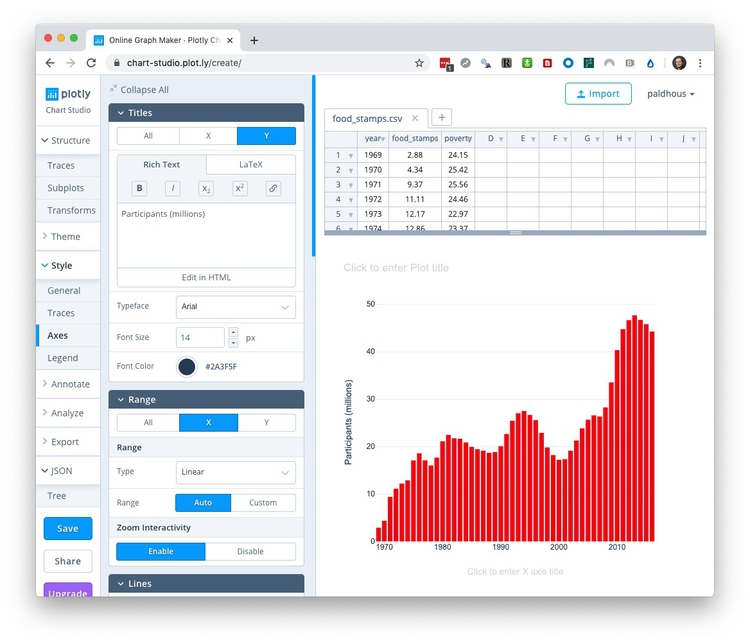

The `Legend` tab allows you to customize the color legend for charts that need them, superfluous here.

The `Annotate` menu allows you to annotate the chart in various ways. 

`Text` allows you to add text annotations.

`Shapes` provides options to add reference lines or bands to your chart; use in combination with `Text` as required for chart annotation. (If you need to add a trend line to a scatter plot, use `Curve Fitting` under the `Analyze` menu.)

`Images` allows you to add images, such as an organization's logo, to a chart.

Having finished customizing your chart, hit the `Save` button, then save both `Plot` and `Grid` as `Public` (`Private` is not available for free accounts):

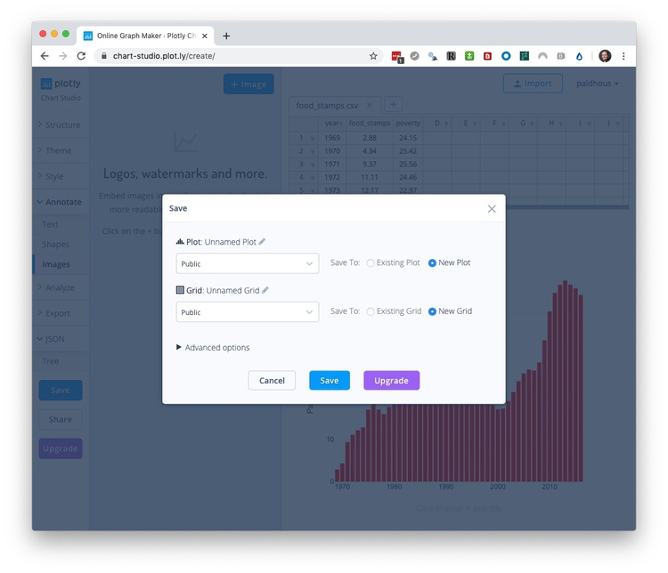

### Export and share the chart

Having saved your chart, select the `Image` tab under the  `Export` export to save it as a PNG image, setting the desired height and width in pixels:

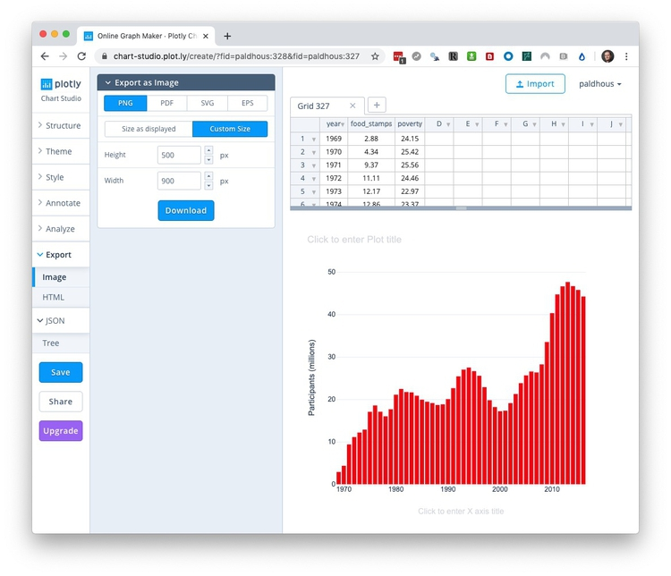

Click `Download` to save the PNG image file to you computer. (Saving in PDF, SVG, and EPS formats, which will give a graphic that can edited in a vector graphics editor such as [Adobe Illustrator](https://www.adobe.com/products/illustrator.html), is possible only with a paid account.)

For a simple embed, click the `Share` button and switch to the `Embed` tab to obtain an [**iframe**](https://www.w3schools.com/html/html_iframe.asp) code:

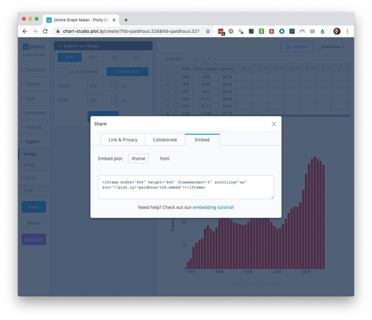

Copy the embed code, then open the `test.html` file in [Sublime Text](https://www.sublimetext.com/). Insert the code into the page and edit as follows:

```Javascript
  <div class="container">

<iframe width="100%" height="500" frameborder="0" scrolling="no" src="https://plot.ly/~paldhous/328.embed"></iframe>

  </div> <!-- /.container -->
```
An iframe allows you to embed one web page, here displaying your chart on Plotly's servers, into another. Set its height in pixels, and its width as `100%`. This will allow the chart width to adjust for different browser window sizes. You may also need to insert `https:` at the start of the web address.

A `div` is a distinct section of a webpage. Insert the iframe into the div with the class `container`. This is a feature of Bootstrap that will center the embed on you page, optimized for different browser window sizes.

Save the page and open it in your web browser:

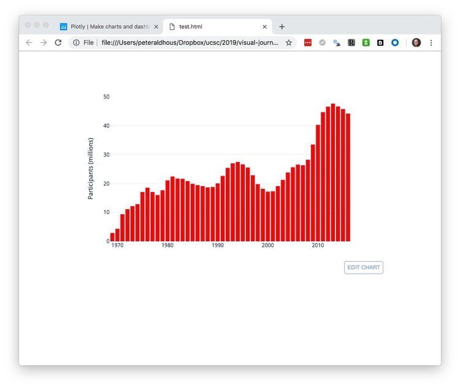

A default Plotly embed contains an `EDIT CHART` link, allowing other users to edit the chart using their own Plotly account. When you hover over the chart, various controls appear at top right.

To obtain an embed without these features, which I would recommend, select `Export` once more, switch to the `HTML` tab, and `Download as Html file`:

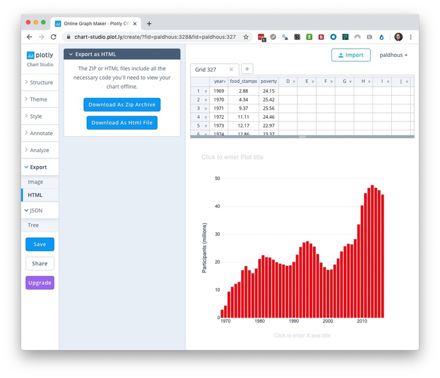

Place the downloaded file in your working folder for this class and rename it as `food-stamps-column.html`. Open in Sublime Text, scroll to the bottom of the file, and edit as follows:

**Before:**

```Javascript
 config: {"showLink": true, "linkText": "Export to plot.ly", "mapboxAccessToken": "pk.eyJ1IjoiY2hyaWRkeXAiLCJhIjoiY2lxMnVvdm5iMDA4dnhsbTQ5aHJzcGs0MyJ9.X9o_rzNLNesDxdra4neC_A"}
```

**After:**
```Javascript
config: {"showLink": false, "displayModeBar": false, "linkText": "Export to plot.ly", "mapboxAccessToken": "pk.eyJ1IjoiY2hyaWRkeXAiLCJhIjoiY2lxMnVvdm5iMDA4dnhsbTQ5aHJzcGs0MyJ9.X9o_rzNLNesDxdra4neC_A"}
```
Now open `test.html` once more and edit the iframe to embed the downloaded web page:

```Javascript
  <div class="container">

    <iframe width="100%" height="500" frameborder="0" scrolling="no" src="food-stamps-column.html"></iframe>

  </div> <!-- /.container -->
```
You should now have the following clean embed:

<iframe width="100%" height="500" frameborder="0" scrolling="no" src="food-stamps-column.html"></iframe>


### Make a dot-and-line chart comparing number of people in poverty with number on food stamps over time

Click your browswer's back arrow to return to your account's home page:

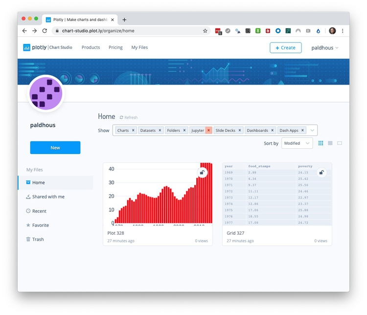

Now hover over the grid with the food stamps data, and click on `Open in: Editor` to start making a new chart from the same data.

This time, select `Line` for the first `Trace`, and  put `food_stamps` on the `Y` axis and `year` on the `X`:

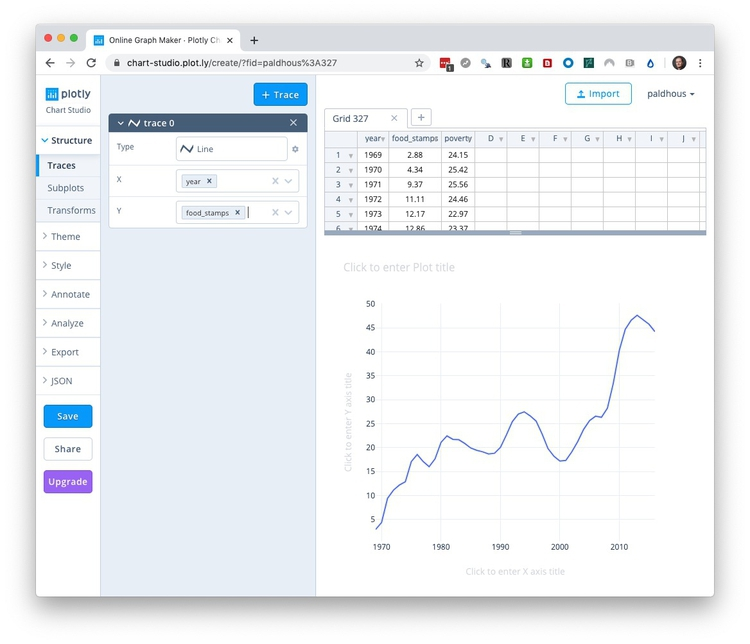

Now click the `+ Trace` button to add a second line, and edit so that `poverty` is mapped to the `Y` axis.


Change the `Typeface` to Arial as before under the `General` in the `Style` menu.

Under `Traces` in the `Style` menu, select the `By Type` tab check `Points`. (With multiple traces, you can also use the `Individually` tab to customize them one at a time.) Once you add points to a line chart, Plotly should automatically adjust the `Y` axis to start at zero.

By default, Plotly has chosen a qualitative palette for `categorical scales`; you can use the `Individually` tab to customize the color of each trace individually if you wish. Here I have chosen blue and orange, at opposite sides of the color wheel, and also labelled each `Trace`:

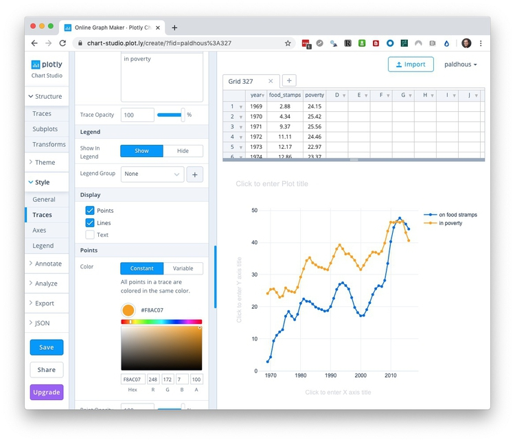


Switch to `Axes`, and edit the `Y` axis title to `People (millions)`:

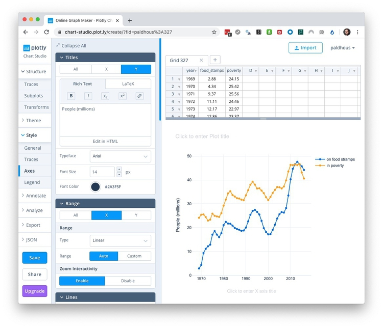

Select `Legend`, and adjust its `Positioning`, `Orientation` and `Trace Order` as desired:


Save the chart and then export/share as before.

### Make a bubble chart showing the relationship between GDP per capita and life expectancy for the world's nations in 2017

Click your browser's back arrow to return to your account's home page, then select `Create>Chart` to open a new blank grid. Import the `nations_2017.csv` file:

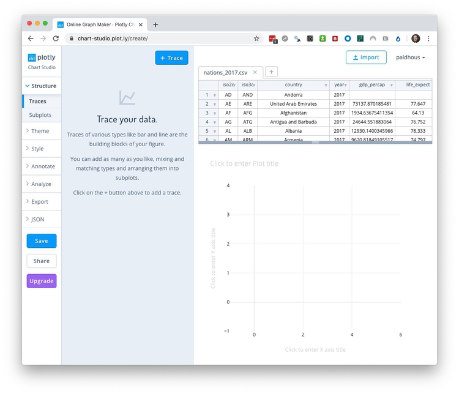

Add a `Trace` the default `Scatter` plot and map `gdp_percap` onto the `X` axis and `life_expect` onto the `Y`:


To color the circles by region, select `Transforms` under the `Structure` menu, click `+ Transform`, select `Split`, and split by `region` to color the countries by their region.

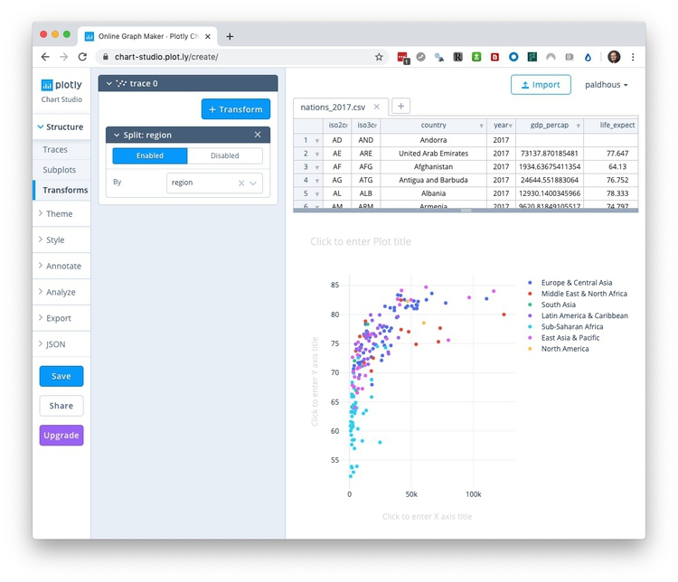

Under `General` in the `Style` menu, set the `Typeface` to `Arial`.

In the `Style` menu under `Traces`, select the `By Type` tab, click on the color palette under `Points` and select `Set2`, which is a ColorBrewer palette.

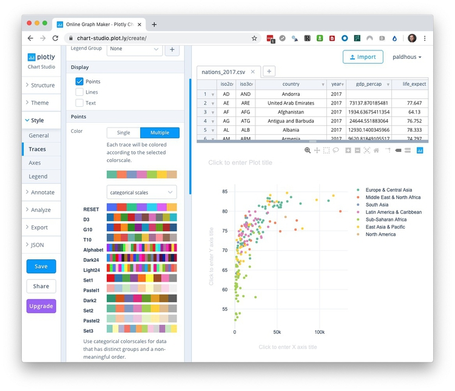

Scroll further down to select `Variable` under `Size` and in the `Choose data` box select `Population` to size the circles by the countries' populations.


Scroll further down to select `country` under `Text` and check `Text` under `Hover/Tooltip Text` so that the tooltip shows country names, as well as the values on the `X` and `Y` axes.


Under `Axes`, edit the axis titles, and to mimic the appearance of the chart we saw in the Gapminder video switch the `Axis Type` to `Log` for the `X` axis under `Range`. For the `X` axis, also add a `Prefix` of `$` under `Tick Labels`:

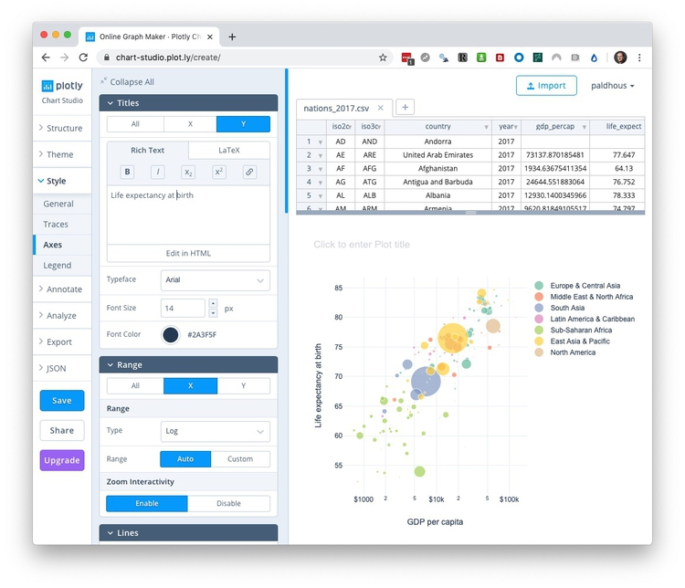

Under `Legend` adjust the orientation and position of the legend:

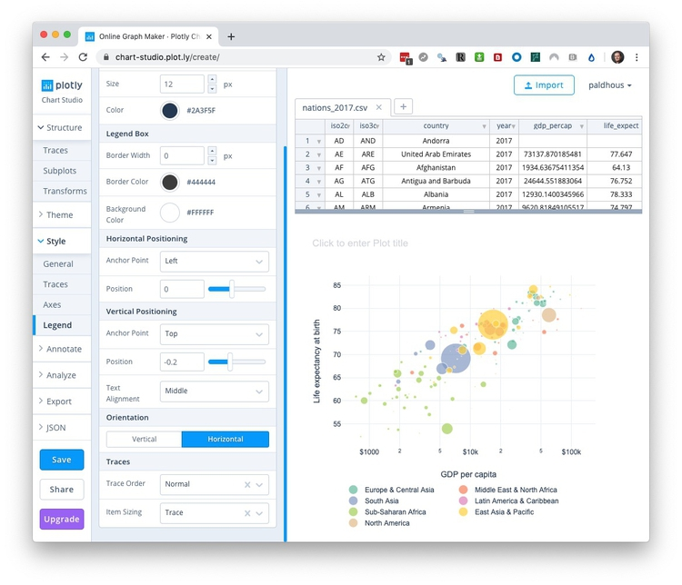

Save the chart, and then export/share as before.

### Further reading/resources

**[Plotly Chart Studio Tutorials](https://help.plot.ly/tutorials/)**


