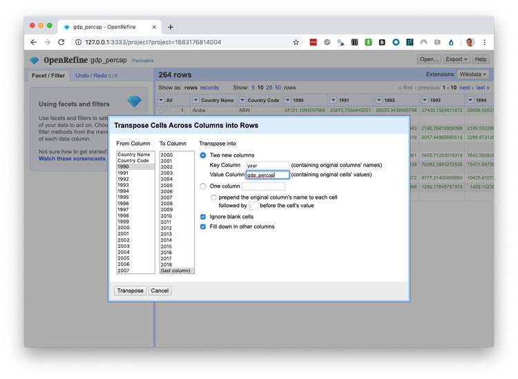
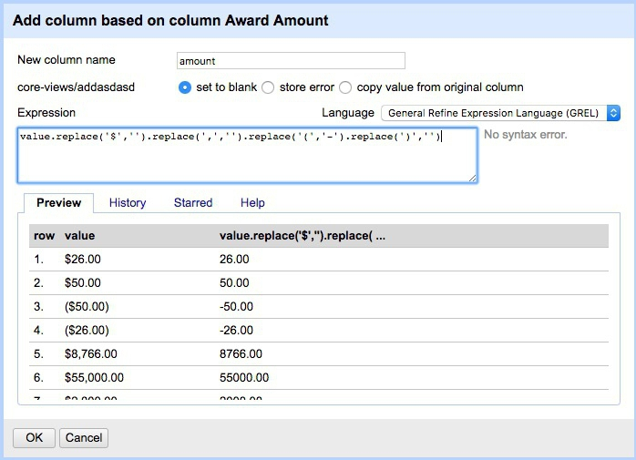
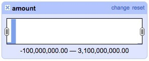
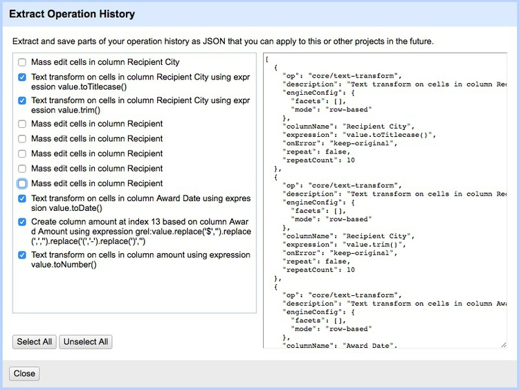

# Cleaning and processing data

In this class, we will consider how to recognize and clean “dirty” data.

### The data we will use

Download the data for this session from [here](data/cleaning-data.zip), unzip the folder and place it on your desktop. It contains the following files:

- `gdp_percap.csv` [World Bank data](https://data.worldbank.org/indicator/NY.GDP.PCAP.PP.CD) on Gross Domestic Product (GDP) per capita for nations and groups of nations, from 1990 to 2018, in current international dollars, corrected for purchasing power in different territories.

- `ucb_stanford_2014.csv` Data on federal government grants to UC Berkeley and Stanford University in 2014, downloaded from [USASpending.gov](https://www.usaspending.gov/).

#### Is your data wide, or long?

Particularly when data shows a time series for a single variable, it is often provided like the example below, downloaded from the [World Bank's data site](http://data.worldbank.org/indicator/?tab=all) on the [value of high-technology exports](http://data.worldbank.org/indicator/TX.VAL.TECH.CD?view=chart) for different countries and groups of countries over time, expressed in current US dollars. There are four variables in this data, which I've color-coded to make them easier to spot:


The variables are:
- `Country Name` Yellow
- `Country Code` Green
- `Year` Blue
- `High-Tech Exports` Pink

While this "wide" data format makes the spreadsheet easier for people to scan, most software for data analysis and visualization wants the data in a tidy "long" format, with one variable in each column, like this:


So you may need to convert data from wide to long format.

### Can I trust this data?

Having identified a possible source of data for your project, you need to ask: Is it reliable, accurate and useful? If you rush into analysis or visualization without considering this question, your hard work may be undermined by the maxim: “Garbage In, Garbage Out.”

The best rule of thumb in determining the reliability of a dataset is find out whether it has been used for analysis before, and by whom. If a dataset was put together for an academic study, or is actively curated so it can be made available for experts to analyze, you can be reasonably confident that it is as complete and accurate as it can be -- the U.S. Geological Survey's earthquake data is a good example.

While in general you might be more trusting of data downloaded from a `.gov` or `.edu` domain than something found elsewhere on the web, don’t simply assume that it is reliable and accurate. Be especially wary of databases that are compiled from forms submitted to government agencies, such as the [Bioresearch Monitoring Information System](https://www.fda.gov/Drugs/InformationOnDrugs/ucm135162.htm) (BMIS) database we discussed last week.

Government agencies may be required by law to maintain databases such as BMIS, but that doesn’t mean that the information contained in them is wholly reliable. First, forms may not always be submitted, making the data incomplete. Second, information may be entered by hand from the forms into the database -- and not surprisingly, mistakes are made.

So before using any dataset, do some background research to find out how it was put together, and whether it has been rigorously checked for errors. If possible, try to speak to the people responsible for managing the database, and any academics or other analysts who have used the data. They will be your best guide to a dataset’s strengths and weaknesses.

Even for well-curated data, make a point of speaking with experts who compile it or use it, and ask them about the data's quirks and limitations. From talking with experts on hurricanes, for example, I know not to place too much trust in data on North Atlantic storms prior to about 1990, before satellite monitoring was well developed -- even though the data available from NOAA goes back to 1851.

Always ask probing questions of a dataset before putting your trust in it. Is this data complete? Is it up-to-date? If it comes from a survey, was it based on a representative sample of people who are relevant to your project? Remember that the first dataset you find online may not be the most relevant or reliable.

### Recognize dirty data

In an ideal world, every dataset we find would have been lovingly curated, allowing us to start analyzing and visualizing without worrying about its accuracy.

In practice, however, often the best available data has some flaws, which may need to be corrected as far as is possible. So before starting to work with a new dataset, load it into a spreadsheet or database and take a look for common errors. Here, for example, is a sample of records from the BMIS database, with names including non-alphabetical characters -- which are clearly errors:


(Source: Peter Aldhous, from [Bioresearch Information Monitoring System](https://www.fda.gov/Drugs/InformationOnDrugs/ucm135162.htm) data)

Look for glitches in the alignment of columns, which may cause data to appear under the wrong field.

For people’s names, look for variations in spelling, format, initials and accents, which may cause the same person to appear in multiple guises. Similar glitches may affect addresses, and any other information entered as text.

Some variables offer obvious checks: if you see a zip code with less than 5 digits, for instance, you know it must be wrong.

Dates can also be entered incorrectly, so it’s worth scanning for those that fall outside the timeframe that should be covered by the data.

Also scan numbers in fields that represent continuous variables for any obvious outliers. These values are worth checking out. Are they correct, or did someone misplace a decimal point or enter a number in the wrong units?

Other common problems are white spaces before and after some entries, which may need to be stripped out.

At all stages of your work, pay attention to zeros. Is each one actually supposed to represent zero, or should the cell in fact be empty, or "null"? Take particular care when exporting data from one software tool and importing to another, and check how nulls have been handled.

### Clean and process data with Open Refine

Checking and cleaning "dirty" data, and processing data into the format you need, can be the most labor intensive part of many data journalism projects. However, **[Open Refine](http://openrefine.org/)** can streamline the task -- and also create a reproducible script to quickly repeat the process on data that must be cleaned and processed in the same way.

When you launch Open Refine, it opens in your web browser. However, any data you load into the program will remain on your computer -- it does not get posted online.

The opening screen should look like this:


#### Reshape data from wide to long format

Click the `Choose Files` button and navigate to the file `gdp_percap.csv`. Click `Next>>`, and at the next screen make sure `Parse cell text into numbers, dates,...` is checked, and edit the `Project name` as desired:


Open Refine diplays numbers and dates in green, and text entires in black. So checking this button should make the numbers turn green. Open Refine should also recognize that the data is in a CSV file, but if not you can use the panel at bottom to specify the correct file type and format for the data.

When you are satisfied that the data has been read correctly, click the `Create Project >>` button at top right. The screen should now look like this:


As you can see, the data is in wide format, with values for GDP per capita by country organized in columns, one for each year. To convert this to long format, click on the small downward-pointing triangle for the first of these year columns, and select `Transpose>Transpose cells across columns into rows`.

Fill in the dialog box as below, making sure that `From Column` and `To Column` are highlighted correctly, that the `Key column` and `Value column` have been given appropriate names, and that `Fill down in other columns` is checked. (Failing to do check this box will mean that the region names each will only appear once in the reshaped data, rather than being copied down to appear next to the corresponding data for year and GDP per capita.)



Click `Transpose` and then the `50` rows link, to see the first 50 rows of the reshaped data:


Click the `Export` button at top right and you will see options to export the data in a variety of file types, including `Comma-separated value` and `Excel` spreadsheet.

#### Clean and process dirty data

Click the Open Refine logo at top left to return to the opening screen. Create a new project from the file `ucb_stanford_2014.csv`.

Again, each field/column has a button with a downward-pointing triangle. Click on these buttons and you get the option to create “facets” for the column, which provide a powerful way to edit and clean data.

The `All` columns dropdown menu in Open Refine can be useful to remove unwanted columns and quickly recorder those you want to retain. Select `Edit Columns>Re-order / remove columns` to pull up this dialog box:


Here we will keep all the data, however.

Click on the button for the field `Recipent City`, and select `Facet>Text facet`. A summary of the various entries now appears in the panel to the left:


The numbers next to each entry show how many records there are for each value.

We can edit entries individually: Select `Veterans Bureau Hospi`, which is clearly not a city, click on the `Edit` link, change it to `Unknown`. (If cleaning this data for a real project, we would need to check with an external source to get the actual city for this entry.)

Another problem is that we have a mixture of cases, with some entries in Title or Proper Case, some in UPPERCASE. We can fix this back in the field itself. Click its button again and select `Edit cells>common transforms>To titlecase`.

Now notice that we apparently have duplicate entries for `Berkeley`, `Palo Alto` and `Stanford`. This is the result of trailing white space after the city names for some entries. Select `Edit cells>common transforms>Trim leading and trailing whitespace` and notice how the problem resolves:


Having cleaned this field, close the facet by clicking the cross at top left.

Now create a text facet for the field `Recipient`:


What a mess! The only possibilities are Stanford or Berkeley, yet there are multiple variants of each, many including `Board of Trustees` for Stanford and `Regents of` for UC Berkeley.

First, manually edit `Interuniveristy Center for Japanese Language` to `Stanford`, which is where this center is based.

We could contrinute editing manually, but to illustrate Open Refine's editing functions click on the `Cluster` button. Here you can experiment with different clustering algorithms to edit entries that may be variants of the same thing. Select `key collision` and `metaphone3`, then start checking the clusters and renaming them as `Berkeley` or `Stanford` as appropriate:


Click `Merge Selected & Close` and the facet can then be quickly edited manually:


Often you may need to convert fields to text, numbers or dates. For example, click on the button for `Award Date` and select `Edit cells>common transforms>To date` and see that it changes from a string of text to a date in standard format.

Notice the field `Award amount`, which is a value in dollars with a dollar sign. Negative values are given in brackets and there are commas to separate thousands. Because of these symbols, the field is being recognized as a string of text, rather than a number. So to fix this problem, we have to remove the symbols.

Select `Edit colum>Add column based on this column...` and fill in the dialog box as follows:



Here is what I entered under `Expression`:

```Javascript
value.replace('$','').replace(',','').replace('(','-').replace(')','')
```

Here `value` refers to the value in the original column, and `replace` is a function that replaces characters in the value. We can run several `replace` operations by "chaining" them together.

Here we are replacing the "$" symbols, the commas separating thousands, and the closing brackets with nothing; we are replacing the opening brackets with a hyphen to designate negative numbers.

Click `OK` and the new column will be created. Note that it is still being treated as text, but that can be corrected by selecting `Edit cells>common transforms>To number`.

This is just one example of many data transformation functions that can be accessed using Open Refine's expression language, called GREL. Learning these functions can make Open Refine into a very powerful data processing tool. Study the "Further reading" links for more.

Open Refine's facets can also be used to inspect columns containing numbers. Select `Facet>Numeric facet` for the new field. This will create a histogram showing the distribution of numbers in the field:



We can then use the slider controls to filter the data, which is good for examining possible outliers at the top of bottom of the range. Notice that here a small number of grants have negative values, while there is one grant with a value of more than $3 billion from the National Science Foundation. This might need to be checked out to ensure that it is not an error.

While most of the data processing we have explored could also be done in a spreadsheet, the big advantage of Open Refine is that we can extract a "pipeline" for processing data to use when we obtain data in the same format in future.

Select `Undo / Redo` at top left. Notice that clicking on one of the steps detailed at left will transform the data back to that stage in our processing. This means you don't need to worry about making mistakes, as it's always possible to revert to an earlier state, before the error, and pick up from there.

Return to the final step, then click the `Extract` button. At the dialog box, check only those operations that you will want to perform in future (typically generic transformations on fields/columns, and not correcting errors for individual entries). Here I have unchecked all of the corrections in the text facets, and selected just those operations that I know I will want to repeat if I obtain data from this source again:



This will generate JSON in the right hand panel that can be copied into a blank text file and saved.

To process similar data in future. Click the `Apply` button on the `Undo / Redo` tab, paste in the text from this file, and click `Perform Operations`. The data will then be processed automatically.

When you are finished cleaning and processing your data, click the `Export` button at top right to export as a CSV file or in other formats.

Open Refine is a very powerful tool that will reward efforts to explore its wide range of its functions for manipulating data. See the "Further reading" for more.

#### Filtering data in Open Refine

Clicking `Export` will export the data currently being viewed.

This means you can filter data based on values of a continuous variable using the slider control on a numeric facet.

To filter data based on text or categorical variables, you can create a text filter.

From the dropdown menu for `Recipient`, select `Text filter` and type `Berkeley`. This will filter the data to the 1387 grants awarded to Berkeley.

To delete records based on a text filter, set the filter and then select `Edit rows>Remove all matching rows` from the `All` columns dropdown.


### Correct for inflation (and cost of living)

A common task in data journalism and visualization is to compare currency values over time. When doing so, it usually makes sense to show the values after correcting for inflation -- for example in constant 2018 dollars for a time series ending in 2018. Some data sources, such as the World Bank, provide some data both in raw form or in a given year's constant dollars.

So pay attention to whether currency values have already been corrected for inflation, or whether you will need to do so yourself. When correcting for inflation in the United States, the most widely-used method is the [**Consumer Price Index**](https://www.bls.gov/cpi/), or CPI, which is based on prices paid by urban consumers for a representative basket of goods and services. Use this online [calculator](https://data.bls.gov/cgi-bin/cpicalc.pl) to obtain conversions.

For comparing currency values across nations, regions or cities, you may also need to correct for the cost of living -- or differences in what a dollar can buy in different places. For World Bank indicators, look for the phrase "purchasing power parity," or PPP, for data that includes this correction. PPP conversion factors for nations over time are given [here](https://data.worldbank.org/indicator/PA.NUS.PPPC.RF).

### Convert between common data formats

**[Mr Data Converter](https://shancarter.github.io/mr-data-converter/)** is a web app made by Shan Carter, formerly of the graphics team at *The New York Times* and now with [Google Brain](https://research.google.com/teams/brain/), that makes it easy to convert data from a spreadsheet or delimited text file to JSON or XML.

Copy the data from a `CSV` or tab-delimited text file and paste it into the top box, select the output you want, and it will appear at the bottom. You will generally want to select the `Properties` variants of JSON or XML.

You can then copy and paste this output into a text editor, and save the file with the appropriate extension (`.xml`, `.json`).


(Source: [Mr Data Converter](https://shancarter.github.io/mr-data-converter/))

More often, however, you'll want to convert data from JSON or XML into CSV/text files. For this you can use Open Refine. First create a new project and import your JSON or XML file. Use the `Export` button and select `Tab-separated value` or `Comma-separated value` to export as a text file.


### Further reading

[Open Refine Wiki](https://github.com/OpenRefine/OpenRefine/wiki)

[Open Refine Documentation](https://github.com/OpenRefine/OpenRefine/wiki/Documentation-For-Users)

[Open Refine Recipes](https://github.com/OpenRefine/OpenRefine/wiki/Recipes)
