# Processing data with R

### Introducing R and RStudio

In today's class we will work with **[R](http://www.r-project.org/)**, which is a very powerful tool, designed by statisticians for data analysis. Described on its website as "free software environment for statistical computing and graphics," R is a programming language that opens a world of possibilities for making graphics and analyzing and processing data. Indeed, just about anything you may want to do with data can be done with R, from web scraping to making interactive graphics.

Our main goal for this class is to get used to processing and analyzing data using the **[dplyr](https://dplyr.tidyverse.org/)** R package.

**[RStudio](https://www.rstudio.com/)** is an "integrated development environment," or IDE, for R that provides a user-friendly interface.

Launch RStudio, and the screen should look like this:

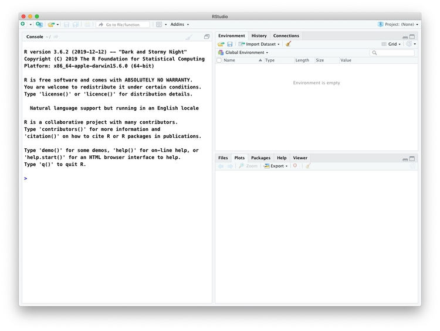

The main panel to the left is the R Console. It shows the version of R you are running, here `3.6.2`.

Type valid R code into here, hit `return`, and it will be run. See what happens if you run:

```R
print("Hello World!")
```

### The data we will use today

Download the data for this session from [here](data/data-processing-r.zip). You do not need to unzip. It contains the following files:

- `nations.csv` Data from the [World Bank Indicators](https://data.worldbank.org/indicator/) portal. Contains the following fields:
 -  `iso2c` `iso3c` Two- and Three-letter codes for each country, assigned by the [International Organization for Standardization](https://www.iso.org/standard/63545.html).
 - `country` Country name.
 - `year`
 - `population` Estimated [total population](https://data.worldbank.org/indicator/SP.POP.TOTL) at mid-year, including all residents apart from refugees.
 - `gdp_percap` [Gross Domestic Product per capita](https://data.worldbank.org/indicator/NY.GDP.PCAP.PP.CD) in current international dollars, corrected for purchasing power in different territories.
 - `life_expect` [Life expectancy at birth](https://data.worldbank.org/indicator/SP.DYN.LE00.IN), in years.
 - `population` Estimated [total population](https://data.worldbank.org/indicator/SP.POP.TOTL) at mid-year, including all residents apart from refugees.
 - `region` `income` World Bank [regions and income groups](https://siteresources.worldbank.org/DATASTATISTICS/Resources/CLASS.XLS), explained [here](https://datahelpdesk.worldbank.org/knowledgebase/articles/906519).

- `co2.csv` From the [Global Carbon Atlas](http://www.globalcarbonatlas.org/en/CO2-emissions). Contains the following variables:
 - `iso3c` Three-letter code for each country.
 - `country` Country name.
 - `year`
 - `emissions` Carbon dioxide emissions, in millions of tonnes.

- `kindergarten.csv` Data from the [California Department of Public Health](https://www.shotsforschool.org/k-12/reporting-data/), documenting enrollment and the number of children with complete immunizations at entry into kindergartens in California from 2001 to 2014. Contains the following variables:
  - `district` School district.
  - `sch_code` Unique identifying code for each school.
  - `pub_priv` Whether school is public or private.
  - `school` School name.
  - `enrollment` Number of children enrolled.
  - `complete` Number of children with complete immunizations.
  - `start_year` Year of entry (for the 2014-2015 school year, for example, this would be 2014).

- `kindergarten_2015.csv` As above, but data from 2015 only.


### Reproducibility: Save your scripts

Data journalism should ideally be fully documented and reproducible. R makes this easy, as every operation performed can be saved in a script, and repeated by running that script. Click on the  icon at top left and select `R Script`. A new panel should now open:

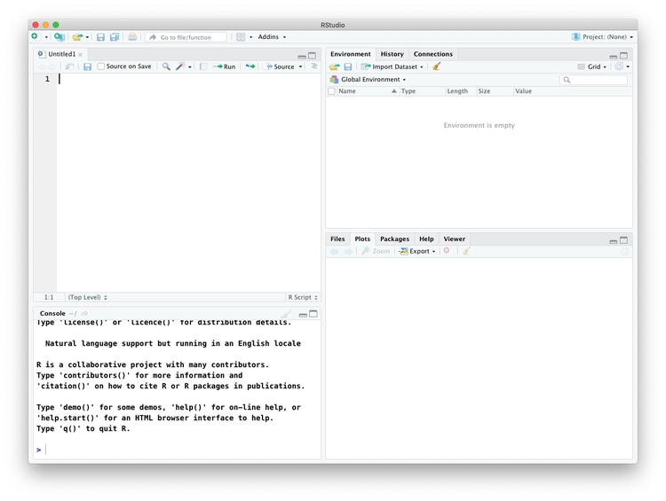

Any code you type in here can be run in the console. Hitting `Run` will run the line of code on which the cursor is sitting. To run multiple lines of code, highlight them and click `Run`.

Click on the save/disk icon in the script panel and save the blank script to the file on your desktop with the data for this week, calling it `data_processing.R`.

### Set your working directory

Now you can set the working directory to this folder by selecting from the top menu `Session>Set Working Directory>To Source File Location`. (Doing so means you can load the files in this directory without having to refer to the full path for their location, and anything you save will be written to this folder.)

Notice how this code appears in the console:

```R
setwd("~/Desktop/data_processing_r")
```

When working in RStudio, you can add the following line to the top of your script to automatically set your working directory to the folder containing the script:

```R
# set working directory to the folder containing this script
setwd(dirname(rstudioapi::getActiveDocumentContext()$path))
```

So add this code to the top of your script now.

### Comment your code

Anything that appears on a line after `#` will be treated as a comment, and will be ignored when the code is run. Use this to explain what the codes does. Get into the habit of commenting your code: Don't trust yourself to remember!

### Save your data

The panel at top right has three tabs, the first showing the `Environment`, or all of the "objects" loaded into memory for this R session. We can save this as well, so we don't have to load and process data again if we return to return to a project later.

Click on the save/disk icon in the `Environment` panel to save and call the file `data_processing.RData`. You should see the following code appear in the Console:

```r
save.image("~/Desktop/data_processing_r/data_processing.RData")
```
Copy the code below into your script, placing it at the end, with a comment, explaining what it does:

```r
# save session data
save.image("data_processing.RData")```

You don't need to define the full path to save the data file because you already have set the working directory to this location. Now if you run your entire script, the last action will be to save the data in your environment.

From now on, add code to your script **between** the two lines we have added so far.

From the top menu, select `RStudio>Preferences`, and change `Save workspace to .RData on exit` to `Never`:


This change in your settings will ensure that the contents of your environment are not saved into a generic file that will load each time you open RStudio.

Each time you shut down RStudio, also make sure to close your script(s) and any data files that you have open to view. If you don't, they will reopen the next time you launch RStudio.


### Some R code basics

- `<-` is known as an “assignment operator.” It means: “Make the object named to the left equal to the output of the code to the right.”
- `&` means AND, in Boolean logic.
- `|` means OR, in Boolean logic.
- `!` means NOT, in Boolean logic.
- When referring to values entered as text, or to dates, put them in quote marks, like this: `"United States"`, or `"2017-07-26"`. Numbers are not quoted.
- When entering two or more values as a list, combine them using the function `c`, with the values separated by commas, for example: `c("2018-08-26","2018-09-04")`
- As in a spreadsheet, you can specify a range of values with a colon, for example: `c(1:10)` creates a list of integers (whole numbers) from one to ten.
- Some common operators:
 - `+` `-` Add, subtract.
 -  `*` `/` Multiply, divide.
 -  `>` `<` Greater than, less than.
 -  `>=` `<=` Greater than or equal to, less than or equal to.
 -  `!=` Not equal to.

- Equals signs can be a little confusing, but see how they are used in the code we use today:

 -  `==` Test whether an object is equal to a value. This is often used when filtering data, as we will see.
 -  `=` Make an object equal to a value; works like `<-`, but used within the parentheses of a function.

- Handling null values:
 - Nulls are designated as `NA`.
 - `is.na(x)` looks for nulls within variable `x`.
 - `!is.na(x)` looks for non-null values within variable `x`.

In the code above, `is.na`, `c`, `setwd`, `print`, and so on are **functions**. Functions are followed by parentheses, and act on the data/code in the parenthesis.

==**Important:**== Object and variable names in R should not contain spaces.

### Install and load R packages

Much of the power of R comes from the thousands of "packages" written by its community of contributors. These are optimized for specific statistical, graphical, or data-processing tasks. To see what packages are available in the basic distribution of R, select the `Packages` tab in the panel at bottom right. To find packages for particular tasks, try searching Google using appropriate keywords and the phrase "R package."

In this class, we will work with two incredibly useful packages developed by [Hadley Wickham](http://hadley.nz/), chief scientist at RStudio:

- **[readr](https://readr.tidyverse.org/)** Reads and writes CSV and other text files.
- **[dplyr](https://dplyr.tidyverse.org/)** Processes and analyzes data, using the operations we discussed in the first class.

These and several other useful packages have been combined into a super-package called the **[tidyverse](https://www.tidyverse.org/)**, which have a common underlying grammar.

To install a package, click on the `Install` icon in the `Packages` tab, type its name into the dialog box, and make sure that `Install dependencies` is checked, as some packages will only run correctly if other packages are also installed. Click `Install` and all of the required packages should install:

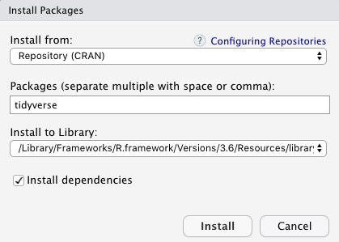

Notice that the following code appears in the console:

```r
install.packages("tidyverse")
```
So you can also install packages with code in this format, without using the point-and-click interface.

Each time you start R, it's a good idea to click on `Update` in the `Packages` panel to update all your installed packages to the latest versions.

Installing a package makes it available to you, but to use it in any R session you need to load it. You can do this by checking its box in the `Packages` tab. However, we will enter the following code into our script, then highlight these lines of code and run them:

```r
# load packages to read, write and process data
library(readr)
library(dplyr)
```
At this point, and at regular intervals, save your script, by clicking the save/disk icon in the script panel, or using the `⌘-S` or `Ctrl-S` keyboard shortcut.

### Load and view data

#### Load data

You can load data into R using `Import Dataset` in the `Environment` tab. However, we will use the `read_csv` function from the **readr** package. Copy the following code into your script and `Run`:

```r
# load nations data
nations <- read_csv("nations.csv")

```

Notice that the `Environment` now contains ab object called `nations`.

If your enviroment is in the `List` view (look at top right), use the drop-down menu to switch to the `Grid` view.

The two objects will be of type `spec_tbl_df`, a variety of the standard R object for holding tables of data, known as a **data frame**:

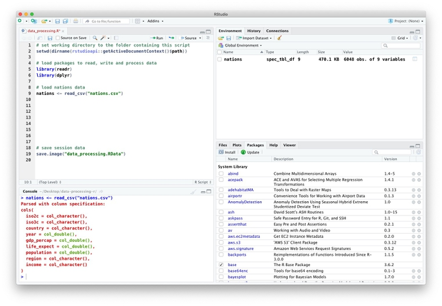

The `Value` for each data frame details the number of columns, and the number of rows, or observations, in the data.

You can remove any object from your environment by checking it in the `Grid` view and clicking the broom icon. You can also use the code `rm(object)`.


#### Examine the data

We can `View` data at any time by clicking on its table icon in the `Environment` tab in the `Grid` view, or with the code `View(object)`.

The `glimpse` function will tell you more about the columns in your data, including their data type. Copy this code into your script and `Run`:

```r
# view structure of data
glimpse(nations)
```
This should give the following output in the R Console:

```JSON
Observations: 6,048
Variables: 9
$ iso2c       <chr> "AD", "AD", "AD", "AD", "AD", "AD", "AD", "AD",…
$ iso3c       <chr> "AND", "AND", "AND", "AND", "AND", "AND", "AND"…
$ country     <chr> "Andorra", "Andorra", "Andorra", "Andorra", "An…
$ year        <dbl> 1990, 1995, 1996, 1997, 1998, 1999, 2000, 2001,…
$ gdp_percap  <dbl> NA, NA, NA, NA, NA, NA, NA, NA, NA, NA, NA, NA,…
$ life_expect <dbl> NA, NA, NA, NA, NA, NA, NA, NA, NA, NA, NA, NA,…
$ population  <dbl> 54509, 63850, 64360, 64327, 64142, 64370, 65390…
$ region      <chr> "Europe & Central Asia", "Europe & Central Asia…
$ income      <chr> "High income", "High income", "High income", "H…```

`chr` means "character," or a string of text (which can be treated as a categorical variable); `int` means an integer or whole number; `dbl` means a number that can contain decimal fractions; `dttm` means a date-time variable.

If you run into any trouble importing data with **readr**, you may need to specify the data types for some columns -- in particular for date and time. [This link](https://readr.tidyverse.org/articles/readr.html) explains how to set data types for individual variables when importing data with **readr**.

To specify an individual column use the name of the data frame and the column name, separated by `$`. Type this into your script and run:

```r
# print values for population in the nations data
nations$population
```
The output will be the first 1,000 values for that column.

If you need to change the data type for any column, use the following functions:

- `as.character` converts to a text string.
- `as.double` converts to a number that can include decimal fractions.
- `as.factor` converts to a categorical variable.
- `as.integer` converts to an integer.
- `as.Date` converts to a date.
- `as.POSIXct` converts to a full date and timestamp.

(To convert a date/time written as a string of text to a date or a full timestamp, you may also need to specify the format, see [here](https://www.r-bloggers.com/date-formats-in-r/) for more.)

This code will convert the population numbers from integers to numbers that could hold decimal fractions:

```r
# convert population to integer
nations$population <- as.integer(nations$population)
glimpse(nations)
```
Notice that the data type for `population` has now changed:

```JSON
Observations: 6,048
Variables: 9
$ iso2c       <chr> "AD", "AD", "AD", "AD", "AD", "AD", "AD", "AD",…
$ iso3c       <chr> "AND", "AND", "AND", "AND", "AND", "AND", "AND"…
$ country     <chr> "Andorra", "Andorra", "Andorra", "Andorra", "An…
$ year        <dbl> 1990, 1995, 1996, 1997, 1998, 1999, 2000, 2001,…
$ gdp_percap  <dbl> NA, NA, NA, NA, NA, NA, NA, NA, NA, NA, NA, NA,…
$ life_expect <dbl> NA, NA, NA, NA, NA, NA, NA, NA, NA, NA, NA, NA,…
$ population  <int> 54509, 63850, 64360, 64327, 64142, 64370, 65390…
$ region      <chr> "Europe & Central Asia", "Europe & Central Asia…
$ income      <chr> "High income", "High income", "High income", "H…> ```

The `summary` function will run a quick statistical summary of a data frame, calculating mean, median and quartile values for continuous variables:

```r
# summary of nations data
summary(nations)
```
Here is the console output:

```JSON
   iso2c              iso3c             country         
 Length:6048        Length:6048        Length:6048       
 Class :character   Class :character   Class :character  
 Mode  :character   Mode  :character   Mode  :character  
                                                         
                                                         
                                                         
                                                         
      year        gdp_percap      life_expect      population       
 Min.   :1990   Min.   :   301   Min.   :26.17   Min.   :8.913e+03  
 1st Qu.:1997   1st Qu.:  2579   1st Qu.:62.29   1st Qu.:6.075e+05  
 Median :2004   Median :  7313   Median :70.76   Median :5.300e+06  
 Mean   :2004   Mean   : 14343   Mean   :68.36   Mean   :2.958e+07  
 3rd Qu.:2010   3rd Qu.: 19817   3rd Qu.:75.58   3rd Qu.:1.797e+07  
 Max.   :2017   Max.   :139962   Max.   :85.42   Max.   :1.386e+09  
                NA's   :855      NA's   :496     NA's   :17         
    region             income         
 Length:6048        Length:6048       
 Class :character   Class :character  
 Mode  :character   Mode  :character  
     ```

### Process and analyze data with dplyr

Now we will use **dplyr** to process the data, using the basic operations we discussed in the first class:

- **Sort:** Largest to smallest, oldest to newest, alphabetical etc.

- **Filter:** Select a defined subset of the data.

- **Summarize/Aggregate:** Deriving one value from a series of other values to produce a summary statistic. Examples include: count, sum, mean, median, maximum, minimum etc. Often you'll **group** data into categories first, and then aggregate by group.

- **Join:** Merging entries from two or more datasets based on common field(s), e.g. unique ID number, last name and first name.

Here are some of the most useful functions in **dplyr**:

- `select` Choose which columns to include.
- `filter` **Filter** the data.
- `arrange` **Sort** the data, by size for continuous variables, by date, or alphabetically.
- `group_by` **Group** the data by a categorical variable.
- `summarize` **Summarize**, or aggregate (for each group if following `group_by`). Often used in conjunction with functions including:
	- `mean(x)` Calculate the mean, or average, for variable `x`.
	- `median(x)` Calculate the median.
	- `max(x)` Find the maximum value.
	- `min(x)` Find the minimum value.
	- `sum(x)` Add all the values together.
	- `n()` Count the number of records. Here there isn't a variable in the brackets of the function, because the number of records applies to all variables.
	- `n_distinct(x)` Count the number of unique values in variable `x`.
- `mutate` Create new column(s) in the data, or change existing column(s).
- `rename` Rename column(s).
- `bind_rows` Append one data data frame to another, combining data from columns with the same name.
- `unique` remove duplicate rows.

There are also various functions to **join** data, which we will explore later.

These functions can be chained together using the "pipe" operator `%>%`, which makes the output of one line of code the input for the next. This allows you to run through a series of operations in a logical order. I find it helpful to think of `%>%` as meaning "then."

#### Filter and sort data

Now we will **filter** and **sort** the data in specific ways. For each of the following examples, copy the code that follows into your script, and view the results. Notice how we create new objects to hold the processed data.

##### Filter the data for 2017 only

```r
# filter data for 2017 only, and select columns for country, life expectancy, income group, and region
longevity <- nations %>%
  filter(year == 2017 & !is.na(life_expect)) %>%
  select(country, life_expect, income, region)
```
This creates a new object called `longevity` from `nations` and then (`%>%`) filters it for just the data for 2017 and to include only non-null values. Then the code selects just four variables from the nine in the original data frame. There should be data returned for 198 countries.

Here are the first few records in the new object:

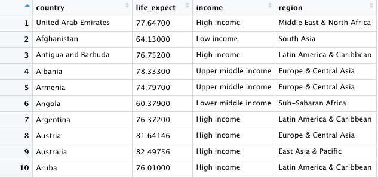

##### Find the ten high-income countries with the shortest life expectancy in 2017

```r
# find the ten high-income countries with the shortest life expectancy
high_income_short_life <- longevity %>%
  filter(income == "High income") %>%
  arrange(life_expect) %>%
  head(10)
```


This code takes the previous `longevity` object, filters it for countries in the high income group only, then sorts the data, using `arrange` (the default is ascending order). Finally it uses `head(10)` to return the first ten countries in the sorted data.

##### Find countries in North America or Europe & Central Asia with a life expectancy in 2016 of between 75 and 80.

```R
# find countries in North America or Europe & Central Asia with a life expectancy in 2017 of 75 - 80
eur_na_75_80 <- longevity %>%
  filter(life_expect > 75 & life_expect < 80 & (region == "Europe & Central Asia" | region == "North America")) %>%
  arrange(desc(life_expect))
```

This should be the result:

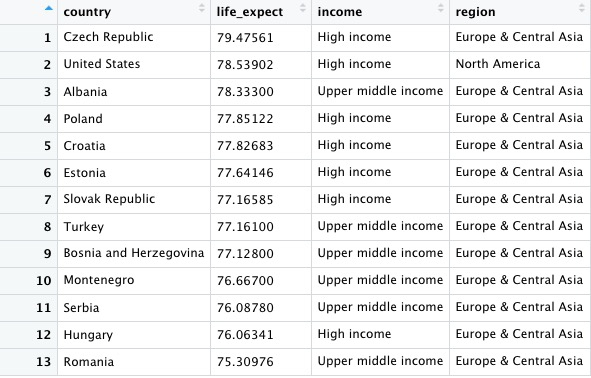

In the initial filter of the data to create the `longevity` data frame we used `&` to return data meeting both criteria. This time we also used `|` to include data meeting either criteria. `&` and `|` are equivalent to `AND` and `OR` in Boolean logic. Notice how the `|` part of the filter is wrapped in parentheses. Look at what happens if you remove them, and work out what is going on.

**==Note:==** When combining `&` and `|` in more complex filters, use parentheses to determine which parts of the evaluation should be carried out first.

##### Find the 20 countries with the longest life expectancy in 2017, plus the United States with its rank, if it lies outside the top 20

```r
# find the 20 countries with the longest life expectancies, 
# plus the United States with its rank, if it lies outside the top 20
long_life <- longevity %>%
  mutate(rank_le = rank(desc(life_expect))) %>%
  arrange(rank_le) %>%
  filter(rank_le <= 20 | country == "United States")
```
This should be the result, showing the United States to rank a lowly 46th:

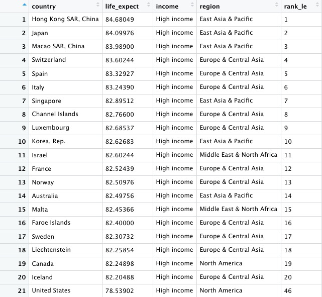

This codes starts by creating a new variable in the data called `rank_le`, using the `mutate` function from dplyr and the `rank` function (https://www.rdocumentation.org/packages/base/versions/3.6.2/topics/rank) from base R. It ends by filtering the data for the top 20 countries, plus the United States.

Notice also in this code that a single `=` is used to change or create values, while `==` is used to test whether a value is equal to something.

This code produces exactly the same result. Make sure you understand why:

```R
long_life <- nations %>%
  filter(year == 2017 & !is.na(life_expect)) %>%
  select(country, life_expect, income, region) %>%
  mutate(rank_le = rank(desc(life_expect))) %>%
  arrange(rank_le) %>%
  filter(rank_le <= 20 | country == "United States")
```

##### Now let's find out where Russia ranks, too
```r
# find the 20 countries with the longest life expectancies,
# plus the United States and Russia with their ranks
long_life <- longevity %>%
  mutate(rank_le = rank(desc(life_expect))) %>%
  arrange(rank_le) %>%
  filter(rank_le <= 20 | grepl("United States|Russia", country))
```

This should be the result:


This code demonstrates some simple pattern matching on text, using the function `grepl("pattern_a|pattern_b", x)`, which searches variable `x` for values containing any of a list of text values. This is useful for fuzzy text matching. Notice how searching for `Russia` returns `Russian Federation`, which is the country's full name. (`!grepl` will return text strings that *don't* contain the specified pattern.)


**==Note:==** You can overwrite an object by assigning some new code to the same name used previously.

#### Some practice with filtering and sorting

- Find the countries with a life expectancy of between 50 and 60 years in 1990, arranged in descending order of life expectancy.

- Find upper middle and lower middle income countries with a life expectancy of between 60 and 70 in 1990. Sort in descending order of life expectancy.

- Find countries that in 1990 had a GDP per capita of more than $50,000 dollars and a life expectancy of 70 years or more that were not in Europe or North America. Sort them in ascending order of life expectancy.

#### Write data to a CSV file

**readr** can write data to CSV and other text files. This code will save the result above to a CSV file in your working directory:

```r
# write data to a csv file
write_csv(long_life, "long_life.csv", na="")
```
Although we have no null values here, including `na=""` is good practice, because it ensures that any empty cells in the data frame are saved as blanks, not `NA`.

#### Group and summarize data

##### Summarize the longevity data by year, finding the country-level maximum, minimum, and range.

```r
# summarize the data by year, finding the maximum and minimum country-level life expectancies, and then calculate the range of values
longevity_summary <- nations %>%
  filter(!is.na(life_expect)) %>%
  group_by(year) %>%
  summarize(countries = n(),
            max_life_expect = max(life_expect),
            min_life_expect = min(life_expect)) %>%
  mutate(range_life_expect = max_life_expect - min_life_expect) %>%
  arrange(desc(year))
```

This should be the first few rows in the data:


This code introduces the functions `group_by` and `summarize`. The entire `summarize` function could be written on one line, but I have started a new line after each summary statistic for clarity.

In this example, we calculated the number of countries for which we have data in each year, then the maximum and minimum country-level life expectancies. Having done that, we used the `mutate` function to calculate the range of values by subtracting the minimum from the maximum.

##### Calculate total GDP by region and year

```r
# total GDP, in trillions of dollars, by region, over time
gdp_regions <- nations %>%
  mutate(gdp = gdp_percap * population,
         gdp_tn = gdp/1000000000000) %>%
  group_by(region, year) %>%
  summarize(total_gdp_tn = sum(gdp_tn, na.rm = TRUE))
```
This should be the first few rows in the data:

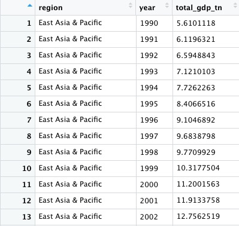

We could also write `10^12` (10 raised to the power of 12) instead of `1000000000000` in this example.

Notice that variables created within a `mutate` function can be immediately used within the same function.

Here the `group_by` function groups on two variables, `region` and `year`.

Notice that the `sum` function used to add up the GDP values across countries within each region and year includes the argument `na.rm = TRUE`, to remove the `NA` values before running the calculation. See what happens if you don't include this. Previously this wasn't necessary because we had started by filtering out the `NA`s.

**==Note:==** Get into the habit of including `na.rm = TRUE` in your summary functions, to avoid problems caused by null values!

#### Some practice with grouping and summarizing (and filtering and sorting)

- Calculate the total GDP by income group and year. Sort the results in descending order of years and, within year, in descending order of GDP.

- Calculate the total GDP for the East Asia & Pacific region, by income group and year.

#### Join data from two data frames

There are also a number of **join** functions in **dplyr** to combine data from two data frames. Here are the most useful:

- `inner_join` returns values from both tables only where there is a match.
- `left_join` returns all the values from the first-mentioned table, plus those from the second table that match.
- `semi_join` filters the first-mentioned table to include only values that have matches in the second table.
- `anti_join` filters the first-mentioned table to include only values that have no matches in the second table.

[Here is a useful reference](https://stat545.com/join-cheatsheet.html) for managing joins with **dplyr**.

This code will load the carbon dioxide emissions data and join to the nations data.

```r
# load co2 emissions data
co2 <- read_csv("co2.csv")

# join nations to co2
nations2 <- inner_join(nations, co2, by = c("iso3c" = "iso3c", "year" = "year"))
```
See what happens if you use `left_join` or `right_join` instead of inner join. Here we specified exactly how the join should be made with the code starting with `by`.

If you don't specificy the columns to join on, **dplyr** looks for variables with matching names, here `iso3c`, `country`, and `year`, and joins on those. What happens if you run the following code, and why?

```r
# join nations to co2
nations3 <- inner_join(nations, co2)
```

##### Calculate total carbon dioxide emissions by region and year

In the joined data frame, we can now calculate the total carbon dioxide emissions for each country and each year, and then add up the totals by region over the years:

```r
# total carbon dioxide emissions, in gigatonnes, by region, over time
co2_regions_year <- nations %>%
  group_by(region, year) %>%
  summarize(total_co2 = sum(co2, na.rm = TRUE))
```
Here are the first few rows in the data:

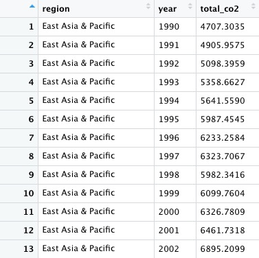

### Load California kindergarten immunization data

Now we'll work with the California immunization data.

```r
# load data
immun <- read_csv("kindergarten.csv",  col_types = list(
  .default = col_character(),
  enrollment = col_integer(),
  complete  = col_integer(),
  start_year = col_integer()))

immun_2015 <- read_csv("kindergarten_2015.csv",  col_types = list(
  .default = col_character(),
  enrollment = col_integer(),
  complete  = col_integer(),
  start_year = col_integer()))
```

We need to append the data for 2015 to the older data. This code specifies the data type for each variable, to be sure that there won't be any mismatches in data type that would cause an error in the next step. We used `.default` to set the default data type for any other columns not specifically defined.

#### Append the 2015 data to the older data using `bind_rows`

```r
# append the 2015 data to the older data
immun <- bind_rows(immun, immun_2015)
```

This code introduces the `bind_rows` function, which appends one data frame to another, based on matching column names and data types. (If a column exists in one data frame but not in the other, `NA`s will be added where necessary.)

#### Calculate the percentage of children with incomplete immunizations, for the entire state, and by county

The data contains the number of children enrolled in each kindergarten across the state, and the number who had the complete recommended immunizations at the start of the year.

From this, we can calculate the percentage of children who did not have the complete schedule of immunizations. The following code runs these calculations for each year, first for the entire state, summing across all kindergartens grouped by year, and then for each of California's 58 counties, by changing the `group_by` function.

```r
# percentage incomplete, entire state, by year
immun_year <- immun %>%
  group_by(start_year) %>%
  summarize(enrolled = sum(enrollment, na.rm=TRUE),
            completed = sum(complete, na.rm=TRUE)) %>%
  mutate(pc_incomplete = round(((enrolled-completed)/enrolled*100),2))
```
This should be the result:

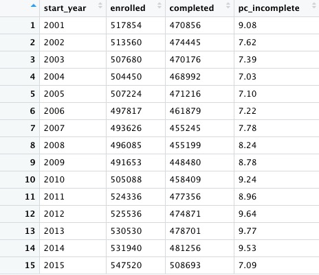

Notice how the `round(x,n)` function is used to round values for `x`, here the percentage incomplete calculation, to `n` decimal places, here 2. Using negative numbers for `n` will round to tens (-1), hundreds (-2), and so on.

```r
# percentage incomplete, by county, by year
immun_counties_year <- immun %>%
  group_by(county,start_year) %>%
  summarize(enrolled = sum(enrollment, na.rm = TRUE),
            completed = sum(complete, na.rm = TRUE)) %>%
  mutate(pc_incomplete = round(((enrolled-completed)/enrolled*100),2))
```
Here are the first few rows of the data that should be returned:

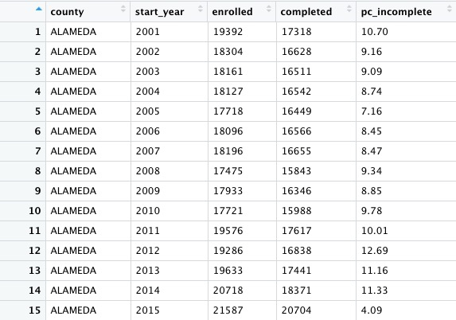

Now we can identify the five largest counties with the largest enrollment over the years, and use a join to filter the data by counties for just these five:

```r
# identify five counties with the largest enrollment over all years
top5 <- immun %>%
  group_by(county) %>%
  summarize(enrolled = sum(enrollment, na.rm = TRUE)) %>%
  arrange(desc(enrolled)) %>%
  head(5) %>%
  select(county)

# proportion incomplete, top 5 counties by enrollment, by year
immun_top5_year <- semi_join(immun_counties_year, top5)
```

Notice the use of `semi_join` to filter the data for just the five counties with the largest kindergarten enrollment.

Here are the first few rows of that data:


### Clean up and close your RStudio session

Before you exit RStudio, save and close your script, save the data in your Environment, and close any data files you have open in `View`. Finally, in the Console, type `Ctrl-L` to clear the console.

### Further reading

**[RStudio Data Wrangling Cheet Sheet](https://www.rstudio.com/wp-content/uploads/2015/02/data-wrangling-cheatsheet.pdf)**
Also introduces the [**tidyr**](https://blog.rstudio.org/2014/07/22/introducing-tidyr/) package, which can manage wide-to-long transformations, and text-to-columns splits, among other data manipulations.

**[Stack Overflow](https://stackoverflow.com/)**
For any work involving code, this question-and-answer site is a great resource for when you get stuck, to see how others have solved similar problems. Search the site, or [browse R questions](https://stackoverflow.com/questions/tagged/r)


